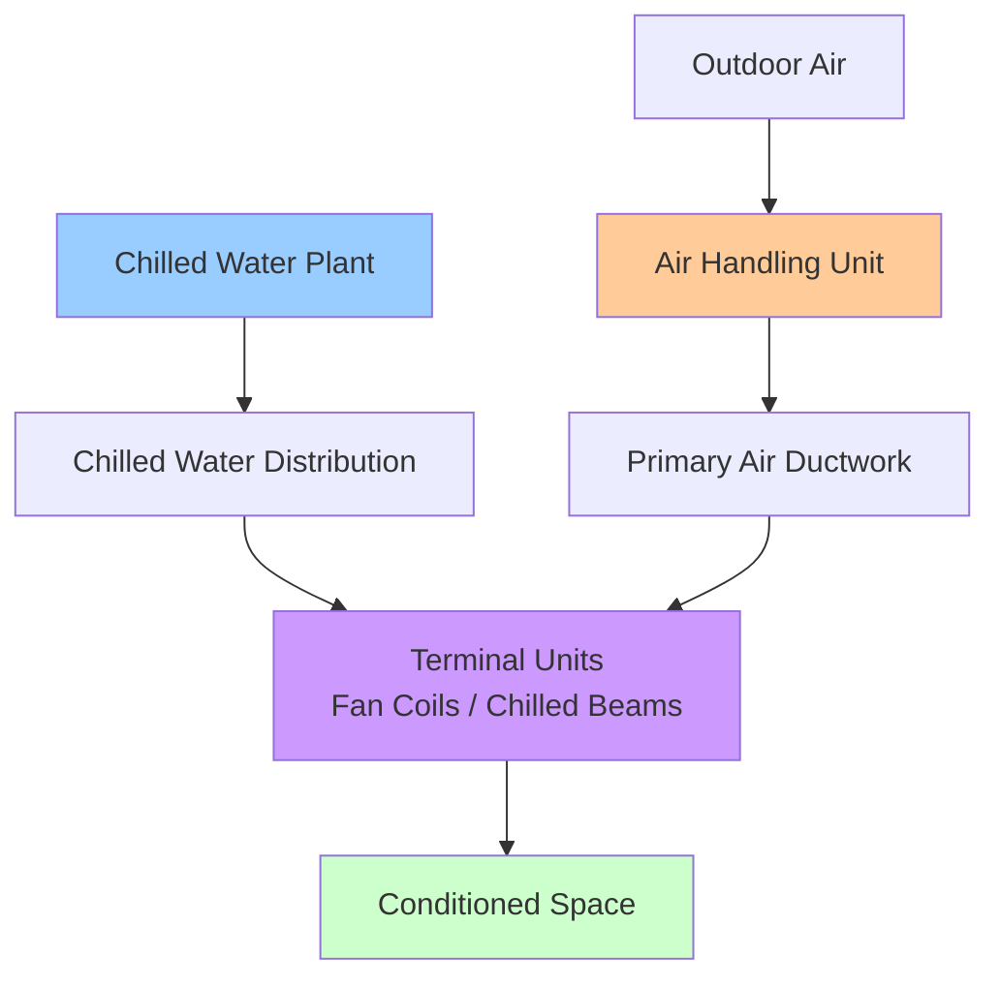
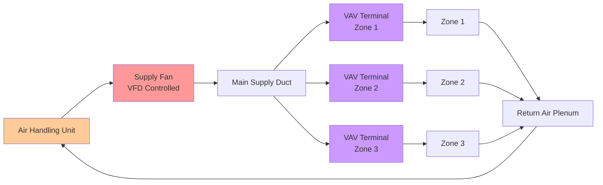

HVAC systems represent integrated assemblies of equipment, distribution networks, and controls designed to condition building spaces through coordinated heating, cooling, ventilation, and humidity regulation. System selection determines energy performance, installation cost, operational flexibility, and maintenance requirements throughout the building lifecycle.

## HVAC System Classifications

HVAC systems are categorized by the medium used to transport thermal energy from central equipment to conditioned spaces. This fundamental distinction drives system architecture, distribution design, and zoning capabilities.

### All-Air Systems

All-air systems deliver both sensible and latent cooling capacity through conditioned air supplied via ductwork. The air serves as the sole heat transfer medium between central equipment and occupied zones.

**System characteristics:**
- Central air handling with distributed ductwork
- Heating and cooling through air temperature modulation
- Dehumidification at central cooling coil
- Ventilation air integrated with thermal conditioning
- Zone control through airflow variation or temperature adjustment

**Energy transport equation:**

$$Q = \dot{m}_{\text{air}} \cdot c_p \cdot \Delta T = \rho \cdot \dot{V} \cdot c_p \cdot (T_{\text{supply}} - T_{\text{zone}})$$

Where:
- $Q$ = heating or cooling rate (W)
- $\dot{m}_{\text{air}}$ = air mass flow rate (kg/s)
- $c_p$ = specific heat of air at constant pressure (≈1006 J/kg·K)
- $\Delta T$ = temperature difference between supply and zone (K)
- $\rho$ = air density (≈1.2 kg/m³ at sea level)
- $\dot{V}$ = volumetric airflow rate (m³/s)

All-air systems include constant air volume (CAV), variable air volume (VAV), dual-duct, and multizone configurations detailed in ASHRAE Handbook—HVAC Systems and Equipment, Chapter 4.

### All-Water Systems

All-water systems distribute thermal energy through hydronic piping to terminal units located in conditioned spaces. Water's superior heat capacity (4186 J/kg·K versus 1006 J/kg·K for air) enables smaller distribution infrastructure.

**Comparative heat transport:**

For equivalent thermal capacity, the volumetric flow ratio is:

$$\frac{\dot{V}_{\text{air}}}{\dot{V}_{\text{water}}} = \frac{\rho_w \cdot c_{p,w} \cdot \Delta T_w}{\rho_a \cdot c_{p,a} \cdot \Delta T_a}$$

With typical design parameters ($\Delta T_w$ = 10K, $\Delta T_a$ = 10K):

$$\frac{\dot{V}_{\text{air}}}{\dot{V}_{\text{water}}} \approx \frac{1000 \times 4186 \times 10}{1.2 \times 1006 \times 10} \approx 3400$$

This 3400:1 volumetric ratio demonstrates why piping requires substantially less space than equivalent ductwork, making all-water systems advantageous in buildings with spatial constraints.

**Terminal equipment:**
- Fan coil units with local air circulation
- Radiant panels (ceiling, wall, or floor mounted)
- Chilled beams (passive or active)
- Unit ventilators with separate ventilation air
- Cabinet heaters and convectors

All-water systems require separate ventilation air provision per ASHRAE 62.1, typically through dedicated outdoor air systems (DOAS) or operable windows where permitted by code.

### Air-Water Systems

Air-water systems combine central air handling for ventilation and dehumidification with hydronic distribution for sensible heating and cooling. This hybrid approach optimizes the advantages of both media.

**Operational principle:**

Total cooling load is partitioned:

$$Q_{\text{total}} = Q_{\text{air}} + Q_{\text{water}}$$

Where:
- $Q_{\text{air}}$ handles ventilation, latent load, and partial sensible load
- $Q_{\text{water}}$ addresses remaining sensible load through local terminal units

Typical distribution: 30-40% of sensible cooling via primary air, 60-70% via chilled water to terminal units. This reduces central air handling capacity and ductwork size by 50-60% compared to all-air designs.

**Common configurations:**
- Fan coil units with dedicated outdoor air
- Active chilled beams with ventilation air
- Radiant ceiling panels with DOAS
- Induction units (legacy design, uncommon in new construction)

### Unitary Systems

Unitary equipment integrates refrigeration components, air handling, and controls into factory-assembled packages. These self-contained units minimize field installation complexity and eliminate field refrigerant charging for many configurations.

**Unitary system categories:**

| System Type | Refrigerant Containment | Installation Location | Capacity Range |
|------------|------------------------|---------------------|----------------|
| Split System | Outdoor condensing unit + indoor coil | Separate indoor/outdoor | 1.5-25 tons |
| Package Unit | Single cabinet | Rooftop or ground level | 3-150 tons |
| Ductless Mini-Split | Multiple indoor units | Wall/ceiling mounted | 0.5-5 tons per indoor unit |
| VRF/VRV System | Distributed evaporators | Indoor fan coils | 2-60 tons per outdoor unit |
| PTAC/PTHP | Through-wall chassis | Building perimeter | 0.5-1.5 tons |

**Performance metrics:**

Unitary efficiency is rated per AHRI 210/240 using:
- **EER** (Energy Efficiency Ratio): Cooling efficiency at 95°F outdoor, 80°F/67°F WB indoor
- **SEER** (Seasonal Energy Efficiency Ratio): Seasonal cooling efficiency weighted across operating conditions
- **HSPF** (Heating Seasonal Performance Factor): Seasonal heating efficiency for heat pumps
- **IEER** (Integrated Energy Efficiency Ratio): Part-load efficiency metric per AHRI 340/360

Minimum efficiency standards are established in ASHRAE 90.1 Table 6.8.1-1 through 6.8.1-4, with values varying by equipment type, capacity, and cooling method (air-cooled versus water-cooled).

## System Selection Criteria

Proper HVAC system selection balances first cost, operating efficiency, spatial requirements, zoning flexibility, and maintenance access. The selection process follows ASHRAE Handbook—HVAC Applications, Chapter 1.

### Thermal Load Characteristics

**Load diversity:**

Buildings with high load diversity (e.g., office buildings with perimeter and core zones experiencing simultaneous heating and cooling) benefit from systems enabling zone-level control:
- Variable air volume with reheat
- Variable refrigerant flow (VRF)
- Four-pipe hydronic with fan coils
- Active chilled beams with dedicated outdoor air

**Load density:**

Space cooling load density influences system viability:
- **Low density** (<30 W/m²): Suitable for all system types
- **Medium density** (30-75 W/m²): All-air or air-water systems typical
- **High density** (>75 W/m²): Chilled water to local terminal units or high-velocity all-air systems required

Data centers and laboratory spaces with densities exceeding 200 W/m² typically employ chilled water to computer room air handlers (CRAH) or in-row cooling units with close-coupled heat rejection.

### Ventilation Requirements

ASHRAE 62.1 mandates minimum outdoor air rates based on occupant density and space type. Systems must deliver and distribute ventilation air while maintaining acceptable indoor air quality.

**Ventilation airflow:**

$$\dot{V}_{\text{ot}} = R_p \cdot P_z + R_a \cdot A_z$$

Where:
- $\dot{V}_{\text{ot}}$ = outdoor airflow rate in breathing zone (L/s)
- $R_p$ = outdoor air rate per person (L/s per person)
- $P_z$ = zone population (persons)
- $R_a$ = outdoor air rate per unit area (L/s per m²)
- $A_z$ = zone floor area (m²)

All-air systems inherently provide ventilation distribution. All-water systems require supplementary ventilation via DOAS, transfer air, or operable windows. The ventilation burden significantly impacts system selection in applications requiring high outdoor air percentages (laboratories, kitchens, industrial spaces).

### Spatial and Architectural Considerations

**Distribution space requirements:**

Approximate space allocation for distribution systems:

| System Type | Vertical Shaft Space | Horizontal Distribution | Mechanical Room |
|------------|---------------------|------------------------|-----------------|
| All-Air VAV | 3-4% floor area | 250-400 mm ceiling depth | 1.5-2.5% floor area |
| Chilled Beams + DOAS | 1-2% floor area | 150-250 mm ceiling depth | 1-2% floor area |
| VRF | 0.5-1% floor area | 100-150 mm ceiling depth | 0.3-0.5% floor area |
| Four-Pipe Fan Coil | 1.5-2.5% floor area | 200-300 mm ceiling depth | 1-1.5% floor area |

High-rise buildings favor systems minimizing vertical distribution. Water-based systems reduce shaft requirements compared to all-air designs due to the 3400:1 volumetric transport ratio calculated previously.

### Operational Flexibility and Control

**Zone control capabilities:**

Zone-level temperature control precision varies by system architecture:
- **VAV with reheat**: ±0.5°C zone control, individual zone scheduling
- **VRF**: ±0.5°C zone control, independent zone operation
- **Chilled beams**: ±1.0°C zone control, limited individual control
- **CAV with zone reheat**: ±1.0°C zone control, simultaneous heating/cooling penalty
- **Two-pipe fan coil**: ±1.5°C zone control, seasonal changeover limitation

Applications requiring precise environmental control (museums, laboratories, healthcare) demand systems with tight zone regulation and independent heating/cooling capability.

### Energy Efficiency Considerations

System efficiency encompasses central equipment performance, distribution losses, and part-load operation characteristics.

**Annual energy consumption:**

$$E_{\text{annual}} = \sum_{i=1}^{8760} \left( \frac{Q_{\text{cooling},i}}{\text{COP}_{\text{cooling},i}} + \frac{Q_{\text{heating},i}}{\text{COP}_{\text{heating},i}} + P_{\text{fan},i} + P_{\text{pump},i} \right)$$

This hourly summation accounts for:
- Variable cooling and heating loads
- Part-load equipment efficiency degradation
- Distribution fan and pump energy
- Outdoor air economizer operation
- Internal load variations

ASHRAE 90.1 Appendix G energy modeling procedures require this hour-by-hour simulation for building energy code compliance demonstration.

**Part-load performance:**

Variable speed equipment operates more efficiently at reduced capacity than constant-speed units cycling on-off. Variable flow systems (VAV air, variable flow water) reduce distribution energy proportionally to load:

$$P_{\text{fan}} \propto \dot{V}^3 \text{ (at constant static pressure)}$$

$$P_{\text{pump}} \propto \dot{V}^3 \text{ (with VFD control)}$$

This cubic relationship means 50% airflow reduces fan power to approximately 12.5% of full load, substantially improving seasonal efficiency in climates with significant cooling or heating load variation.

## Primary HVAC System Configurations

### Variable Air Volume (VAV)

VAV systems modulate airflow to each zone via motorized dampers in terminal units, maintaining space temperature while minimizing supply fan energy. Cooling is provided by reducing airflow as load decreases; heating is provided through reheat coils or perimeter baseboard.

**Design parameters:**
- Supply air temperature: 12-14°C
- Minimum airflow: 30% of design (ventilation requirement)
- Maximum airflow: 100% of design (peak cooling load)
- Turndown ratio: 3:1 to 4:1
- Static pressure control: 50-75% of design at minimum flow

VAV systems dominate commercial office, institutional, and educational applications due to excellent energy efficiency and zone control flexibility. ASHRAE Guideline 36 provides standardized VAV control sequences.

### Four-Pipe Hydronic with Fan Coils

Four-pipe systems provide simultaneous heating and cooling capability through separate chilled water and hot water distribution to fan coil units. Each zone operates independently with local fan speed and valve control.

**Piping configuration:**
- Chilled water supply and return (typically 6-12°C supply, 12-18°C return)
- Hot water supply and return (typically 60-80°C supply, 50-60°C return)
- Individual zone control valves (two-way preferred for variable flow)
- Primary-secondary or variable primary flow pumping

Four-pipe systems excel in applications requiring simultaneous heating and cooling (perimeter zones with high solar gains, hotels, residential buildings) and buildings with spatial constraints limiting ductwork installation.

### Variable Refrigerant Flow (VRF)

VRF systems employ inverter-driven compressors and electronic expansion valves to modulate refrigerant flow to multiple indoor fan coil units. Heat recovery configurations enable simultaneous heating and cooling by transferring thermal energy between zones.

**Operational characteristics:**
- Capacity modulation: 10-100% through compressor speed variation
- Refrigerant pipe lengths: up to 150-300 m depending on manufacturer
- Elevation difference: typically 50-90 m maximum
- Indoor units per outdoor unit: 8-64 depending on system design
- Part-load COP: 15-30% higher than rated conditions at 50% capacity

VRF systems are prevalent in commercial buildings with distributed loads, renovation projects with limited space for ductwork, and applications requiring zone-level temperature control without dedicated mechanical rooms.

## Integration with Building Systems

HVAC systems interface with electrical power distribution, building automation, life safety, and plumbing systems. Coordination across disciplines ensures proper system function and code compliance.

**Critical integration points:**
- **Electrical**: Emergency power for smoke control, minimum ventilation during power failures
- **Fire protection**: Smoke damper coordination, fire-rated duct and pipe penetrations per NFPA 90A
- **Plumbing**: Condensate drainage, humidification water supply, water-cooled equipment
- **Building automation**: HVAC equipment monitoring and control through BACnet, Modbus, or LonWorks protocols per ASHRAE 135

## Standards and References

HVAC system design, installation, and operation are governed by consensus standards:

- **ASHRAE 62.1**: Ventilation and acceptable indoor air quality
- **ASHRAE 90.1**: Energy standard for buildings except low-rise residential
- **ASHRAE Guideline 36**: High-performance sequences of operation for HVAC systems
- **ASHRAE Handbook—HVAC Systems and Equipment**: Comprehensive system descriptions
- **ASHRAE Standard 55**: Thermal environmental conditions for human occupancy
- **AHRI 210/240**: Unitary equipment performance rating
- **NFPA 90A/90B**: Air conditioning and ventilating system installation standards

Proper system selection, design, and commissioning per these standards ensures energy-efficient operation, occupant comfort, and long-term reliability across the building lifecycle. System architecture represents the foundational decision determining all subsequent design, construction, and operational characteristics of the building HVAC installation.
