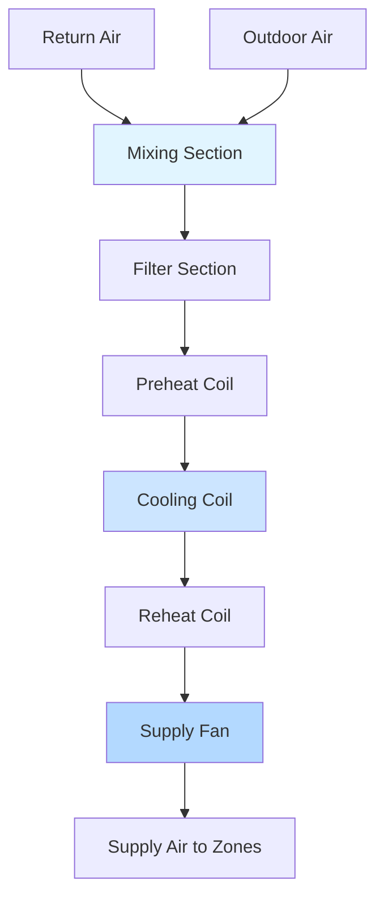
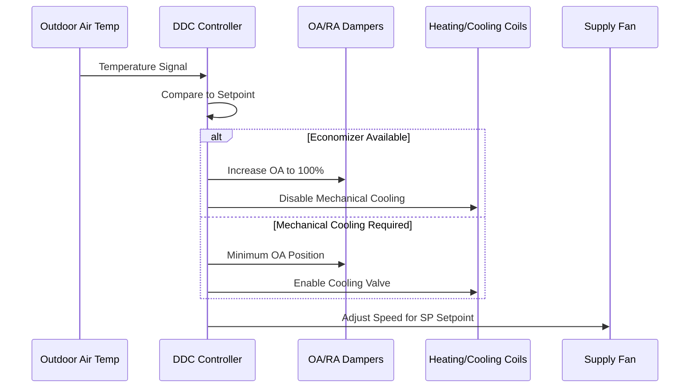

# Air Handling Systems

Air handling units (AHUs) serve as the central processing equipment in commercial HVAC systems, conditioning and distributing air to occupied spaces. These systems integrate multiple components—fans, coils, filters, dampers, and controls—to achieve precise environmental control while optimizing energy consumption.

## Fundamental Psychrometric Processes

AHUs perform thermodynamic processes that alter air properties according to well-defined psychrometric relationships. The sensible heat ratio (SHR) characterizes the balance between temperature change and moisture control:

$$
SHR = \frac{Q_s}{Q_s + Q_l} = \frac{Q_s}{Q_t}
$$

where $Q_s$ represents sensible heat transfer (temperature change), $Q_l$ represents latent heat transfer (moisture change), and $Q_t$ is total cooling capacity.

### Cooling Coil Performance

The cooling process combines sensible and latent heat removal. The apparatus dew point (ADP) defines the effective surface temperature where air-coil interaction occurs:

$$
Q_t = \dot{m} \cdot (h_1 - h_2) = 4.5 \cdot CFM \cdot \Delta h
$$

where $\dot{m}$ is mass flow rate, $h$ is enthalpy (Btu/lb), CFM is volumetric flow rate, and $\Delta h$ is enthalpy difference. The bypass factor characterizes coil effectiveness:

$$
BF = \frac{t_{leaving} - t_{ADP}}{t_{entering} - t_{ADP}}
$$

Typical bypass factors range from 0.05 to 0.30, with lower values indicating better heat transfer performance.

## Fan Performance and System Curves

Fan selection requires matching equipment performance to system resistance. The fan laws govern performance relationships across speed and diameter changes:

**Fan Law 1 (Flow):**
$$
\frac{CFM_2}{CFM_1} = \frac{N_2}{N_1} \cdot \left(\frac{D_2}{D_1}\right)^3
$$

**Fan Law 2 (Pressure):**
$$
\frac{SP_2}{SP_1} = \left(\frac{N_2}{N_1}\right)^2 \cdot \left(\frac{D_2}{D_1}\right)^2
$$

**Fan Law 3 (Power):**
$$
\frac{BHP_2}{BHP_1} = \left(\frac{N_2}{N_1}\right)^3 \cdot \left(\frac{D_2}{D_1}\right)^5
$$

where $N$ is rotational speed (RPM), $D$ is impeller diameter, $SP$ is static pressure, and $BHP$ is brake horsepower.

### System Resistance Curve

The system curve follows a quadratic relationship:

$$
SP_{system} = K \cdot CFM^2
$$

Operating point occurs where fan curve intersects system curve. Variable frequency drives (VFDs) enable efficient part-load operation by shifting the fan curve.

## AHU Configuration Comparison

| Configuration | Applications | Advantages | Limitations |
|--------------|--------------|------------|-------------|
| Draw-Through | General commercial | Uniform discharge temp, better mixing | Requires fan heat consideration |
| Blow-Through | High static systems | Higher available pressure | Non-uniform coil face velocity |
| Multi-Zone | Simultaneous heating/cooling | Zone-level control | Higher energy use, complex controls |
| Dual-Duct | Precision control required | Excellent zone control | High installation cost, space intensive |
| Variable Air Volume | Modern commercial | Energy efficient | Requires minimum flow consideration |

## Filter Section Design

ASHRAE Standard 52.2 establishes Minimum Efficiency Reporting Value (MERV) ratings for particulate filtration. Pressure drop across filters increases with particle loading:

$$
\Delta P_{filter} = \frac{V^2 \cdot \rho \cdot f \cdot L}{2 \cdot D_h}
$$

where $V$ is face velocity (typically 300-500 fpm), $\rho$ is air density, $f$ is friction factor, $L$ is media depth, and $D_h$ is hydraulic diameter.

**MERV Rating Application Guide:**

| MERV Range | Particle Size | Typical Applications |
|------------|---------------|---------------------|
| 1-4 | >10 μm | Residential, minimal filtration |
| 5-8 | 3-10 μm | Commercial buildings, standard |
| 9-12 | 1-3 μm | Healthcare, laboratories |
| 13-16 | 0.3-1 μm | Hospitals, cleanrooms |

## Heating and Cooling Coil Sizing

Coil capacity depends on face area, rows deep, and fluid temperature differential. The heat transfer equation:

$$
Q = U \cdot A \cdot LMTD
$$

where $U$ is overall heat transfer coefficient (Btu/hr·ft²·°F), $A$ is coil face area (ft²), and LMTD is log mean temperature difference:

$$
LMTD = \frac{(t_{fluid,in} - t_{air,out}) - (t_{fluid,out} - t_{air,in})}{\ln\left(\frac{t_{fluid,in} - t_{air,out}}{t_{fluid,out} - t_{air,in}}\right)}
$$

Water-side pressure drop must remain below 15 ft for typical hydronic systems to prevent excessive pump energy.

## Energy Recovery Integration

ASHRAE Standard 90.1 mandates energy recovery when outdoor air exceeds specific thresholds. Effectiveness characterizes recovery performance:

$$
\varepsilon_{sensible} = \frac{t_{supply} - t_{outdoor}}{t_{exhaust} - t_{outdoor}}
$$

$$
\varepsilon_{latent} = \frac{W_{supply} - W_{outdoor}}{W_{exhaust} - W_{outdoor}}
$$

where $W$ represents humidity ratio (lb moisture/lb dry air).

## Static Pressure Budget

Total system static pressure allocates to individual components:

$$
SP_{total} = SP_{filter} + SP_{coils} + SP_{dampers} + SP_{ductwork} + SP_{diffusers}
$$

ASHRAE Guideline 36 recommends trim and respond logic for VAV systems, maintaining minimum static pressure setpoint while avoiding simultaneous heating and cooling.

## Control Sequences

Modern AHUs employ direct digital control (DDC) implementing sequences per ASHRAE Guideline 36:

1. **Mixed air temperature control**: Modulate outdoor/return dampers to achieve setpoint
2. **Cooling sequence**: Enable cooling valve when mixed air exceeds setpoint + deadband
3. **Heating sequence**: Enable heating valve when supply air falls below setpoint - deadband
4. **Supply fan control**: Maintain duct static pressure setpoint via VFD
5. **Economizer mode**: Maximize outdoor air when conditions favorable

## Performance Optimization

Optimizing AHU performance requires balancing first cost, operating cost, and system reliability. Key strategies include:

- **Variable speed drives**: Reduce fan energy proportional to cube of speed reduction
- **Low face velocity coils**: Decrease pressure drop, increase heat transfer
- **Demand-controlled ventilation**: Reduce outdoor air based on occupancy
- **Airside economizer**: Leverage free cooling when outdoor conditions permit
- **Supply air temperature reset**: Raise cooling setpoint based on zone demand

Proper AHU selection and configuration establishes the foundation for efficient, reliable HVAC system operation across all building types and climates.
