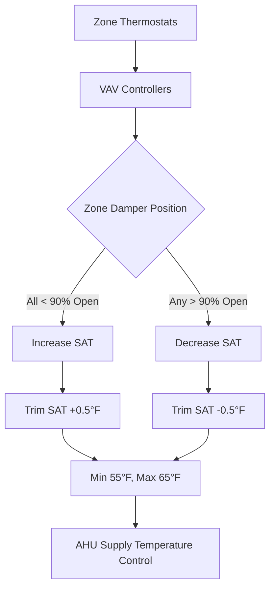

# Central HVAC Systems

Central HVAC systems serve multiple zones or an entire building from a centralized equipment location. Unlike unitary systems where equipment serves individual spaces, central systems distribute conditioned air, water, or both through ductwork and piping networks. This architecture enables economies of scale, superior efficiency, and centralized control for medium to large buildings.

## Fundamental System Classifications

Central HVAC systems divide into three primary categories based on the distribution medium that delivers heating and cooling to occupied spaces.

### All-Air Systems

All-air systems transport thermal energy exclusively through air. The central air handling unit (AHU) conditions air to the required temperature and humidity, then distributes it via ductwork to terminal devices in each zone. The entire heating and cooling load transfers through sensible and latent heat exchange with the supply air.

The energy balance for a conditioned space served by an all-air system follows:

$$Q_{total} = \dot{m}_{air} \cdot c_p \cdot (T_{supply} - T_{return}) + \dot{m}_{air} \cdot h_{fg} \cdot (W_{supply} - W_{return})$$

Where $Q_{total}$ represents the total cooling load (sensible plus latent), $\dot{m}_{air}$ is the mass flow rate of air, $c_p$ is specific heat at constant pressure, $T$ denotes temperature, $h_{fg}$ is the latent heat of vaporization, and $W$ represents humidity ratio.

Key all-air system types include:

- **Single-duct constant volume (CAV)**: Fixed airflow with varying supply temperature
- **Single-duct variable air volume (VAV)**: Modulating airflow at constant or reset supply temperature
- **Dual-duct systems**: Separate hot and cold air streams mixed at zone terminals
- **Multizone systems**: Multiple zone decks at the AHU with individual duct runs

### All-Water Systems

All-water systems circulate chilled water and hot water to terminal units located in each zone. Fan coil units, unit ventilators, or radiators exchange thermal energy between the water and room air. Ventilation air typically enters through dedicated outdoor air systems (DOAS) or through infiltration and operable windows.

The heat transfer at a water-to-air coil obeys:

$$Q_{coil} = \dot{m}_{water} \cdot c_{p,water} \cdot (T_{entering} - T_{leaving}) = UA \cdot LMTD$$

Where $U$ is the overall heat transfer coefficient, $A$ is coil surface area, and LMTD represents the log mean temperature difference between water and air streams.

All-water system configurations include:

- **Two-pipe systems**: Single supply and return pipe serving heating OR cooling
- **Three-pipe systems**: Separate hot and cold supply with common return (rarely used due to mixing losses)
- **Four-pipe systems**: Separate hot water supply/return and chilled water supply/return enabling simultaneous heating and cooling availability

### Air-Water Systems

Air-water systems combine both distribution methods. Primary air from a central AHU provides ventilation and partial conditioning, while water distributed to zone terminals handles the majority of sensible load. This approach reduces ductwork size while maintaining superior indoor air quality control.

Common air-water system types:

- **Induction systems**: High-velocity primary air induces room air circulation through water coils
- **Fan-coil with DOAS**: Dedicated outdoor air system for ventilation, fan coils for zone temperature control
- **Radiant panels with ventilation air**: Hydronic radiant surfaces for sensible loads, separate ventilation system

## System Performance Comparison

The following table compares key performance characteristics across central system types:

| System Type | Energy Efficiency | Zone Control | Space Requirements | First Cost | Operating Cost | IAQ Control |
|-------------|-------------------|--------------|-------------------|------------|----------------|-------------|
| VAV All-Air | High | Excellent | High (large ducts) | Medium | Low | Excellent |
| CAV All-Air | Medium | Poor | High | Low | Medium | Excellent |
| 4-Pipe Water | Medium-High | Excellent | Low (small pipes) | High | Medium | Poor (without DOAS) |
| 2-Pipe Water | Low-Medium | Poor | Low | Low | Medium-High | Poor (without DOAS) |
| Fan-Coil + DOAS | High | Excellent | Medium | Medium-High | Low | Excellent |
| Dual-Duct | Low | Excellent | Very High | Medium | High | Excellent |

## Central Plant Equipment

Central systems require substantial mechanical equipment located in dedicated equipment rooms or rooftops.

### Air Handling Units

The AHU serves as the heart of all-air and air-water systems. Standard components include:

- **Mixing section**: Combines outdoor air and return air per ASHRAE Standard 62.1 ventilation requirements
- **Filter section**: Removes particulates to MERV 8-16 depending on application
- **Cooling coil**: Chilled water or direct expansion refrigerant coil for sensible and latent cooling
- **Heating coil**: Hot water, steam, or electric resistance for heating
- **Supply fan**: Provides static pressure to overcome duct system resistance
- **Return fan**: Maintains building pressure control (optional, required for systems >20,000 CFM)

Fan power requirements follow the fan laws and system pressure drop:

$$P_{fan} = \frac{\dot{V} \cdot \Delta P_{total}}{\eta_{fan}}$$

Where $\dot{V}$ is volumetric flow rate, $\Delta P_{total}$ is total static pressure, and $\eta_{fan}$ is fan efficiency.

### Chilled Water Plants

Central chilled water systems typically operate at 44°F supply temperature and 54-56°F return temperature, yielding a 10-12°F ΔT. The chiller plant includes:

- **Chillers**: Water-cooled centrifugal, screw, or absorption machines (5-10 COP)
- **Cooling towers**: Reject condenser heat to atmosphere via evaporative cooling
- **Chilled water pumps**: Primary, secondary, or variable primary flow configurations
- **Condenser water pumps**: Circulate water between chiller condensers and cooling towers

Chiller efficiency expressed as kW/ton relates to coefficient of performance:

$$COP = \frac{3.517}{kW/ton}$$

Modern water-cooled centrifugal chillers achieve 0.45-0.65 kW/ton at AHRI conditions, equivalent to COP of 5.4-7.8.

### Heating Plants

Central heating plants supply hot water (120-180°F) or steam (2-15 psig) to terminal units and AHU heating coils. Common heat sources include:

- **Gas-fired boilers**: 80-95% thermal efficiency
- **Electric boilers**: 100% input efficiency but higher operating cost
- **Heat recovery chillers**: Extract heat from chiller condenser for simultaneous heating
- **Combined heat and power (CHP)**: Generate electricity with waste heat recovery

## Distribution System Design

### Airflow Distribution

Duct systems must deliver design airflow to each terminal with acceptable noise levels and pressure balance. Friction loss per ASHRAE Fundamentals Chapter 21 follows the Darcy-Weisbach equation:

$$\Delta P_f = f \cdot \frac{L}{D} \cdot \frac{\rho V^2}{2}$$

Where $f$ is the friction factor, $L$ is duct length, $D$ is hydraulic diameter, $\rho$ is air density, and $V$ is air velocity.

The equal friction method sizes ducts to maintain 0.08-0.15 in. w.g. per 100 ft, limiting velocity to prevent excessive noise:

- Main ducts: 1,200-2,500 FPM
- Branch ducts: 800-1,500 FPM
- Terminal connections: 500-800 FPM

### Hydronic Distribution

Water systems transport thermal energy far more efficiently than air due to water's superior volumetric heat capacity (3,000× greater than air). This enables smaller distribution infrastructure.

Piping system pressure drop follows similar principles to air, with the Hazen-Williams equation commonly used for water:

$$\Delta P = 4.52 \cdot \frac{L}{C^{1.85} \cdot D^{4.87}} \cdot Q^{1.85}$$

Where $C$ is the roughness coefficient (typically 100-150 for steel/copper), and $Q$ is flow rate in GPM.

Pump head requirements account for piping friction, coil pressure drop, control valve authority, and elevation changes:

$$H_{pump} = \Delta P_{piping} + \Delta P_{coils} + \Delta P_{valve} + \Delta P_{elevation}$$

## Control Strategies and Sequences

Central system control coordinates equipment operation to maintain comfort conditions while minimizing energy consumption.

### Variable Air Volume Control

VAV systems modulate airflow to each zone based on thermal load. The supply air temperature resets based on the zone requiring maximum cooling:

This reset strategy reduces reheat energy and chiller load during mild weather.

### Chilled Water Reset

Chilled water supply temperature resets upward as cooling load decreases, improving chiller efficiency. The reset schedule typically follows:

$$T_{CHW,supply} = T_{design} + K \cdot (T_{outdoor,design} - T_{outdoor,actual})$$

Where $K$ ranges from 0.1 to 0.3 depending on system characteristics. Typical range: 42-50°F.

Higher chilled water temperatures increase chiller COP by reducing lift (temperature difference between evaporator and condenser).

## Zoning and Load Diversity

Central systems serve multiple zones with varying load profiles. Proper zoning groups spaces with similar:

- Thermal load patterns (envelope vs. interior)
- Occupancy schedules (office vs. conference rooms)
- Process requirements (server rooms vs. general office)
- Orientation (north vs. south exposure)

System capacity benefits from diversity factor:

$$\text{Diversity Factor} = \frac{\text{Sum of Individual Zone Peaks}}{\text{Coincident System Peak}}$$

Typical diversity factors range from 1.15 to 1.35, allowing downsized central equipment compared to the sum of zone peaks.

## Energy Efficiency Considerations

Central system efficiency derives from:

1. **Equipment efficiency**: High-efficiency chillers, boilers, fans, and pumps per ASHRAE Standard 90.1
2. **Distribution efficiency**: Minimized pressure drops, reduced transport distances, proper insulation
3. **Control optimization**: Optimal start/stop, economizer operation, demand-controlled ventilation
4. **Heat recovery**: Air-to-air energy recovery, waterside economizers, waste heat utilization

ASHRAE Standard 90.1 mandates minimum equipment efficiencies and prescriptive control requirements for central systems, including:

- VAV fan power limits: 1.2-1.4 W/CFM depending on system pressure class
- Chiller integrated part load value (IPLV) minimum performance
- Economizer operation when outdoor conditions enable free cooling
- Energy recovery when outdoor air exceeds 70% of supply air (climate dependent)

## System Selection Criteria

The optimal central system type depends on project-specific factors:

- **Building size and layout**: Large floor plates favor all-air, vertical buildings suit all-water
- **Space availability**: Mechanical room and shaft space constraints
- **Load characteristics**: High ventilation needs favor all-air, high sensible loads suit hydronic
- **Operational flexibility**: Future tenant changes favor adaptable systems
- **First cost vs. life cycle cost**: Capital budget constraints vs. long-term operating costs
- **Maintenance capabilities**: In-house staff expertise and access to equipment
- **Acoustic requirements**: Critical spaces require low-velocity systems and sound attenuation

Central systems excel in buildings exceeding 50,000 square feet where centralized equipment advantages offset higher distribution costs. The superior efficiency, control precision, and equipment longevity justify the initial investment in most commercial, institutional, and industrial applications.
