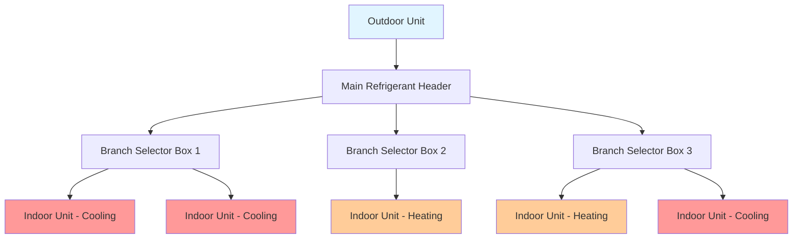
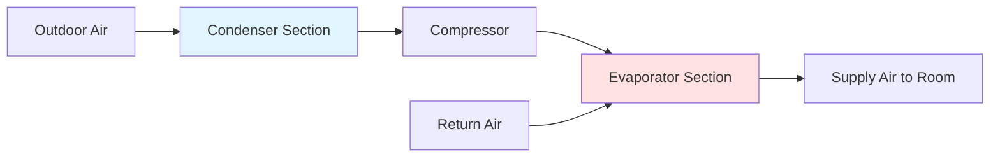
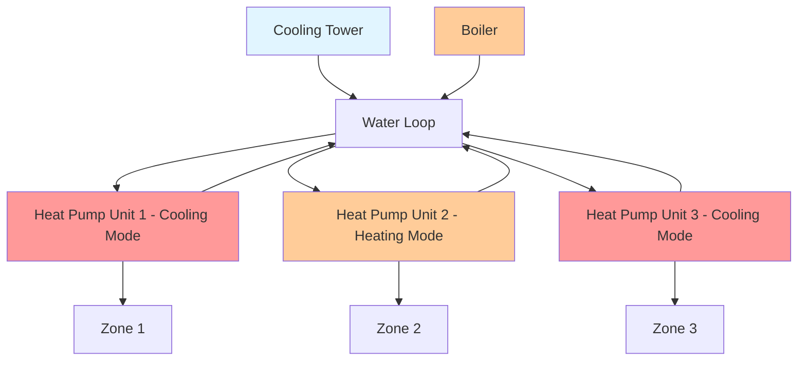
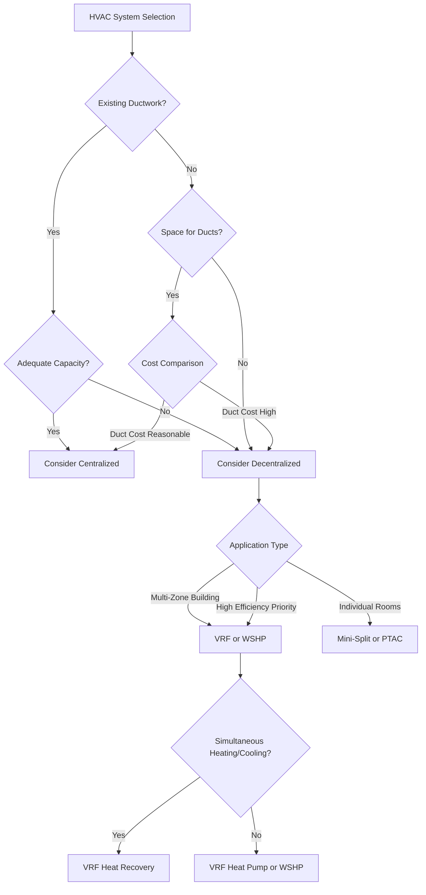

# Decentralized HVAC Systems

Decentralized HVAC systems distribute heating and cooling capacity throughout a building using multiple independent or semi-independent units rather than centralized air handlers and extensive ductwork. This architecture offers advantages in zone control, installation flexibility, energy efficiency through heat recovery, and reduced distribution losses. Applications range from residential retrofits to large commercial buildings where diverse thermal zones require independent control.

## Fundamental Principles

Decentralized systems eliminate or minimize central air distribution by placing refrigeration equipment closer to conditioned spaces. Heat transfer occurs through shorter refrigerant lines, hydronic piping, or minimal ductwork, reducing fan energy and thermal losses inherent in long duct runs.

**Key Characteristics:**

- Independent zone control with individual thermostats
- Reduced or eliminated ductwork
- Multiple outdoor units or distributed heat rejection
- Direct expansion refrigeration to occupied zones
- Simultaneous heating and cooling capability in multi-zone configurations

The thermal effectiveness of decentralized systems derives from minimizing distribution losses. Central systems typically lose 15-30% of heating and cooling energy through duct leakage, heat gain/loss through duct walls, and fan heat. Decentralized systems reduce these losses to 5-10% through shorter refrigerant lines and minimal air distribution.

## System Types and Configurations

### Variable Refrigerant Flow (VRF)

VRF systems represent the most sophisticated decentralized architecture, using refrigerant as the heat transfer medium with electronic expansion valves controlling flow to multiple indoor units.

**Operating Principle:**

A VRF system modulates refrigerant flow to match instantaneous zone loads through inverter-driven compressors and electronic expansion valves. The outdoor unit varies capacity from 10-130% of nominal rating, while indoor units operate at 8-100% capacity based on local thermostat demands.

**Heat Recovery VRF:**

Three-pipe heat recovery systems allow simultaneous heating and cooling by transferring heat from cooling zones to heating zones. A branch selector (BS) box at each indoor unit determines whether the unit operates in heating or cooling mode, routing refrigerant accordingly.

Energy balance for heat recovery operation:

$$
Q_{heating} = Q_{cooling} + W_{compressor} - Q_{losses}
$$

Where:
- $Q_{heating}$ = total heating capacity delivered (Btu/hr)
- $Q_{cooling}$ = total cooling capacity from cooling zones (Btu/hr)
- $W_{compressor}$ = compressor power input (Btu/hr)
- $Q_{losses}$ = system thermal losses (Btu/hr)

Heat recovery efficiency reaches 60-80% when heating and cooling loads are balanced, significantly reducing net energy consumption compared to conventional systems.

**Performance Characteristics:**

| Parameter | Heat Pump VRF | Heat Recovery VRF | Units |
|-----------|--------------|-------------------|-------|
| Cooling EER | 14-20 | 14-19 | Btu/Wh |
| Heating COP | 3.5-4.8 | 3.8-5.2 | - |
| Modulation Range | 10-130% | 10-130% | % of nominal |
| Piping Distance | 500-1000 | 500-1000 | ft |
| Elevation Difference | 165-360 | 165-360 | ft |
| Indoor Units per Outdoor | 3-64 | 3-64 | units |

### Ductless Mini-Split Systems

Mini-split systems consist of one outdoor condensing unit serving 1-8 indoor air handlers through refrigerant lines. Single-zone mini-splits provide dedicated control for individual rooms, while multi-zone systems connect multiple indoor units to one outdoor unit.

**Capacity Control:**

Inverter-driven compressors modulate capacity to match loads, maintaining tighter temperature control than fixed-capacity systems. The compressor frequency varies from 15-130 Hz, corresponding to capacity range of 30-120% of nominal rating.

Steady-state capacity as a function of operating conditions:

$$
Q_{cooling} = Q_{rated} \times CF_{temp} \times CF_{altitude}
$$

Where:
- $Q_{rated}$ = nominal capacity at AHRI conditions (Btu/hr)
- $CF_{temp}$ = temperature correction factor (dimensionless)
- $CF_{altitude}$ = altitude correction factor (dimensionless)

For cooling at 95°F outdoor temperature: $CF_{temp}$ = 0.90-1.00
For heating at 47°F outdoor temperature: $CF_{temp}$ = 0.95-1.05

**Installation Considerations:**

- Refrigerant line sets: 15-50 ft typical, 100-165 ft maximum depending on model
- Elevation difference: 15-50 ft maximum between indoor and outdoor units
- Line insulation: Minimum R-4 for suction line, R-3 for liquid line
- Condensate drainage: Gravity or pump-assisted, 1/4 in per foot minimum slope
- Outdoor unit location: Minimum clearances per manufacturer specifications

### Packaged Terminal Units

Packaged Terminal Air Conditioners (PTAC) and Heat Pumps (PTHP) integrate all refrigeration components into a single chassis installed through an exterior wall. Common in hotels, dormitories, and residential applications where individual room control and simple installation are priorities.

**Configuration:**

**Energy Performance:**

PTAC efficiency is lower than split systems due to compact heat exchanger constraints and fixed-speed compressors. ASHRAE Standard 90.1 establishes minimum efficiency requirements:

| Capacity (Btu/hr) | Cooling EER | Heating COP (Heat Pump) |
|-------------------|-------------|------------------------|
| <7,000 | 11.9 | 3.2 |
| 7,000-15,000 | 11.3 | 3.2 |
| >15,000 | 10.0 | 2.9 |

Modern high-efficiency PTACs with inverter compressors achieve EER 13-15 and COP 3.5-4.2, reducing energy consumption by 20-35% compared to minimum-efficiency units.

### Water-Source Heat Pumps

Water-source heat pump (WSHP) systems use water as the heat rejection and absorption medium, with individual heat pumps serving each zone. A central water loop (typically 60-90°F) connects all units, with boiler and cooling tower maintaining loop temperature.

**System Schematic:**

**Heat Recovery Operation:**

When simultaneous heating and cooling occur, units in cooling mode reject heat to the water loop while units in heating mode absorb heat from the loop. This internal heat transfer reduces boiler and cooling tower operation.

Net energy input to loop:

$$
Q_{loop} = \sum Q_{cooling} - \sum Q_{heating} + \sum W_{compressor} \pm Q_{aux}
$$

Where:
- $Q_{loop}$ = net heat to/from loop (Btu/hr)
- $\sum Q_{cooling}$ = total heat rejection from cooling units (Btu/hr)
- $\sum Q_{heating}$ = total heat absorption by heating units (Btu/hr)
- $\sum W_{compressor}$ = total compressor power (Btu/hr)
- $Q_{aux}$ = auxiliary heating or cooling to maintain loop temperature (Btu/hr)

If $Q_{loop} > 0$, cooling tower operates; if $Q_{loop} < 0$, boiler operates.

**Performance Characteristics:**

| Parameter | Value | Notes |
|-----------|-------|-------|
| Cooling EER (at 86°F EWT) | 11-17 | Higher at lower water temperatures |
| Heating COP (at 68°F EWT) | 3.5-4.8 | Higher at higher water temperatures |
| Water Loop Temperature | 60-90°F | Optimal 70-80°F for balanced operation |
| Water Flow Rate | 2-3 gpm/ton | Per heat pump unit |
| Loop Pressure Drop | 10-25 ft | Depends on piping layout |

## Comparison with Centralized Systems

Decentralized and centralized systems present distinct advantages depending on application, building characteristics, and operational requirements.

### Performance Comparison Table

| Criterion | Decentralized (VRF/Mini-Split) | Centralized (VAV/CAV) |
|-----------|-------------------------------|----------------------|
| Zone Control | Excellent - individual thermostats | Good - requires multiple zones |
| Energy Efficiency | High - reduced distribution losses | Medium - duct losses significant |
| Part-Load Performance | Excellent - inverter modulation | Good - requires proper VAV design |
| Heat Recovery | Excellent - internal heat transfer | Fair - requires dedicated equipment |
| First Cost | Medium-High | Medium |
| Installation Complexity | Low - minimal ductwork | High - extensive duct distribution |
| Maintenance Access | Distributed - local unit access | Centralized - mechanical room access |
| Air Filtration | Limited - unit filters only | Excellent - central filtration |
| Ventilation Integration | Complex - requires separate system | Simple - integrated with air handler |
| Acoustic Performance | Fair - unit locations matter | Excellent - remote equipment |

### Energy Consumption Analysis

Annual energy consumption depends on climate, building loads, and operating schedules. The following comparison assumes a 10,000 ft² office building in mixed climate (5000 HDD, 1000 CDD):

| System Type | Annual Cooling (kWh) | Annual Heating (kWh) | Fan Energy (kWh) | Total (kWh) | EUI (kBtu/ft²·yr) |
|-------------|---------------------|---------------------|-----------------|-------------|------------------|
| VRF Heat Recovery | 18,500 | 22,000 | 3,500 | 44,000 | 15.0 |
| Mini-Split Multi-Zone | 19,200 | 24,500 | 4,200 | 47,900 | 16.3 |
| WSHP with Loop | 20,800 | 23,800 | 5,500 | 50,100 | 17.1 |
| VAV with Reheat | 22,100 | 28,600 | 8,900 | 59,600 | 20.3 |
| PTAC (Standard Efficiency) | 26,500 | 32,800 | Included | 59,300 | 20.2 |

Energy savings of 20-35% are typical for VRF systems compared to conventional VAV systems, primarily from reduced fan energy, heat recovery, and improved part-load efficiency.

## Design Considerations

### Refrigerant Piping Design

Proper refrigerant piping ensures adequate oil return, prevents liquid slugging, and maintains system efficiency.

**Critical Parameters:**

- **Equivalent Length**: Total of actual length plus fitting/elevation equivalents. Maximum varies by system: 500-1000 ft for VRF, 100-165 ft for mini-splits.
- **Vertical Risers**: Suction line velocity must exceed minimum for oil entrainment. Minimum velocity typically 1000 fpm for R-410A systems.
- **Pressure Drop**: Limit to 1-2 psi equivalent to maintain capacity. Excessive drop reduces system efficiency and capacity.
- **Line Sizing**: Follow manufacturer specifications based on capacity, length, and refrigerant type.

Oil return velocity requirement:

$$
V_{min} = \sqrt{\frac{2 \times g \times \rho_L \times (\rho_L - \rho_V)}{\rho_V \times f}}
$$

Where:
- $V_{min}$ = minimum velocity for oil entrainment (ft/min)
- $g$ = gravitational acceleration (32.2 ft/s²)
- $\rho_L$ = liquid density (lb/ft³)
- $\rho_V$ = vapor density (lb/ft³)
- $f$ = friction factor (dimensionless)

### Control Strategies

Decentralized systems require coordination between multiple independent units to optimize building-wide performance.

**Control Approaches:**

1. **Individual Zone Control**: Each unit operates based on local thermostat without inter-unit communication. Simple but may result in simultaneous heating/cooling in adjacent zones.

2. **Centralized Supervisory Control**: Building management system monitors all units, implementing strategies such as:
   - Zone temperature setpoint limits
   - Demand limiting during peak periods
   - Scheduled setbacks during unoccupied hours
   - Heat recovery optimization in VRF systems

3. **Distributed Intelligence**: Units communicate via network, sharing data to optimize overall performance. Advanced VRF systems use this approach to maximize heat recovery and balance capacity allocation.

### Ventilation Requirements

Decentralized systems condition recirculated zone air but typically do not provide outdoor air ventilation. ASHRAE Standard 62.1 mandates minimum outdoor air rates based on occupancy and space type.

**Integration Options:**

- **Dedicated Outdoor Air Systems (DOAS)**: Separate system delivers 100% outdoor air to each zone. DOAS unit preconditions outdoor air to neutral or slightly cool conditions, with decentralized system handling remaining sensible and latent loads.

- **Ventilating Indoor Units**: Specific VRF and mini-split models include outdoor air connections with dampers. Capacity typically limited to 10-30% of total airflow.

- **Natural Ventilation**: Operable windows provide ventilation when weather permits. Requires controls to disable mechanical cooling when windows open.

- **ERV/HRV Units**: Small energy recovery ventilators serve individual zones or groups of zones, recovering energy from exhaust air.

## Applications and Selection Criteria

### Optimal Applications for Decentralized Systems

**Hotels and Dormitories:**
- Individual room control and billing
- Varied occupancy schedules
- Simple installation through exterior walls (PTAC)
- Minimal maintenance staff access to guest rooms

**Office Buildings:**
- Diverse thermal zones (perimeter vs. interior, variable occupancy)
- Tenant spaces requiring separate metering
- Renovation projects where ductwork is impractical
- Buildings with high cooling-to-heating diversity for heat recovery

**Retail Spaces:**
- Long hours of operation benefiting from high-efficiency equipment
- Display lighting creating localized cooling loads
- Flexible layouts requiring zone-by-zone control

**Residential Applications:**
- Single-family homes without existing ductwork
- Multi-family buildings requiring unit-by-unit control
- Additions where extending central system is impractical

### Selection Decision Framework

**Decision Criteria:**

- Building type and occupancy patterns
- Existing infrastructure (ductwork, piping, electrical capacity)
- Budget constraints (first cost vs. operating cost)
- Maintenance capabilities
- Ventilation requirements and integration approach
- Acoustic requirements for occupied spaces
- Climate and seasonal load profiles
- Future flexibility and expansion needs

## Conclusion

Decentralized HVAC systems provide efficient, flexible conditioning by distributing equipment throughout buildings and minimizing thermal distribution losses. VRF systems with heat recovery offer the highest efficiency for buildings with simultaneous heating and cooling loads, while mini-splits excel in residential and light commercial applications where individual zone control is paramount. Water-source heat pump systems balance central loop simplicity with distributed zone control. Proper design requires careful consideration of refrigerant piping limits, ventilation integration, control strategies, and application-specific requirements. When specified appropriately, decentralized systems deliver 20-35% energy savings compared to conventional centralized systems while providing superior zone control and installation flexibility.
