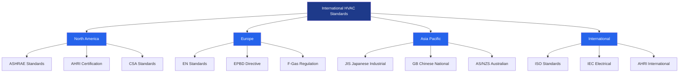
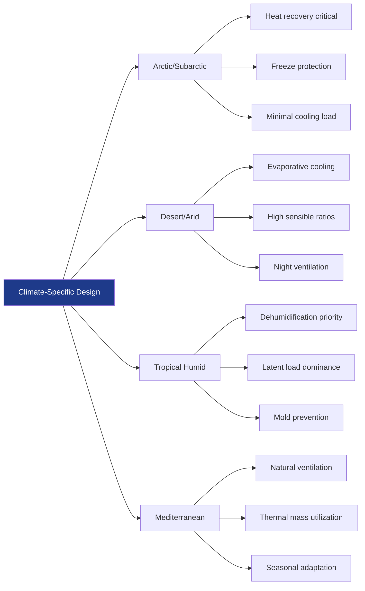
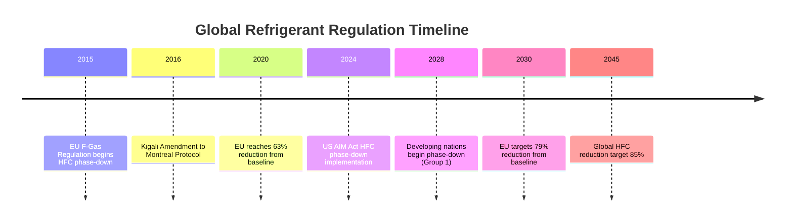

# International HVAC Standards and Global Practices

The globalization of HVAC engineering demands comprehensive understanding of international standards, regional design practices, and climate-specific approaches. This section examines the fundamental differences in HVAC methodologies across continents, evaluates regional regulatory frameworks, and establishes equivalencies between diverse efficiency metrics.

## Global Standards Framework

HVAC design standards vary significantly across regions, reflecting different priorities in energy efficiency, environmental protection, and building performance. The primary standards bodies operate independently while increasingly seeking harmonization.

### Major International Standards Organizations

## Regional Efficiency Metrics Comparison

Different regions employ distinct metrics for evaluating HVAC equipment efficiency, complicating international equipment specification and performance comparison.

| Region | Cooling Metric | Heating Metric | Units | Calculation Basis |
|--------|---------------|----------------|-------|-------------------|
| North America | SEER/EER | HSPF/AFUE | BTU/Wh | Seasonal average |
| Europe | SCOP/EER | SCOP | W/W | European climate |
| Japan | APF | APF | W/W | JIS conditions |
| China | APF/EER | COP | W/W | GB standards |
| Australia | AEER | ACOP | W/W | AS/NZS zones |
| International | ESEER | ISCOP | W/W | ISO conditions |

The conversion between North American and international metrics requires understanding the fundamental testing conditions and seasonal weighting factors:

$$\text{SEER (BTU/Wh)} \approx 3.412 \times \text{SCOP (W/W)}$$

This conversion provides approximate equivalency but does not account for differences in testing protocols, part-load performance weighting, and climate assumptions.

## European HVAC Framework

European HVAC practice centers on the Energy Performance of Buildings Directive (EPBD), which mandates near-zero energy buildings and establishes stringent efficiency requirements. The directive employs primary energy factors that account for generation and transmission losses:

$$\text{Primary Energy} = \text{Delivered Energy} \times f_{p}$$

Where $f_{p}$ represents the primary energy factor, varying from 1.0 for renewable sources to 2.5-3.0 for grid electricity in many European nations. This calculation methodology fundamentally influences equipment selection, favoring high-efficiency heat pumps and combined heat and power systems.

The F-Gas Regulation (EU 517/2014) phases down hydrofluorocarbon refrigerants through a quota system, reducing available HFC quantity by 79% between 2015 and 2030. The global warming potential (GWP) weighted phase-down creates market pressure toward low-GWP alternatives:

$$\text{CO}_{2}\text{-equivalent} = \text{Refrigerant Mass (kg)} \times \text{GWP}$$

## Asian Standards and Practices

Asian markets demonstrate rapid HVAC technology adoption with distinct regional characteristics. Japanese standards emphasize compact equipment and seasonal efficiency through the Annual Performance Factor (APF):

$$\text{APF} = \frac{\text{Annual Cooling Output} + \text{Annual Heating Output}}{\text{Annual Energy Consumption}}$$

Chinese GB standards mandate minimum efficiency requirements based on climate zones, with tier-based labeling systems driving market transformation. The five-tier energy label system creates clear efficiency differentiation, with Tier 1 representing top performance.

## Climate-Specific Design Approaches

Regional climate characteristics dictate fundamentally different design strategies beyond standard adjustments.

### Extreme Climate Design Parameters

Arctic and subarctic climates require designs prioritizing heat recovery, with effectiveness exceeding 85% to minimize outdoor air heating penalties. The heating energy recovery effectiveness directly impacts annual energy consumption:

$$\eta_{\text{recovery}} = \frac{T_{\text{supply}} - T_{\text{outdoor}}}{T_{\text{exhaust}} - T_{\text{outdoor}}}$$

Desert climates benefit from direct and indirect evaporative cooling, achieving supply air temperatures 3-8°C above wet-bulb temperature. The psychrometric process follows the constant enthalpy line for direct evaporative cooling:

$$\frac{h_{1} - h_{2}}{h_{fg}} = \frac{W_{2} - W_{1}}{1}$$

## Developing World Applications

HVAC solutions for developing regions emphasize low-cost cooling, off-grid capability, and minimal maintenance requirements. Passive cooling strategies, thermal mass optimization, and natural ventilation provide thermal comfort without conventional refrigeration equipment. Solar thermal cooling and absorption systems offer grid-independent operation where electricity infrastructure remains unreliable.

## International Harmonization Trends

Progressive harmonization of testing standards through ISO adoption facilitates equipment comparison and global trade. ASHRAE maintains active international engagement, with standards increasingly referenced worldwide. The trend toward seasonal efficiency metrics rather than single-point ratings reflects real-world performance priorities.

Climate change impacts drive convergence in design approaches as temperature extremes intensify globally. Heat pump adoption accelerates internationally as decarbonization policies favor electrification with renewable generation.

## Standards Convergence and Divergence

While international standards increasingly align on fundamental testing methodologies, significant regional differences persist in regulatory requirements and enforcement mechanisms.

### Testing Condition Comparison

| Standard | Cooling Test (°C) | Heating Test (°C) | Humidity | Part-Load Points |
|----------|------------------|-------------------|----------|------------------|
| ASHRAE 37 | 35/27 outdoor/indoor | 8.3/-8.3 outdoor | 50% RH | 4 points |
| EN 14511 | 35/27 outdoor/indoor | 7/20 outdoor | Various | 4 points |
| JIS C 9612 | 35/27 outdoor/indoor | 7/20 outdoor | Specified | 6 points |
| GB/T 7725 | 35/27 outdoor/indoor | 7/20 outdoor | 50% RH | 4 points |
| AS/NZS 3823 | 35/27 outdoor/indoor | 7/20 outdoor | 50% RH | Variable |

The variation in part-load testing points and weighting factors produces efficiency ratings that cannot be directly compared without conversion factors accounting for climate and usage patterns.

## Refrigerant Regulations Global Status

Refrigerant regulations demonstrate the most significant divergence in international HVAC practice, with phase-down schedules and allowable substances varying substantially by region.

## Regional Equipment Standards

Equipment construction standards reflect local conditions, electrical systems, and safety priorities. North American equipment operates on 60 Hz power with voltage ranges 115/230/460V single and three-phase. European equipment standardizes on 50 Hz with 230/400V systems. Asian markets accommodate both standards depending on regional grid characteristics.

Safety standards show similar variation, with UL certification dominant in North America, CE marking required in Europe, and regional certifications in Asian markets. The International Electrotechnical Commission (IEC) standards provide baseline requirements increasingly adopted worldwide.

## Conclusion

Understanding international HVAC standards, regional practices, and climate-specific design requirements enables effective global project execution. The ongoing evolution toward harmonized metrics, low-GWP refrigerants, and enhanced efficiency standards reflects worldwide commitment to sustainable building performance. Engineers must navigate diverse regulatory frameworks while applying fundamental thermodynamic principles that transcend regional boundaries.

The continuing globalization of HVAC manufacturing and design creates pressure for standards convergence, while regional climate conditions and regulatory priorities maintain necessary divergence in specific requirements. Successful international practice requires technical competence in fundamental principles combined with detailed knowledge of applicable regional standards.
