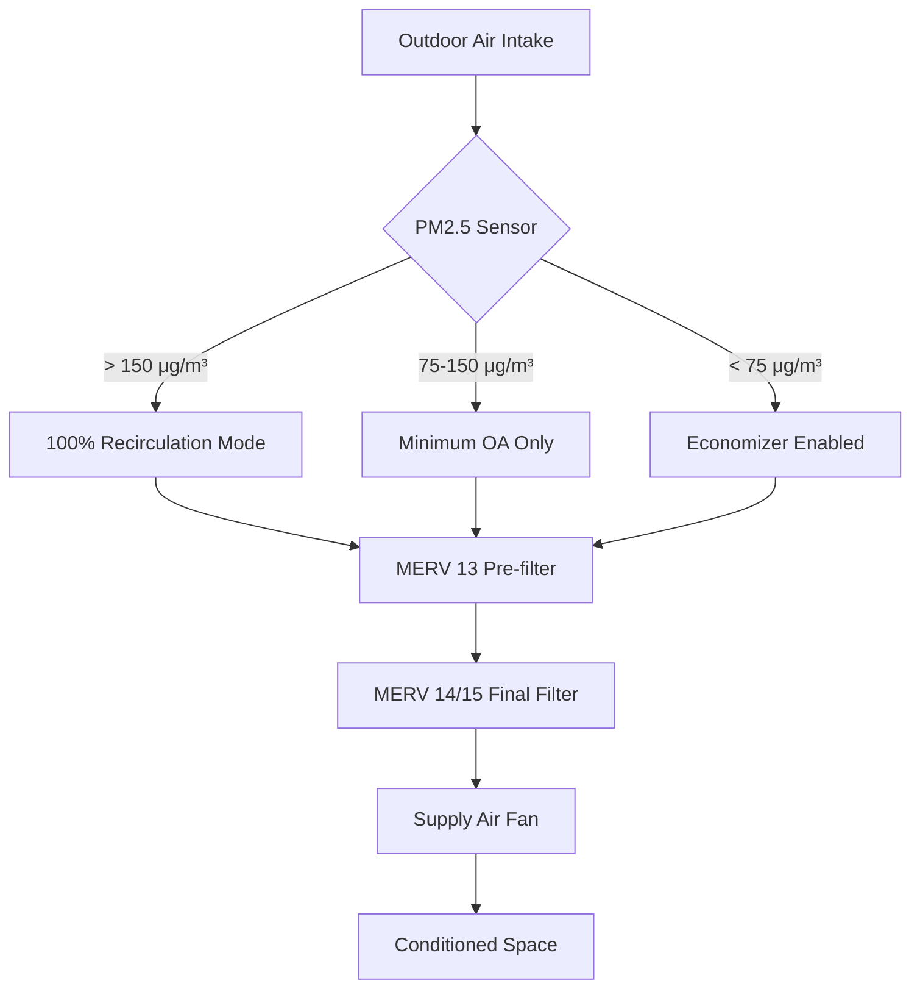
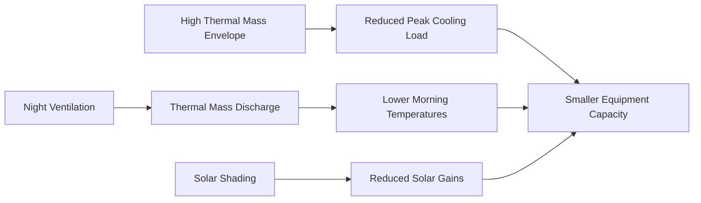

## Overview of Asian HVAC Engineering Practices

Asian HVAC standards reflect diverse climatic zones spanning arctic conditions in northern regions to tropical environments near the equator. The engineering methodologies combine traditional Western standards with region-specific adaptations addressing humidity control, typhoon resistance, seismic considerations, and extreme air quality challenges.

## Major Regional Standards Bodies

Asian HVAC practices are governed by multiple national and regional organizations that establish design criteria, testing protocols, and efficiency metrics distinct from ASHRAE standards.

### Primary Standards Organizations

| Organization | Region | Primary Focus | International Alignment |
|-------------|--------|---------------|------------------------|
| **SHASE** | Japan | Equipment standards, seismic design | ISO, partial ASHRAE |
| **CSSC** | China | GB standards, air quality | ISO, regional standards |
| **SAREK** | South Korea | Energy efficiency, DDC systems | ISO, ASHRAE hybrid |
| **SIRIM** | Malaysia | Tropical climate HVAC | MS standards, ISO |
| **ISHRAE** | India | Regional climate adaptation | ASHRAE-based with modifications |
| **TASEC** | Thailand | Humidity control standards | ASEAN harmonization |

## Climate-Driven Design Considerations

Asian regions require specialized HVAC approaches due to extreme climatic diversity and population density factors.

### Humidity Control Requirements

High humidity regions across Southeast Asia demand latent load management significantly exceeding typical ASHRAE design parameters. The sensible heat ratio (SHR) becomes the critical design parameter:

$$\text{SHR} = \frac{Q_{\text{sensible}}}{Q_{\text{total}}} = \frac{Q_{\text{sensible}}}{Q_{\text{sensible}} + Q_{\text{latent}}}$$

Typical SHR values by region:

- **Temperate Asia** (Japan, Korea): SHR = 0.75-0.85
- **Subtropical Asia** (Southern China): SHR = 0.65-0.75
- **Tropical Asia** (Southeast Asia): SHR = 0.55-0.70

The enthalpy difference drives total cooling requirements:

$$Q_{\text{total}} = \dot{m}_{\text{air}} \times (h_{\text{outdoor}} - h_{\text{indoor}})$$

where enthalpy values frequently exceed 90 kJ/kg in tropical coastal cities during monsoon seasons.

### Air Quality Integration

Asian standards increasingly mandate particulate matter (PM2.5, PM10) filtration beyond ASHRAE 52.2 specifications due to industrial emissions and dust storms. Chinese GB standards require:

- **Minimum filtration efficiency**: MERV 13 (85% for 1-3 μm particles)
- **Supply air PM2.5**: < 35 μg/m³ for occupied spaces
- **Outdoor air monitoring**: Continuous with automatic economizer lockout

## Energy Efficiency Metrics

Asian markets employ diverse efficiency rating systems that differ from ASHRAE Standard 90.1 and IECC requirements.

### Comparative Efficiency Standards

**Cooling Equipment Metrics:**

| Region | Metric | Typical Requirement | ASHRAE Equivalent |
|--------|--------|---------------------|-------------------|
| China | GB 19577 | EER ≥ 3.2 (W/W) | ~10.9 Btu/Wh |
| Japan | JIS C 9612 | APF ≥ 5.8 | Annual performance factor |
| Korea | KEP | CSPF ≥ 4.5 | Cooling seasonal performance |
| India | BEE Star Rating | ISEER ≥ 3.5-5.0 | Indian seasonal EER |
| Singapore | SS 530 | COP ≥ 3.0 | Standard COP at full load |

The relationship between power input and cooling output follows:

$$\text{COP} = \frac{Q_{\text{cooling}}}{W_{\text{input}}} = \frac{\dot{m}_{\text{ref}} \times (h_1 - h_4)}{W_{\text{comp}}}$$

where subscripts refer to refrigeration cycle state points in the vapor-compression cycle.

## Seismic and Typhoon Design Requirements

Japanese and Southeast Asian standards mandate structural resilience exceeding typical ASHRAE applications.

### Seismic Bracing Calculations

Equipment seismic force follows:

$$F_p = 0.4 \times a_p \times S_{DS} \times W_p \times \left(\frac{1 + 2\frac{z}{h}}{R_p/I_p}\right)$$

where:
- $a_p$ = component amplification factor (2.5 for mechanical equipment)
- $S_{DS}$ = design spectral response acceleration (up to 1.5g in Japan)
- $W_p$ = component operating weight
- $z/h$ = height ratio in structure
- $R_p$ = component response modification factor
- $I_p$ = component importance factor

Japanese Building Standard Law requires all HVAC equipment > 50 kg to be seismically braced for 1.5× the building design acceleration.

### Typhoon Wind Loading

Coastal Asian installations must resist wind pressures calculated per regional wind speed maps:

$$P = 0.00256 \times K_z \times K_{zt} \times K_d \times V^2 \times I$$

Design wind speeds reach 280 km/h (175 mph) for Super Typhoon-prone regions, requiring enhanced equipment anchorage and protective louver designs.

## Heat Rejection Challenges

High wet-bulb temperatures across Asia reduce cooling tower and air-cooled condenser performance significantly below ASHRAE design conditions.

### Cooling Tower Design Adjustments

The cooling tower approach temperature increases with elevated wet-bulb conditions:

$$\text{Approach} = T_{\text{CW,out}} - T_{\text{wb,ambient}}$$

Design wet-bulb temperatures by region:

- **Hong Kong**: 28.5°C (83.3°F) 0.4% design
- **Singapore**: 27.8°C (82°F) year-round average
- **Bangkok**: 28.0°C (82.4°F) 0.4% design
- **Mumbai**: 28.2°C (82.8°F) monsoon peak

These conditions necessitate oversized cooling towers (15-25% larger than ASHRAE 90.1 baseline) or supplementary evaporative pre-cooling.

## Building Envelope Integration

Asian standards emphasize thermal mass and natural ventilation integration absent from many Western design protocols.

Korean and Japanese standards credit thermal mass effects using:

$$Q_{\text{adjusted}} = Q_{\text{peak}} \times \left(1 - 0.15 \times \frac{M}{A}\right)$$

where $M/A$ represents mass per unit area (kg/m²) for heavyweight construction.

## Refrigerant Regulations

Asian markets transition to low-GWP refrigerants at varying rates, with Japan and Korea leading adoption of R-32 and R-454B while other regions maintain R-410A usage.

### Regional Refrigerant Preferences

- **Japan**: R-32 dominant for splits/VRF (GWP = 675)
- **China**: R-410A phasedown beginning 2024, R-32 transition
- **India**: R-32 and R-290 (propane) for smaller systems
- **Southeast Asia**: Mixed R-410A/R-32 with slow transition

The thermodynamic efficiency advantage of R-32 follows from its volumetric capacity:

$$\frac{Q_{\text{R-32}}}{Q_{\text{R-410A}}} \approx 1.05 \text{ (5% higher capacity per unit volume)}$$

## Conclusion

Asian HVAC standards reflect climate-driven priorities including extreme humidity management, air quality filtration, seismic resilience, and high-density urban applications. Engineering practitioners must navigate diverse national standards while addressing performance requirements often exceeding Western baseline criteria. Understanding regional calculation methodologies, efficiency metrics, and structural requirements proves essential for successful system design across Asian markets.

