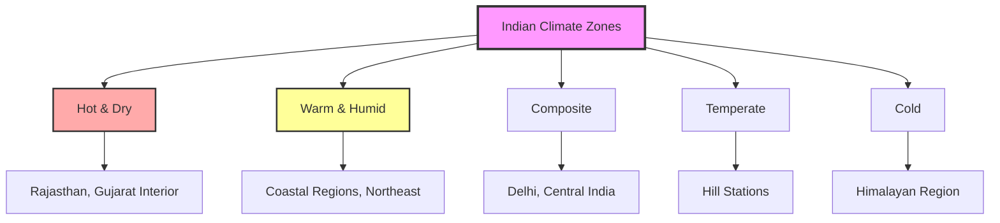

## Overview

Indian HVAC standards reflect the country's diverse climate zones, rapid urbanization, and growing emphasis on energy efficiency. The primary regulatory framework combines Bureau of Energy Efficiency (BEE) star ratings, National Building Code (NBC) requirements, and Indian Standards (IS codes) developed by the Bureau of Indian Standards. These standards address tropical and subtropical climate conditions while incorporating modern energy conservation principles.

## Primary Regulatory Framework

### Bureau of Energy Efficiency (BEE)

BEE establishes energy performance standards for HVAC equipment through mandatory star rating programs:

**Room Air Conditioners (RAC)**
- Star rating based on Indian Seasonal Energy Efficiency Ratio (ISEER)
- Mandatory labeling for units up to 10.5 kW cooling capacity
- Testing per IS 1391 (Part 1 and Part 2)
- Minimum ISEER requirements updated biennially

**Chillers and Central Air Conditioning**
- Voluntary labeling program for water-cooled and air-cooled chillers
- Performance measured at standard rating conditions
- Integration with Energy Conservation Building Code (ECBC)

### National Building Code (NBC) 2016

NBC Part 8 (Building Services) addresses HVAC requirements:

- Minimum ventilation rates for various occupancies
- Air conditioning load calculation procedures
- Equipment installation and safety requirements
- Coordination with electrical and plumbing systems

### Indian Standards (IS Codes)

Key standards governing HVAC design and installation:

| Standard | Title | Application |
|----------|-------|-------------|
| IS 4444 (Parts 1-3) | Code of Practice for Central Air Conditioning | Design, equipment, installation |
| IS 3315 | Ventilation and Air Conditioning in Textile Industry | Industrial applications |
| IS 3231 | Code of Practice for Air Conditioning in Medical Facilities | Healthcare requirements |
| IS 1391 | Room Air Conditioners | Performance testing |
| IS 13315 (Parts 1-2) | Unitary Air Conditioners | Testing and rating |

## Climate Zone Classification

Indian climate zones as defined by NBC and ECBC:

## Energy Conservation Building Code (ECBC)

ECBC establishes minimum energy performance standards for commercial buildings with connected loads exceeding 100 kW or contract demand above 120 kVA.

### Building Envelope Requirements

**Warm & Humid Zone (Representative for Coastal Cities)**

Maximum allowable U-factors (W/m²·K):

| Component | ECBC Standard | ECBC+ | SuperECBC |
|-----------|---------------|-------|-----------|
| Roof | 0.409 | 0.261 | 0.200 |
| Wall | 0.450 | 0.400 | 0.350 |
| Fenestration | 3.300 | 3.000 | 2.700 |
| Skylight | 4.270 | 3.580 | 2.840 |

**Solar Heat Gain Coefficient (SHGC)**
- Maximum SHGC: 0.25 (ECBC Standard)
- Maximum SHGC: 0.23 (ECBC+)
- Significant impact on cooling loads in tropical climate

### HVAC System Requirements

**Cooling Equipment Efficiency**

Air-cooled chillers (full load):

$$\text{COP}_{\text{min}} = \frac{Q_c}{W} \geq 2.65 \text{ (ECBC Standard)}$$

$$\text{COP}_{\text{min}} = \frac{Q_c}{W} \geq 2.85 \text{ (ECBC+)}$$

Water-cooled chillers demonstrate superior efficiency in Indian climate:

$$\text{COP}_{\text{water-cooled}} = \frac{Q_c}{W} \geq 5.50 \text{ at rated conditions}$$

**Part Load Performance**

Integrated Part Load Value (IPLV) accounts for variable load operation:

$$\text{IPLV} = 0.01A + 0.42B + 0.45C + 0.12D$$

Where:
- A = COP at 100% capacity
- B = COP at 75% capacity
- C = COP at 50% capacity
- D = COP at 25% capacity

### Ventilation Requirements

Minimum outdoor air requirements per ECBC and NBC:

| Space Type | Outdoor Air (L/s·person) | Air Changes per Hour |
|------------|--------------------------|----------------------|
| Office Space | 6.5 | - |
| Conference Room | 5.0 | - |
| Retail | 5.0 | - |
| Restaurant Dining | 10.0 | - |
| Kitchen | - | 15-30 |
| Toilet/Bathroom | - | 10 |

## Cooling Load Calculation

Indian standards reference ASHRAE methodologies with adjustments for local conditions.

### Design Outdoor Conditions

**Warm & Humid Climate (Mumbai, Chennai, Kolkata)**
- Dry-bulb temperature: 32-34°C (1% design condition)
- Wet-bulb temperature: 27-29°C
- Relative humidity: 70-80%

**Hot & Dry Climate (Delhi, Jaipur, Ahmedabad)**
- Dry-bulb temperature: 40-46°C (1% design condition)
- Wet-bulb temperature: 24-28°C
- Daily temperature range: 12-15°C

### Solar Heat Gain

Higher solar intensity requires careful fenestration design:

$$q_{solar} = A \times SHGC \times SC \times SHGF$$

Where:
- A = window area (m²)
- SHGC = solar heat gain coefficient
- SC = shading coefficient
- SHGF = solar heat gain factor for latitude (W/m²)

Indian latitudes (8°N to 35°N) experience intense solar radiation, particularly in hot-dry zones where peak values exceed 900 W/m².

## Air Conditioning System Design

### System Selection Criteria

**Variable Refrigerant Flow (VRF)**
- Gaining market share in commercial applications
- High efficiency at part load conditions
- Reduced ductwork requirements
- Individual zone control

**Chilled Water Systems**
- Standard for large commercial buildings
- Central plant with air handling units
- Better humidity control in warm-humid climates
- Integration with thermal storage

### Humidity Control

Critical consideration in warm-humid zones:

$$SHR = \frac{q_s}{q_s + q_l}$$

Where:
- SHR = sensible heat ratio
- q_s = sensible cooling load (kW)
- q_l = latent cooling load (kW)

Coastal regions require SHR values of 0.65-0.75, necessitating:
- Proper coil sizing for moisture removal
- Reheat consideration for deep dehumidification
- Dedicated outdoor air systems (DOAS) for ventilation loads

## Indian Seasonal Energy Efficiency Ratio (ISEER)

BEE developed ISEER to reflect actual operating conditions across Indian climate zones:

$$\text{ISEER} = \frac{\text{Total Annual Cooling Output (kWh)}}{\text{Total Annual Energy Consumption (kWh)}}$$

Calculation based on weighted operation at multiple temperature bins:

| Outdoor Temperature (°C) | Operating Hours (%) | Compressor Load |
|-------------------------|---------------------|-----------------|
| 24 | 5 | 100% |
| 28 | 10 | 100% |
| 32 | 25 | 100% |
| 35 | 35 | 100% |
| 38 | 15 | 100% |
| 41 | 10 | 100% |

Star ratings updated to require minimum ISEER performance aligned with global best practices.

## Refrigerant Regulations

India follows the Montreal Protocol and Kigali Amendment:

**Phase-down Schedule**
- HFC consumption freeze: 2028
- 10% reduction: 2029
- 85% reduction: 2047

**Current Trends**
- R-32 becoming standard in room air conditioners
- R-410A prevalent in VRF systems
- R-134a phase-out in chillers
- Growing interest in R-290 (propane) for small systems

## Installation and Safety Standards

### Electrical Safety

Per NBC Part 8 and IS 4444:
- Dedicated circuits for air conditioning equipment
- Proper earthing and grounding
- Overcurrent and overload protection
- Coordination with Central Electricity Authority regulations

### Structural Requirements

Rooftop and split system installations must address:
- Equipment weight and seismic loading
- Drainage and waterproofing
- Access for maintenance
- Protection from monsoon weather

## Comparison with ASHRAE Standards

| Parameter | ASHRAE 90.1-2019 | ECBC 2017 | Relationship |
|-----------|------------------|-----------|-------------|
| Chiller COP (water-cooled) | 6.10 (Path A) | 5.50 | ASHRAE more stringent |
| Ventilation Rate (Office) | 8.5 L/s·person | 6.5 L/s·person | ECBC lower |
| Wall U-factor (Climate 1A) | 0.701 W/m²·K | 0.450 W/m²·K | ECBC more stringent |
| Window SHGC | 0.25 | 0.25 | Equivalent |

Indian standards increasingly align with international best practices while accounting for economic and climatic realities.

## Future Developments

**Emerging Priorities**
- Integration of renewable energy with HVAC systems
- Smart grid compatibility and demand response
- Enhanced indoor air quality standards post-pandemic
- Expansion of ECBC to residential sector (Eco-Niwas Samhita)
- Advanced commissioning requirements for large systems

Indian HVAC standards continue evolving to balance energy efficiency, occupant comfort, and economic development in one of the world's fastest-growing construction markets.
