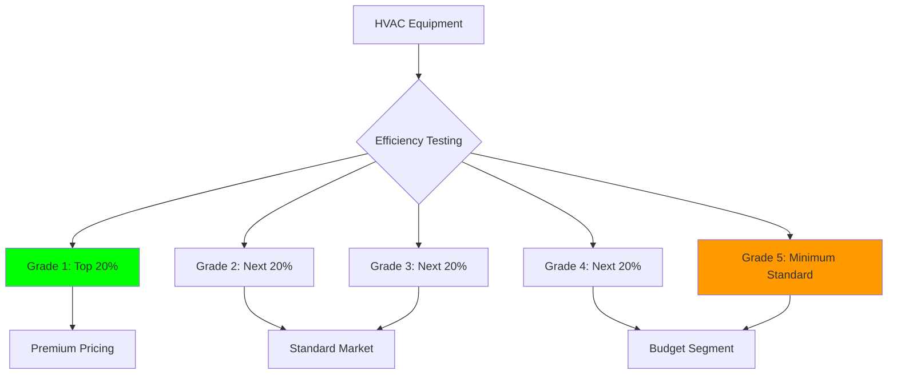
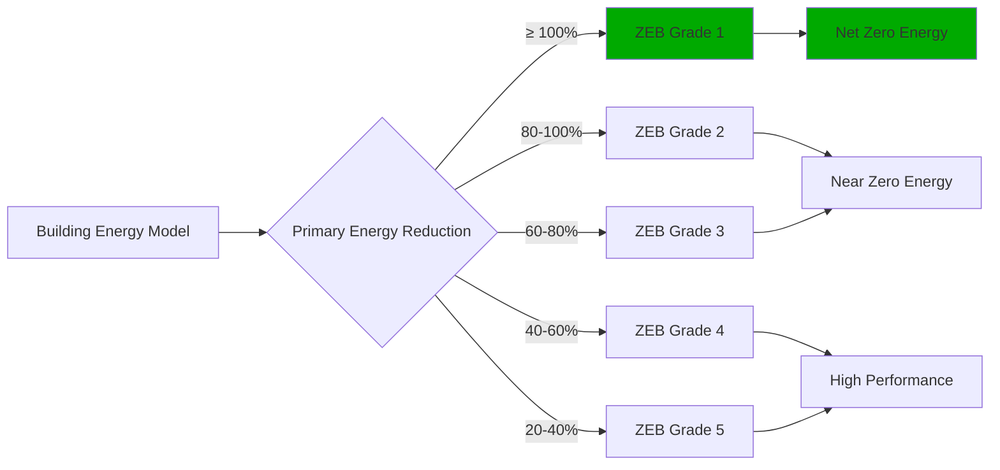

## Overview of Korean HVAC Standards Framework

South Korea's HVAC regulatory system combines rigorous national standards (KS), mandatory energy efficiency labeling, and aggressive building energy performance requirements. The Korean Standards Association (KSA) develops technical standards while the Korea Energy Agency (KEA) administers efficiency programs. This dual framework has positioned South Korea as a leader in heat pump deployment, district heating integration, and zero energy building development in the Asia-Pacific region.

The standards reflect Korea's unique heating culture centered on ondol (radiant floor heating), cold winter climate requiring robust heating capacity, and government commitment to reducing building energy consumption by 30% from 2010 baseline levels by 2030.

## Korean Standards (KS) for HVAC Equipment

### KS B 6368: Air Conditioners and Heat Pumps

KS B 6368 establishes performance requirements, testing procedures, and safety specifications for air conditioning and heat pump equipment. The standard defines:

**Capacity rating conditions** using psychrometric testing chambers:

| Operating Mode | Indoor Condition | Outdoor Condition |
|----------------|------------------|-------------------|
| Cooling (rated) | 27°C DB / 19°C WB | 35°C DB / 24°C WB |
| Heating (rated) | 20°C DB / 15°C WB | 7°C DB / 6°C WB |
| Low temp heating | 20°C DB / 15°C WB | -15°C DB |
| Extreme low temp | 20°C DB / 15°C WB | -25°C DB |

The low temperature testing requirements at -15°C and -25°C exceed AHRI 210/240 specifications, reflecting Korean winter conditions where outdoor temperatures regularly fall below -10°C in northern regions. Equipment sold in Korea must demonstrate heating capacity and efficiency at these extreme conditions.

**Performance metrics** include:

- **Cooling COP**: Calculated as cooling capacity (W) / input power (W) at rated conditions
- **Heating COP**: Calculated as heating capacity (W) / input power (W) at rated conditions
- **Integrated part-load value (IPLV)**: Weighted performance across part-load conditions
- **Annual energy consumption**: Based on Seoul climate bin data

**Safety requirements** address:

- Electrical safety per KS C IEC 60335-2-40 for motor-compressors
- Refrigerant charge limits and leak detection for A2L refrigerants
- Pressure vessel certification for components exceeding 0.3 MPa
- Fire resistance of electrical components and insulation materials

### KS B 6879: Packaged Air Conditioners

KS B 6879 specifically covers packaged units including split systems, multi-splits, and VRF systems. Key provisions include:

**Minimum efficiency requirements** aligned with Energy Efficiency Label grade thresholds:

- Grade 1 equipment must achieve COP ≥ 4.1 (cooling) and COP ≥ 3.6 (heating at 7°C)
- Inverter-driven equipment must achieve seasonal efficiency ratings 25% higher than fixed-speed equivalents
- Multi-split systems must meet efficiency requirements at all partial load conditions (25%, 50%, 75%, 100%)

**Refrigerant specifications**:

- Maximum refrigerant charge per circuit
- Leak detection requirements for systems exceeding 1.5 kg charge
- Refrigerant concentration limits in occupied spaces
- Recovery and recycling requirements at end-of-life

**Noise level limits** measured at 1 meter distance in semi-anechoic conditions:

| Equipment Capacity | Indoor Unit | Outdoor Unit |
|-------------------|-------------|--------------|
| < 7 kW | 45 dB(A) | 55 dB(A) |
| 7-14 kW | 48 dB(A) | 58 dB(A) |
| 14-28 kW | 52 dB(A) | 62 dB(A) |
| > 28 kW | 55 dB(A) | 65 dB(A) |

## Energy Efficiency Label System

Korea operates a mandatory energy efficiency labeling program administered by the Korea Energy Agency. All HVAC equipment sold in the domestic market must display efficiency labels indicating grade (1-5), annual energy consumption, and estimated operating cost.

### Five-Grade Efficiency Classification

The system uses a five-tier structure where Grade 1 represents highest efficiency:

Current thresholds for room air conditioners (cooling capacity ≤ 7 kW):

| Grade | Cooling COP | Heating COP (7°C) | Heating COP (-15°C) |
|-------|-------------|-------------------|---------------------|
| 1 | ≥ 4.10 | ≥ 3.60 | ≥ 2.40 |
| 2 | ≥ 3.85 | ≥ 3.35 | ≥ 2.20 |
| 3 | ≥ 3.60 | ≥ 3.10 | ≥ 2.00 |
| 4 | ≥ 3.35 | ≥ 2.85 | ≥ 1.80 |
| 5 | ≥ 3.10 | ≥ 2.60 | ≥ 1.60 |

The heating COP requirements at -15°C distinguish Korean standards from most international frameworks, which typically specify performance only at moderate conditions (2-7°C). This reflects the critical importance of reliable low-temperature heating capacity.

### Seasonal Performance Metrics

Variable-speed equipment uses seasonal performance metrics accounting for part-load operation:

**Cooling Seasonal Performance Factor (CSPF)**:

$$\text{CSPF} = \frac{\sum_{i=1}^{n} Q_{c,i} \cdot h_i}{\sum_{i=1}^{n} E_{c,i} \cdot h_i}$$

where:
- $Q_{c,i}$ = cooling capacity at bin condition $i$ (W)
- $E_{c,i}$ = power input at bin condition $i$ (W)
- $h_i$ = hours at bin condition $i$ (hours/year)
- $n$ = number of temperature bins

**Heating Seasonal Performance Factor (HSPF)**:

$$\text{HSPF} = \frac{\sum_{i=1}^{n} Q_{h,i} \cdot h_i + Q_{def}}{\sum_{i=1}^{n} E_{h,i} \cdot h_i + E_{def} + E_{aux}}$$

where:
- $Q_{h,i}$ = heating capacity at bin condition $i$ (W)
- $E_{h,i}$ = power input at bin condition $i$ (W)
- $Q_{def}$ = heating capacity loss during defrost (Wh)
- $E_{def}$ = energy consumed during defrost cycles (Wh)
- $E_{aux}$ = auxiliary heat energy at temperatures below equipment capacity (Wh)

The defrost and auxiliary heat terms become significant in Korean climate conditions where low-temperature operation represents substantial annual hours.

## Ondol Integration and Radiant Heating

Traditional Korean ondol heating—radiant floor systems heated by water or electric resistance—influences HVAC system design and standards. Modern ondol systems integrate with heat pumps and district heating infrastructure.

### Hydronic Ondol Specifications

KS B 6526 governs hydronic radiant floor heating systems:

**Supply water temperature requirements**:

- Maximum supply temperature: 60°C to prevent floor surface overheating
- Design supply temperature: 40-50°C for typical residential applications
- Return temperature: Minimum 30°C to prevent condensation in distribution piping

**Heat flux limitations** based on floor covering:

| Floor Covering | Maximum Heat Flux | Surface Temperature |
|----------------|------------------|---------------------|
| Tile/stone | 100 W/m² | 29°C |
| Engineered wood | 80 W/m² | 28°C |
| Vinyl/linoleum | 90 W/m² | 28°C |
| Carpet | 70 W/m² | 27°C |

**Thermal resistance calculation** for ondol floor assembly:

$$R_{total} = R_{finish} + R_{slab} + R_{tubing} + R_{insulation}$$

Minimum insulation R-value below ondol tubing:

- Ground floor: R = 2.1 m²·K/W
- Above unheated space: R = 2.6 m²·K/W
- Above heated space: R = 1.3 m²·K/W

### Heat Pump Integration

Air-source heat pumps supplying ondol systems face unique challenges:

**Capacity matching**: Heat pumps must deliver rated capacity at -15°C outdoor temperature, when building heating load peaks and equipment capacity typically degrades. Undersizing results in auxiliary electric resistance heat, significantly increasing operating cost.

**Supply temperature capability**: Standard air-source heat pumps produce 45°C supply water at rated conditions. Low outdoor temperatures reduce achievable supply temperature to 35-40°C, necessitating increased flow rate or supplementary heating.

**Defrost cycle impact**: Frequent defrost cycles at low temperatures interrupt heat delivery. Buffer tanks (200-500 L capacity) maintain system operation during defrost periods.

**COP degradation** at low temperature:

$$\text{COP}_{actual} = \text{COP}_{rated} \times \left(1 - 0.015 \times (T_{rated} - T_{outdoor})\right)$$

For equipment rated at 7°C operating at -15°C:

$$\text{COP}_{-15°C} = 3.6 \times (1 - 0.015 \times 22) = 2.41$$

This approximation shows the significant performance degradation driving Korean standards' low-temperature testing requirements.

## District Heating Infrastructure

South Korea operates extensive district heating networks serving approximately 58% of urban residential units. The Korea District Heating Corporation (KDHC) manages regional networks, while smaller municipal systems serve individual cities.

### Technical Characteristics

**Heat source mix**:

- Combined heat and power (CHP): 65%
- Waste heat recovery from industrial facilities: 20%
- Natural gas boilers: 10%
- Renewable sources (biomass, geothermal): 5%

**Distribution parameters**:

| Parameter | Supply | Return |
|-----------|--------|--------|
| Temperature (winter) | 110-130°C | 60-70°C |
| Temperature (summer DHW) | 70-85°C | 50-60°C |
| Design pressure | 10-16 bar | 3-5 bar |

**Building-level heat interface units** reduce network temperature to ondol supply conditions (40-50°C) using plate heat exchangers. Modern installations incorporate:

- Heat meters measuring energy consumption for usage-based billing
- Thermostatic mixing valves preventing floor overheating
- Differential pressure control valves balancing distribution
- Weather-compensated supply temperature control

### Energy Efficiency Improvements

District heating modernization initiatives focus on:

**Fourth-generation district heating (4GDH)** reducing supply temperatures to 50-70°C:

- Enables waste heat integration from low-temperature sources
- Reduces distribution losses from 10-15% to 5-8%
- Allows plastic piping replacing steel, reducing installation cost
- Requires larger heat exchangers and emitter surfaces

**Thermal energy storage** enabling demand-side management:

- Building-level water tanks (10-30 m³) storing off-peak heat
- Phase change materials providing compact thermal storage
- Centralized storage at district heating plants time-shifting generation

## Zero Energy Building Certification

Korea mandates zero energy building (ZEB) performance for all new public buildings exceeding 1,000 m² from 2020, expanding to all new buildings exceeding 500 m² by 2025. The certification uses a five-grade system based on primary energy reduction versus baseline.

### ZEB Grade Structure

**Calculation methodology**:

$$\text{Primary Energy Reduction} = \frac{E_{baseline} - (E_{consumption} - E_{renewable})}{E_{baseline}} \times 100\%$$

where:
- $E_{baseline}$ = baseline building primary energy per building energy code
- $E_{consumption}$ = actual building primary energy consumption
- $E_{renewable}$ = renewable energy generation (solar PV, solar thermal, geothermal)

**HVAC system requirements** for ZEB certification:

- Heat pumps with seasonal COP ≥ 4.0 (cooling) and ≥ 3.5 (heating)
- Heat recovery ventilation with effectiveness ≥ 75%
- Radiant heating/cooling systems with individual zone control
- Building automation systems optimizing equipment operation
- Thermal energy storage reducing peak demand

### HVAC Technology Deployment

Korean ZEB projects emphasize:

**Air-source heat pump systems**: Variable refrigerant flow (VRF) or water-source heat pumps supplying ondol and fan coil units. Cold climate heat pumps maintaining COP > 2.0 at -20°C outdoor temperature.

**Ground-source heat pump systems**: Closed-loop vertical boreholes (100-200 m depth) providing stable heat source/sink. Design entering water temperatures of 5-30°C enable heat pump COP of 4.5-5.5.

**Solar thermal integration**: Evacuated tube collectors preheating domestic hot water and providing low-temperature heat to heat pumps, improving overall system efficiency by 15-25%.

## Society of Air-Conditioning and Refrigerating Engineers of Korea (SAREK)

SAREK develops design guidelines, load calculation methodologies, and technical standards complementing mandatory KS standards.

**SAREK Design Handbook** provides:

- Load calculation procedures for Korean building types and climate zones
- Duct and piping sizing methodologies
- Equipment selection guidelines
- Control sequence recommendations
- Commissioning procedures

**Climate zones** for HVAC design:

| Zone | Representative City | Design Winter Temp | Design Summer Temp | HDD (18°C) |
|------|--------------------|--------------------|-----------------------|------------|
| 1 (Northern) | Seoul | -15°C | 32°C DB / 25°C WB | 2,700 |
| 2 (Central) | Daejeon | -12°C | 33°C DB / 26°C WB | 2,400 |
| 3 (Southern) | Busan | -8°C | 31°C DB / 26°C WB | 1,800 |
| 4 (Jeju) | Jeju | -3°C | 30°C DB / 26°C WB | 1,200 |

The significant variation in heating degree days drives different equipment selection and system design approaches across regions.

## Refrigerant Regulations and Future Directions

Korea follows the Montreal Protocol and Kigali Amendment schedules for refrigerant phase-down. The Act on the Control of Transboundary Movement of Hazardous Wastes governs refrigerant management.

**Current refrigerant landscape**:

- R410A: Dominant refrigerant in existing equipment, phase-down beginning 2025
- R32: Preferred replacement for residential and light commercial equipment (GWP = 675)
- R454B: Emerging for commercial applications (GWP = 466)
- R290 (propane): Used in small capacity equipment < 1 kW (GWP = 3)

**A2L refrigerant safety requirements** per KS C IEC 60335-2-40:

- Refrigerant leak detection in occupied spaces for systems > 1.5 kg charge
- Mechanical ventilation interlocked with leak detection
- Maximum refrigerant concentration limits preventing flammable mixtures
- Service access restrictions requiring technician certification

**Recovery requirements**:

- Mandatory refrigerant recovery at equipment disposal
- Certified recovery equipment and technicians
- Recovery rate targets: 80% for field-serviceable equipment
- Penalties for venting refrigerants to atmosphere

## Market Characteristics and Technology Trends

### Heat Pump Market Growth

South Korea's heat pump market grows 12-15% annually, driven by:

- District heating network limitations in suburban areas
- Government subsidies for high-efficiency heat pumps replacing fossil fuel heating
- Zero energy building mandates requiring high-performance HVAC
- Consumer preference for combined cooling and heating capability

**Government incentive programs**:

- Residential heat pump subsidies: 30-50% of equipment and installation cost
- Commercial building grants for heat pump retrofits
- Accelerated depreciation for high-efficiency equipment
- Preferential financing for ZEB projects

### Smart HVAC Integration

Korean HVAC manufacturers integrate building automation and IoT capabilities:

- Remote control and monitoring via smartphone applications
- Integration with smart home platforms (Samsung SmartThings, LG ThinQ)
- AI-based learning algorithms optimizing comfort and energy consumption
- Demand response participation reducing peak electrical load
- Predictive maintenance using equipment operating data

### Industry Consolidation

Korean HVAC manufacturing concentrates among major conglomerates:

- LG Electronics: Commercial and residential air conditioning, VRF systems, chillers
- Samsung Electronics: Residential systems, DVM (Digital Variable Multi) VRF
- Carrier Korea: Licensed production of Carrier equipment for domestic market
- Domestic specialists: Daeil Aqua, Kyungdong Navien focusing on heating equipment

These manufacturers compete in efficiency ratings, with Grade 1 equipment representing 45% of residential market sales, significantly higher than most international markets where premium efficiency captures 15-25% share.

## Conclusion

South Korea's HVAC standards framework combines rigorous technical requirements, mandatory efficiency labeling, and aggressive building energy performance mandates. KS standards address Korean climate conditions through low-temperature performance requirements reflecting cold winter heating demands. The energy efficiency label system drives market transformation toward high-performance equipment. Ondol integration creates unique design requirements for heat pump systems. Zero energy building certification accelerates deployment of heat pumps, heat recovery ventilation, and renewable energy integration. Understanding Korean standards, market dynamics, and technology trends provides essential context for manufacturers, engineers, and policymakers engaged in Asian HVAC markets and global efficiency initiatives.
