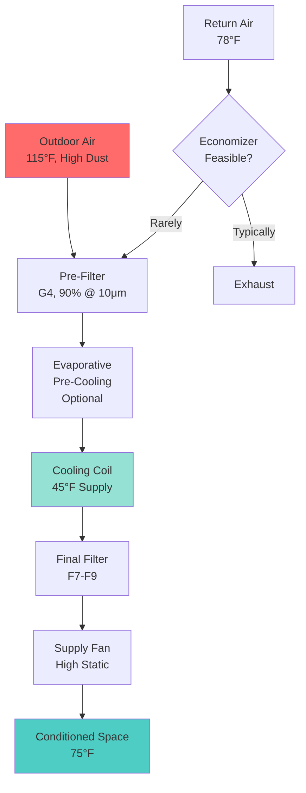
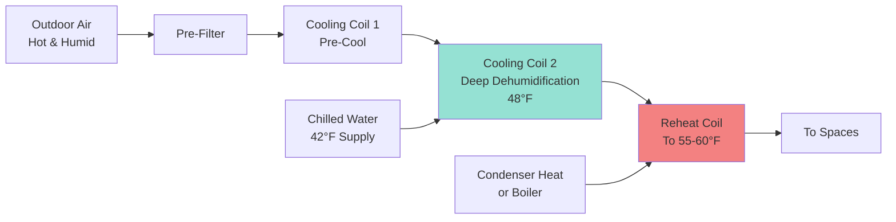

## Overview of Middle East HVAC Challenges

Middle East HVAC systems operate under extreme thermal conditions that drive unique design requirements. Outdoor design temperatures routinely exceed 115°F (46°C) with simultaneous solar radiation intensities reaching 1000 W/m². The combination of extreme sensible heat, high dust concentrations, and coastal humidity creates engineering challenges distinct from other global regions.

Regional standards have evolved to address desert climate performance requirements, sand infiltration protection, and energy efficiency in continuously cooling-dominated applications.

## Extreme Temperature Design Criteria

### Cooling Load Intensity

Middle East design conditions generate peak cooling loads that exceed typical ASHRAE design parameters. Dubai's 0.4% design condition reaches 115°F (46°C) dry bulb with 79°F (26°C) wet bulb, while Riyadh experiences 117°F (47°C) dry bulb with lower humidity.

The sensible cooling load dominates due to high temperature differentials:

$$Q_s = \dot{m} \times c_p \times (T_{outdoor} - T_{indoor})$$

where:
- $Q_s$ = sensible cooling load (BTU/hr or kW)
- $\dot{m}$ = mass flow rate of outdoor air (lb/hr or kg/s)
- $c_p$ = specific heat of air (0.24 BTU/lb·°F or 1.006 kJ/kg·K)
- $T_{outdoor}$ = outdoor design temperature
- $T_{indoor}$ = indoor setpoint (typically 75°F or 24°C)

For a 117°F outdoor condition with 75°F indoor setpoint, the temperature differential reaches 42°F (23°C), compared to 15-20°F (8-11°C) differentials in temperate climates.

### Equipment Capacity Derating

High ambient temperatures reduce refrigeration equipment capacity and efficiency. Air-cooled condensers experience significant capacity degradation as condensing temperature rises with ambient conditions.

The Carnot coefficient of performance degradation follows:

$$\text{COP}_{degradation} = \frac{T_{evap}}{T_{cond} - T_{evap}}$$

where temperatures are absolute (Rankine or Kelvin). As $T_{cond}$ increases with ambient temperature, COP decreases exponentially.

Manufacturers typically rate equipment at 95°F (35°C) ambient, requiring capacity correction factors of 0.85-0.90 for 115°F (46°C) operation. Engineers must oversize equipment or specify units designed for high-ambient operation.

## Sand and Dust Mitigation Strategies

### Filtration Requirements

Atmospheric dust concentrations in Middle East urban areas regularly exceed 150 μg/m³, with sandstorm events reaching 1000+ μg/m³. This particulate loading necessitates robust filtration systems beyond standard commercial practice.

| Filter Stage | Efficiency | Application | Replacement Frequency |
|--------------|------------|-------------|----------------------|
| Pre-filter (G4) | 85-90% @ 10 μm | Coarse dust removal | 1-2 months |
| Bag filter (F7) | 80-90% @ 1 μm | Fine particle capture | 3-4 months |
| Final filter (F9) | 95% @ 1 μm | Critical applications | 6-12 months |

Multi-stage filtration protects downstream coils and maintains indoor air quality. Pre-filters extend the life of higher-efficiency downstream filters by capturing coarse particles.

### Coil Protection

Heat exchanger coils require protective measures against sand accumulation and erosion. Design practices include:

- **Increased fin spacing**: 8-10 fins per inch (compared to 12-14 FPI in temperate climates) reduces plugging susceptibility
- **Coil coatings**: Epoxy or polymer coatings protect aluminum fins from corrosion and facilitate cleaning
- **Upstream filtration**: Minimum MERV 11 filtration protects cooling coils
- **Access for cleaning**: Removable panels and adequate clearance enable periodic maintenance

Pressure drop across fouled coils increases according to:

$$\Delta P_{fouled} = \Delta P_{clean} \times \left(1 + k \times t\right)$$

where $k$ represents the fouling rate coefficient and $t$ is operating time since last cleaning.

## Regional Standards and Codes

### Saudi Arabian Standards

Saudi Arabia has developed HVAC standards through the Saudi Standards, Metrology and Quality Organization (SASO) that reference but modify ASHRAE and ISO standards for local conditions.

**SASO 2663**: Energy performance of air conditioners specifies minimum efficiency requirements:
- Split systems ≤12,000 BTU/hr: Minimum EER of 11.5 (3.37 W/W)
- Package units: Minimum EER of 10.0 (2.93 W/W)

These requirements exceed US minimum standards to address the energy intensity of continuous cooling operation.

### UAE Green Building Regulations

Dubai Municipality Regulation 66 establishes green building requirements including HVAC performance criteria:

- **Chilled water systems**: Minimum system efficiency of 0.65 kW/ton (COP of 5.4)
- **DX systems**: Seasonal energy efficiency ratio (SEER) ≥14 for residential applications
- **Ventilation**: CO₂-based demand-controlled ventilation required for spaces >500 m²
- **Heat recovery**: Energy recovery required when outdoor air exceeds 30% of supply air

## Chilled Water System Prevalence

Large-scale developments in the Middle East predominantly employ district cooling or building-level chilled water systems rather than direct expansion equipment. This approach provides several advantages for extreme climates:

### Thermodynamic Efficiency

Central chilled water plants achieve higher coefficients of performance through:

1. **Large capacity equipment**: Centrifugal chillers in 500-2000 ton capacities operate at part-load efficiency peaks
2. **Water-cooled condensing**: Cooling towers provide lower condensing temperatures than air-cooled systems, even in hot climates
3. **Thermal storage**: Ice or chilled water storage shifts electrical demand to off-peak hours when ambient temperatures are lower

The water-cooled chiller advantage in Middle East climates stems from the wet bulb temperature depression. Even when dry bulb reaches 115°F (46°C), wet bulb temperatures of 78-82°F (26-28°C) allow cooling tower approach temperatures of 85-90°F (29-32°C), compared to 115°F+ (46°C+) for air-cooled condensers.

### Distribution System Design

Chilled water distribution requires careful design to minimize thermal gains and pumping energy:

$$Q_{gain} = U \times A \times (T_{ambient} - T_{chw})$$

where:
- $U$ = overall heat transfer coefficient of insulated pipe (BTU/hr·ft²·°F)
- $A$ = external pipe surface area (ft²)
- $T_{ambient}$ = ambient temperature in pipe chases or underground
- $T_{chw}$ = chilled water temperature (typically 42-45°F)

With ambient temperatures in unconditioned spaces reaching 100-120°F (38-49°C), insulation thickness of 2-3 inches is standard for chilled water piping, compared to 1-1.5 inches in temperate climates.

## Humidity Control Challenges

Coastal Middle East cities (Dubai, Abu Dhabi, Jeddah) experience high humidity simultaneously with extreme heat, creating latent cooling loads that challenge conventional systems.

The latent heat removal requirement follows:

$$Q_l = \dot{m} \times h_{fg} \times (W_{outdoor} - W_{indoor})$$

where:
- $Q_l$ = latent cooling load
- $h_{fg}$ = enthalpy of vaporization (1060 BTU/lb)
- $W$ = humidity ratio (lb water/lb dry air)

For Dubai summer conditions (115°F DB, 79°F WB), the humidity ratio reaches 0.0135 lb/lb. Maintaining indoor conditions at 75°F and 50% RH (W = 0.0093 lb/lb) requires substantial dehumidification.

### Dedicated Outdoor Air Systems

DOAS configurations provide superior humidity control by separating ventilation air treatment from space conditioning:

Deep cooling to 48-50°F effectively condenses moisture, followed by reheat to prevent overcooling. The energy penalty of reheat is offset by precise humidity control and reduced total airflow requirements.

## Energy Efficiency Imperatives

Cooling energy represents 60-70% of building electrical consumption in Middle East climates. Efficiency improvements directly impact operating costs and grid demand.

### Variable Speed Drive Applications

VFD-controlled equipment provides significant energy savings in systems operating at part load. Fan power follows the affinity laws:

$$P_2 = P_1 \times \left(\frac{N_2}{N_1}\right)^3$$

where $P$ is power and $N$ is rotational speed. Reducing fan speed to 80% of design reduces power consumption to 51% of full-speed operation.

Chilled water pump VFDs similarly reduce pumping energy as building loads decrease, though Middle East buildings experience less load variation than temperate climate structures due to continuous cooling requirements.

### High-Efficiency Equipment Standards

Specification practices emphasize premium efficiency equipment:

| Equipment Type | Standard Efficiency | High Efficiency | Premium Efficiency |
|----------------|---------------------|-----------------|-------------------|
| Centrifugal chiller | 0.60 kW/ton | 0.50 kW/ton | 0.45 kW/ton |
| Screw chiller | 0.75 kW/ton | 0.65 kW/ton | 0.58 kW/ton |
| Air handler fan | 0.8 W/CFM | 0.6 W/CFM | 0.4 W/CFM |
| Cooling tower | 20 gpm/hp | 30 gpm/hp | 40 gpm/hp |

The incremental cost of high-efficiency equipment typically achieves payback within 2-4 years given continuous operation and high electricity costs in the region.

## Building Envelope Integration

HVAC system performance depends critically on building envelope thermal resistance. Middle East construction increasingly employs advanced envelope strategies:

- **Exterior insulation**: R-19 to R-25 wall assemblies reduce conductive heat gain
- **High-performance glazing**: Low-e coatings with solar heat gain coefficients (SHGC) of 0.25-0.35
- **Thermal bridging elimination**: Continuous insulation and insulated structural elements
- **Air barrier systems**: Continuous air barriers reduce infiltration loads

The relationship between envelope performance and HVAC capacity follows:

$$Q_{envelope} = U_{eff} \times A \times CLTD + (SHGC \times A_{glazing} \times SHGF)$$

where CLTD is the cooling load temperature difference and SHGF is solar heat gain factor.

Improving wall U-value from 0.15 to 0.10 BTU/hr·ft²·°F reduces peak cooling load by approximately 8-12% in Middle East climates, enabling smaller, more efficient HVAC systems.

## Gulf Cooperation Council Standards

The GCC Standardization Organization (GSO) develops unified standards across member states (Saudi Arabia, UAE, Kuwait, Qatar, Bahrain, Oman). Key HVAC-related standards include:

### GSO ISO 5151

Energy efficiency and performance testing for air conditioners and heat pumps. This standard establishes testing protocols for equipment sold throughout the GCC region, ensuring consistent performance ratings.

### GSO Energy Labeling

Mandatory energy labeling requirements for air conditioning equipment enable consumers to compare efficiency ratings. The labeling system uses star ratings (1-5 stars) based on EER or SEER values, with 5 stars representing the highest efficiency.

## Qatar GSAS Sustainability Assessment

The Global Sustainability Assessment System (GSAS) developed by the Gulf Organization for Research and Development provides performance-based sustainability criteria for buildings in Qatar and other Gulf states.

HVAC-specific requirements in GSAS include:

- **Energy efficiency credit**: Points awarded for system efficiency exceeding baseline by 10%, 20%, or 30%
- **Refrigerant impact**: Low GWP refrigerant selection earns sustainability credits
- **Ventilation effectiveness**: CO₂ monitoring and demand-controlled ventilation required for certification
- **Thermal comfort**: Compliance with ASHRAE Standard 55 thermal comfort criteria

## Kuwait Energy Conservation Code

Kuwait's energy conservation code mandates specific HVAC performance requirements for new construction:

- **Building envelope**: Maximum overall thermal transmittance (OTTV) of 30 W/m²
- **Equipment efficiency**: Split AC units must achieve minimum EER of 10.0
- **Controls**: Programmable thermostats required for all conditioned spaces
- **Insulation**: R-13 minimum for walls, R-19 for roofs in air-conditioned buildings

## Extreme Climate Design Considerations

### Solar Radiation Management

Peak solar radiation in Middle East climates reaches 1000 W/m² on horizontal surfaces and 800 W/m² on vertical east/west facades. This solar load significantly impacts cooling requirements.

The solar heat gain through glazing follows:

$$Q_{solar} = A_{glazing} \times SHGC \times SHGF \times CLF$$

where:
- $A_{glazing}$ = window area (ft²)
- $SHGC$ = solar heat gain coefficient (0.25-0.85)
- $SHGF$ = solar heat gain factor (BTU/hr·ft²)
- $CLF$ = cooling load factor (accounts for thermal mass)

High-performance glazing with SHGC ≤0.30 reduces solar gains by 60-70% compared to standard clear glass (SHGC ≈0.80).

### Night Sky Radiation Cooling

Arid Middle East climates with clear night skies offer opportunities for radiative cooling. The night sky acts as a heat sink at an effective temperature of 40-60°F (4-16°C), enabling heat rejection through longwave radiation.

Radiative cooling potential follows the Stefan-Boltzmann law:

$$Q_{rad} = \varepsilon \times \sigma \times A \times (T_{surface}^4 - T_{sky}^4)$$

where $\varepsilon$ is surface emissivity, $\sigma$ is the Stefan-Boltzmann constant (5.67×10⁻⁸ W/m²·K⁴), and temperatures are absolute.

Properly designed radiative cooling panels can reject 40-60 W/m² during clear desert nights, reducing mechanical cooling loads.

## Conclusion

Middle East HVAC engineering practices reflect the region's extreme thermal environment and continuous cooling requirements. High ambient temperatures, sand infiltration, and energy costs drive design decisions toward central chilled water systems, robust filtration, and premium efficiency equipment. Regional standards increasingly mandate performance levels that exceed international minimums, recognizing the energy intensity of desert climate conditioning. Successful system design integrates thermodynamic fundamentals with climate-specific practical considerations to achieve reliable, efficient operation under challenging environmental conditions.
