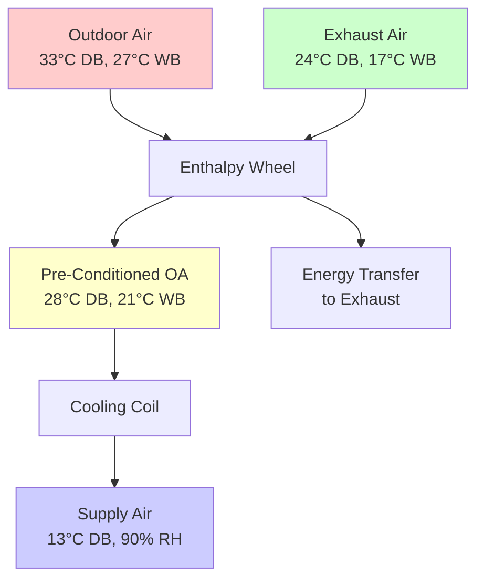

## Regional Climate Characteristics and Design Implications

Southeast Asia experiences tropical climate conditions that fundamentally shape HVAC design priorities. The region spans approximately 10°N to 10°S latitude, characterized by high solar radiation, consistently elevated temperatures, and substantial humidity levels year-round. These conditions create cooling-dominated loads with humidity control presenting the primary technical challenge.

Outdoor design conditions throughout major Southeast Asian cities exhibit remarkable consistency:

| City | Design DB (°C) | Design WB (°C) | Design RH (%) | Annual CDD (base 18°C) |
|------|----------------|----------------|---------------|------------------------|
| Singapore | 33.5 | 27.0 | 65-70 | 4,850 |
| Bangkok | 35.0 | 27.5 | 60-65 | 5,200 |
| Ho Chi Minh City | 34.5 | 27.0 | 65-70 | 5,100 |
| Manila | 34.0 | 27.5 | 65-75 | 4,900 |
| Kuala Lumpur | 33.0 | 26.5 | 70-80 | 4,750 |
| Jakarta | 33.5 | 27.0 | 70-75 | 4,950 |

The minimal temperature variation between months eliminates seasonal load swings common in temperate climates. Heating loads essentially do not exist, allowing complete focus on cooling and dehumidification system optimization.

## Psychrometric Considerations for Tropical Design

High wet-bulb temperatures fundamentally limit evaporative cooling effectiveness and reduce refrigeration cycle efficiency. The relationship between wet-bulb temperature and achievable condensing temperature directly impacts compressor lift:

$$
\text{COP}_{\text{cooling}} = \frac{Q_{\text{evap}}}{W_{\text{comp}}} = \frac{h_1 - h_4}{h_2 - h_1}
$$

Where elevated condensing temperatures (determined by wet-bulb plus approach plus range in water-cooled systems, or dry-bulb plus approach in air-cooled systems) increase the enthalpy difference $(h_2 - h_1)$ across the compressor, reducing cycle efficiency.

### Latent Load Dominance

Tropical conditions generate higher latent-to-sensible heat ratios than temperate climates. Internal latent gains from occupants, combined with infiltration of outdoor air at 70-80% relative humidity, create substantial dehumidification requirements.

The sensible heat ratio (SHR) for typical Southeast Asian commercial spaces:

$$
\text{SHR} = \frac{Q_{\text{sensible}}}{Q_{\text{sensible}} + Q_{\text{latent}}} = 0.65 - 0.75
$$

This contrasts with temperate climate SHR values of 0.80-0.90. Lower SHR values require cooling coils with greater surface area and lower entering air temperatures to achieve adequate moisture removal, increasing supply air temperature depression requirements.

### Overcooling and Reheat Strategies

Standard DX cooling systems sized for sensible load often provide insufficient dehumidification, leading to space humidity levels exceeding comfort thresholds (60% RH maximum per ASHRAE Standard 55). This necessitates:

- **Subcooling with reheat**: Cooling air to 10-12°C to condense moisture, then reheating to 13-15°C supply temperature
- **Dedicated outdoor air systems (DOAS)**: Processing ventilation air separately to remove latent load before mixing with recirculated air
- **Desiccant dehumidification**: Using solid or liquid desiccants to remove moisture without overcooling

## Regional Standards and Regulatory Frameworks

### Singapore: SS Standards

Singapore employs Singapore Standards (SS) developed by the Singapore Standards Council in conjunction with the Building and Construction Authority (BCA).

**SS 553: Code of Practice for Air-Conditioning and Mechanical Ventilation in Buildings** establishes:

- Minimum ventilation rates: 0.6 L/s·m² for offices, 5 L/s·person for conference rooms
- Indoor design conditions: 24-26°C, 55-65% RH for office spaces
- Energy efficiency requirements tied to GFA (Gross Floor Area) cooling load limits
- Duct leakage testing requirements: ≤10% at 250 Pa for low-pressure systems

**SS 530** specifies chiller efficiency requirements exceeding ASHRAE 90.1 minimums:

| Chiller Type | Capacity Range | Minimum COP (Full Load) |
|--------------|----------------|-------------------------|
| Water-cooled centrifugal | >1,055 kW | 6.2 |
| Air-cooled screw | 264-528 kW | 2.9 |
| Water-cooled screw | 264-528 kW | 4.9 |

Singapore's Green Mark certification scheme provides additional incentives for systems exceeding minimum efficiency thresholds by 15-30%.

### Malaysia: MS Standards and UBBL Requirements

Malaysia implements Malaysian Standards (MS) alongside Uniform Building By-Laws (UBBL) requirements.

**MS 1525: Code of Practice on Energy Efficiency and Use of Renewable Energy for Non-Residential Buildings** establishes the regulatory framework for energy performance. Key provisions:

- Overall Thermal Transfer Value (OTTV) limits for building envelopes: ≤50 W/m² for most occupancies
- Minimum equipment efficiency levels based on building type and system configuration
- Lighting power density limits integrated with cooling load calculations
- Energy audit requirements for buildings >4,000 m² conditioned area

**MS 2680: Air-Conditioning and Mechanical Ventilation Systems** addresses design and installation:

- Supply air temperature range: 13-16°C for overhead distribution
- Air change requirements: 6-8 ACH for offices, 12-20 ACH for commercial kitchens
- Filter specifications: MERV 8 minimum for outdoor air, MERV 11 for recirculation in sensitive applications
- Vibration isolation requirements based on equipment speed and proximity to occupied spaces

### Thailand: Ministerial Regulations and TISI Standards

Thailand's regulatory environment combines Ministerial Regulations under the Building Control Act with Thai Industrial Standards Institute (TISI) specifications.

**Ministerial Regulation on Energy Conservation in Buildings** requires:

- Building Energy Code (BEC) compliance for buildings >2,000 m² or with cooling capacity >300 kW
- Annual energy consumption reporting for regulated buildings
- Energy audits every 5 years for facilities exceeding consumption thresholds
- Retroactive compliance requirements when major renovations occur

Energy intensity targets under BEC regulations:

| Building Type | Maximum Energy Intensity (kWh/m²·year) |
|---------------|----------------------------------------|
| Office buildings | 200 |
| Hotels | 300 |
| Shopping centers | 350 |
| Hospitals | 400 |

### Indonesia: SNI Standards Framework

Indonesia applies Indonesian National Standards (SNI) developed by the National Standardization Agency.

**SNI 03-6390: Energy Conservation in Building Air Conditioning Systems** establishes design requirements:

- Maximum cooling load: 180 W/m² for office buildings with compliant envelopes
- Chiller plant efficiency: ≥0.65 kW/RT for systems >500 RT capacity
- Variable flow pumping requirements for systems >150 kW cooling capacity
- Economizer cycles required where applicable (limited applicability in tropical conditions)

## Equipment Selection and Performance Optimization

### Chiller Systems and Condenser Water Considerations

Water-cooled chillers dominate commercial applications due to significant efficiency advantages over air-cooled equipment in tropical conditions. However, consistently high wet-bulb temperatures limit cooling tower performance.

Cooling tower approach temperatures typically range 3-5°C, producing condenser water temperatures of 30-32°C. This elevates condensing pressure compared to temperate climate operation:

$$
\text{Condensing Temperature} = T_{\text{wb,outdoor}} + \text{Approach} + \text{Range}
$$

For Bangkok summer conditions (27.5°C WB), with 3.5°C approach and 5°C range:

$$
T_{\text{cond}} = 27.5 + 3.5 + 5.0 = 36°C
$$

Centrifugal chillers maintain better efficiency under these conditions compared to screw or scroll compressor types. Magnetic bearing compressors further reduce parasitic losses, achieving full-load COP values of 6.5-7.2 at tropical rating conditions.

### Air Distribution Strategies

High latent loads require careful air distribution design to prevent comfort issues:

**Low-temperature air distribution (LTAD)**: Supply air at 7-10°C rather than conventional 13-15°C, reducing airflow requirements and duct sizes. LTAD systems require attention to diffuser selection preventing drafts and condensation on supply registers.

**Dedicated outdoor air systems (DOAS)**: Process ventilation air separately from recirculated air. The outdoor air stream undergoes deep cooling to 10-12°C for dehumidification, then either:
- Tempers to neutral temperature (19-21°C) and delivers separately
- Mixes with recirculated air after independent sensible cooling
- Supplies directly at low temperature to spaces with high latent loads

### Refrigerant Selection Considerations

Tropical operation creates refrigerant-specific performance implications:

**R410A** experiences higher discharge temperatures under elevated condensing pressures, approaching compressor thermal limits (120-140°C) at extreme conditions. This constrains system capacity and reliability.

**R32** offers lower GWP (675 vs. 2,088) and better thermodynamic properties at high condensing temperatures, making it increasingly preferred despite A2L flammability classification requiring charge limits and enhanced ventilation.

**R134a** in centrifugal chillers provides excellent high-temperature performance with A1 safety classification, maintaining efficiency advantages at condensing temperatures of 38-42°C.

## Ventilation and Indoor Air Quality Challenges

### Minimum Outdoor Air Requirements

ASHRAE Standard 62.1 ventilation rates generally exceed regional standards, though Singapore and Malaysia increasingly align with international requirements:

- Office spaces: 2.5 L/s·person (ASHRAE 62.1) vs. 5.0 L/s·person (SS 553)
- Retail spaces: 5 L/s·person (ASHRAE 62.1) vs. 6 L/s·person (MS 1525)
- Restaurants: 7.5 L/s·person (ASHRAE 62.1) vs. 8 L/s·person (regional practice)

Higher local standards reflect concerns about high-density occupancy and reduced natural ventilation in sealed, air-conditioned buildings.

### Energy Recovery Limitations

Energy recovery ventilators (ERV) and heat recovery ventilators (HRV) provide limited benefit in tropical climates. The minimal temperature difference between exhaust and outdoor air reduces sensible heat transfer effectiveness:

$$
\varepsilon_{\text{sensible}} = \frac{T_{\text{supply}} - T_{\text{outdoor}}}{T_{\text{exhaust}} - T_{\text{outdoor}}}
$$

With outdoor air at 33°C, exhaust at 25°C, and sensible effectiveness of 70%:

$$
T_{\text{supply}} = 33 - 0.70(33-25) = 27.4°C
$$

This modest 5.6°C precooling provides limited value. Enthalpy wheels transferring both sensible and latent energy offer better performance but require careful maintenance to prevent contamination transfer and biological growth on desiccant surfaces.

## Energy Efficiency Strategies and Building Integration

### Envelope Performance Requirements

Building envelope thermal performance directly impacts cooling loads. Regional standards establish maximum heat gain through building envelopes using Overall Thermal Transfer Value (OTTV) for walls and Roof Thermal Transfer Value (RTTV):

$$
\text{OTTV} = \alpha \times U_{\text{wall}} \times (1-WWR) \times TD_{\text{eq}} + (SC \times CF \times WWR \times SF) + U_{\text{window}} \times WWR \times \Delta T
$$

Where:
- $\alpha$ = solar absorption coefficient (0.3-0.9 depending on wall color)
- $U_{\text{wall}}$ = wall thermal transmittance (W/m²·K)
- WWR = window-to-wall ratio
- $TD_{\text{eq}}$ = equivalent temperature difference (10-15 K for tropical climates)
- SC = shading coefficient (0.2-0.9)
- CF = solar correction factor
- SF = solar factor (130-250 W/m² depending on orientation)
- $U_{\text{window}}$ = window thermal transmittance (W/m²·K)

Meeting OTTV limits of 45-50 W/m² requires low-emissivity glazing, external shading devices, and insulated wall assemblies—measures that increase first cost but reduce lifetime operating expenses.

### Variable Flow Pumping and Fan Systems

Tropical buildings with constant cooling loads might suggest fixed-flow distribution systems suffice. However, zone load diversity and part-load operation still create opportunities for variable flow optimization:

Pumping power relationships:

$$
P_{\text{pump}} = \frac{\rho \times g \times Q \times H}{\eta_{\text{pump}}} \propto Q^3
$$

Variable primary flow (VPF) chilled water systems with variable speed pumps reduce energy consumption by 30-50% compared to constant primary/variable secondary configurations. Minimum flow requirements through chiller evaporators (typically 30-40% of design flow) establish lower modulation limits.

### Thermal Energy Storage Potential

Time-of-use electricity rates and peak demand charges create economic incentives for thermal energy storage (TES). However, minimal diurnal temperature swing reduces free cooling potential available in temperate climates.

Full storage or partial storage configurations shift chiller operation to off-peak periods. Chilled water storage at 4-6°C or ice storage at -1°C provides capacity during peak demand periods. Economic viability depends on utility rate structures and available space for storage tanks.

## Regional Market Characteristics and Technology Adoption

### Equipment Market Distribution

Split-type air conditioning systems dominate residential and small commercial applications throughout Southeast Asia, with market penetration exceeding 80% in Singapore and 60-70% in other major urban centers. Variable Refrigerant Flow (VRF) systems increasingly capture mid-size commercial projects (500-3,000 m²) due to installation flexibility and perceived efficiency advantages.

Central plant systems remain standard for large commercial, institutional, and hospitality facilities exceeding 5,000 m² conditioned area. Water-cooled centrifugal chillers constitute 75-85% of large installations, with air-cooled equipment limited to applications where water availability, treatment complexity, or space constraints preclude cooling towers.

### Maintenance and Service Challenges

High humidity environments accelerate biological growth on wet surfaces, requiring aggressive maintenance protocols:

- **Cooling coil cleaning**: Monthly inspection and quarterly cleaning minimum to prevent biofilm development reducing heat transfer
- **Condensate drain maintenance**: Weekly flushing to prevent blockages from biological growth
- **Filter replacement**: 30-45 day intervals for pleated filters in typical office environments
- **Refrigerant leak monitoring**: Higher pressures at elevated condensing temperatures stress joints and seals

Water treatment programs for cooling towers and condensers require careful attention to prevent scaling, corrosion, and biological contamination. Conductivity, pH, and biocide concentration monitoring ensures system longevity and heat transfer effectiveness.

## Conclusion

Southeast Asian HVAC practice reflects the unique challenges of tropical climate operation. Cooling-dominated loads with high latent heat ratios require system designs emphasizing dehumidification capability over sensible cooling capacity alone. Regional standards increasingly align with international best practices while addressing local climate conditions and construction patterns. Equipment efficiency improvements, proper humidity control implementation, and building envelope optimization represent the primary pathways to sustainable cooling system operation in this consistently warm, humid environment. Understanding the physical principles governing tropical psychrometrics and heat transfer enables engineers to design systems providing comfort and efficiency despite challenging outdoor conditions year-round.
