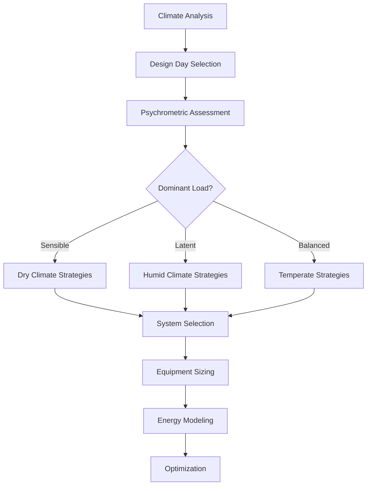

## Climate Classification and HVAC Design

Climate-specific HVAC design represents the application of thermodynamic principles and psychrometric analysis to meet comfort and process requirements under vastly different outdoor conditions. ASHRAE climate zones provide the foundation for system selection, equipment sizing, and energy optimization strategies worldwide.

The fundamental relationship between climate characteristics and HVAC load is expressed through the sensible heat ratio (SHR):

$$SHR = \frac{Q_s}{Q_s + Q_l}$$

where $Q_s$ represents sensible cooling load (kW) and $Q_l$ represents latent cooling load (kW). This ratio varies dramatically across climate zones, from SHR > 0.95 in desert climates to SHR < 0.65 in tropical marine environments.

## ASHRAE Climate Zone Framework

ASHRAE Standard 169 defines eight thermal climate zones (1-8, hot to cold) and three moisture regimes (A: moist, B: dry, C: marine), creating 26 distinct climate classifications. Each zone presents unique design challenges:

| Climate Zone | Representative Locations | Primary Design Challenge | Typical Design Strategy |
|--------------|-------------------------|--------------------------|------------------------|
| 1A | Miami, Singapore | High latent load, year-round cooling | Dedicated outdoor air systems, desiccant dehumidification |
| 2B | Phoenix, Riyadh | Extreme dry heat, high solar gain | Evaporative cooling, thermal mass, night purge |
| 3C | San Francisco, Lisbon | Mild temperatures, marine influence | Natural ventilation, mixed-mode systems |
| 5A | Chicago, Stockholm | Heating-dominated, humidity control | Heat recovery, variable refrigerant flow |
| 7 | Fairbanks, Yakutsk | Extreme cold, freeze protection | Heat recovery, glycol systems, vestibules |
| 8 | Barrow, Longyearbyen | Arctic conditions, permafrost | Ground-coupled systems, waste heat recovery |

## Psychrometric Design Considerations

Climate-specific design begins with psychrometric analysis of outdoor air conditions. The enthalpy difference between outdoor and indoor air determines the total cooling or heating load from ventilation:

$$Q_{vent} = \dot{m} \cdot (h_o - h_i) = 1.08 \cdot CFM \cdot \Delta h$$

where $\dot{m}$ is mass flow rate (kg/s), $h_o$ and $h_i$ are outdoor and indoor enthalpies (kJ/kg), and $\Delta h$ is the enthalpy difference (Btu/lb for the simplified equation).

## Design Temperature and Humidity Selection

ASHRAE Handbook—Fundamentals provides design conditions at 0.4%, 1%, and 2% annual cumulative frequency of occurrence. The selection impacts equipment capacity:

**Cooling Design Conditions:**
- 0.4% design: Equipment sized for 35 hours/year exceedance (conservative, higher first cost)
- 1% design: Equipment sized for 88 hours/year exceedance (standard practice)
- 2% design: Equipment sized for 175 hours/year exceedance (economical, accepts brief periods of unmet load)

**Heating Design Conditions:**
Most jurisdictions require 99% or 99.6% winter design conditions to ensure adequate capacity during extreme cold events.

## Heat Transfer Mechanisms by Climate

The dominant heat transfer mode varies by climate zone, influencing envelope design and system strategy:

### Hot-Arid Climates (2B, 3B)

Solar radiation dominates cooling loads. The sol-air temperature accounts for combined effects:

$$T_{sol-air} = T_o + \frac{\alpha \cdot I_t}{h_o} - \frac{\epsilon \cdot \Delta R}{h_o}$$

where $T_o$ is outdoor air temperature (°C), $\alpha$ is solar absorptance, $I_t$ is total solar radiation (W/m²), $h_o$ is exterior heat transfer coefficient (W/m²·K), $\epsilon$ is emissivity, and $\Delta R$ is thermal radiation exchange (W/m²).

Design strategies emphasize:
- High thermal mass to shift peak loads
- Reflective surfaces (low $\alpha$, high $\epsilon$)
- Evaporative cooling where water is available
- Night ventilation for thermal mass discharge

### Hot-Humid Climates (1A, 2A)

Latent loads from moisture infiltration and ventilation air dominate. The moisture removal requirement:

$$\dot{m}_w = \rho \cdot CFM \cdot (W_o - W_i) / 60$$

where $\rho$ is air density (lb/ft³), $W_o$ and $W_i$ are outdoor and indoor humidity ratios (lb moisture/lb dry air).

Design strategies include:
- Dedicated outdoor air systems with independent latent control
- Desiccant dehumidification for deep dehumidification (< 40% RH)
- Building pressurization to minimize infiltration
- Sensible heat recovery with energy recovery ventilators

### Cold Climates (6, 7, 8)

Envelope heat loss through conduction dominates heating loads:

$$Q_{loss} = U \cdot A \cdot (T_i - T_o)$$

where $U$ is overall heat transfer coefficient (W/m²·K), $A$ is surface area (m²), and $T_i - T_o$ is the indoor-outdoor temperature difference (K).

Design strategies emphasize:
- High-performance envelopes (U < 0.15 W/m²·K)
- Heat recovery ventilation (75-90% effectiveness)
- Vestibules and air curtains to minimize infiltration
- Freeze protection for hydronic systems

## Mixed-Mode and Adaptive Strategies

Temperate climates (3A, 3C, 4A, 4B, 4C) benefit from mixed-mode systems that transition between natural ventilation, mechanical ventilation, and mechanical cooling based on outdoor conditions. The economizer cycle provides free cooling when:

$$h_o < h_i \text{ (enthalpy economizer)}$$

or

$$T_o < T_i - 2°C \text{ (temperature economizer)}$$

## Climate-Responsive System Selection

| Climate Type | Recommended Systems | Efficiency Features | Considerations |
|--------------|---------------------|---------------------|----------------|
| Hot-Humid | DOAS + radiant, VRF with dehumidification | ERV, desiccant wheels | Latent capacity verification |
| Hot-Dry | Evaporative cooling, thermal storage | Indirect evaporative, night purge | Water availability |
| Temperate | VAV with economizer, heat pumps | Airside economizer, demand control | Seasonal changeover |
| Cold | Hydronic heating, DOAS with HRV | Heat recovery > 80%, condensing boilers | Freeze protection |
| Extreme Cold | Glycol systems, waste heat recovery | Run-around loops, ground source heat | Permafrost considerations |

## Humidity Control Across Climates

The moisture balance equation governs humidity control requirements:

$$\dot{m}_{dehumidification} = \dot{m}_{generation} + \dot{m}_{ventilation} - \dot{m}_{infiltration}$$

In humid climates, dehumidification capacity must exceed the sum of internal moisture generation and outdoor air moisture load. In cold climates, humidification prevents excessively dry indoor conditions during heating.

## Energy Optimization by Climate

Climate-specific energy optimization focuses resources on dominant loads:

**Hot Climates:**
- Minimize solar heat gain (SHGC < 0.25)
- Optimize air distribution to minimize reheat
- Maximize economizer hours

**Cold Climates:**
- Maximize envelope insulation (R-60+ roofs)
- Heat recovery effectiveness > 80%
- Minimize ventilation during extreme conditions

**Temperate Climates:**
- Natural ventilation during swing seasons
- Thermal mass for load shifting
- Demand-based control sequences

## Code Requirements and Standards

Climate-specific requirements appear in:

- **ASHRAE 90.1 Energy Standard:** Climate zone-specific envelope requirements, equipment efficiencies, and economizer mandates
- **International Energy Conservation Code (IECC):** Prescriptive requirements by climate zone
- **Local Amendments:** Enhanced requirements in extreme climates (California Title 24, Canadian National Energy Code)

Climate-specific HVAC design requires understanding the interaction between outdoor conditions, building envelope performance, and system capabilities to deliver comfort and efficiency across the full spectrum of global environments.
