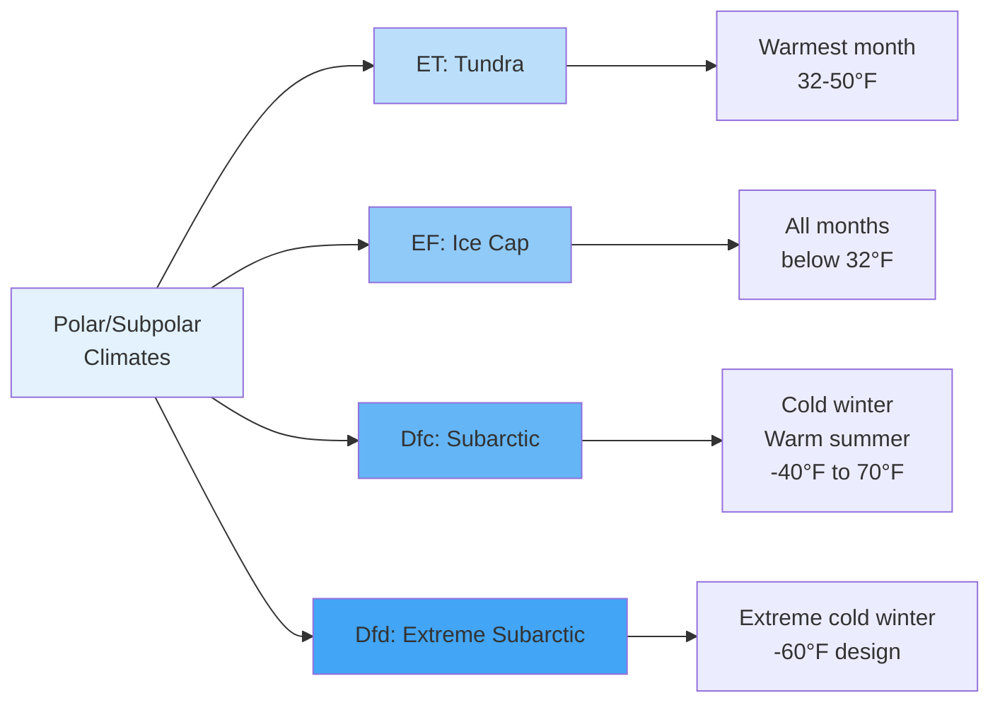

# Arctic-Subarctic Climate Characteristics for HVAC

Arctic and subarctic climates impose extraordinary thermal demands on HVAC systems through sustained extreme cold, massive temperature differentials, permafrost interaction, and atmospheric phenomena that fundamentally alter heat transfer mechanisms. Understanding the physics governing these conditions is essential for designing systems that maintain thermal comfort while managing energy consumption and equipment survival.

## Temperature Regime Analysis

Arctic and subarctic regions experience the most extreme cold temperature conditions for occupied structures, characterized by prolonged heating seasons and temperature extremes that challenge conventional HVAC equipment operational limits.

### Design Temperature Distribution

The thermal environment varies significantly across arctic and subarctic zones:

| Climate Classification | Winter 99.6% Design | Winter 99.0% Design | Summer 0.4% Design | Annual Mean | Heating Season |
|----------------------|-------------------|-------------------|------------------|------------|----------------|
| Subarctic Interior | -45°F to -55°F | -40°F to -48°F | 70°F to 80°F | 20°F to 30°F | 9-10 months |
| Arctic Coastal | -35°F to -45°F | -30°F to -40°F | 50°F to 65°F | 10°F to 20°F | 10-11 months |
| Arctic Interior | -50°F to -65°F | -45°F to -58°F | 65°F to 75°F | 5°F to 15°F | 11-12 months |
| High Arctic | -55°F to -70°F | -50°F to -65°F | 45°F to 60°F | -5°F to 10°F | Year-round |

ASHRAE Handbook Fundamentals Chapter 14 provides detailed climatic design data. The 99.6% design temperature represents conditions exceeded only 0.4% annually (35 hours), establishing the baseline for heating system sizing.

### Heating Degree Day Accumulation

Heating degree days (HDD) quantify annual heating energy requirements, calculated as the cumulative difference between base temperature (typically 65°F) and mean daily temperature:

$$
\text{HDD} = \sum_{i=1}^{365} \max(T_{base} - T_{mean,i}, 0)
$$

Arctic and subarctic HDD values drastically exceed temperate climate loads:

**HDD Distribution by Region:**
- Subarctic: 12,000-16,000 HDD (base 65°F)
- Arctic Coastal: 16,000-20,000 HDD
- Arctic Interior: 20,000-25,000 HDD
- High Arctic: 25,000-30,000 HDD

For comparison, Chicago accumulates approximately 6,500 HDD annually. Arctic structures experience 3-5 times the thermal load per degree of envelope conductance.

## Thermodynamic Conditions and Heat Transfer

The extreme temperature differentials in arctic climates create heat transfer rates and mechanisms that differ fundamentally from temperate environments.

### Conductive Heat Loss Mechanics

Heat conduction through building envelopes follows Fourier's law, with arctic conditions amplifying heat flux through massive temperature gradients:

$$
q = \frac{k \cdot A \cdot \Delta T}{L}
$$

Where:
- $q$ = heat transfer rate (W or BTU/hr)
- $k$ = thermal conductivity (W/m·K or BTU/hr·ft·°F)
- $A$ = surface area (m² or ft²)
- $\Delta T$ = temperature difference (K or °F)
- $L$ = material thickness (m or ft)

**Example: Wall Assembly Heat Loss**

Consider a wall with R-40 insulation (U = 0.025 BTU/hr·ft²·°F):
- Interior temperature: 70°F
- Exterior temperature: -50°F (arctic design condition)
- Temperature differential: ΔT = 120°F
- Heat flux: $q'' = U \times \Delta T = 0.025 \times 120 = 3.0$ BTU/hr·ft²

The same wall assembly in a temperate climate with ΔT = 70°F yields only 1.75 BTU/hr·ft², demonstrating the 71% increase in heat loss per unit area under arctic conditions.

### Convective Heat Transfer at Low Temperatures

Natural and forced convection coefficients vary with temperature and atmospheric density. The convective heat transfer coefficient at building surfaces:

$$
h = Nu \cdot \frac{k}{L}
$$

Where Nusselt number (Nu) depends on Grashof number (Gr) and Prandtl number (Pr) for natural convection, or Reynolds number (Re) and Pr for forced convection.

Cold air density increases significantly:
- Air density at 70°F: 0.075 lb/ft³
- Air density at -40°F: 0.090 lb/ft³
- Density increase: 20%

This density variation affects convection patterns, infiltration driving forces, and HVAC equipment performance.

### Radiative Heat Transfer

Long-wave radiative exchange between building surfaces and the sky becomes significant in arctic conditions, particularly during clear winter nights:

$$
q_{rad} = \epsilon \cdot \sigma \cdot A \cdot (T_{surface}^4 - T_{sky}^4)
$$

Where:
- $\epsilon$ = surface emissivity (0.9 for most building materials)
- $\sigma$ = Stefan-Boltzmann constant (5.67×10⁻⁸ W/m²·K⁴)
- $T$ = absolute temperature (K)

Under clear arctic skies, effective sky temperature can drop 20-30°F below ambient air temperature, creating additional radiative cooling loads on roofs and exposed surfaces that must be accounted for in heat loss calculations.

## Atmospheric Conditions

Arctic atmospheric physics creates unique challenges for HVAC system operation and building pressurization.

### Air Density and Infiltration

Stack effect pressure differential increases with temperature difference and building height:

$$
\Delta P = \frac{g \cdot h \cdot \Delta T \cdot (P_{out})}{T_{avg}}
$$

Where:
- $g$ = gravitational acceleration (9.81 m/s²)
- $h$ = vertical height (m)
- $\Delta T$ = indoor-outdoor temperature difference (K)
- $P_{out}$ = outdoor atmospheric pressure (Pa)
- $T_{avg}$ = average absolute temperature (K)

**Stack Effect Comparison:**

For a 3-story building (30 ft height):
- Temperate climate (ΔT = 40°F): ΔP = 0.13 in. w.c.
- Arctic climate (ΔT = 120°F): ΔP = 0.39 in. w.c.

The tripled pressure differential increases infiltration rates proportionally for a given envelope tightness, driving the critical need for superior air sealing (target: 0.6 ACH50 or lower).

### Absolute Humidity and Moisture Transport

Arctic air holds minimal moisture due to low saturation vapor pressure. The Clausius-Clapeyron relationship governs saturation pressure:

$$
\frac{dP_{sat}}{dT} = \frac{L \cdot P_{sat}}{R \cdot T^2}
$$

Where $L$ = latent heat of vaporization and $R$ = specific gas constant.

**Moisture Content Comparison (at 100% RH):**

| Temperature | Saturation Pressure | Humidity Ratio | Dew Point |
|------------|-------------------|----------------|-----------|
| 70°F | 0.363 psia | 110 gr/lb | 70°F |
| 0°F | 0.039 psia | 12 gr/lb | 0°F |
| -40°F | 0.004 psia | 1.3 gr/lb | -40°F |

Arctic outdoor air contains 98.8% less moisture than saturated air at 70°F. Introducing this air into heated spaces without humidification produces indoor relative humidity below 5%, causing material damage, static electricity, and occupant discomfort.

### Wind Chill and Equipment Exposure

Wind velocity amplifies convective heat loss from exposed surfaces through reduced boundary layer thickness. The wind chill equivalent temperature affects equipment performance:

Wind velocity increases surface heat transfer coefficients from typical still-air values of 1-2 BTU/hr·ft²·°F to 6-8 BTU/hr·ft²·°F at 20 mph wind speeds, effectively doubling heat loss from outdoor equipment.

## Permafrost Thermal Properties

Permafrost—ground remaining below 32°F for two consecutive years—covers 24% of exposed land in the Northern Hemisphere and fundamentally alters foundation design requirements.

### Thermal Conductivity of Frozen Ground

Soil thermal properties change dramatically upon freezing due to water-to-ice phase transition:

| Soil Type | Thermal Conductivity (Unfrozen) | Thermal Conductivity (Frozen) | Volumetric Heat Capacity |
|-----------|-------------------------------|------------------------------|------------------------|
| Dry sand | 0.15 BTU/hr·ft·°F | 1.2 BTU/hr·ft·°F | 20 BTU/ft³·°F (frozen) |
| Saturated clay | 0.6 BTU/hr·ft·°F | 1.0 BTU/hr·ft·°F | 35 BTU/ft³·°F (frozen) |
| Peat/organic | 0.08 BTU/hr·ft·°F | 0.6 BTU/hr·ft·°F | 25 BTU/ft³·°F (frozen) |
| Ice | — | 1.3 BTU/hr·ft·°F | 21 BTU/ft³·°F |

Frozen soil exhibits 2-8 times higher thermal conductivity than unfrozen counterpart, accelerating heat transfer from heated structures into permafrost and increasing thaw risk.

### Active Layer Dynamics

The active layer—the surface zone that thaws annually—ranges from 1-3 feet thick in arctic regions. Heat from buildings penetrates this layer, potentially causing permafrost degradation:

$$
\text{Penetration Depth} = \sqrt{\frac{\alpha \cdot t}{\pi}}
$$

Where:
- $\alpha$ = thermal diffusivity (k/ρc)
- $t$ = time period (typically annual cycle)

Buildings must prevent downward heat flux exceeding 1-3 BTU/hr·ft² to avoid progressive permafrost thaw and settlement.

## Solar Radiation Patterns

Arctic solar geometry creates extreme seasonal variation in available solar radiation and daylight hours.

### Seasonal Insolation Variation

```mermaid
graph TD
    A[Arctic Solar Patterns] --> B[Winter Solstice]
    A --> C[Summer Solstice]
    B --> D[24-hour darkness<br/>High Arctic]
    B --> E[2-4 hours twilight<br/>Arctic Circle]
    B --> F[No direct solar gain<br/>Heating load maximum]
    C --> G[24-hour daylight<br/>Midnight sun]
    C --> H[Solar altitude 30-47°<br/>Low angle radiation]
    C --> I[Continuous cooling load<br/>No nighttime recovery]

    style B fill:#1a1a4d
    style C fill:#ffd700
    style F fill:#ff6b6b
    style I fill:#4ecdc4
```

Solar radiation availability:
- **Winter (Nov-Feb):** 0-5 kWh/m²/day, primarily diffuse
- **Spring/Fall (Mar-Apr, Sep-Oct):** 2-4 kWh/m²/day
- **Summer (May-Aug):** 5-7 kWh/m²/day, continuous but low angle

The low solar altitude angle (maximum 47° at Arctic Circle, 23.5° at North Pole) reduces solar heat gain coefficient effectiveness and challenges photovoltaic system orientation.

## Meteorological Phenomena

Additional atmospheric conditions impact HVAC system design and operation.

### Precipitation Characteristics

Arctic precipitation totals remain low (4-12 inches water equivalent annually) but occur as snow with high accumulation potential:

- **Snow density:** 5-15 lb/ft³ (fresh) to 15-30 lb/ft³ (settled)
- **Roof snow loads:** 40-100 lb/ft² design values
- **Drift factors:** 1.5-2.5× balanced snow load
- **Icing:** Freeze-thaw cycles create ice dams and icicle formations

Outdoor air intakes require protection from snow infiltration and ice blockage through elevated positioning, hoods, and heating systems.

### Atmospheric Icing

Supercooled water droplets freeze on contact with surfaces below 32°F, accumulating on:
- Cooling tower fill and distribution systems
- Condensing unit coils and fans
- Air intake louvers and dampers
- Exhaust terminations

Ice accumulation reduces airflow, blocks drainage, increases mechanical loads, and can cause catastrophic equipment failure.

## Climate Classification System

Arctic and subarctic climates correspond to Köppen climate classifications:

**Classification Characteristics:**

- **ET (Tundra):** Mean temperature of warmest month 32-50°F, permafrost present
- **EF (Ice Cap):** All months below 32°F, permanent snow/ice cover
- **Dfc (Subarctic):** Severe winters (<-36°F), short cool summers, <4 months >50°F
- **Dfd (Extreme Subarctic):** Coldest inhabited regions, winter means below -36°F

## HVAC Design Implications

The climatic characteristics drive specific HVAC system requirements:

**Critical Design Parameters:**

1. **Envelope thermal resistance:** R-60+ roofs, R-40+ walls, R-50+ floors
2. **Air barrier continuity:** <0.6 ACH50 blower door test
3. **Ventilation heat recovery:** 85-95% effectiveness HRV/ERV required
4. **Humidification capacity:** 5-10 lb/hr per 1000 CFM outdoor air
5. **Freeze protection:** All piping, coils, and condensate management
6. **Equipment cold-start capability:** Operation to design temperature minus 10°F
7. **Backup heating redundancy:** 100% capacity backup for critical facilities
8. **Permafrost protection:** Foundation heat removal or ventilation systems

**Thermal Load Magnitude:**

For a 10,000 ft² structure with moderate envelope (U-wall = 0.025):
- Wall heat loss (4,000 ft² at ΔT = 120°F): 12,000 BTU/hr
- Roof heat loss (10,000 ft² at ΔT = 120°F): 24,000 BTU/hr
- Floor heat loss (10,000 ft² at ΔT = 50°F): 10,000 BTU/hr
- Infiltration (0.1 ACH, 80,000 ft³): 14,400 BTU/hr
- Ventilation (500 CFM at 85% recovery): 9,720 BTU/hr
- **Total heating load: 70,120 BTU/hr** (7.0 BTU/hr·ft²)

Temperate climate equivalent would be approximately 30,000 BTU/hr, demonstrating the 2.3× load multiplier for arctic conditions.

## Conclusion

Arctic and subarctic climate characteristics present the most demanding thermal environment for HVAC system design. Sustained extreme cold creates temperature differentials exceeding 120°F, generating heat flux densities 2-3 times greater than temperate climates. Low atmospheric moisture content necessitates humidification systems handling vapor pressure differentials of 0.36 psia. Permafrost interaction requires careful thermal management to prevent foundation degradation. Stack effect pressure differentials triple, demanding exceptional air barrier performance. Equipment must operate reliably at temperatures 30-50°F below conventional limits while managing icing, cold-start conditions, and accelerated freeze-thaw cycles. Understanding these fundamental climatic properties—temperature extremes, thermodynamic conditions, atmospheric density variations, permafrost thermal behavior, and solar patterns—provides the foundation for designing HVAC systems that maintain occupant comfort and building integrity in polar environments.
