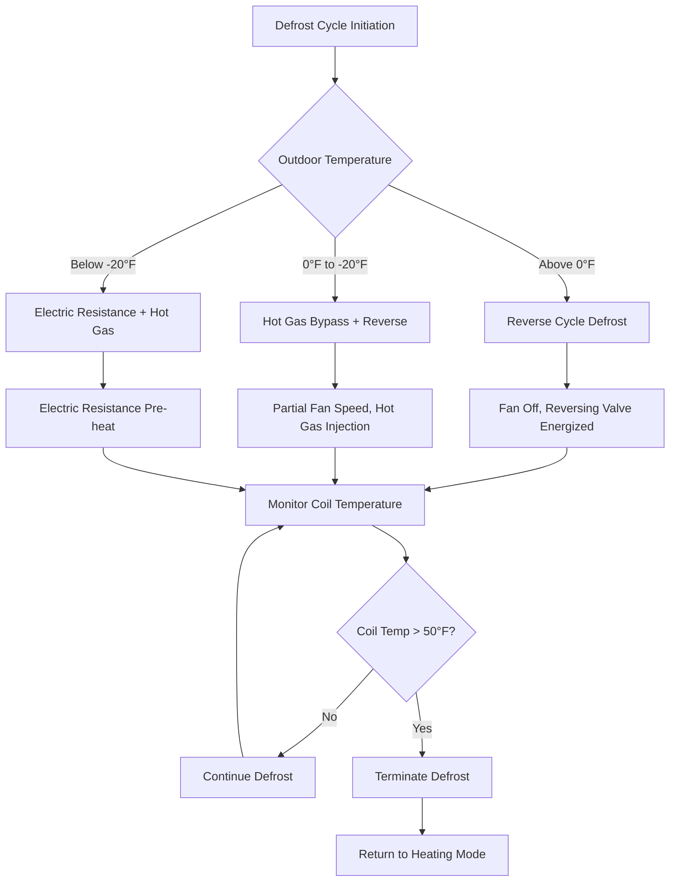

# Arctic Climate HVAC Equipment Considerations

Equipment selection for arctic and subarctic climates requires specialized components designed for continuous operation at outdoor temperatures ranging from -40°F to -60°F (-40°C to -51°C). Standard HVAC equipment fails in these conditions due to lubricant solidification, refrigerant pressure limitations, material embrittlement, and defrost system inadequacy. Arctic-rated equipment incorporates enhanced materials, specialized controls, and thermal management systems to maintain reliable performance under extreme cold.

## Low Temperature Heat Pump Technology

### Operational Temperature Ranges

Arctic heat pumps utilize advanced refrigerant circuits and compressor technologies to extend operational ranges beyond standard equipment limitations.

| Heat Pump Type | Minimum Operating Temp | Heating Capacity at -13°F | COP at -13°F |
|----------------|----------------------|---------------------------|--------------|
| Standard Air Source | +5°F to +17°F | 40-50% rated | 1.2-1.5 |
| Cold Climate | -13°F to -15°F | 55-65% rated | 1.6-2.0 |
| Enhanced Cold Climate | -22°F to -25°F | 65-75% rated | 1.8-2.3 |
| Extreme Cold Climate | -31°F to -35°F | 70-80% rated | 2.0-2.5 |

ASHRAE Standard 116 defines heat pump performance testing procedures at low temperatures, requiring capacity and efficiency measurements at 5°F, 17°F, and 47°F outdoor conditions.

### Vapor Injection Technology

Enhanced vapor injection (EVI) compressors inject refrigerant vapor at intermediate pressure during compression, increasing heating capacity and efficiency at low ambient temperatures.

The thermodynamic benefit derives from the two-stage compression process:

$$W_{comp} = \dot{m}_{1} \cdot (h_{2} - h_{1}) + (\dot{m}_{1} + \dot{m}_{inj}) \cdot (h_{3} - h_{2})$$

Where:
- $W_{comp}$ = Total compressor work (BTU/hr)
- $\dot{m}_{1}$ = Main refrigerant mass flow rate (lb/hr)
- $\dot{m}_{inj}$ = Injected vapor mass flow rate (lb/hr)
- $h_{1}, h_{2}, h_{3}$ = Enthalpy at suction, intermediate, and discharge (BTU/lb)

Vapor injection increases heating capacity by 15-30% at temperatures below 0°F compared to single-stage compression.

### Refrigerant Selection for Cold Climates

Arctic heat pumps require refrigerants with low critical temperatures and adequate pressure ratios at extreme conditions:

| Refrigerant | Evaporation Pressure at -40°F | Critical Temp | Arctic Suitability |
|-------------|------------------------------|---------------|-------------------|
| R-410A | 30 psig | 158°F | Good to -15°F |
| R-32 | 42 psig | 172°F | Good to -20°F |
| R-454B | 35 psig | 153°F | Good to -15°F |
| R-744 (CO₂) | 150 psig | 88°F | Excellent to -40°F |

R-744 (carbon dioxide) transcritical systems maintain positive suction pressure and adequate compression ratios at temperatures where conventional refrigerants approach vacuum conditions.

## Compressor Design for Extreme Cold

### Cold Start Requirements

Compressor operation at extreme temperatures demands specialized features:

**Crankcase Heaters:** Maintain oil temperature 20-30°F above ambient to ensure adequate viscosity and prevent refrigerant migration into the compressor during off-cycles.

Required heater capacity:

$$Q_{heater} = U \cdot A \cdot (T_{oil} - T_{ambient}) + \dot{m}_{mig} \cdot h_{fg}$$

For a typical scroll compressor in -40°F conditions:
- Surface heat loss: 150-200 BTU/hr
- Migration heat: 50-100 BTU/hr
- Total heater capacity: 200-300 watts

**Oil Management Systems:** Enhanced oil separators (98-99% efficiency) and oil return circuits prevent oil logging in outdoor coils during low-temperature operation.

**Compressor Motor Protection:** Thermal overload protection calibrated for cold ambient conditions, with motor winding temperature sensors preventing burnout during high compression ratio operation.

### Scroll Compressor Advantages

Scroll compressors dominate arctic applications due to:

1. **Fewer Moving Parts** - Reduced wear and friction losses
2. **Continuous Compression** - Smoother operation at high pressure ratios
3. **Axial Compliance** - Automatic adjustment to varying loads
4. **Oil Management** - Superior oil return characteristics

Pressure ratio capability at -40°F ambient, +120°F condensing:

$$PR = \frac{P_{discharge}}{P_{suction}} = \frac{437 \text{ psia}}{47 \text{ psia}} = 9.3$$

Standard compressors limit to pressure ratios of 5-7; arctic-rated scrolls operate reliably at 8-11.

## Outdoor Coil Configuration

### Frost Accumulation Characteristics

Outdoor coil frosting follows distinct patterns based on ambient conditions:

| Outdoor Temp | Relative Humidity | Frost Rate | Defrost Frequency |
|--------------|------------------|------------|-------------------|
| +35°F | 70-80% | Heavy, wet | 45-60 min |
| +17°F | 60-70% | Moderate, crystalline | 60-90 min |
| 0°F | 50-60% | Light, fine | 90-120 min |
| -20°F | 40-50% | Minimal | 180+ min |

Below -15°F, atmospheric moisture content becomes minimal, reducing frost accumulation but increasing defrost cycle complexity due to ice bonding.

### Coil Face Velocity

Arctic coils operate at reduced face velocities (200-300 FPM) compared to standard designs (400-500 FPM) to:

- Reduce air-side pressure drop through frosted coil
- Increase coil surface area and refrigerant residence time
- Improve heat transfer at low temperature differentials

**Air-side heat transfer:**

$$Q = h_{air} \cdot A_{coil} \cdot (T_{air,in} - T_{surface})$$

At -40°F ambient, 300 FPM face velocity, fin spacing 12-14 FPI (compared to 18-20 FPI standard) optimizes frost tolerance and heat transfer.

## Advanced Defrost Control Systems

### Defrost Initiation Strategies

Arctic heat pumps employ multiple defrost initiation methods:

**Time-Temperature Defrost:** Initiates based on runtime accumulation and temperature differential between liquid line and outdoor air. Typical settings at -20°F:
- Runtime threshold: 90 minutes
- Temperature differential: <15°F

**Pressure Differential Defrost:** Monitors pressure drop across outdoor coil via refrigerant pressure sensors. Frost accumulation increases pressure drop, triggering defrost when differential exceeds threshold (typically 20-30 psi).

**Impedance Sensing:** Measures electrical impedance between coil fins. Ice formation alters impedance, providing direct frost measurement.

### Defrost Methodologies

**Electric Resistance Assisted Defrost:** Below -25°F, reverse cycle defrost becomes ineffective due to insufficient heat extraction from indoor air. Supplemental electric resistance (3-6 kW) provides defrost energy while maintaining indoor comfort.

Defrost energy penalty:

$$E_{defrost} = \frac{Q_{defrost} \cdot t_{defrost} \cdot N_{cycles}}{COP_{heating}}$$

For 10-minute defrost cycles every 90 minutes at -20°F:
- Defrost energy: 15,000 BTU per cycle
- Frequency: 16 cycles per day
- Daily defrost penalty: 240,000 BTU (7% of heating load)

## Material Selection for Extreme Cold

### Metal Ductility and Fracture

Metals exhibit reduced ductility and increased fracture susceptibility at cryogenic temperatures. The ductile-to-brittle transition temperature (DBTT) varies by material:

| Material | DBTT | Arctic Suitability |
|----------|------|-------------------|
| Carbon Steel (A36) | +32°F to -20°F | Poor - brittle below -20°F |
| 304 Stainless Steel | -100°F | Excellent |
| 6061-T6 Aluminum | -320°F | Excellent |
| Copper (Type L) | -320°F | Excellent |
| PVC Schedule 40 | +50°F | Unacceptable |
| CPVC | +20°F | Poor |

Arctic installations mandate austenitic stainless steel, copper, or aluminum for outdoor piping and components. Carbon steel requires impact testing per ASME B31.3 if used below design metal temperature.

### Gasket and Seal Materials

Elastomeric seals lose compliance at low temperatures, causing leakage:

**Acceptable Materials:**
- Silicone rubber: Service to -80°F
- Fluorosilicone: Service to -60°F, improved fuel/oil resistance
- PTFE (Teflon): Service to -400°F, low compression set

**Unacceptable Materials:**
- EPDM: Stiffens below -40°F
- Nitrile (Buna-N): Brittle below -30°F
- Standard neoprene: Limited to -20°F

## Freeze Protection Systems

### Glycol Concentration Requirements

Hydronic systems require propylene glycol solutions at concentrations preventing freezing with 10°F safety margin below design temperature.

**Freeze point depression:**

$$T_{freeze} = T_{water} - k \cdot \% glycol - c \cdot (\% glycol)^2$$

For propylene glycol:
- $k = 0.445$
- $c = 0.0018$

| Design Temp | Required Glycol % | Freeze Point | Safety Margin |
|-------------|------------------|--------------|---------------|
| -20°F | 40% | -27°F | 7°F |
| -30°F | 48% | -42°F | 12°F |
| -40°F | 53% | -52°F | 12°F |
| -50°F | 57% | -61°F | 11°F |

**Glycol Heat Transfer Penalty:**

Specific heat reduction:

$$c_{p,glycol} = c_{p,water} \cdot (1 - 0.0038 \cdot \% glycol)$$

At 50% glycol concentration:
- Specific heat: 0.81 BTU/lb·°F (19% reduction vs. water)
- Density: 8.13 lb/gal (2% reduction)
- Viscosity: 4.8 cp (300% increase at 40°F)

Flow rate increase requirement:

$$GPM_{glycol} = GPM_{water} \cdot \frac{c_{p,water}}{c_{p,glycol}} = GPM_{water} \cdot 1.23$$

Pumping power increases 40-60% due to combined effects of increased flow rate and viscosity.

### Heat Trace Systems

Electric heat trace prevents freezing in exposed piping, condensate lines, and drain systems.

**Self-Regulating Heat Trace:** Polymer core increases resistance as temperature rises, automatically limiting output:
- Low temperature (−40°F): 12-15 W/ft
- Moderate temperature (+32°F): 5-7 W/ft
- Maintenance temperature (+50°F): 3-4 W/ft

**Constant Wattage Heat Trace:** Fixed output requiring thermostat control:
- Standard output: 5-8 W/ft
- High output: 10-15 W/ft
- Used for rapid heat-up or long circuits

**Heat trace circuit design:**

$$W_{total} = (W_{pipe} + W_{heat-loss}) \cdot L \cdot SF$$

Where:
- $W_{pipe}$ = Heat trace output per foot
- $W_{heat-loss}$ = Pipe heat loss per foot (from insulation calculation)
- $L$ = Circuit length (feet)
- $SF$ = Safety factor (1.1-1.3)

Maximum circuit length limited by voltage drop:

$$L_{max} = \frac{\Delta V_{max} \cdot A_{conductor}}{I \cdot \rho \cdot 2}$$

Typical 120V circuit limits: 150-250 feet depending on heat trace wattage.

## Outdoor Equipment Enclosures

### Weatherization Requirements

Arctic equipment enclosures protect components from extreme cold, snow accumulation, and wind:

**Insulation Values:**
- Wall insulation: R-10 to R-15
- Access panels: R-8 minimum
- Viewing windows: Double-pane, thermally broken frames

**Heating Systems:**
- Thermostat-controlled electric heaters
- Setpoint: 40-50°F minimum
- Capacity: 50-100 W/ft² of enclosure floor area

**Ventilation:**
- Powered during compressor operation to remove heat
- Dampers close during shutdown to retain heat
- Minimum 10 air changes per hour during operation

### Snow and Ice Management

Equipment elevation and drainage prevent ice accumulation:

- Minimum clearance above snow line: 18-24 inches
- Coil orientation: Vertical preferred for ice shedding
- Drain pan heating: 40-60 W/ft² to prevent ice blockage
- Wind barriers: Reduce snow infiltration and wind chill effects

## Permafrost Foundation Systems

### Thermosyphon Technology

Two-phase thermosyphons passively remove heat from building foundations, maintaining permafrost stability.

**Operating Principle:**

Refrigerant (CO₂, propane, or ammonia) evaporates in the ground probe, absorbing heat. Vapor rises to the radiator exposed to cold ambient air, where it condenses and releases heat. Liquid returns to the probe by gravity.

**Heat removal capacity:**

$$Q_{removal} = \dot{m} \cdot h_{fg} \cdot N_{cycles}$$

For a single 6-inch diameter thermosyphon:
- Heat removal: 500-1,500 BTU/hr (varies with temperature differential)
- Effective radius: 8-12 feet
- Typical spacing: 12-20 feet on center

**Design considerations:**

Thermosyphons operate only when ambient air temperature falls below ground temperature, typically October through April in arctic regions. Summer shutdown allows some ground warming, requiring adequate thermal mass in permafrost layer.

### Active Refrigeration Systems

Critical structures employ mechanical refrigeration maintaining permafrost:

**System Components:**
- Ground-embedded cooling coils (100-200 ft per zone)
- Glycol circulation pumps (redundant)
- Air-cooled condensing units or dry coolers
- Temperature monitoring (multiple depths)

**Capacity calculation:**

$$Q_{cooling} = k \cdot A \cdot \frac{T_{building} - T_{permafrost}}{L}$$

Where:
- $k$ = Soil thermal conductivity (0.6-1.2 BTU/hr·ft·°F frozen)
- $A$ = Foundation area (ft²)
- $T_{building}$ = Building heat flux (typically 35-40°F beneath insulation)
- $T_{permafrost}$ = Required permafrost temperature (below 30°F)
- $L$ = Effective insulation thickness (feet)

Energy consumption for permafrost maintenance ranges from 2-8 BTU/hr per square foot of building area, representing 5-15% of total building heating load.

## Control System Adaptations

### Low Temperature Sensor Technologies

Standard temperature sensors may malfunction in arctic conditions:

**Thermistor Sensors:**
- Range: -40°F to +300°F
- Accuracy: ±0.2°F
- Response time: 3-10 seconds
- Arctic rating: Excellent

**RTD (Resistance Temperature Detector):**
- Range: -400°F to +1,200°F
- Accuracy: ±0.1°F
- Drift: Minimal over time
- Cost: 3-5× thermistor

**Thermocouple:**
- Range: -330°F to +2,300°F
- Accuracy: ±2°F
- Requires compensation
- Cost: Lowest

Arctic installations prefer RTD or thermistor sensors in protective thermowells, with sensor wire rated for low temperature service.

### Battery Backup Systems

Heating system continuity during power outages proves critical in arctic climates where frozen pipes develop within 4-8 hours of heating loss.

**Battery System Sizing:**

$$Ah_{required} = \frac{W_{load} \cdot t_{backup}}{V_{system} \cdot DOD \cdot \eta}$$

For 24-hour backup of controls and circulation pumps (500W total):
- Load: 500 W
- Backup time: 24 hours
- System voltage: 48V DC
- Depth of discharge: 50%
- Efficiency: 85%
- Required capacity: 294 Ah

Lithium-ion batteries with integral heating maintain capacity at -40°F, whereas lead-acid capacity drops 50-70% at these temperatures.

## Equipment Redundancy Strategies

Arctic installations require backup systems preventing heating loss:

### Parallel Heating Systems

**Configuration 1 - Dual Heat Sources:**
- Primary: Cold climate heat pump (70% of load)
- Backup: Oil or propane furnace (100% of load)
- Changeover: Automatic based on outdoor temperature

**Configuration 2 - Multiple Units:**
- Units: Two 60% capacity heat pumps
- Operation: Both run during extreme cold
- Failure mode: Single unit maintains 60% capacity

### Standby Power Generation

**Generator Sizing:**

$$kW_{gen} = \frac{(W_{heating} + W_{circ} + W_{controls}) \cdot 1.25}{\eta_{gen} \cdot PF}$$

For typical residential installation:
- Heating load: 40 kW (136,500 BTU/hr)
- Circulation: 2 kW
- Controls/lights: 3 kW
- Safety factor: 1.25
- Generator efficiency: 0.9
- Power factor: 0.8
- Required capacity: 78 kW standby

Automatic transfer switches (ATS) detect power loss and start generators within 10-30 seconds, preventing system shutdown.

## Conclusion

Arctic HVAC equipment selection demands specialized components engineered for extreme cold operation. Enhanced vapor injection heat pumps extend heating capacity to -35°F while maintaining COP values of 2.0-2.5, substantially exceeding electric resistance efficiency. Compressor systems incorporate crankcase heaters, enhanced oil management, and arctic-rated refrigerants such as R-744 enabling reliable operation at temperatures where conventional refrigerants approach vacuum conditions. Material selection proves critical, with austenitic stainless steel, copper, and aluminum replacing carbon steel and plastics that become brittle below -20°F. Glycol concentrations of 50-60% protect hydronic systems to -50°F, accepting 20-40% pumping power penalties. Advanced defrost controls employing pressure differential sensing and electric resistance assistance maintain heat pump operation during extreme cold periods. Equipment redundancy and standby power systems ensure heating continuity essential for arctic installations where system failure creates life-threatening conditions within hours.
