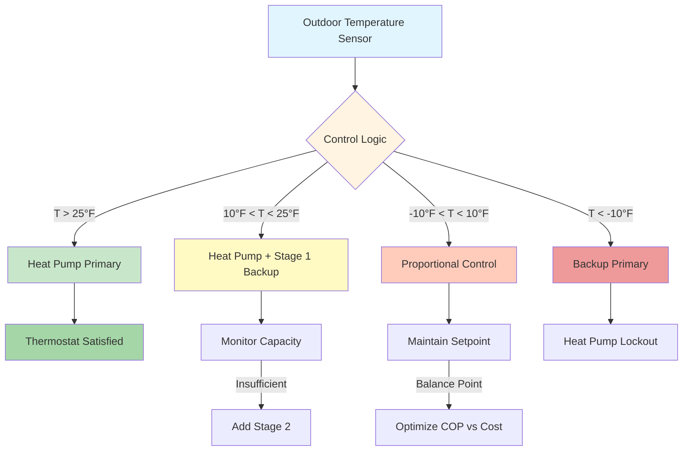
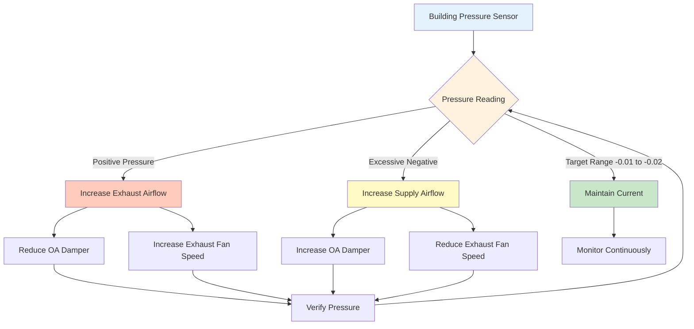
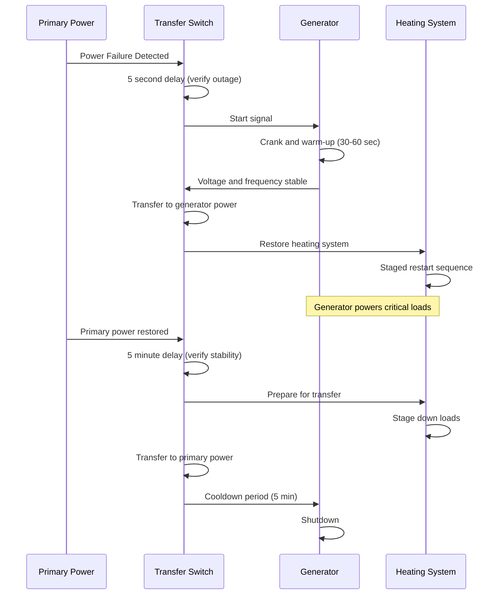

# Arctic HVAC Strategies and System Design

Arctic and subarctic climates demand integrated HVAC strategies that address extreme temperature differentials exceeding 120°F, extended heating seasons of 9-11 months, and critical reliability requirements. Effective system design combines multiple heat sources, advanced energy recovery, rigorous moisture control, and comprehensive equipment protection to ensure occupant comfort and system longevity in the world's most challenging thermal environment.

## Hybrid Heating System Strategies

Arctic applications require multiple heating sources to balance energy efficiency, reliability, and operational economics across widely varying outdoor conditions.

### Dual Fuel System Configuration

Dual fuel systems integrate electric heat pumps with fossil fuel backup, optimizing energy cost while ensuring heating capacity at all temperatures.

**System Architecture:**

**Changeover Temperature Determination:**

The economically optimal changeover temperature occurs where heat pump operating cost equals backup fuel cost:

$$\text{COP}_{\text{HP}} \times \frac{C_{\text{electric}}}{C_{\text{fuel}}} \times \eta_{\text{fuel}} = 1$$

Where:
- COP_HP = Heat pump coefficient of performance at outdoor temperature
- C_electric = Electric energy cost ($/kWh)
- C_fuel = Fuel cost ($/therm or $/gallon)
- η_fuel = Fuel heating system efficiency (0.80-0.95)

**Example Calculation:**

Given:
- Electricity: $0.15/kWh
- Heating oil: $3.50/gallon (139,000 BTU/gallon)
- Oil furnace efficiency: 85%
- Heat pump COP at 15°F: 2.2

Electric cost per BTU = $0.15/kWh ÷ 3,412 BTU/kWh = $0.0000440/BTU

Oil cost per delivered BTU = $3.50 ÷ (139,000 × 0.85) = $0.0000296/BTU

Heat pump cost per delivered BTU = $0.0000440 ÷ 2.2 = $0.0000200/BTU

At 15°F, heat pump delivers lower cost energy. Changeover occurs when COP drops below 1.5 (approximately 0°F for this economic scenario).

### Parallel Heating System Design

Parallel systems operate multiple heat sources simultaneously, providing capacity redundancy and optimizing efficiency across load conditions.

**Configuration Options:**

| System Type | Primary Source | Backup Source | Changeover Logic | Application |
|-------------|---------------|---------------|------------------|-------------|
| HP + Electric | Heat pump | Resistance strips | Capacity-based | Residential, small commercial |
| HP + Boiler | Heat pump | Hydronic boiler | Temperature-based | Large residential, institutional |
| Boiler + Boiler | Primary boiler | Secondary boiler | Lead-lag rotation | Critical facilities |
| District + Local | District heat | Local backup | Supply temp/pressure | Campus, remote facilities |

**Capacity Staging Strategy:**

For a building with 500,000 BTU/hr design heating load at -40°F:

1. **Heat Pump (HP):** 180,000 BTU/hr at 47°F, 90,000 BTU/hr at -13°F
2. **Stage 1 Backup:** 150,000 BTU/hr (oil-fired furnace)
3. **Stage 2 Backup:** 150,000 BTU/hr (second furnace or modular boiler)

**Staging Sequence:**

- 35°F to 15°F: HP only (90-120% capacity)
- 15°F to -5°F: HP + Stage 1 (adequate capacity)
- -5°F to -25°F: HP + Stage 1 + Stage 2 (design capacity)
- Below -25°F: Stage 1 + Stage 2 only (HP lockout)

## Advanced Heat Recovery Strategies

Energy recovery ventilation achieves 75-95% effectiveness in arctic climates, recovering 30-50% of total heating energy in well-designed systems.

### Heat Recovery Ventilator Performance Optimization

HRV effectiveness varies with airflow balance, temperature differential, and frost accumulation. Maximum performance requires careful control integration.

**Effectiveness Relationship:**

$$\varepsilon = \frac{T_{\text{supply}} - T_{\text{outdoor}}}{T_{\text{exhaust}} - T_{\text{outdoor}}}$$

For balanced airflow with 85% effective core:
- Outdoor air: -45°F
- Exhaust air: 70°F
- Temperature difference: 115°F
- Supply air temperature: -45°F + (0.85 × 115°F) = 52.8°F

**Energy Recovery Calculation:**

Annual heating energy recovered:

$$Q_{\text{recovered}} = 1.08 \times \text{CFM} \times \text{HDD} \times 24 \times \varepsilon$$

For 200 CFM continuous ventilation with 18,000 HDD:

Q_recovered = 1.08 × 200 × 18,000 × 24 × 0.85 = 79.7 million BTU/year

At $30/million BTU fuel cost: **Annual savings = $2,391**

### Frost Control in Heat Recovery Systems

Arctic HRV operation requires active frost prevention as exhaust air moisture freezes on cold surfaces within the heat exchanger core.

**Frost Accumulation Physics:**

Frost forms when exhaust air temperature drops below freezing point. The location of frost formation:

$$x_{\text{frost}} = L \times \frac{T_{\text{exhaust}} - 32°F}{T_{\text{exhaust}} - T_{\text{outdoor}}}$$

Where:
- L = Heat exchanger core depth
- x_frost = Distance from exhaust inlet to frost formation
- T_exhaust = Exhaust air temperature (typically 68-72°F)
- T_outdoor = Outdoor air temperature

At -40°F outdoor with 70°F exhaust and 12-inch core depth:

x_frost = 12 × (70 - 32) / (70 - (-40)) = 12 × 38 / 110 = 4.1 inches

Frost accumulates in the outer 4 inches of the core, eventually blocking airflow.

**Defrost Strategies:**

| Method | Operation | Energy Penalty | Effectiveness | Application |
|--------|-----------|---------------|---------------|-------------|
| Recirculation | Exhaust air bypasses outdoors | 8-12% | Good | Standard HRVs |
| Preheat | Electric element warms outdoor air | 15-20% | Excellent | Extreme cold |
| Intermittent Operation | Cycle HRV off during defrost | 5-8% | Fair | Mild subarctic |
| Exhaust Only | Supply damper closes, warm exhaust melts frost | 10-15% | Good | Residential |

**Defrost Cycle Control:**

Initiate defrost when:
1. Supply air temperature drops below 28°F (frost accumulation indicator)
2. Differential pressure across core exceeds 1.5× normal (blockage)
3. Time-based cycle: Every 20-40 minutes below -20°F outdoor

### Energy Recovery Wheel Application

Enthalpy wheels transfer both sensible and latent energy, providing superior performance in extreme cold with active rotation preventing frost accumulation.

**Performance Comparison:**

For identical airflow and temperature conditions:

| Recovery Type | Sensible Effectiveness | Latent Effectiveness | Frost Risk | Maintenance |
|---------------|----------------------|---------------------|------------|-------------|
| Plate HRV | 75-85% | 0% | High | Low |
| Plate ERV | 70-80% | 50-65% | Medium | Low |
| Enthalpy Wheel | 80-90% | 60-75% | Low | Medium |
| Heat Pipe | 60-70% | 0% | Very Low | Very Low |

Enthalpy wheels excel in arctic applications with continuous rotation distributing frost evenly and warm exhaust continuously melting accumulated ice.

## Moisture Control and Vapor Management

Arctic structures experience extreme vapor pressure differentials driving moisture migration from interior to exterior, requiring rigorous vapor barrier installation and controlled ventilation.

### Vapor Pressure Differential Analysis

The driving force for moisture migration is the vapor pressure difference between interior and exterior environments.

**Vapor Pressure Calculation:**

Saturated vapor pressure (psia):

$$p_{\text{sat}} = \exp\left(77.345 + 0.0057T - \frac{7235}{T}\right) / (T^{8.2})$$

Where T is absolute temperature (°R = °F + 460)

**Example Calculation:**

Interior conditions: 70°F, 30% RH
- T = 530°R
- p_sat = 0.3631 psia
- p_vapor = 0.3631 × 0.30 = 0.1089 psia

Exterior conditions: -40°F
- T = 420°R
- p_sat = 0.0019 psia (essentially zero at this temperature)

Vapor pressure differential: 0.1089 - 0.0019 = 0.1070 psia

This 56:1 pressure ratio drives aggressive moisture migration requiring vapor barriers with permeance < 0.1 perm.

### Condensation Prevention Strategies

**Critical Surface Temperature:**

Condensation occurs when any surface temperature drops below the dew point temperature of adjacent air. The dew point:

$$T_{\text{dewpoint}} = \frac{243.04 \times \left(\ln\left(\frac{RH}{100}\right) + \frac{17.625 \times T}{243.04 + T}\right)}{17.625 - \left(\ln\left(\frac{RH}{100}\right) + \frac{17.625 \times T}{243.04 + T}\right)}$$

For 70°F at 30% RH:
- T_dewpoint = 38.8°F

Any interior surface below 38.8°F will experience condensation. With -40°F outdoor temperature, interior surface temperatures must be maintained above this threshold through adequate insulation.

**Minimum R-Value Calculation:**

Required insulation to prevent condensation:

$$R_{\text{min}} = \frac{T_{\text{indoor}} - T_{\text{outdoor}}}{T_{\text{indoor}} - T_{\text{dewpoint}}} \times R_{\text{interior film}}$$

For the example conditions:

R_min = (70 - (-40)) / (70 - 38.8) × 0.68 = 110 / 31.2 × 0.68 = 2.40

However, this represents the absolute minimum. Practical applications require R-30 to R-60 wall assemblies to provide safety margin and energy efficiency.

### Building Pressurization Control

Maintaining slight negative pressure (-0.01 to -0.02 in. w.c.) in arctic buildings prevents warm, humid air exfiltration into wall cavities where it would condense and cause structural damage.

**Pressure Control Strategy:**

Negative pressurization prevents:
1. Exfiltration through envelope penetrations
2. Moisture accumulation in wall cavities
3. Ice formation at thermal bridges
4. Structural damage from freeze-thaw cycles

## Equipment Winterization Requirements

Arctic HVAC equipment requires comprehensive protection against extreme cold, including material selection, auxiliary heating, and operational safeguards.

### Outdoor Air Handling Unit Protection

**Preheat Coil Design:**

Preheat coils protect downstream components from freezing. Required capacity:

$$Q_{\text{preheat}} = 1.08 \times \text{CFM} \times (T_{\text{target}} - T_{\text{outdoor}})$$

For 5,000 CFM outdoor air with -50°F design temperature, heating to 35°F:

Q_preheat = 1.08 × 5,000 × (35 - (-50)) = 459,000 BTU/hr (38.3 MBH)

**Preheat Coil Control Sequence:**

1. **Face and Bypass Dampers:** Modulate to maintain leaving air temperature
2. **Freeze Protection Thermostats:** Triple redundancy at 35°F, 32°F, and 28°F
3. **Low Limit Cutout:** Shut down supply fan and close outdoor air damper if leaving air < 28°F
4. **Glycol Solution:** 50% propylene glycol for -50°F freeze protection

### Cold Weather Start-Up Procedures

Equipment stored in unheated spaces or shut down during extreme cold requires staged warm-up to prevent mechanical damage.

**Start-Up Sequence:**

| Step | Action | Duration | Temperature Threshold |
|------|--------|----------|----------------------|
| 1 | Energize crankcase heaters | 4-8 hours | Compressor oil > 50°F |
| 2 | Start circulation pumps (if applicable) | 1-2 hours | Fluid movement established |
| 3 | Energize electric preheat | 30 minutes | Outdoor air intake > 20°F |
| 4 | Start supply fan at minimum speed | 15 minutes | Airflow verified |
| 5 | Enable primary heating sequence | Normal | All safeties verified |
| 6 | Ramp to full capacity | 30-60 minutes | Gradual load increase |

**Cold Soak Protection:**

Refrigerant migration during shutdown creates liquid slugging risk. Prevention measures:

- Crankcase heaters: 50-150W maintaining oil temperature 20-30°F above ambient
- Pump-down cycle: Evacuate evaporator before shutdown
- Time delay on restart: Minimum 5 minutes off per ASHRAE Standard 15

### Condensate Management in Extreme Cold

All condensate must be managed in heated spaces or protected against freezing through active heat trace and insulation.

**Heat Trace Sizing:**

Required heat trace capacity to prevent freezing:

$$W = \frac{2 \times \pi \times k \times (T_{\text{maintain}} - T_{\text{ambient}})}{\ln(r_{\text{outer}} / r_{\text{inner}})}$$

Where:
- W = Heat trace watts per linear foot
- k = Thermal conductivity of insulation (BTU-in/hr-ft²-°F)
- T_maintain = Minimum fluid temperature (40°F)
- T_ambient = Minimum ambient temperature (-50°F)
- r_outer, r_inner = Outer and inner insulation radii

For 1-inch copper pipe with 1-inch insulation (k = 0.25) at -50°F ambient:

W ≈ 8-12 watts per linear foot (use 12W self-regulating heat trace)

**Installation Requirements:**

- Heat trace installed on bottom of horizontal pipe (prevents ice dam formation)
- Insulation over heat trace (never between trace and pipe)
- Thermostat control: Activate below 40°F, deactivate above 50°F
- Circuit monitoring: Continuous verification of operation
- Backup power: Critical drains require UPS or generator backup

## Emergency Heating Protocols

Arctic facilities require redundant heating and emergency protocols to maintain life safety during equipment failure or power outage.

### Backup Heat Capacity Requirements

**Tiered Backup Strategy:**

| Facility Type | Primary Heat | Secondary Heat | Emergency Heat | Hold Time |
|---------------|--------------|----------------|----------------|-----------|
| Residential | Heat pump | Oil/propane furnace | Electric resistance | 24 hours |
| Commercial | Boiler plant | Rooftop units | Portable heaters | 12 hours |
| Critical Facility | Dual boilers | Emergency generator + electric | Diesel air heaters | 72 hours |
| Remote Station | District heat | Local boiler | Bottled propane heater | 7 days |

**Heat Loss During Outage:**

Building temperature decay rate without heating:

$$\frac{dT}{dt} = -\frac{UA}{mc_p}(T_{\text{indoor}} - T_{\text{outdoor}})$$

Where:
- U = Overall building heat transfer coefficient
- A = Building envelope area
- m = Building thermal mass
- c_p = Specific heat of building materials

For typical construction (UA = 20,000 BTU/hr-°F, mass = 500,000 lb):

Temperature decay = -(20,000 / (500,000 × 0.20)) × (70 - (-40)) = -2.2°F per hour

Building reaches freezing in approximately 18 hours without heat at -40°F outdoor temperature.

### Generator Integration for Life Safety

**Automatic Transfer Switch (ATS) Sequence:**

**Load Shedding Priority:**

1. **Critical loads (100% backup):** Heating system, circulation pumps, controls, freeze protection
2. **Essential loads (50% backup):** Partial lighting, communication, minimal ventilation
3. **Non-essential loads (0% backup):** Air conditioning, non-critical receptacles, outdoor lighting

Generator sizing:

$$\text{kW}_{\text{generator}} = \frac{\sum kW_{\text{critical}} + \sum kW_{\text{essential}}}{0.80} \times 1.25$$

The 0.80 factor accounts for power factor; 1.25 provides safety margin for motor starting.

## System Commissioning for Arctic Conditions

Arctic climate commissioning requires verification of all cold-weather protection systems and operational sequences under design conditions.

### Cold Weather Functional Testing

**Testing Protocol:**

| System Component | Test Condition | Acceptance Criteria | Method |
|------------------|----------------|---------------------|--------|
| Preheat coil | Outdoor air at design temp | Leaving air ≥ 35°F | Simulate with dampers |
| Freeze stats | Manual activation | Fan shutdown, damper close in < 30 sec | Trip each stat |
| Heat recovery defrost | Outdoor air < -20°F | Defrost cycles maintain supply > 28°F | Monitor during cold snap |
| Heat trace circuits | Pipe surface at ambient | Heat trace activates, maintains > 40°F | IR thermography |
| Backup heating | Primary system disabled | Backup provides design capacity | Load calculation verification |
| Emergency generator | Simulated power failure | Transfer < 60 sec, systems operational | Full load test |

### Thermal Imaging Verification

Infrared thermography identifies thermal bridges, insulation defects, and air leakage under maximum temperature differential conditions.

**Optimal Testing Conditions:**

- Indoor-outdoor temperature difference: ≥ 40°F (greater differential improves contrast)
- Wind speed: < 15 mph (prevents convective masking)
- No precipitation: Moisture interferes with IR readings
- Time: Pre-dawn (eliminates solar radiation effects)

**Critical Areas for Inspection:**

1. Envelope penetrations (pipes, ducts, cables)
2. Window and door frames
3. Wall-to-roof transitions
4. Foundation-to-wall connections
5. Equipment curbs and supports

Temperature difference across properly insulated R-40 wall with 100°F differential:

Interior surface: 70°F - (100°F / 40) × 0.68 = 68.3°F
Thermal bridge (R-5): 70°F - (100°F / 5) × 0.68 = 56.4°F

The 11.9°F surface temperature difference clearly identifies thermal bridging defects.

## Conclusion

Arctic HVAC strategies require integrated design approaches combining hybrid heating sources for reliability and efficiency, advanced heat recovery capturing 75-95% of ventilation energy, rigorous moisture control preventing structural damage, comprehensive equipment winterization ensuring operation to -50°F and below, and robust emergency heating protocols maintaining life safety during system failures. Successful arctic climate systems achieve supply air temperatures of 50-55°F from outdoor air at -45°F through 85% effective heat recovery, reduce annual heating energy by 30-50% compared to systems without recovery, prevent condensation through vapor barriers with permeance below 0.1 perm and negative building pressurization of -0.01 to -0.02 in. w.c., and maintain building temperatures above freezing for 18-72 hours during heating system outages depending on thermal mass and backup capacity. The extreme temperature differentials, extended heating seasons, and critical reliability requirements of arctic climates demand rigorous attention to thermodynamic fundamentals, equipment protection, and system redundancy to ensure occupant comfort and building longevity in Earth's most demanding thermal environment.
