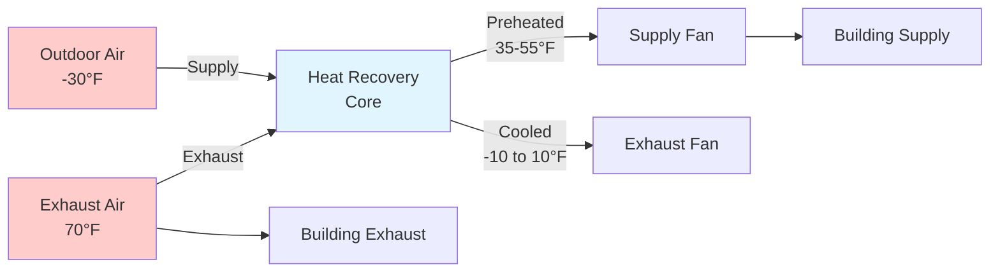

# Cold Climate HVAC Design

Cold climate HVAC systems face unique challenges driven by extreme temperature differentials, prolonged heating seasons, and the physics of heat transfer through building envelopes. Design priorities shift from cooling-dominated concerns to heating capacity, freeze protection, and moisture management under sustained sub-freezing conditions.

## Fundamental Heat Loss Mechanisms

Heat loss in cold climates occurs through three primary modes: conduction through the building envelope, convection via air infiltration, and radiation to cold surfaces. The total heating load combines these components:

$$Q_{total} = Q_{conduction} + Q_{infiltration} + Q_{ventilation} + Q_{radiation}$$

Conductive heat loss through envelope assemblies follows Fourier's law, where heat flux is proportional to the temperature gradient and inversely proportional to thermal resistance:

$$Q_{cond} = \frac{A \cdot \Delta T}{R_{total}}$$

where:
- $A$ = surface area (ft² or m²)
- $\Delta T$ = indoor-outdoor temperature difference (°F or K)
- $R_{total}$ = total thermal resistance (hr·ft²·°F/BTU or m²·K/W)

For design conditions at -30°F outdoor and 70°F indoor, a 100°F temperature differential drives substantial heat loss. A wall with R-30 insulation experiences heat flux of:

$$q = \frac{\Delta T}{R} = \frac{100°F}{30 \text{ hr·ft²·°F/BTU}} = 3.33 \text{ BTU/hr·ft²}$$

## Infiltration and Air Leakage Control

Air infiltration represents a critical heat loss mechanism in cold climates, often accounting for 25-40% of total heating load. The volumetric flow rate through envelope penetrations depends on pressure differential and effective leakage area:

$$Q_{inf} = \rho \cdot c_p \cdot \dot{V} \cdot \Delta T$$

where:
- $\rho$ = air density (lb/ft³ or kg/m³)
- $c_p$ = specific heat of air (0.24 BTU/lb·°F or 1.005 kJ/kg·K)
- $\dot{V}$ = volumetric airflow rate (CFM or m³/s)
- $\Delta T$ = temperature difference

ASHRAE Standard 62.1 requires minimum ventilation rates, but uncontrolled infiltration wastes energy. Building envelope tightness measured as air changes per hour at 50 Pa (ACH50) should target:

| Building Type | Target ACH50 | Application |
|---------------|--------------|-------------|
| Passive House | ≤0.6 | Ultra-efficient construction |
| High Performance | 1.0-1.5 | Advanced cold climate design |
| Code Minimum | 3.0-5.0 | Standard construction |
| Existing Buildings | 5.0-15.0 | Retrofit candidates |

## Energy Recovery Ventilation

Energy recovery ventilators (ERVs) and heat recovery ventilators (HRVs) are essential in cold climates to meet ventilation requirements while minimizing heating penalties. These devices transfer sensible heat (and in ERVs, latent heat) between exhaust and supply airstreams.

The effectiveness of heat recovery defines the temperature of supply air entering the building:

$$\eta = \frac{T_{supply} - T_{outdoor}}{T_{exhaust} - T_{outdoor}}$$

High-efficiency HRVs achieve 75-95% sensible effectiveness, substantially reducing the ventilation heating load:

$$Q_{vent,recovered} = \dot{m} \cdot c_p \cdot (T_{exhaust} - T_{outdoor}) \cdot \eta$$

## Freeze Protection Strategies

Freeze protection is paramount in cold climate HVAC design. Water-based systems face catastrophic failure if pipe temperatures drop below 32°F. Protection strategies include:

### Heating System Design
- **Antifreeze solutions**: Propylene glycol at 30-50% concentration lowers freezing point to -20°F to -60°F
- **Heat tracing**: Electric resistance cables maintain minimum pipe temperature
- **Insulation**: Minimizes heat loss from distribution piping
- **Low-limit thermostats**: Shut down equipment before freeze conditions

### Outdoor Air Handling
Outdoor air dampers and coils require freeze protection through:

1. **Face and bypass dampers**: Route outdoor air around coils during cold conditions
2. **Preheat coils**: Electric or steam coils raise air temperature before main coil
3. **Glycol runaround loops**: Transfer heat from exhaust to outdoor air
4. **Mixing plenums**: Blend outdoor and return air before coil exposure

The minimum outdoor air temperature for direct coil exposure without freeze risk:

$$T_{OA,min} = T_{leaving} - \frac{Q_{coil}}{\dot{m} \cdot c_p}$$

## Building Envelope Considerations

Thermal bridging through structural elements creates localized heat loss and condensation risk. Steel studs, concrete slabs, and window frames conduct heat efficiently, bypassing insulation layers. The effective R-value of a wall assembly accounts for thermal bridging:

$$R_{eff} = \frac{1}{\frac{f_{frame}}{R_{frame}} + \frac{f_{cavity}}{R_{cavity}}}$$

where $f_{frame}$ and $f_{cavity}$ represent the fractions of wall area occupied by framing and insulated cavity respectively.

| Assembly Type | Nominal R-Value | Effective R-Value | Reduction |
|---------------|-----------------|-------------------|-----------|
| 2x6 Wood Frame, R-21 | R-21 | R-16 | 24% |
| Steel Frame, R-21 | R-21 | R-7 | 67% |
| ICF Concrete, R-22 | R-22 | R-20 | 9% |
| SIPs, R-28 | R-28 | R-27 | 4% |

## Condensation and Moisture Control

Cold surfaces below the dew point temperature accumulate condensation, leading to mold growth and structural damage. The dew point temperature at which condensation forms on a surface:

$$T_{dp} = T - \frac{100 - RH}{5}$$

(Approximate formula for temperatures near 70°F)

Vapor barriers positioned on the warm side of insulation prevent moisture migration to cold surfaces. The vapor diffusion rate through materials:

$$\dot{m}_v = \frac{A \cdot \delta \cdot \Delta p_v}{L}$$

where:
- $\delta$ = vapor permeability
- $\Delta p_v$ = vapor pressure difference
- $L$ = material thickness

## Heating System Selection

Cold climate heating systems prioritize reliability, capacity, and efficiency under extreme conditions:

**Forced Air Systems**
- Advantages: Rapid response, integration with ventilation, lower first cost
- Disadvantages: Duct heat loss, air leakage, noise

**Hydronic Radiant Systems**
- Advantages: Superior comfort, silent operation, no air movement
- Disadvantages: Slow response, higher installation cost, freeze risk

**Heat Pump Technology**
Cold-climate heat pumps with vapor injection maintain capacity to -15°F to -25°F outdoor temperature. Coefficient of performance (COP) decreases with temperature differential:

$$COP = \frac{Q_{delivered}}{W_{input}}$$

At -20°F, advanced cold-climate heat pumps achieve COP of 1.8-2.2, compared to 3.0-4.0 at 40°F.

## Design Temperature Selection

ASHRAE Handbook—Fundamentals provides heating design temperatures based on 99.6% and 99% annual cumulative frequency. The 99.6% temperature (colder than 99.6% of all hours annually) ensures adequate capacity for extreme conditions.

| Location | 99.6% DB | 99% DB | Design Selection |
|----------|----------|---------|------------------|
| Fairbanks, AK | -47°F | -42°F | Use 99.6% + safety |
| Minneapolis, MN | -16°F | -12°F | Use 99.6% |
| Anchorage, AK | -12°F | -7°F | Use 99.6% |
| Calgary, AB | -27°F | -22°F | Use 99.6% + safety |

Safety factors of 5-15% additional capacity compensate for equipment degradation and extreme weather events beyond design conditions.

## Thermal Mass and Setback Strategies

Building thermal mass moderates temperature swings and enables night setback without excessive morning recovery loads. The time constant for thermal response:

$$\tau = \frac{R \cdot C}{A}$$

where:
- $R$ = thermal resistance
- $C$ = heat capacity (BTU/°F or J/K)
- $A$ = surface area

Heavy construction (concrete, masonry) permits greater setback without comfort penalties, while lightweight construction (wood frame) requires more conservative strategies.

Cold climate HVAC design demands rigorous attention to heat loss, infiltration control, freeze protection, and moisture management. Systems engineered with these physics-based principles deliver reliable performance, occupant comfort, and energy efficiency under the most demanding thermal conditions.
