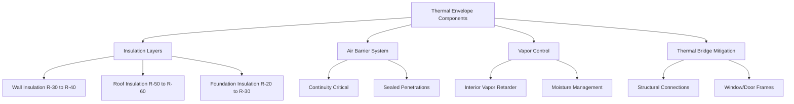
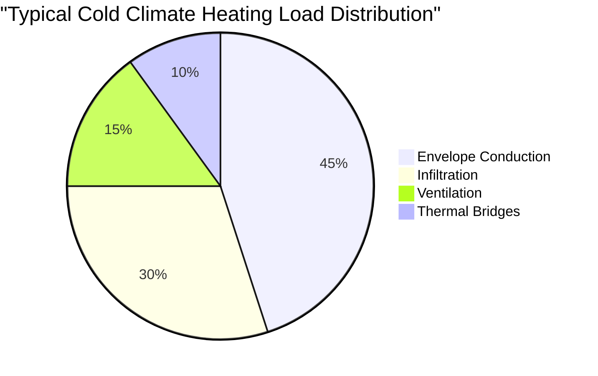

# Cold Climate HVAC Design Characteristics

Cold climate HVAC design requires rigorous analysis of heat transfer mechanisms, moisture management, and thermal envelope performance under extreme temperature differentials. Design conditions in cold climates present unique challenges that fundamentally differ from temperate or warm climate approaches.

## Design Temperature Criteria

Cold climate design follows ASHRAE Standard 90.1 and Handbook of Fundamentals for establishing outdoor design conditions. The 99.6% winter design dry-bulb temperature represents the temperature exceeded by 99.6% of hours during typical meteorological years.

Key design parameters include:

- **Outdoor design temperature**: -30°C to -10°C (-22°F to 14°F) depending on location
- **Indoor design temperature**: 20°C to 22°C (68°F to 72°F) for residential, 21°C (70°F) for commercial
- **Design temperature differential**: 40°C to 50°C (72°F to 90°F) typical
- **Mean coincident wind speed**: Critical for infiltration calculations

## Heat Loss Mechanisms

Heat loss in cold climates occurs through three primary mechanisms: conduction through the building envelope, infiltration of cold outdoor air, and thermal bridging at structural elements.

### Conduction Heat Loss

The fundamental heat transfer equation for steady-state conduction:

$$Q_{cond} = U \cdot A \cdot \Delta T$$

Where:
- $Q_{cond}$ = conduction heat loss (W or Btu/hr)
- $U$ = overall heat transfer coefficient (W/m²·K or Btu/hr·ft²·°F)
- $A$ = surface area (m² or ft²)
- $\Delta T$ = temperature difference between inside and outside (K or °F)

Cold climate design demands U-values significantly lower than temperate climates. Wall assemblies typically require U ≤ 0.28 W/m²·K (0.05 Btu/hr·ft²·°F), while roofs require U ≤ 0.18 W/m²·K (0.032 Btu/hr·ft²·°F).

### Infiltration Heat Loss

Air leakage represents a substantial portion of total heat loss, often 25-40% in cold climates. The infiltration heat loss equation:

$$Q_{inf} = \rho \cdot V \cdot c_p \cdot \Delta T$$

Where:
- $\rho$ = air density (kg/m³ or lb/ft³)
- $V$ = volumetric airflow rate (m³/s or cfm)
- $c_p$ = specific heat of air (1.006 kJ/kg·K or 0.24 Btu/lb·°F)
- $\Delta T$ = temperature difference (K or °F)

Air leakage rates in cold climates should not exceed 1.5 ACH50 (air changes per hour at 50 Pa) for residential construction, with passive house standards requiring ≤0.6 ACH50.

## Thermal Envelope Performance

### Insulation Requirements

Cold climate insulation levels exceed minimum code requirements to achieve economic and comfort objectives:

| Building Component | Climate Zone 6 | Climate Zone 7 | Climate Zone 8 |
|-------------------|----------------|----------------|----------------|
| Walls (R-value) | R-20 to R-21 | R-21 to R-25 | R-25 to R-30 |
| Roof/Ceiling | R-49 to R-60 | R-49 to R-60 | R-60+ |
| Floor over unconditioned | R-30 | R-30 to R-38 | R-38 |
| Basement walls | R-15 | R-15 to R-19 | R-19 |
| Slab edge | R-15, 4 ft depth | R-20, 4 ft depth | R-20, full slab |
| Glazing U-factor | ≤0.32 | ≤0.29 | ≤0.26 |

## Moisture and Condensation Control

Cold climates create severe vapor pressure differentials driving moisture from warm interior spaces toward cold exterior surfaces. The dewpoint temperature within wall assemblies must remain above surface temperatures to prevent interstitial condensation.

The vapor pressure differential:

$$\Delta P_v = P_{v,in} - P_{v,out}$$

During winter conditions with 21°C (70°F) indoor temperature at 30% RH and -20°C (-4°F) outdoor temperature, the vapor pressure differential reaches approximately 680 Pa, driving moisture outward.

### Vapor Retarder Placement

Vapor retarders must be positioned on the warm side of insulation in cold climates. The ratio of exterior to interior thermal resistance determines condensation risk:

$$\frac{R_{exterior}}{R_{interior}} \leq 0.33$$

This criterion ensures that the vapor retarder surface temperature remains above the dewpoint temperature of interior air.

## Thermal Bridging

Thermal bridges create localized heat loss pathways and surface temperature depressions that risk condensation. Common thermal bridges include:

- Steel stud framing (reduces effective R-value by 40-55%)
- Concrete slab edges and balconies
- Window and door frames
- Structural steel connections

Linear thermal transmittance (ψ-value) quantifies thermal bridge heat loss:

$$Q_{bridge} = \psi \cdot L \cdot \Delta T$$

Where:
- $\psi$ = linear thermal transmittance (W/m·K or Btu/hr·ft·°F)
- $L$ = length of thermal bridge (m or ft)

## Heating Load Components

## Air Leakage Testing

Blower door testing per ASTM E779 or ISO 9972 verifies envelope airtightness. Cold climate targets:

| Building Type | Target Air Leakage |
|---------------|-------------------|
| Residential - Code Minimum | ≤3.0 ACH50 |
| Residential - High Performance | ≤1.5 ACH50 |
| Passive House | ≤0.6 ACH50 |
| Commercial | ≤0.4 cfm/ft² @ 75 Pa |

## Foundation Heat Loss

Ground-coupled heat loss follows two-dimensional heat transfer patterns. The simplified approach per ASHRAE Handbook:

$$Q_{ground} = U_{eff} \cdot A_{floor} \cdot (T_{in} - T_{ground})$$

Where $U_{eff}$ varies with insulation configuration, soil type, and water table depth. Frost-protected shallow foundations (FPSF) reduce heat loss by placing horizontal insulation extending outward from the foundation perimeter.

## Window Performance

Window selection critically affects cold climate performance. Triple-glazed units with low-e coatings achieve U-values of 0.15-0.20 W/m²·K (0.027-0.035 Btu/hr·ft²·°F). The solar heat gain coefficient (SHGC) should balance winter solar gains (SHGC 0.35-0.50) against summer overheating risks.

## System Implications

Cold climate characteristics drive HVAC system requirements:

- Heating capacity 2-4 times greater than cooling
- Ductwork and piping require freeze protection
- Heat recovery ventilation essential for energy efficiency
- Hydronic systems preferred for even heat distribution
- Humidity control prevents condensation on cold surfaces

These thermal envelope characteristics establish the foundation for cold climate HVAC system design, directly determining heating loads, equipment sizing, and energy performance.
