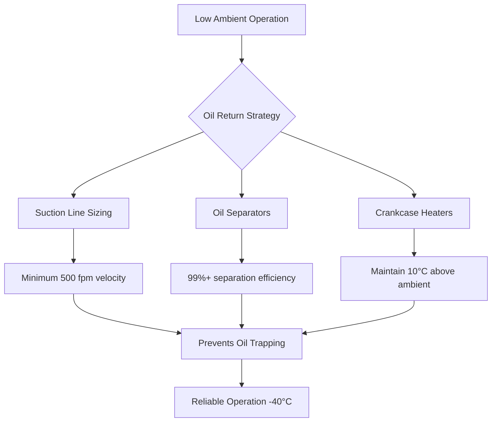

## Equipment Performance Degradation

Cold climates impose severe operational constraints on HVAC equipment through reduced heat transfer effectiveness, refrigerant behavior changes, and material property degradation. Understanding these physical limitations determines appropriate equipment selection and system configuration.

### Heat Pump Capacity Loss

Air-source heat pump capacity decreases dramatically as outdoor temperature drops according to refrigeration cycle thermodynamics:

$$
COP_{HP} = \frac{T_{condensing}}{T_{condensing} - T_{evaporating}}
$$

Where temperatures use absolute scale (Kelvin). At -20°C outdoor conditions, evaporator temperature may reach -30°C, reducing theoretical COP from 4.0 at mild conditions to approximately 2.0 at design conditions. Real equipment experiences additional losses from:

- Increased viscous flow losses in expansion devices
- Higher compressor friction at cold oil temperatures
- Reduced heat exchanger effectiveness from frost accumulation
- Auxiliary heat requirements for defrost cycles

ASHRAE Standard 116 specifies testing at 8.3°C and -8.3°C outdoor temperatures, but cold climate design requires extended rating data down to -25°C or lower.

## Defrost Strategy Selection

Frost accumulation on outdoor coils blocks airflow and degrades heat transfer when surface temperature falls below 0°C and outdoor air contains moisture. Defrost cycle selection impacts system efficiency and occupant comfort.

### Defrost Method Comparison

| Method | Energy Penalty | Comfort Impact | Control Complexity | Application |
|--------|---------------|----------------|-------------------|-------------|
| Reverse cycle | 15-25% during defrost | Moderate (brief cooling) | Medium | Residential, light commercial |
| Hot gas bypass | 10-15% continuous | Minimal | Low | Commercial applications |
| Electric resistance | 30-40% during defrost | High (shutdown) | Low | Small equipment |
| Demand defrost | 5-10% reduction | Minimal | High | Advanced systems |

Demand defrost using temperature and pressure differential sensors reduces unnecessary defrost cycles by 50% compared to time-based initiation, saving approximately 10% seasonal energy in cold climates.

### Defrost Termination Control

Proper termination prevents excessive defrost duration while ensuring complete frost removal. The heat balance during defrost:

$$
Q_{defrost} = m_{ice} \cdot L_f + m_{coil} \cdot c_p \cdot \Delta T + Q_{losses}
$$

Where:
- $m_{ice}$ = frost mass accumulated (kg)
- $L_f$ = latent heat of fusion (334 kJ/kg)
- $m_{coil}$ = coil thermal mass (kg)
- $c_p$ = specific heat of coil material (kJ/kg·K)
- $Q_{losses}$ = heat losses to ambient (kJ)

Termination strategies include coil temperature sensing (typically 21-27°C), time-based limits (5-10 minutes), or pressure-based methods monitoring refrigerant saturation conditions.

## Refrigerant and Oil Management

Low ambient temperatures create refrigerant migration and oil return challenges affecting system reliability and longevity.

### Oil Viscosity Effects

Lubricant viscosity increases exponentially with temperature decrease according to the Walther equation. POE oils used with HFC refrigerants may exceed 1000 cSt at -40°C, creating:

- Inadequate compressor lubrication during startup
- Poor oil return from outdoor coil at low loads
- Increased pressure drop through suction lines
- Compressor damage from oil-rich slugging

Oil management solutions:

### Crankcase Heating Requirements

Refrigerant migration to cold crankcases during off-cycles dilutes oil and causes foaming at startup. Crankcase heater wattage follows empirical relationships:

$$
W_{heater} = k \cdot V_{crankcase} \cdot \Delta T_{design}
$$

Typical values: k = 5-8 W/L·°C for reciprocating compressors, 8-12 W/L·°C for scroll compressors in extreme cold climates.

## Materials and Component Selection

Cold temperatures affect material properties requiring specific selection criteria.

### Component Specifications

| Component | Standard Material | Cold Climate Requirement | Reason |
|-----------|------------------|-------------------------|---------|
| Gaskets/seals | Nitrile rubber | EPDM, silicone | Maintains flexibility <-30°C |
| Electrical wire | PVC insulation | XLPE, Tefzel | Prevents insulation cracking |
| Plastic housings | ABS | Polycarbonate, nylon | Impact resistance at low temp |
| Control wiring | Copper | Tinned copper | Prevents corrosion from ice/salt |
| Insulation | Fiberglass | Closed-cell foam | Moisture resistance |
| Condensate drains | PVC Schedule 40 | Heat traced/insulated | Prevents freeze blockage |

### Metal Ductility Transition

Carbon steel ductility decreases sharply below -20°C, approaching brittle fracture conditions. ASTM A333 Grade 6 steel maintains impact strength to -46°C for critical outdoor components.

## Outdoor Unit Configuration

Equipment designed for cold climates incorporates specific features addressing environmental challenges.

### Wind Protection Requirements

Wind velocity amplifies convective heat loss from outdoor units following forced convection principles:

$$
h_{conv} = C \cdot Re^m \cdot Pr^n \cdot \frac{k}{L}
$$

Wind breaks reducing velocity by 50% decrease heat loss by approximately 30%, improving capacity 8-12% at -20°C conditions. ASHRAE Standard 37 specifies still-air testing, requiring correction factors for actual installation conditions.

### Elevated Mounting

Ground-level installations in heavy snow regions require:

- Minimum 450 mm clearance above maximum snow depth
- Structural support for combined equipment and snow load
- Accessibility for maintenance without snow removal
- Drainage routing preventing ice dam formation

## Variable-Speed Technology Advantages

Inverter-driven compressors provide superior cold climate performance through:

1. **Extended operating range**: Modern units operate to -30°C outdoor temperature
2. **Soft start capability**: Reduces electrical demand and mechanical stress
3. **Continuous modulation**: Minimizes defrost frequency through lower coil loading
4. **Enhanced oil return**: Higher compression ratios improve refrigerant velocity

Coefficient of performance improvements range from 15-30% compared to fixed-speed equipment across the heating season in climate zones 6-8.

## Conclusion

Cold climate equipment selection requires comprehensive analysis of thermodynamic performance degradation, material compatibility, and operational reliability at design conditions. Proper specification of defrost controls, oil management systems, and cold-rated materials ensures dependable heating service throughout winter operating periods. Engineers must verify manufacturer performance data extends to project design temperatures and account for capacity loss in heating load calculations per ASHRAE Handbook—Fundamentals psychrometric relationships.
