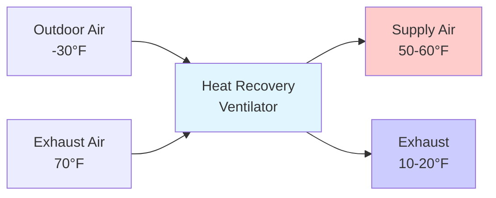

Cold climate HVAC design requires strategies that address extreme outdoor temperatures, extended heating seasons, high heating loads, and equipment operation in sub-zero conditions. Systems must maintain comfort while managing moisture, preventing freeze damage, and operating efficiently when outdoor temperatures drop below -20°F (-29°C).

## Design Temperature Considerations

ASHRAE Handbook—Fundamentals provides 99.6% and 99% design dry-bulb temperatures for winter design. Cold climates typically feature design temperatures from 0°F to -40°F (-18°C to -40°C) depending on location.

### Heating Load Magnitude

The conductive heat loss through building envelope components increases linearly with temperature difference:

$$Q_{cond} = U \cdot A \cdot \Delta T$$

Where:
- $Q_{cond}$ = conductive heat loss (Btu/h)
- $U$ = overall heat transfer coefficient (Btu/h·ft²·°F)
- $A$ = surface area (ft²)
- $\Delta T$ = indoor-outdoor temperature difference (°F)

For a 70°F indoor temperature and -30°F outdoor temperature, $\Delta T$ reaches 100°F, creating substantial envelope losses that dominate the heating load calculation.

## Envelope-Integrated Design

Cold climate HVAC strategy begins with envelope performance. Air barrier continuity and thermal bridge elimination reduce heating loads and prevent condensation within wall assemblies.

### Air Leakage Impact

Infiltration heat loss in cold climates exceeds conductive losses in poorly sealed buildings:

$$Q_{inf} = 1.08 \cdot Q_{cfm} \cdot \Delta T$$

Where $Q_{cfm}$ is the volumetric airflow rate through leakage paths. At -30°F outdoor temperature with 100°F temperature difference, every 100 cfm of infiltration represents 10,800 Btu/h of heat loss.

### Vapor Control Strategy

Cold climate construction requires vapor control on the warm (interior) side of insulation to prevent moisture migration and condensation at cold surfaces. HVAC systems must maintain interior relative humidity below levels that cause condensation at the coldest envelope surface temperature.

## Heat Recovery Ventilation

Energy recovery from exhaust air is essential in cold climates where ventilation air heating represents 30-50% of total building heating load.

### HRV vs ERV Selection

| Parameter | HRV (Heat Recovery) | ERV (Energy Recovery) |
|-----------|---------------------|------------------------|
| Sensible effectiveness | 60-85% | 60-80% |
| Latent recovery | No | Yes |
| Frost control | Required | Better inherent frost resistance |
| Indoor humidity | Lower (drier) | Higher (moisture retained) |
| Best application | Tight envelopes, low humidity | Moderate envelopes, humidity control needed |

In cold climates with outdoor temperatures below 20°F, frost formation on heat exchanger surfaces requires defrost strategies including preheating, recirculation bypass, or periodic defrost cycles.

### Effectiveness and Temperature Recovery

Sensible heat recovery effectiveness:

$$\epsilon = \frac{T_{supply} - T_{outdoor}}{T_{exhaust} - T_{outdoor}}$$

For 75% effectiveness with -30°F outdoor air and 70°F exhaust air:

$$T_{supply} = -30 + 0.75(70 - (-30)) = -30 + 75 = 45°F$$

This reduces heating load from 100°F rise to 25°F rise, a 75% reduction in ventilation heating energy.

## Equipment Selection for Cold Climate Operation

### Heat Pump Limitations

Air-source heat pump capacity and efficiency decline as outdoor temperature drops. Standard equipment loses 50-70% of rated capacity at 0°F compared to 47°F rating conditions. Cold-climate heat pumps with enhanced vapor injection maintain capacity to -15°F but require backup heating at lower temperatures.

| Outdoor Temperature | Capacity (% of rated) | COP |
|---------------------|----------------------|-----|
| 47°F | 100% | 3.2 |
| 17°F | 75% | 2.4 |
| 0°F | 50% | 1.8 |
| -10°F | 35% | 1.4 |

### Hydronic System Advantages

Hydronic heating distribution offers superior performance in cold climates:

- Even heat distribution with radiant floors or panel radiators
- Lower supply temperatures (90-140°F) improve condensing boiler efficiency
- Reduced stratification compared to forced air systems
- No duct heat losses in unconditioned spaces
- Better thermal mass for temperature stability

### Condensing Boiler Efficiency

Condensing boilers recover latent heat from flue gases when return water temperature remains below approximately 130°F. Efficiency increases from conventional 80-85% to 90-96%.

$$\eta_{condensing} = \frac{Q_{sensible} + Q_{latent}}{Q_{fuel}}$$

Lower design supply temperatures enabled by high-performance envelopes maximize condensing operation hours.

## Frost Protection Strategies

All HVAC components exposed to outdoor air require frost protection below 32°F.

### Coil Freeze Protection

Heating coils in outdoor air streams must maintain surface temperature above 32°F. Protection methods include:

1. **Face and bypass dampers**: Modulate airflow across coil face
2. **Glycol solutions**: Depress freezing point (30-40% propylene glycol)
3. **Steam or electric preheat**: Raise entering air temperature
4. **Drain-down systems**: Automatic water drainage on temperature drop

### Condensate Freeze Prevention

Condensate drain lines from cooling coils, heat recovery units, and high-efficiency furnaces require heat tracing in unconditioned spaces or routing through conditioned areas.

## Ventilation Rate Optimization

ASHRAE Standard 62.1 requires minimum ventilation rates regardless of climate. In cold climates, demand-controlled ventilation based on occupancy or CO₂ sensing reduces over-ventilation penalties.

### Energy Impact

For 10,000 cfm outdoor air at -30°F heated to 70°F:

$$Q_{vent} = 1.08 \times 10,000 \times 100 = 1,080,000 \text{ Btu/h}$$

This represents substantial heating capacity. Reducing unnecessary ventilation during unoccupied periods through scheduling and demand control provides significant savings.

## System Zoning and Control

Cold climates benefit from perimeter zoning with dedicated heating to offset envelope losses and prevent occupant discomfort near exterior walls and windows. Core zones may require cooling year-round due to internal gains, while perimeter zones require heating.

### Reset Strategies

Outdoor air temperature reset of supply temperature and discharge pressure reduces energy consumption during milder winter conditions while maintaining capacity during extreme cold.

$$T_{supply} = T_{supply,design} - K \cdot (T_{outdoor} - T_{outdoor,design})$$

Where $K$ is the reset ratio, typically 0.5-1.0.

## Thermal Storage Applications

Cold climate design can leverage outdoor air for "free cooling" through thermal storage. Ice storage or chilled water tanks charged during cold overnight periods provide daytime cooling for buildings with internal gains, eliminating mechanical cooling energy during winter months.

Cold climates demand HVAC strategies focused on heat retention, efficient heat recovery, freeze protection, and equipment designed for low-temperature operation. Success requires integrated envelope and systems design with attention to moisture control and realistic capacity at design conditions.
