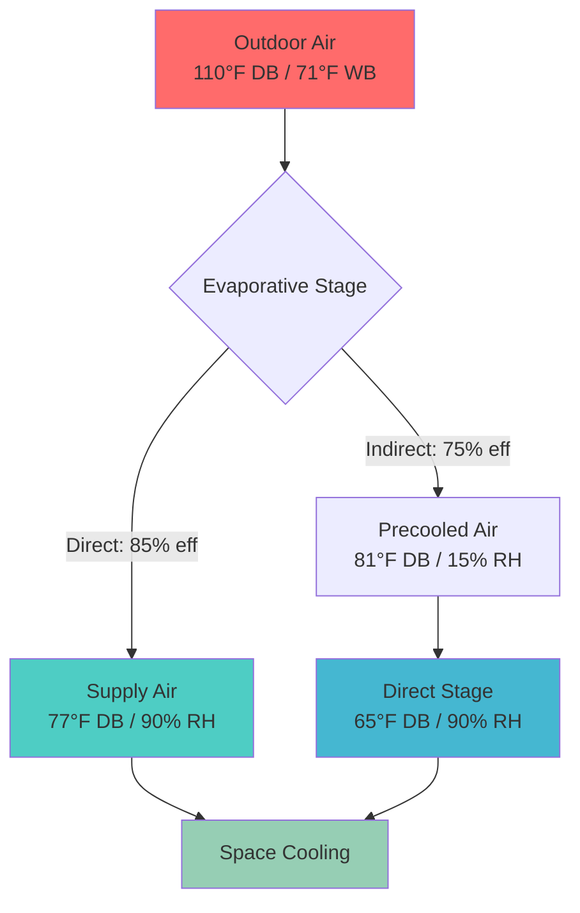

# Desert Arid Climate HVAC Design

Desert and arid climate zones present unique HVAC challenges characterized by extreme diurnal temperature swings, intense solar radiation, minimal precipitation, and airborne particulate contamination. Successful system design requires leveraging the low humidity advantage while protecting against thermal extremes and environmental particulates.

## Climate Characteristics and Design Implications

**Key Design Conditions (ASHRAE Climate Zone 2B, 3B)**

| Parameter | Typical Range | Design Impact |
|-----------|---------------|---------------|
| Summer Dry Bulb | 105-120°F | Peak cooling load |
| Winter Dry Bulb | 25-40°F | Heating requirements |
| Relative Humidity | 5-25% | Evaporative cooling potential |
| Diurnal Swing | 30-40°F | Thermal mass benefits |
| Solar Radiation | 900-1100 W/m² | Dominant load component |
| Particulate Level | Elevated PM10/PM2.5 | Filtration requirements |

The defining feature of arid climates is the combination of high dry-bulb temperatures with exceptionally low humidity ratios. This creates a significant wet-bulb depression (difference between dry-bulb and wet-bulb temperatures), typically 20-35°F during peak conditions, enabling highly effective evaporative cooling.

## Psychrometric Analysis for Desert Conditions

Desert climates operate in the lower left region of the psychrometric chart, characterized by high sensible heat ratios (SHR > 0.95) and minimal latent load. The design condition psychrometrics reveal the cooling strategy opportunities.

**Example Calculation: Phoenix, AZ Design Day**
- Outdoor: 110°F DB / 71°F WB (15% RH)
- Indoor target: 75°F DB / 50% RH
- Wet-bulb depression: 39°F

For direct evaporative cooling with 85% effectiveness:
- Supply air temperature = 110°F - (0.85 × 39°F) = 76.8°F
- Nearly meeting space temperature without mechanical refrigeration

## Cooling Load Characteristics

Desert climates exhibit extreme solar-dominated cooling loads with minimal latent component.

**Typical Load Distribution:**
- Solar heat gain through envelope: 40-50%
- Conduction through roof/walls: 25-35%
- Internal gains: 15-20%
- Ventilation sensible: 8-12%
- Ventilation latent: <2%

**Solar Heat Gain Calculation**

For west-facing glazing at design conditions:
- SHGC (Solar Heat Gain Coefficient): 0.25 (low-e glazing)
- Direct solar radiation: 250 Btu/h·ft²
- Heat gain = A × SHGC × Solar Radiation
- For 100 ft² window: Q = 100 × 0.25 × 250 = 6,250 Btu/h

This single exposure can represent 25-30% of a small building's cooling load, emphasizing the critical importance of solar control strategies.

## System Design Strategies

```mermaid
flowchart LR
    A[Desert Climate<br/>HVAC Strategy] --> B[Evaporative Cooling]
    A --> C[Solar Protection]
    A --> D[Filtration System]
    A --> E[Thermal Storage]

    B --> B1[Direct/Indirect<br/>Evaporative]
    B --> B2[Two-Stage Systems]
    B --> B3[Hybrid with DX]

    C --> C1[High-Performance<br/>Glazing]
    C --> C2[External Shading]
    C --> C3[Cool Roof<br/>SR > 0.65]

    D --> D1[MERV 13-16<br/>Pre-filters]
    D --> D2[Sealed Outdoor<br/>Air Intakes]
    D --> D3[Pressurization<br/>Strategy]

    E --> E1[Night Cooling<br/>Purge]
    E --> E2[Thermal Mass<br/>Integration]
    E --> E3[Cool Storage]

    style A fill:#f4a261
    style B fill:#2a9d8f
    style C fill:#e76f51
    style D fill:#264653
    style E fill:#e9c46a
```

### Evaporative Cooling Application

**Direct Evaporative Cooling (DEC)**
- Effectiveness: 80-90% wet-bulb depression
- Energy consumption: 10-25% of mechanical refrigeration
- Supply air humidity: 85-95% RH
- Best application: Industrial, warehouse, semi-conditioned spaces

**Indirect Evaporative Cooling (IEC)**
- Effectiveness: 70-80% wet-bulb depression
- No humidity addition to supply air
- Suitable for occupied spaces with comfort requirements
- Often paired with direct stage for maximum efficiency

**Two-Stage (Indirect-Direct) Systems**

The optimal desert climate solution combines both stages:

1. **Indirect stage**: Precools outdoor air sensibly (no moisture addition)
   - Heat exchanger transfers cooling to primary air stream
   - Secondary air stream undergoes evaporative cooling
   - Achieves 70-75% of wet-bulb depression

2. **Direct stage**: Further cools the precooled air
   - Adds controlled humidity to final supply
   - Total system effectiveness: 100-120% of single-stage wet-bulb depression
   - Can achieve supply temperatures 5-10°F below outdoor wet-bulb

**Performance Comparison**

| System Type | Supply Temp (110°F/71°F WB) | Relative Energy | Humidity Control |
|-------------|------------------------------|-----------------|------------------|
| DX Only | 55°F | 1.00 (baseline) | Excellent |
| Direct Evap | 77°F | 0.15 | Poor (high RH) |
| Indirect Evap | 81°F | 0.20 | Good |
| Two-Stage | 65°F | 0.25 | Fair |
| Hybrid IEC+DX | 55°F | 0.60 | Excellent |

### Solar Gain Mitigation

Solar radiation represents the dominant heat source in desert climates, requiring aggressive control strategies.

**Envelope-Level Controls:**
- SHGC ≤ 0.25 for all glazing orientations
- External shading devices (prevent solar entry before glass)
- Cool roof coatings: Solar reflectance (SR) ≥ 0.65, thermal emittance ≥ 0.85
- Roof insulation: R-30 minimum, R-49 preferred
- Wall insulation: R-13 continuous insulation minimum

**Calculated Benefit:**

Standard roof (SR = 0.20) vs. cool roof (SR = 0.70):
- Roof surface temperature reduction: 40-60°F
- Heat flux reduction: q = U × ΔT
- For R-30 roof (U = 0.033): q = 0.033 × 50°F = 1.65 Btu/h·ft²
- 2,000 ft² roof savings: 3,300 Btu/h (0.28 tons)

### Particulate Contamination Control

Airborne dust, sand, and particulates accelerate equipment degradation and compromise indoor air quality.

**Filtration Strategy:**
- Pre-filters: MERV 8-11 (coarse dust removal, frequent replacement)
- Final filters: MERV 13-16 (fine particulates, longer service life)
- Filter velocity: ≤ 300 FPM (prevents media damage and bypass)
- Pressure drop monitoring: Replace at 2× initial resistance

**Equipment Protection:**
- Sealed outdoor air intake plenums with weather louvers
- Coil coatings: Phenolic or epoxy for corrosion resistance
- Hail guards for rooftop equipment (≥ 1.75" hail rating)
- Condenser coil spacing: ≥ 12 FPI for easier cleaning
- Access panels sized for routine coil washing

**Building Pressurization:**

Maintaining slight positive pressure (0.02-0.05 in. w.c.) prevents infiltration of particulate-laden air through building envelope gaps. Calculate outdoor air requirement:

OA_cfm = Occupant_ventilation + Pressurization_makeup

Pressurization makeup = (Building_leakage_area × Pressure^0.65) / 2.5

## Load Calculation Methodology

Desert climate load calculations must account for the extreme solar component and diurnal temperature swing benefits.

**ASHRAE Fundamentals Load Calculation:**

Total cooling load = Roof + Walls + Windows + Internal + Ventilation

**Roof load with thermal mass lag:**
- CLTD (Cooling Load Temperature Difference) method
- Accounts for sol-air temperature and thermal lag
- Sol-air temp: T_sa = T_outdoor + (α × I / h_o) - (ε × ΔR / h_o)
  - α = solar absorptance (0.90 for dark roof, 0.30 for cool roof)
  - I = solar radiation intensity (Btu/h·ft²)
  - h_o = outdoor film coefficient (3.0 Btu/h·ft²·°F)
  - ε × ΔR = long-wave radiation correction (~7°F at night)

**Nighttime Cooling Benefit:**

Desert diurnal swing enables substantial thermal mass cooling:
- Night outdoor temperature: 70-75°F
- Building mass cool-down: ΔT = 20-30°F
- Stored cooling capacity: Q = m × c × ΔT
- For 100,000 lb concrete: Q = 100,000 × 0.22 × 25 = 550,000 Btu

This stored cooling reduces daytime peak load by 10-25% when combined with night ventilation purge strategies.

## System Sizing Considerations

**Cooling System Capacity:**
- Base load calculation on 1% design conditions (ASHRAE Fundamentals)
- Safety factor: 10-15% (lower than humid climates due to predictable loads)
- Evaporative systems: Size for 100-110% of calculated load
- Hybrid systems: DX sized for 60-70% of peak, evaporative covers swing

**Heating System Capacity:**
- 99% design temperature (typically 25-35°F)
- Envelope heat loss dominates (minimal infiltration in tight construction)
- Oversizing discouraged: Short heating season, cycling inefficiency
- Heat pump balance point: Often economical due to mild winter

**Equipment Selection:**
- High-efficiency condensing units: EER ≥ 12.0, SEER ≥ 16
- Desert-rated units: Enhanced coil coatings, larger coil surface area
- Variable-speed compressors: Efficiency at part-load conditions
- Evaporative media: Rigid CELdek® or similar, 12" depth for two-stage

## Operational Strategies

**Economizer Operation:**
- Dry-bulb economizer: 500-1000+ hours annually
- Setpoint: 65-70°F outdoor air
- Damper control: Modulating for precise mixing
- Minimum position: Code-required ventilation rate

**Night Cooling Purge:**
- Activate when outdoor < 70°F and indoor > 75°F
- 100% outdoor air, maximum supply fan speed
- Duration: 2-4 hours before occupancy
- Precools thermal mass, reduces morning load

**Humidity Control:**
- Desert climates rarely require dehumidification
- Evaporative systems may require humidity limiting during monsoon periods
- Monitor space RH, lockout direct evaporative stage if RH > 65%

---

**References:**
- ASHRAE Standard 90.1: Energy Standard for Buildings Except Low-Rise Residential Buildings
- ASHRAE Handbook: Fundamentals, Chapter 18: Nonresidential Cooling and Heating Load Calculations
- ASHRAE Climatic Design Conditions: Climate Zone 2B, 3B
- ASHRAE Standard 62.1: Ventilation for Acceptable Indoor Air Quality
