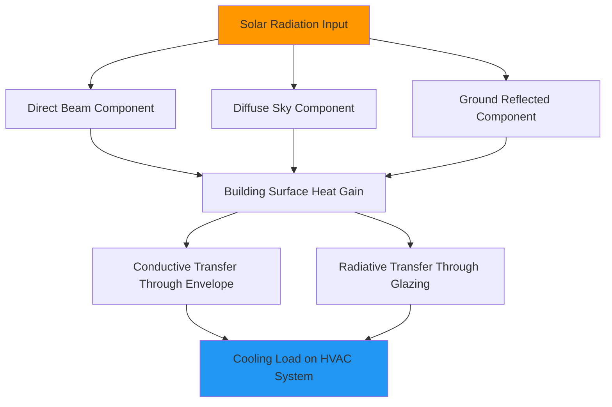

## Climate Parameters

Desert and arid climates present unique thermodynamic challenges for HVAC systems, characterized by extreme diurnal temperature swings, minimal atmospheric moisture, and intense solar radiation. These conditions fundamentally alter load calculations, equipment selection, and system performance parameters.

### Temperature Characteristics

Desert regions exhibit diurnal temperature ranges exceeding 40°F (22°C), with summer design dry-bulb temperatures reaching 115-125°F (46-52°C) according to ASHRAE Handbook Fundamentals. This extreme differential drives substantial cooling loads during peak hours while enabling effective nighttime ventilation strategies.

The rate of temperature change follows:

$$\frac{dT}{dt} = \frac{q_{net}}{mc_p}$$

where $q_{net}$ represents net heat transfer, $m$ is the thermal mass, and $c_p$ is specific heat capacity. Desert structures require strategic thermal mass placement to dampen these rapid fluctuations.

| Climate Parameter | Typical Range | Design Impact |
|------------------|---------------|---------------|
| Summer DB Temperature | 110-125°F (43-52°C) | Peak cooling load |
| Diurnal Range | 35-50°F (19-28°C) | Thermal storage opportunity |
| Winter DB Temperature | 25-45°F (-4 to 7°C) | Heating equipment sizing |
| Mean Coincident WB | 65-72°F (18-22°C) | Evaporative cooling potential |

### Psychrometric Properties

Low absolute humidity defines desert psychrometrics, with typical dewpoint temperatures between 20-40°F (-7 to 4°C) during summer months. This creates large wet-bulb depression values, enabling highly effective evaporative cooling.

The wet-bulb depression is calculated as:

$$\Delta T_{wb} = T_{db} - T_{wb}$$

Values of 40-50°F (22-28°C) are common, allowing direct evaporative coolers to reduce supply air temperatures by 25-35°F (14-19°C) at design conditions.

The moisture removal load remains minimal, with sensible heat ratio (SHR) typically exceeding 0.95:

$$SHR = \frac{Q_s}{Q_s + Q_l}$$

where $Q_s$ is sensible cooling and $Q_l$ is latent cooling. This high SHR enables equipment downsizing for latent capacity, focusing design on sensible heat removal.

### Solar Radiation Effects

Desert locations receive among the highest solar irradiance globally, with clear-sky horizontal irradiance reaching 1000-1100 W/m² at solar noon. ASHRAE clear-sky model calculations show:

$$E_b = E_0 \cdot e^{-B/\sin(\beta)}$$

where $E_b$ is direct normal irradiance, $E_0$ is extraterrestrial irradiance, $B$ is atmospheric extinction coefficient, and $\beta$ is solar altitude angle.

Annual horizontal irradiance totals 2200-2500 kWh/m²/year exceed temperate zone values by 40-60%, driving substantial conductive and radiative heat gains through building envelopes.

### Heat Transfer Dynamics

Convective heat transfer coefficients at exterior surfaces increase with wind velocity, following:

$$h_c = a + b \cdot V$$

where typical coefficients yield $h_c$ = 15-25 W/m²·K for desert wind conditions. Combined with radiative exchange to clear night skies (effective sky temperature 30-50°F below ambient), nighttime heat rejection becomes highly efficient.

Sky radiation cooling potential follows Stefan-Boltzmann relationships:

$$q_{rad} = \epsilon \cdot \sigma \cdot A \cdot (T_{surface}^4 - T_{sky}^4)$$

This enables passive cooling strategies and enhances condenser heat rejection during nighttime operation.

### Wind and Dust Considerations

Desert winds transport significant particulate matter, requiring enhanced filtration and equipment protection. Prevailing wind patterns create pressure differentials across building envelopes:

$$\Delta P_{wind} = \frac{1}{2} \cdot C_p \cdot \rho \cdot V^2$$

where $C_p$ is pressure coefficient (0.4-0.8 for windward surfaces), $\rho$ is air density, and $V$ is wind velocity. These pressure differentials affect infiltration rates and building pressurization requirements.

| Environmental Factor | Design Consideration |
|---------------------|---------------------|
| Dust loading | Enhanced filtration (MERV 11-13 minimum) |
| Sand ingestion | Protected intake locations, coarser pre-filters |
| UV exposure | Material degradation, protective coatings required |
| Low precipitation | Minimal corrosion, extended equipment life |

### Altitude Effects

Many desert regions exist at elevations 2000-7000 feet (610-2130 m) above sea level, reducing air density according to:

$$\rho = \rho_0 \cdot e^{-\frac{g \cdot h}{R \cdot T}}$$

This altitude correction affects fan power requirements, equipment capacity ratings, and combustion equipment performance. At 5000 feet elevation, air density decreases approximately 17%, requiring proportional increases in volumetric airflow to maintain mass flow rates.

## Load Profile Characteristics

Desert climate loads concentrate heavily in sensible cooling, with peak loads occurring during mid-afternoon hours when solar radiation and ambient temperature combine. The asymmetric load profile enables thermal energy storage strategies, shifting cooling production to nighttime hours when equipment operates at higher efficiency and lower energy costs.

External surface temperatures on dark-colored roofs can exceed 180°F (82°C) under summer design conditions, creating severe conductive heat gains. The thermal resistance required to limit heat flux follows:

$$R_{required} = \frac{T_{surface} - T_{indoor}}{q_{max}}$$

Typical desert construction requires roof R-values of R-30 to R-49 (RSI 5.3-8.6) to control solar-driven conductive gains.

## Equipment Performance Considerations

The combination of high ambient temperatures and low humidity creates optimal conditions for evaporative cooling technologies while challenging vapor-compression system performance. Air-cooled condensers experience capacity degradation and efficiency losses at extreme outdoor temperatures, often requiring oversizing or supplemental evaporative pre-cooling.

Desiccant dehumidification systems operate inefficiently in already-dry climates, making them unsuitable for desert applications. Conversely, indirect-direct evaporative cooling stages can achieve coefficient of performance (COP) values exceeding 15 when properly designed for desert psychrometric conditions.

