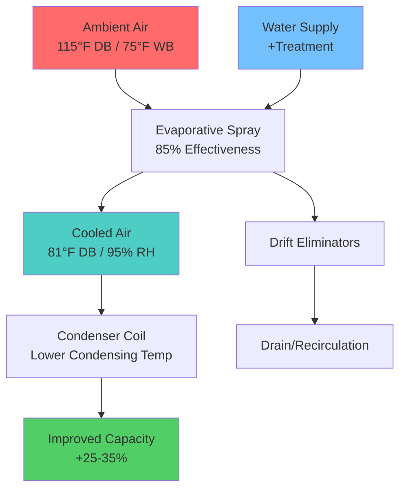
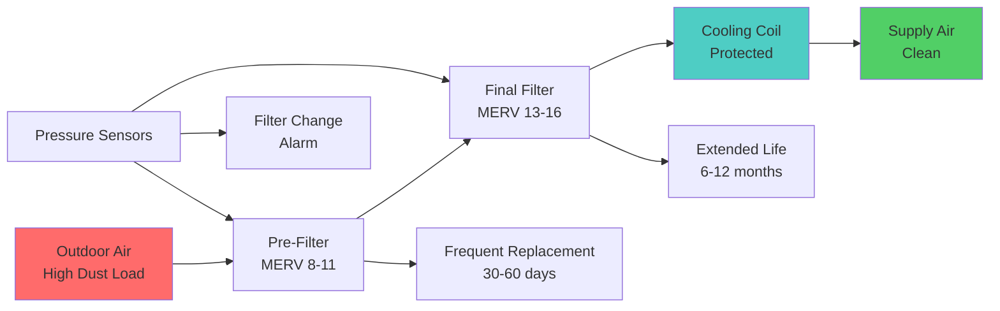

# Desert Climate HVAC Equipment Considerations

Equipment selection for desert and arid climates requires specialized design features to withstand extreme thermal cycling, intense solar radiation, airborne particulate contamination, and corrosive dust exposure. Standard equipment specifications prove inadequate under these conditions, necessitating enhanced materials, protective coatings, and modified geometries.

## Environmental Stressors and Equipment Impact

Desert equipment faces simultaneous exposure to multiple degradation mechanisms.

**Primary Environmental Challenges:**

| Stressor | Magnitude | Equipment Impact | Mitigation Strategy |
|----------|-----------|------------------|---------------------|
| Peak Temperature | 115-125°F ambient | Compressor overload, refrigerant pressure | High-temperature rated components |
| Diurnal Cycling | 30-50°F daily swing | Thermal fatigue, seal failure | Flexible connections, expansion joints |
| Solar Radiation | 900-1100 W/m² | Cabinet degradation, control failure | Reflective coatings, insulated enclosures |
| Airborne Particulates | PM10: 50-200 μg/m³ | Coil fouling, bearing wear | Enhanced filtration, coil geometry |
| Alkaline Dust | pH 8-10 | Aluminum corrosion | Protective coatings, material substitution |
| Hail Exposure | 1.0-2.5" diameter | Coil damage, cabinet denting | Impact-resistant guards |

## Refrigeration Equipment Selection

### Condensing Units - Desert Rated

Standard condensing units experience significant capacity degradation and premature failure in desert conditions. Desert-rated specifications address these limitations.

**Enhanced Design Features:**

**Coil Geometry:**
- Fin spacing: 12-14 FPI (versus standard 16-20 FPI)
- Wider spacing reduces dust accumulation rate
- Facilitates cleaning without fin damage
- Maintains airflow under fouled conditions

**Coil Surface Protection:**
- Phenolic epoxy coating (minimum 1.5 mil thickness)
- E-coating provides superior corrosion resistance versus aluminum oxidation
- Hydrophobic surface reduces dust adhesion
- Service life extension: 200-300% in alkaline dust environment

**Compressor Thermal Protection:**
- Ambient temperature rating: 125°F minimum (140°F preferred)
- Internal thermal overload with manual reset
- Crankcase heater for morning startup in winter
- High-pressure cutout: 475-500 psig for R-410A systems

**Cabinet Construction:**
- 20-gauge galvanized steel minimum (versus 22-gauge standard)
- Powder coat finish with UV stabilizers
- Reflective exterior: Solar reflectance ≥ 0.60
- Louvered panels for solar radiation rejection

### Performance Derating

Equipment capacity declines as condensing temperature rises with ambient conditions. The relationship follows thermodynamic principles of the refrigeration cycle.

**Capacity Correction Factor:**

For air-cooled condensers, capacity varies approximately:

$$
Q_{actual} = Q_{rated} \times \left(1 - 0.02 \times (T_{amb} - T_{rated})\right)
$$

Where:
- $Q_{actual}$ = Actual cooling capacity (Btu/h)
- $Q_{rated}$ = ARI rated capacity at 95°F ambient (Btu/h)
- $T_{amb}$ = Actual ambient temperature (°F)
- $T_{rated}$ = Rating condition temperature (95°F)
- 0.02 = Typical derating factor (2% per °F)

**Example Calculation:**

10-ton unit (120,000 Btu/h at 95°F) operating at 115°F:

$$
Q_{actual} = 120,000 \times \left(1 - 0.02 \times (115 - 95)\right) = 120,000 \times 0.60 = 72,000 \text{ Btu/h}
$$

Capacity reduction: 40% at extreme design conditions.

**Sizing Implications:**
- Select equipment based on anticipated ambient temperature, not standard 95°F rating
- Apply derating factor during load calculations
- Consider multiple smaller units versus single large unit
- Verify compressor high-temperature operation limits

### Evaporative Condensing

Pre-cooling condenser inlet air via evaporative spray reduces condensing temperature and restores capacity during peak conditions.

**System Configuration:**

**Performance Benefit:**

Inlet air temperature after evaporative precooling:

$$
T_{inlet} = T_{db} - \eta \times (T_{db} - T_{wb})
$$

Where:
- $\eta$ = Evaporative effectiveness (0.80-0.90)
- $T_{db}$ = Dry-bulb temperature (°F)
- $T_{wb}$ = Wet-bulb temperature (°F)

For 115°F/75°F WB conditions with 85% effectiveness:

$$
T_{inlet} = 115 - 0.85 \times (115 - 75) = 115 - 34 = 81°F
$$

Condensing temperature reduction: 20-25°F
Capacity improvement: 25-35%
Energy efficiency improvement (EER): 15-25%

**Design Considerations:**
- Water quality: TDS < 500 ppm preferred, treatment required for > 1000 ppm
- Bleed-off rate: 3-5% to control mineral concentration
- Drift eliminators: 0.001% carryover maximum
- Freeze protection: Drain-down system for winter operation

## Evaporative Cooling Equipment

Direct and indirect evaporative coolers provide the most energy-efficient cooling solution for desert climates but require proper media selection and water treatment.

### Evaporative Media Selection

**Rigid Media (CELdek®, Glasdek®):**
- Construction: Cellulose or fiberglass substrate with polymer coating
- Thickness: 6-12 inches (12" for two-stage systems)
- Flute angle: 15/45° or 30/60° cross-corrugated
- Effectiveness: 85-92% at design velocity
- Velocity range: 200-400 FPM (250 FPM optimal)
- Service life: 5-10 years with proper maintenance

**Performance Relationship:**

Evaporative effectiveness follows a logarithmic relationship with media depth:

$$
\eta = 1 - e^{-K \times L / V}
$$

Where:
- $\eta$ = Saturation effectiveness
- $K$ = Mass transfer coefficient (depends on media geometry)
- $L$ = Media depth (inches)
- $V$ = Air velocity (FPM)

**Media Comparison:**

| Media Type | Depth | Velocity | Effectiveness | Pressure Drop | Cost Ratio |
|------------|-------|----------|---------------|---------------|------------|
| Aspen Fiber | 4" | 250 FPM | 75-80% | 0.10" w.c. | 1.0 |
| CELdek 6" | 6" | 250 FPM | 85-88% | 0.15" w.c. | 2.5 |
| CELdek 12" | 12" | 250 FPM | 90-92% | 0.25" w.c. | 4.0 |
| Glasdek 8" | 8" | 300 FPM | 88-90% | 0.18" w.c. | 3.5 |

### Water Distribution Systems

Uniform water distribution across media surface ensures consistent performance and prevents dry spots that reduce effectiveness.

**Distribution Methods:**

**Gravity flood system:**
- Header pipe with calibrated orifices
- Flow rate: 3-6 GPM per linear foot of media
- Recirculation pump: 0.5-1.0 HP per 1000 CFM
- Sump capacity: 2-3 minutes retention at recirculation rate

**Spray nozzle system:**
- Pressure-atomizing nozzles at 15-30 PSI
- Overlap pattern: 100% coverage
- Flow rate: 4-8 GPM per linear foot
- Higher uniformity, increased pump power

**Water Quality Requirements:**

| Parameter | Maximum Value | Impact if Exceeded |
|-----------|---------------|-------------------|
| Total Dissolved Solids | 1000 ppm | Scale formation, reduced wetting |
| Calcium Hardness | 200 ppm as CaCO₃ | White scale deposits |
| pH | 6.5-8.5 | Media degradation, corrosion |
| Chlorides | 200 ppm | Corrosion of metal components |
| Silica | 50 ppm | Hard scale, difficult removal |

**Bleed-Off Calculation:**

To maintain TDS at acceptable levels, a portion of recirculating water must be discharged.

$$
\text{Bleed-off rate (GPM)} = \frac{\text{Evaporation rate}}{\text{Cycles of concentration} - 1}
$$

Evaporation rate approximately equals:

$$
\text{Evaporation (GPM)} = \frac{CFM \times \Delta h}{8.33 \times 60 \times 1060}
$$

Where:
- $\Delta h$ = Enthalpy change across media (Btu/lb)
- 8.33 = lb/gallon water
- 1060 = Btu/lb latent heat (approximate)

**Example:**

10,000 CFM unit, 20°F temperature drop (≈ 14 Btu/lb enthalpy change), 3 cycles of concentration:

$$
\text{Evaporation} = \frac{10,000 \times 14}{8.33 \times 60 \times 1060} \approx 0.26 \text{ GPM}
$$

$$
\text{Bleed-off} = \frac{0.26}{3 - 1} = 0.13 \text{ GPM}
$$

Total makeup water: 0.26 + 0.13 = 0.39 GPM (235 GPH)

## Air Handling Equipment

### Filtration Systems

Desert particulate loading rates exceed standard filter design assumptions by factors of 5-10, requiring specialized filtration strategies.

**Two-Stage Filtration Approach:**

**Pre-Filter Stage:**
- MERV 8-11 rating (45-65% ASHRAE dust spot efficiency)
- Captures coarse particulates: 3-10 μm diameter
- Prevents final filter overload
- Velocity: 300-400 FPM
- Replacement interval: 30-90 days depending on dust storm frequency

**Final Filter Stage:**
- MERV 13-16 rating (85-95% dust spot efficiency)
- Captures fine particulates: 0.3-3 μm diameter
- Protects cooling coils from fouling
- Velocity: 250-350 FPM (lower velocity extends life)
- Replacement interval: 6-12 months with proper pre-filtration

**Pressure Drop Monitoring:**

Filter loading creates exponential pressure drop increase. Replace when pressure differential reaches 2× initial clean resistance.

$$
\Delta P_{filter} = \Delta P_{clean} \times \left(1 + k \times m_{dust}\right)
$$

Where:
- $\Delta P_{filter}$ = Current pressure drop (in. w.c.)
- $\Delta P_{clean}$ = Initial clean pressure drop (in. w.c.)
- $k$ = Loading factor (media dependent)
- $m_{dust}$ = Accumulated dust mass (g/ft²)

**Typical Replacement Thresholds:**

| Filter Type | Initial ΔP | Replace at ΔP | Typical Service (Desert) |
|-------------|-----------|---------------|--------------------------|
| MERV 8 | 0.15" w.c. | 0.40" w.c. | 1-2 months |
| MERV 11 | 0.25" w.c. | 0.60" w.c. | 2-3 months |
| MERV 13 | 0.35" w.c. | 0.80" w.c. | 6-9 months |
| MERV 16 | 0.50" w.c. | 1.20" w.c. | 8-12 months |

### Cooling Coil Protection

Coil fouling reduces heat transfer capacity and increases airside pressure drop, degrading system performance.

**Coil Specification for Desert Conditions:**

**Fin spacing:** 8-10 FPI (versus 12-14 FPI standard)
- Reduces dust accumulation between fins
- Facilitates cleaning access
- Maintains airflow under partial fouling

**Face velocity:** 400-450 FPM maximum
- Lower velocity reduces dust impingement
- Decreases pressure drop penalty from fouling
- Standard design often specifies 500-550 FPM

**Coil depth:** 4-6 rows typical
- Shallower coils easier to clean
- Multiple small coils preferable to single deep coil
- Access requirements: 36" clearance for cleaning

**Protective coatings:**
- Phenolic epoxy: Standard protection, 1.5 mil thickness
- Heresite coating: Premium protection for aggressive environments
- Gold fin coating: Enhanced corrosion resistance for aluminum fins

**Cleaning Access:**
- Removable access panels: Minimum 24" × 24" on both sides
- Clear space: 36" minimum for pressure washer operation
- Drain provisions: 1.5-2.0" drain connection, trapped

### Fan Systems

Desert heat impacts motor performance and bearing lubrication, requiring thermal protection and enhanced cooling.

**Motor Selection:**
- Service factor: 1.15 minimum (1.25 preferred for outdoor units)
- Insulation class: F minimum (155°C), H preferred (180°C)
- Enclosure: TEFC (Totally Enclosed Fan Cooled) for dusty environments
- Ambient rating: 50°C (122°F) continuous duty

**Bearing Protection:**
- Sealed bearings: Prevent dust intrusion
- High-temperature grease: NLGI Grade 2, 350°F dropping point
- Relubrication provisions: Grease fittings accessible without disassembly

**Variable Frequency Drives (VFDs):**
- Ambient rating: 50°C (122°F) minimum
- IP rating: IP54 minimum for outdoor installations
- Conformal coating: Circuit board protection from dust
- Ventilation: Filtered intake, sealed enclosure
- Reactor/filter: Minimize motor bearing current from PWM harmonics

## Outdoor Unit Protection

### Solar Radiation Shielding

Direct solar exposure elevates cabinet temperatures 20-40°F above ambient, affecting controls and reducing component life.

**Shading Strategies:**

**Purpose-built canopies:**
- Height: 12-18" above equipment
- Overhang: 12-24" beyond equipment footprint
- Material: Reflective metal (galvanized steel, aluminum)
- Ventilation: Open sides for airflow
- Temperature reduction: 15-25°F cabinet interior

**Integrated solar shields:**
- Factory-installed reflective panels
- Air gap: 2-4" above cabinet roof
- Solar reflectance: ≥ 0.70
- Thermal emittance: ≥ 0.85

**Cool roof application:**
- Elastomeric coating on equipment cabinet
- Solar reflectance: 0.60-0.80
- Application: Spray or roll-on
- Reapplication: 5-7 years

### Hail Protection

Desert regions experience severe convective storms with large hail. Equipment protection prevents catastrophic damage.

**Hail Guard Specifications:**

**Coil guards:**
- Material: Expanded metal, 0.035" thickness aluminum
- Mesh: 3/4" × 1/4" openings (protects against 1.75" hail)
- Standoff: 1-2" from coil surface
- Airflow impact: < 5% when properly designed

**Cabinet guards:**
- Material: 18-gauge perforated metal
- Perforation: 50-60% open area
- Coverage: Top and windward sides
- Impact resistance: 2.0" hail at terminal velocity (90+ mph)

**Fan guards:**
- Wire diameter: 0.192" minimum (5 gauge)
- Spacing: 0.5-0.75" for blade protection
- Impact resistance: AMCA 99 certified

### Sandstorm Protection

Airborne sand abrading coils and fouling components during dust storms requires both passive and active protection.

**Passive Protection:**
- Intake louvers: Angled downward, 45° minimum
- Labyrinth design: Multiple direction changes trap heavy particles
- Drainage: Weep holes for sand accumulation removal

**Active Protection:**
- Automatic dampers: Close outdoor air intake during extreme events
- Pressure sensors: Detect sandstorm conditions
- Recirculation mode: Maintain operation with 100% return air

**Post-Storm Maintenance:**
- Inspection protocol: Visual check within 24 hours
- Coil cleaning: Gentle water rinse (avoid high pressure on dusty coils)
- Filter replacement: Often required after major dust events

## Control System Protection

Electronic controls fail prematurely in desert conditions without environmental protection.

**Control Panel Environmental Specifications:**

| Parameter | Standard | Desert Enhanced |
|-----------|----------|-----------------|
| Operating Temperature | 32-104°F | 14-140°F |
| NEMA Rating | NEMA 1 | NEMA 3R minimum, NEMA 4 preferred |
| Conformal Coating | Optional | Required (acrylic or urethane) |
| Dust Ingress | Not specified | IP5X minimum |
| Thermal Management | Passive | Active cooling (heat pipe, Peltier) |

**Thermal Management Strategies:**

**Heat pipe cooling:**
- Transfers heat from control enclosure to external heat sink
- No moving parts, high reliability
- Capacity: 50-200 watts
- Temperature reduction: 15-30°F

**Thermoelectric (Peltier) coolers:**
- Active cooling of control enclosure
- Capacity: 100-400 watts
- Temperature reduction: 30-50°F
- Power consumption: 150-300 watts
- Best for critical controls in extreme environments

**Ventilation fans:**
- Filtered intake, exhaust fan
- Filter: MERV 8 minimum, replaceable
- Airflow: 50-100 CFM typical
- Temperature reduction: 10-20°F

## Commissioning and Performance Verification

Desert equipment requires verification under actual operating conditions, not standard rating conditions.

**Critical Performance Tests:**

**High-temperature capacity test:**
- Conduct at actual peak design condition (115°F+)
- Verify capacity meets load calculation
- Check compressor amperage, head pressure limits
- Document actual vs. predicted performance

**Coil airflow verification:**
- Measure pressure drop across coils
- Compare to manufacturer's clean coil data
- Establish baseline for future fouling monitoring
- Target: < 0.15" w.c. per row for clean coil

**Evaporative system effectiveness:**
- Measure dry-bulb and wet-bulb entering and leaving
- Calculate actual effectiveness vs. design specification
- Verify water distribution uniformity
- Check bleed-off operation and TDS levels

**Filter system verification:**
- Install magnehelic gauges across each filter stage
- Document clean filter pressure drop
- Verify pressure alarm setpoints
- Test alarm functionality

---

**References:**
- ASHRAE Handbook: HVAC Systems and Equipment, Chapter 52: Evaporative Cooling
- ASHRAE Standard 143: Design and Maintenance of Evaporative Cooling Equipment
- AHRI Standard 340/360: Performance Rating of Commercial and Industrial Unitary Air-Conditioning and Heat Pump Equipment
- ASHRAE Standard 62.1: Ventilation for Acceptable Indoor Air Quality (Filtration Requirements)