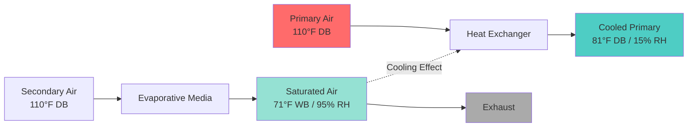
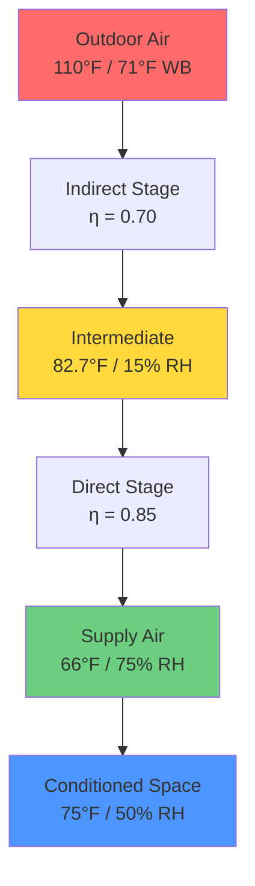
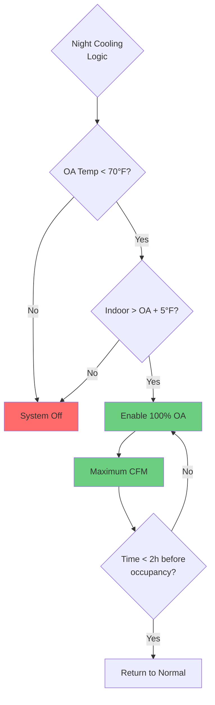

# Desert Climate HVAC Strategies

Desert and arid climate zones demand specialized HVAC approaches that exploit the inherent low-humidity advantage while mitigating extreme thermal loads and diurnal temperature variations. The fundamental strategy centers on minimizing mechanical refrigeration through passive and low-energy active cooling methods.

## Evaporative Cooling Fundamentals

Evaporative cooling represents the primary opportunity in desert climates, leveraging the psychrometric distance between dry-bulb and wet-bulb temperatures to achieve substantial sensible cooling with minimal energy input.

### Direct Evaporative Cooling Physics

Direct evaporative cooling (DEC) operates on the principle of adiabatic saturation, where water evaporation extracts latent heat from the air stream, reducing dry-bulb temperature while increasing humidity ratio.

**Energy Balance:**

$$Q_{evap} = \dot{m}_{air} \times (h_{in} - h_{out})$$

Where the enthalpy remains constant in an ideal adiabatic process, but dry-bulb temperature decreases according to:

$$T_{out} = T_{in} - \eta_{evap} \times (T_{db} - T_{wb})$$

**Key Parameters:**
- $\eta_{evap}$ = evaporative effectiveness (0.80-0.90 for rigid media)
- $(T_{db} - T_{wb})$ = wet-bulb depression
- $T_{wb}$ = thermodynamic wet-bulb temperature

**Performance Analysis Table:**

| Design Condition | Outdoor Air | WB Depression | Supply @ 85% eff | Energy Ratio vs DX |
|------------------|-------------|---------------|------------------|-------------------|
| Phoenix Peak | 110°F / 71°F WB | 39°F | 77°F | 0.15 |
| Las Vegas Peak | 108°F / 68°F WB | 40°F | 74°F | 0.14 |
| Riyadh Peak | 115°F / 75°F WB | 40°F | 81°F | 0.16 |
| Alice Springs Peak | 104°F / 66°F WB | 38°F | 72°F | 0.13 |

Direct evaporative cooling consumes approximately 85-90% less energy than vapor-compression refrigeration, with power requirements limited to fan energy and water circulation pumps.

**Limitations:**
- Supply air relative humidity: 85-95%
- Limited comfort conditioning capability
- Unsuitable for humidity-sensitive applications
- Requires continuous water supply and treatment

### Indirect Evaporative Cooling

Indirect evaporative cooling (IEC) separates the evaporative process from the primary air stream using a heat exchanger, enabling sensible cooling without humidity addition.

**Operating Principle:**

**Heat Transfer Calculation:**

The indirect stage effectiveness is defined as:

$$\eta_{IEC} = \frac{T_{primary,in} - T_{primary,out}}{T_{primary,in} - T_{wb,secondary}}$$

Typical values range from 0.55-0.75 depending on heat exchanger configuration and air velocities.

**Energy Transfer:**

$$Q_{IEC} = \dot{m}_{primary} \times c_p \times (T_{in} - T_{out})$$

For a 10,000 CFM system at Phoenix design conditions:
- Air mass flow: $\dot{m} = 10,000 \times 60 \times 0.0709 = 42,540$ lb/h
- Temperature reduction: $\Delta T = 110 - 81 = 29°F$
- Cooling capacity: $Q = 42,540 \times 0.24 \times 29 = 296,000$ Btu/h (24.7 tons)
- Power consumption: ~15 kW (fan + pumps) = 1.6 kW/ton

Compared to DX refrigeration at 1.0 kW/ton input, IEC achieves comparable cooling with 60% greater efficiency.

### Two-Stage Evaporative Systems

Two-stage (indirect-direct) evaporative cooling combines both technologies in series to maximize cooling potential while managing humidity addition.

**System Configuration:**

**Performance Calculation:**

Stage 1 (Indirect):
$$T_1 = T_{oa} - \eta_{IEC} \times (T_{oa} - T_{wb,oa})$$
$$T_1 = 110 - 0.70 \times (110 - 71) = 82.7°F$$

The intermediate condition has reduced dry-bulb but unchanged humidity ratio, creating new wet-bulb temperature of approximately 68°F.

Stage 2 (Direct):
$$T_2 = T_1 - \eta_{DEC} \times (T_1 - T_{wb,1})$$
$$T_2 = 82.7 - 0.85 \times (82.7 - 68) = 70.2°F$$

**Comparative Performance:**

| System Type | Supply Temp | Supply RH | Cooling Tons | Power Input | EER |
|-------------|-------------|-----------|--------------|-------------|-----|
| DX Only | 55°F | 50% | 30.0 | 30.0 kW | 12.0 |
| IEC Only | 82°F | 15% | 20.0 | 12.0 kW | 20.0 |
| DEC Only | 77°F | 90% | 24.0 | 4.5 kW | 64.0 |
| Two-Stage | 70°F | 75% | 28.5 | 16.5 kW | 20.7 |
| Hybrid IEC+DX | 55°F | 50% | 30.0 | 18.0 kW | 20.0 |

The two-stage configuration provides 95% of mechanical cooling capacity at 55% of the energy input, representing the optimal balance for critical comfort applications.

## Thermal Mass Utilization

Desert climates exhibit extreme diurnal temperature swings (30-40°F), enabling thermal mass to store nighttime cooling for daytime load reduction.

**Heat Storage Capacity:**

$$Q_{stored} = m \times c_p \times \Delta T$$

For concrete thermal mass:
- $c_p = 0.22$ Btu/lb·°F
- Typical building mass: 50-150 lb/ft² of floor area
- Temperature swing: 15-25°F during charge/discharge cycle

**Example Calculation:**

A 5,000 ft² building with 8" concrete floor (100 lb/ft²):
- Total mass: $m = 5,000 \times 100 = 500,000$ lb
- Night cooling: $\Delta T = 20°F$ (from 90°F to 70°F)
- Stored cooling: $Q = 500,000 \times 0.22 \times 20 = 2,200,000$ Btu

This thermal storage provides:
- Average cooling over 10-hour day: 220,000 Btu/h (18.3 tons)
- Peak shaving capability: 25-35% of design load
- Reduced mechanical system sizing: 15-20% capacity reduction

**Thermal Diffusivity and Penetration Depth:**

The effective depth of thermal mass participation depends on thermal diffusivity:

$$\alpha = \frac{k}{\rho \times c_p}$$

For concrete: $\alpha = 0.028$ ft²/h

Penetration depth for 24-hour cycle:

$$d = \sqrt{\frac{2\alpha \times t}{\pi}} = \sqrt{\frac{2 \times 0.028 \times 24}{\pi}} = 0.74 \text{ ft (8.9 inches)}$$

This confirms that standard 6-8" slabs fully participate in diurnal thermal storage cycles.

## Night Ventilation Cooling

Night ventilation purge leverages cool nighttime outdoor air to precool thermal mass and reduce the following day's cooling load.

**Control Strategy:**

**Cooling Delivery Rate:**

$$Q_{night} = \dot{V} \times \rho \times c_p \times (T_{indoor} - T_{outdoor})$$

For 10,000 CFM ventilation with outdoor at 65°F and indoor at 85°F:
$$Q = 10,000 \times 60 \times 0.075 \times 0.24 \times (85-65) = 216,000 \text{ Btu/h}$$

Over a 4-hour night purge cycle:
- Total cooling delivered: 864,000 Btu
- Equivalent thermal mass cooling: 393,000 lb of concrete by 10°F
- Next-day peak load reduction: 72,000 Btu/h average (6 tons)

**Optimal Operating Parameters:**

| Parameter | Recommended Value | ASHRAE Reference |
|-----------|-------------------|------------------|
| Activation temperature | 70°F outdoor | ASHRAE 90.1 |
| Minimum temperature differential | 5°F | Field optimization |
| Air change rate | 4-8 ACH | Thermal mass exposure |
| Duration | 2-6 hours | Building mass capacity |
| Latest end time | 2h before occupancy | Comfort recovery |

## Shading and Solar Control

Solar radiation contributes 40-50% of cooling load in desert climates, making solar control the highest-priority passive strategy.

**Solar Heat Gain Physics:**

Total solar heat gain through glazing:

$$Q_{solar} = A \times SHGC \times I_t \times SC$$

Where:
- $A$ = glazing area (ft²)
- $SHGC$ = Solar Heat Gain Coefficient (dimensionless)
- $I_t$ = total incident solar radiation (Btu/h·ft²)
- $SC$ = shading coefficient for external devices

**Example - West Facade Comparison:**

| Glazing Type | SHGC | U-factor | VLT | Heat Gain @ 250 Btu/h·ft² |
|--------------|------|----------|-----|---------------------------|
| Clear Single | 0.82 | 1.10 | 0.90 | 205 Btu/h·ft² |
| Clear Double | 0.70 | 0.50 | 0.78 | 175 Btu/h·ft² |
| Low-E Double | 0.40 | 0.29 | 0.70 | 100 Btu/h·ft² |
| Triple Low-E | 0.25 | 0.18 | 0.60 | 63 Btu/h·ft² |
| Low-E + Ext Shade | 0.08 | 0.29 | 0.21 | 20 Btu/h·ft² |

For 500 ft² of west-facing glazing, upgrading from clear double to low-E with external shading:
- Heat gain reduction: $(175-20) \times 500 = 77,500$ Btu/h (6.5 tons)
- Cooling load savings: 25-30% of typical building total
- Peak demand reduction: 6.5 kW at 1.0 kW/ton

**External Shading Effectiveness:**

External shading prevents solar radiation from reaching glazing, eliminating heat before transmission through glass.

$$SC_{ext} = \frac{Q_{shaded}}{Q_{unshaded}} = 0.10 - 0.20$$

Horizontal overhang sizing for south exposure:

$$\text{Overhang projection} = \frac{\text{Window height}}{\tan(\text{Solar altitude at design})}$$

For Phoenix at summer solstice (solar altitude 82°):
$$P = \frac{6 \text{ ft}}{\tan(82°)} = 0.85 \text{ ft}$$

However, this provides minimal west/east protection, requiring vertical fins or operable external blinds.

## Air-to-Air Heat Recovery

Air-to-air heat recovery extends economizer operation and reduces ventilation loads during peak conditions.

**Energy Wheel Effectiveness:**

Sensible effectiveness:

$$\eta_s = \frac{T_{supply,leaving} - T_{outdoor}}{T_{exhaust} - T_{outdoor}}$$

For desert applications, target sensible effectiveness of 0.70-0.80.

**Performance at Design Conditions:**

Outdoor: 110°F, Exhaust: 75°F, Effectiveness: 0.75

$$T_{supply} = 110 - 0.75 \times (110-75) = 83.75°F$$

For 5,000 CFM ventilation air:
- Temperature reduction: 26.25°F
- Cooling load reduction: $Q = 5,000 \times 60 \times 0.075 \times 0.24 \times 26.25 = 142,000$ Btu/h
- Capacity savings: 11.8 tons of mechanical cooling
- Annual energy savings: 35,000-50,000 kWh

**Comparison Table:**

| Heat Recovery Type | Sensible Eff | Latent Transfer | Pressure Drop | Desert Suitability |
|--------------------|--------------|-----------------|---------------|--------------------|
| Fixed Plate | 0.60-0.75 | No | 0.4-0.8 in.w.c. | Excellent |
| Energy Wheel | 0.70-0.85 | Yes (unwanted) | 0.3-0.6 in.w.c. | Good |
| Heat Pipe | 0.45-0.65 | No | 0.2-0.5 in.w.c. | Good |
| Run-Around Loop | 0.55-0.65 | No | 0.5-1.0 in.w.c. | Fair |

Fixed-plate heat exchangers provide optimal performance for desert climates, offering high sensible effectiveness without latent transfer (which would add unwanted humidity).

## Extended Economizer Operation

Desert climates enable economizer operation for 800-1,200+ hours annually due to significant diurnal temperature swings and extended shoulder seasons.

**Economizer Control Strategies:**

**Dry-Bulb Control:**
$$\text{If } T_{OA} < T_{economizer,setpoint} \text{ then enable 100% OA}$$

Typical setpoint: 65-70°F for cooling-dominated buildings

**Differential Enthalpy Control:**

Compare outdoor vs. return air enthalpy:

$$h = c_p \times T + W \times h_{fg}$$

Where:
- $W$ = humidity ratio (lb_water/lb_dry air)
- $h_{fg}$ = latent heat of vaporization (1,061 Btu/lb at 75°F)

For desert climates, enthalpy control provides minimal benefit over dry-bulb due to consistently low outdoor humidity ratios.

**Annual Operating Hours:**

| Climate Zone | Economizer Hours | Energy Savings | Payback Period |
|--------------|------------------|----------------|----------------|
| Phoenix, AZ | 1,100 h/yr | 45,000 kWh/yr | 2.5 years |
| Las Vegas, NV | 1,250 h/yr | 52,000 kWh/yr | 2.2 years |
| Albuquerque, NM | 1,400 h/yr | 58,000 kWh/yr | 2.0 years |
| Palm Springs, CA | 900 h/yr | 38,000 kWh/yr | 2.8 years |

**ASHRAE 90.1 Requirements:**

ASHRAE 90.1-2019 mandates economizers for:
- Climate Zones 2B through 8 (includes all desert regions)
- Cooling capacity ≥ 54,000 Btu/h (small packaged units exempted)
- Must include differential enthalpy or dry-bulb control

## Integrated Strategy Implementation

Optimal desert climate HVAC design combines multiple strategies in a coordinated system approach.

**Strategy Priority Matrix:**

```mermaid
graph TB
    A[Desert HVAC<br/>Strategy Hierarchy] --> B[1. Solar Control<br/>40-50% Load Reduction]
    A --> C[2. Evaporative Cooling<br/>60-85% Energy Reduction]
    A --> D[3. Thermal Mass<br/>20-30% Peak Shaving]
    A --> E[4. Night Ventilation<br/>15-25% Load Reduction]
    A --> F[5. Heat Recovery<br/>25-35% Ventilation Load]
    A --> G[6. Economizer<br/>1000+ Hours Free Cooling]

    B --> H{Building Type}
    C --> H
    D --> H
    E --> H
    F --> H
    G --> H

    H -->|Office| I[IEC + DX Hybrid<br/>Night Purge<br/>Energy Wheel]
    H -->|Warehouse| J[Two-Stage Evap<br/>High-Volume<br/>Minimum Enclosure]
    H -->|Residence| K[IEC or Mini-Split<br/>Thermal Mass<br/>Whole-House Fan]
    H -->|Critical Facility| L[DX Primary<br/>IEC Pre-cooling<br/>Backup Systems]

    style B fill:#e76f51
    style C fill:#2a9d8f
    style D fill:#e9c46a
    style E fill:#264653
    style F fill:#a8dadc
    style G fill:#457b9d
```

**Implementation Sequence:**

1. **Envelope optimization** - Establish minimum thermal loads through solar control, insulation, and air sealing
2. **Passive systems** - Incorporate thermal mass and natural ventilation where feasible
3. **Low-energy active** - Size evaporative cooling for maximum practical coverage
4. **Heat recovery** - Integrate air-to-air heat exchangers for ventilation load reduction
5. **Mechanical backup** - Provide DX capacity for peak conditions and latent control

This integrated approach achieves 50-70% energy reduction compared to conventional all-DX systems while maintaining comfort and reliability.

---

**References:**
- ASHRAE Handbook: HVAC Systems and Equipment, Chapter 41: Evaporative Cooling
- ASHRAE Standard 90.1-2019: Energy Standard for Buildings
- ASHRAE Handbook: Fundamentals, Chapter 18: Thermal Properties of Building Materials
- ASHRAE Standard 62.1-2019: Ventilation for Acceptable Indoor Air Quality
- ASHRAE Climatic Design Conditions: Climate Zones 2B, 3B, 4B
