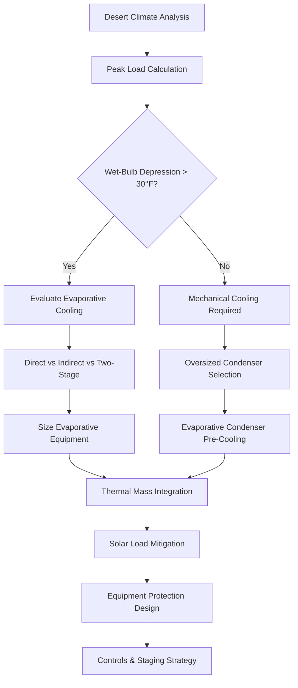

## Desert Climate Characteristics

Hot, dry desert climates present extreme thermal challenges characterized by high ambient temperatures exceeding 120°F (49°C), intense solar radiation approaching 1,050 W/m², extreme diurnal temperature swings of 40-50°F (22-28°C), and exceptionally low relative humidity below 20%. These conditions demand specialized HVAC engineering approaches fundamentally different from humid climate design.

The key thermal advantage in desert climates is the low moisture content, enabling highly effective evaporative cooling. The dry air allows for large sensible cooling capacity with minimal latent load, fundamentally shifting system selection priorities.

## Psychrometric Fundamentals

Desert climate HVAC design exploits the large wet-bulb depression—the difference between dry-bulb and wet-bulb temperatures. For design conditions of 115°F DB and 20% RH, the wet-bulb temperature approaches 77°F, creating a 38°F wet-bulb depression.

The theoretical evaporative cooling potential follows:

$$
Q_{evap} = \dot{m}_a \cdot (h_1 - h_2) = \dot{m}_a \cdot c_p \cdot (T_{db1} - T_{db2})
$$

Where saturation effectiveness for direct evaporative cooling reaches 80-95%, enabling supply air temperatures 3-8°F above wet-bulb temperature without mechanical refrigeration.

## Primary Cooling Strategies

### Direct Evaporative Cooling

Direct evaporative cooling (DEC) systems atomize water directly into the airstream, achieving adiabatic saturation. The cooling effectiveness is:

$$
\eta_{DEC} = \frac{T_{db,in} - T_{db,out}}{T_{db,in} - T_{wb,in}}
$$

For a system with 85% effectiveness at 115°F DB / 77°F WB:

$$
T_{db,out} = 115°F - 0.85 \times (115°F - 77°F) = 82.7°F
$$

This provides substantial cooling with water consumption of 3-5 gallons per ton-hour, far less than the energy cost of mechanical refrigeration.

### Indirect Evaporative Cooling

Indirect evaporative cooling (IEC) cools the supply air without adding moisture by passing it through a heat exchanger where a secondary airstream undergoes evaporative cooling. This maintains lower supply humidity while capturing 50-75% of the wet-bulb depression.

Two-stage systems combining IEC followed by DEC achieve supply temperatures 2-4°F above wet-bulb, with overall effectiveness:

$$
\eta_{total} = \eta_{IEC} + \eta_{DEC}(1 - \eta_{IEC})
$$

For ηIEC = 0.65 and ηDEC = 0.85:

$$
\eta_{total} = 0.65 + 0.85(1 - 0.65) = 0.948
$$

### Mechanical Cooling Optimization

When mechanical cooling is required, condenser operation faces severe challenges. Refrigeration capacity degrades according to:

$$
\dot{Q}_{evap} = \dot{m}_r \cdot (h_1 - h_4) \cdot \eta_{vol}
$$

At 120°F ambient, air-cooled condenser approach temperatures increase 10-15°F above design, reducing capacity by 15-25% and increasing power consumption by 20-30%.

## System Design Comparison

| System Type | Effectiveness | Power Use | Water Use | Application |
|-------------|---------------|-----------|-----------|-------------|
| Direct Evaporative | 80-95% WBD | 0.1-0.2 kW/ton | 3-5 gal/ton-hr | Industrial, warehouse |
| Indirect Evaporative | 50-75% WBD | 0.2-0.4 kW/ton | 2-4 gal/ton-hr | Commercial spaces |
| Two-Stage Evap | 90-100% WBD | 0.3-0.5 kW/ton | 4-6 gal/ton-hr | Precision applications |
| DX Mechanical | 100% capacity | 1.0-1.5 kW/ton | Minimal | Data centers, hospitals |
| Chilled Water | 100% capacity | 0.6-0.9 kW/ton | Cooling tower | Large commercial |

## Thermal Mass and Passive Strategies

Desert climates enable exceptional thermal mass utilization. Massive construction with high thermal diffusivity delays peak cooling loads by 6-10 hours. The thermal time constant:

$$
\tau = \frac{\rho \cdot c \cdot L^2}{\alpha}
$$

For 12-inch concrete (ρ = 140 lb/ft³, c = 0.23 Btu/lb·°F, α = 0.05 ft²/hr):

$$
\tau = \frac{140 \times 0.23 \times 1.0^2}{0.05} = 644 \text{ hours}
$$

This massive thermal inertia smooths internal temperature fluctuations and enables night-sky radiation cooling, where surfaces can reject 50-70 Btu/hr·ft² to the clear night sky when ambient temperatures drop to 65-75°F.

## Solar Load Management

Solar heat gain dominates cooling loads in desert climates. Horizontal surfaces receive peak irradiance of 320-350 Btu/hr·ft², while west-facing vertical surfaces experience 180-220 Btu/hr·ft² during afternoon hours.

The solar heat gain through glazing:

$$
q_{solar} = A \cdot SHGC \cdot I_t \cdot CLF
$$

Effective strategies include:
- High-performance glazing with SHGC < 0.25
- External shading devices blocking direct beam radiation
- Light-colored roof surfaces with solar reflectance > 0.70
- Radiant barriers in attic spaces reducing radiant transfer by 90-95%

## Equipment Protection Requirements

Desert conditions accelerate equipment degradation through sand infiltration, UV exposure, and thermal cycling. Critical protection measures:

**Air Filtration**: MERV 8-11 filters with pre-filters capture sand particles 3-10 microns. Filter pressure drop increases 50-100% faster than humid climates, requiring frequent replacement.

**Condenser Protection**: Evaporative pre-cooling of condenser air reduces entering temperature by 15-25°F, improving capacity and efficiency. Protective coatings on coil fins prevent corrosion from dust accumulation.

**Thermal Expansion**: Daily temperature swings of 40-50°F create significant thermal expansion. Piping requires expansion loops or flexible connectors every 80-100 feet:

$$
\Delta L = L \cdot \alpha \cdot \Delta T
$$

For 100-foot copper pipe (α = 9.8 × 10⁻⁶ in/in·°F) with 50°F swing:

$$
\Delta L = 100 \times 12 \times 9.8 \times 10^{-6} \times 50 = 0.59 \text{ inches}
$$

## Design Process Flow

## Controls and Operating Strategies

Desert HVAC systems benefit from adaptive control strategies responding to diurnal temperature patterns. Optimal approaches include:

**Pre-Cooling**: Operation during early morning hours (4-8 AM) when ambient temperatures reach 65-80°F stores cooling in building mass. The cooling capacity during this period is:

$$
q_{storage} = m \cdot c_p \cdot \Delta T = \rho \cdot V \cdot c_p \cdot (T_{initial} - T_{final})
$$

**Economizer Operation**: Desert climates enable economizer operation 60-75% of annual hours when outdoor air enthalpy falls below return air enthalpy, per ASHRAE 90.1 requirements.

**Staging Sequencing**: Multi-stage systems progress from evaporative to mechanical cooling as loads increase, minimizing energy consumption while meeting comfort requirements.

## Water Resource Considerations

Water scarcity in desert regions necessitates careful evaluation of evaporative cooling water consumption versus mechanical cooling energy consumption. The trade-off analysis:

**Evaporative Water Use**: 3-5 gallons per ton-hour of cooling
**Mechanical Energy**: 1.0-1.5 kW per ton requiring 0.5-0.8 gallons per kWh at typical power plants

Net water consumption for mechanical cooling including power generation often exceeds direct evaporative cooling consumption, though regional infrastructure determines optimal approach.

## ASHRAE Design Standards

ASHRAE Standard 90.1 prescribes desert climate design requirements including:
- Climate Zone 2B (hot-dry) prescriptive requirements
- Minimum equipment efficiency standards for high ambient conditions
- Economizer requirements for cooling systems > 54,000 Btu/h
- Fenestration SHGC limits of 0.25 for vertical glazing

ASHRAE Handbook—HVAC Applications Chapter 51 provides comprehensive guidance on evaporative cooling applications and performance expectations across desert climate zones.

## Conclusion

Desert climate HVAC design achieves optimal performance through strategic application of evaporative cooling principles, thermal mass utilization, aggressive solar load management, and robust equipment protection. The extreme dry conditions enable cooling approaches impossible in humid climates, with energy consumption 70-90% lower than mechanical refrigeration when properly applied. Success requires rigorous psychrometric analysis, careful system selection matching load characteristics, and comprehensive protection against environmental degradation.
