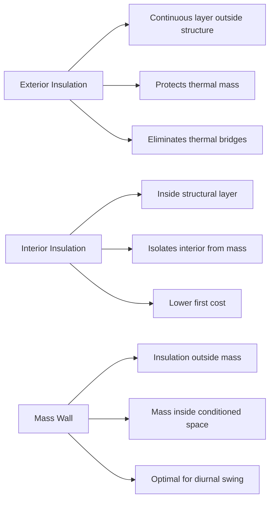

Building envelope design for hot, dry extreme desert climates requires a comprehensive understanding of heat transfer mechanisms, solar radiation management, and thermal storage principles. Properly designed envelopes can reduce cooling loads by 40-60% compared to conventional construction in these challenging environments.

## Climate Characteristics and Envelope Implications

Extreme desert climates (ASHRAE Climate Zone 2B and portions of 3B) exhibit high diurnal temperature swings (20-30°F), intense solar radiation (up to 350 Btu/h·ft²), low humidity (10-30% RH), and minimal cloud cover. These conditions create unique envelope design requirements:

- **High daytime heat gain** from solar radiation and elevated outdoor air temperatures (100-120°F)
- **Nighttime heat rejection potential** during cooler periods (60-80°F)
- **Minimal moisture management needs** due to low absolute humidity
- **Extended cooling seasons** requiring year-round heat gain mitigation

## Thermal Mass Applications

Thermal mass exploits the diurnal temperature swing to time-shift heat gains and reduce peak cooling loads. The effectiveness depends on heat capacity, thermal diffusivity, and surface area exposure.

The thermal penetration depth determines optimal wall thickness:

$$
\delta = \sqrt{\frac{\alpha \cdot t}{\pi}}
$$

where δ is penetration depth (ft), α is thermal diffusivity (ft²/h), and t is the period (24 hours for daily cycles).

For concrete with α = 0.025 ft²/h:

$$
\delta = \sqrt{\frac{0.025 \times 24}{\pi}} = 0.44 \text{ ft} \approx 5.3 \text{ inches}
$$

### Thermal Mass Configuration

| Material | Density (lb/ft³) | Specific Heat (Btu/lb·°F) | Heat Capacity (Btu/ft³·°F) | Optimal Thickness |
|----------|------------------|---------------------------|----------------------------|-------------------|
| Concrete | 150 | 0.20 | 30 | 4-6 inches |
| Adobe | 120 | 0.24 | 28.8 | 8-12 inches |
| Brick | 130 | 0.19 | 24.7 | 4-8 inches |
| Rammed Earth | 125 | 0.22 | 27.5 | 10-16 inches |

Thermal mass performs optimally when:
- Positioned on the interior side of insulation (mass wall configuration)
- Exposed to conditioned space for heat absorption/release
- Combined with nighttime ventilation strategies
- Protected from direct solar gain by external shading or high-reflectance surfaces

## Solar Reflectance and Emittance

Solar reflectance (SR) and thermal emittance (ε) determine roof and wall surface temperatures. The solar reflectance index (SRI) combines both properties:

$$
\text{SRI} = 123.97 - 141.35 \times \text{TS} + 9.655 \times \text{TS}^2
$$

where TS is the steady-state temperature rise above ambient, calculated from SR and ε.

### Cool Surface Performance

| Surface Type | Solar Reflectance | Thermal Emittance | SRI | Surface Temp Rise (°F) |
|--------------|-------------------|-------------------|-----|------------------------|
| White Elastomeric Coating | 0.85 | 0.90 | 110 | 5-8 |
| Cool Gray Coating | 0.60 | 0.85 | 75 | 15-20 |
| Standard Asphalt | 0.05 | 0.90 | 0 | 65-75 |
| Bare Concrete | 0.35 | 0.90 | 35 | 35-40 |
| Aluminum Coating | 0.70 | 0.25 | 50 | 25-30 |

ASHRAE Standard 90.1 requires minimum SRI values of 82 (low-slope roofs) and 39 (steep-slope roofs) for Climate Zones 1-3.

Heat flux reduction through high-reflectance surfaces:

$$
q = \frac{\alpha_s \cdot I \cdot A}{R_{total}}
$$

where α_s is solar absorptance (1 - SR), I is incident solar radiation (Btu/h·ft²), A is surface area (ft²), and R_total is total thermal resistance (h·ft²·°F/Btu).

## Insulation Placement and Configuration

Insulation location significantly affects envelope performance in desert climates. Three primary configurations exist:

### Insulation Configuration Performance

| Configuration | Cooling Load Impact | Thermal Bridge Control | Thermal Mass Utilization | Application |
|---------------|---------------------|------------------------|--------------------------|-------------|
| Mass Wall | -25% to -35% | Excellent | Maximum | High diurnal swing climates |
| Exterior Continuous | -20% to -30% | Excellent | Moderate | All desert applications |
| Cavity + Exterior | -15% to -25% | Good | Limited | Retrofit applications |
| Cavity Only | Baseline | Poor | Minimal | Not recommended |

The thermal resistance requirement for walls in Climate Zone 2B per ASHRAE 90.1 is R-13 (metal framing) or R-13 + R-7.5 ci (mass walls).

## Fenestration and Glazing Strategies

Windows represent the primary heat gain pathway in desert climates. The total solar heat gain through fenestration:

$$
q_{solar} = A \times SHGC \times I_{incident}
$$

where A is glazing area (ft²), SHGC is solar heat gain coefficient, and I_incident is incident solar radiation (Btu/h·ft²).

### High-Performance Glazing Options

| Glazing Type | U-Factor (Btu/h·ft²·°F) | SHGC | Visible Transmittance | LSG Ratio |
|--------------|-------------------------|------|----------------------|-----------|
| Single Clear | 1.04 | 0.76 | 0.81 | 1.07 |
| Double Clear | 0.48 | 0.62 | 0.70 | 1.13 |
| Double Low-E (low solar) | 0.29 | 0.23 | 0.41 | 1.78 |
| Triple Low-E (low solar) | 0.20 | 0.19 | 0.37 | 1.95 |
| Spectrally Selective | 0.32 | 0.27 | 0.60 | 2.22 |

The light-to-solar-gain (LSG) ratio indicates daylight efficiency. Spectrally selective glazing provides optimal performance for desert climates by transmitting visible light while rejecting near-infrared radiation.

ASHRAE 90.1 requires maximum SHGC of 0.25 and U-factor of 0.50 for Climate Zone 2B residential applications.

## Thermal Bridge Mitigation

Thermal bridges create localized heat gain pathways through the envelope. The effective R-value accounting for thermal bridging:

$$
R_{effective} = \frac{1}{\frac{FF}{R_{framing}} + \frac{(1-FF)}{R_{cavity}}}
$$

where FF is framing fraction (typically 0.15-0.25 for studs/joists).

For a wall with R-19 cavity insulation and R-5 framing at 20% framing fraction:

$$
R_{effective} = \frac{1}{\frac{0.20}{5} + \frac{0.80}{19}} = \frac{1}{0.040 + 0.042} = 12.2
$$

This represents a 36% reduction from the nominal R-19 cavity value.

Continuous insulation layers eliminate thermal bridging and provide:
- Uniform thermal resistance across the envelope
- Reduced condensation risk at structural elements
- Lower effective U-factors compared to cavity-only insulation
- Enhanced airtightness at penetrations

## Air Barrier Systems

Air infiltration in desert climates primarily drives sensible heat gain and particulate intrusion (dust). The sensible heat gain from infiltration:

$$
q_{infiltration} = 1.08 \times Q \times \Delta T
$$

where Q is airflow rate (CFM) and ΔT is indoor-outdoor temperature difference (°F).

ASHRAE Standard 90.1 requires building envelope air leakage not to exceed 0.40 CFM/ft² at 75 Pa for Climate Zones 1-3.

Air barrier strategies for desert climates:
- **Self-adhered membranes** on exterior sheathing (best for wind-driven rain resistance)
- **Fluid-applied barriers** for complex geometries and penetrations
- **Interior gypsum with sealed joints** for low-moisture environments
- **Sealed concrete masonry** with parging or coating

The air barrier must form a continuous plane with sealed transitions at foundation, roof, fenestration, and penetrations.

## Envelope Performance Integration

Optimal envelope design integrates multiple strategies to minimize cooling loads while maintaining occupant comfort. The combined effect of envelope improvements:

$$
q_{total} = q_{conduction} + q_{solar} + q_{infiltration} + q_{thermal\_bridge}
$$

Each component requires specific mitigation strategies:
- **Conduction**: Adequate insulation levels and proper placement
- **Solar gain**: High-reflectance surfaces and low-SHGC glazing
- **Infiltration**: Continuous air barrier with sealed penetrations
- **Thermal bridging**: Continuous insulation and advanced framing techniques

When properly designed, building envelopes in extreme desert climates can reduce annual cooling energy consumption by 50-65% compared to minimum code-compliant construction, while enabling smaller, more efficient HVAC equipment with lower first costs and operating expenses.
