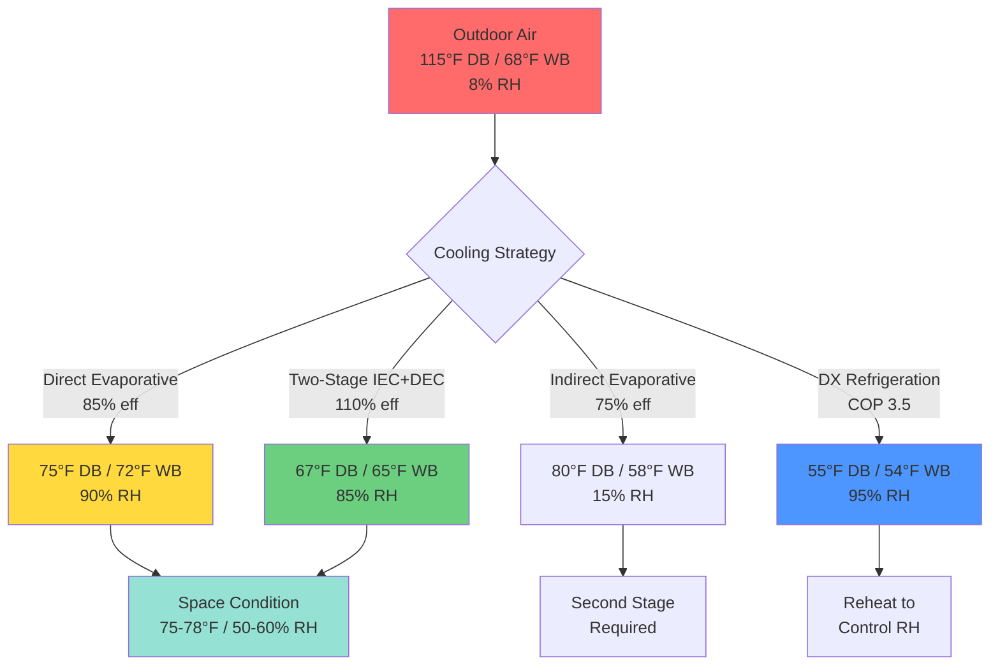
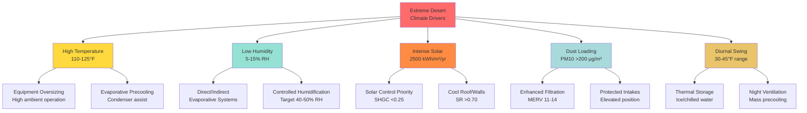

# Extreme Desert Climate HVAC Characteristics

Hot-dry extreme desert climates represent the upper boundary of terrestrial thermal conditions for occupied structures, imposing exceptional demands on HVAC systems through sustained high temperatures, extreme solar radiation, massive diurnal temperature swings, and minimal atmospheric moisture. These conditions create unique opportunities for energy-efficient cooling while simultaneously challenging equipment durability and conventional refrigeration system performance.

## Temperature Regime and Thermal Extremodynamics

Extreme desert regions experience the most severe high-temperature design conditions globally, with ambient temperatures regularly exceeding equipment operating limits and approaching human physiological tolerance thresholds.

### Design Temperature Distribution

Hot-dry extreme deserts encompass the most thermally demanding warm-climate environments:

| Climate Parameter | Extreme Desert Values | ASHRAE Climate Zone | Design Impact |
|------------------|---------------------|-------------------|--------------|
| Summer 0.4% DB | 115-125°F (46-52°C) | 1B, 2B | Peak cooling capacity |
| Summer 1.0% DB | 112-120°F (44-49°C) | 1B, 2B | Extended duration sizing |
| Mean Daily Range | 30-45°F (17-25°C) | All | Thermal storage opportunity |
| Winter 99.6% DB | 25-35°F (-4 to 2°C) | Most | Minimal heating load |
| Annual Mean DB | 75-85°F (24-29°C) | Variable | Equipment runtime hours |

ASHRAE Handbook Fundamentals Chapter 14 designates locations including Death Valley, CA (134°F record), Phoenix, AZ (122°F design), and regions of Saudi Arabia, Iran, and Australia as extreme hot-dry climates. The 0.4% design condition represents temperatures exceeded only 35 hours annually, establishing the baseline for cooling system capacity.

### Diurnal Temperature Swing Physics

Extreme desert diurnal ranges exceed those of any other inhabited climate type, driven by low atmospheric moisture content and minimal cloud cover. The rate of temperature change follows first-order heat balance:

$$
\frac{dT}{dt} = \frac{1}{mc_p}\left(Q_{solar} - Q_{radiation} - Q_{convection}\right)
$$

Where:
- $m$ = building thermal mass (lb or kg)
- $c_p$ = specific heat capacity (BTU/lb·°F or J/kg·K)
- $Q_{solar}$ = absorbed solar radiation (BTU/hr or W)
- $Q_{radiation}$ = long-wave radiative loss to sky (BTU/hr or W)
- $Q_{convection}$ = convective heat transfer (BTU/hr or W)

**Example: Typical Desert Diurnal Cycle**

Phoenix, AZ summer design day:
- 4:00 AM minimum: 78°F
- 2:00 PM maximum: 115°F
- Diurnal range: 37°F
- Peak-to-peak time: 10 hours
- Cooling rate: 4.5°F/hour (evening)
- Heating rate: 3.4°F/hour (morning)

This rapid temperature swing enables thermal energy storage strategies, shifting cooling load from peak afternoon hours to efficient nighttime operation.

### Heat Load Duration Analysis

Unlike humid climates where peak conditions persist for extended periods, extreme desert peaks occur during concentrated afternoon hours (1:00-5:00 PM), with substantial load reduction during evening and night periods.

**Cooling Degree Hour Distribution (Base 75°F):**
- Peak day total: 700-900 CDH
- Peak hours (2:00-4:00 PM): 40-50 CDH/hour
- Evening hours (6:00-10:00 PM): 10-25 CDH/hour
- Night hours (10:00 PM-6:00 AM): 0-10 CDH/hour

This load profile enables undersized mechanical cooling supplemented by thermal storage or nighttime precooling, reducing installed equipment capacity by 30-40%.

## Psychrometric Properties and Moisture Transport

Extreme desert psychrometrics define the lower boundary of atmospheric moisture content for inhabited regions, creating exceptional wet-bulb depression and near-zero latent cooling loads.

### Absolute Humidity and Dewpoint

Atmospheric moisture content in extreme deserts remains at global minimums, with dewpoint temperatures consistently 50-80°F below dry-bulb values:

| Outdoor Condition | Dry Bulb | Wet Bulb | Dewpoint | RH | Humidity Ratio |
|------------------|----------|----------|----------|-----|----------------|
| Design peak | 115°F | 68°F | 38°F | 8% | 0.0054 lb/lb |
| Typical summer | 108°F | 70°F | 42°F | 12% | 0.0064 lb/lb |
| Monsoon period | 100°F | 75°F | 55°F | 25% | 0.0098 lb/lb |
| Winter design | 68°F | 48°F | 28°F | 22% | 0.0038 lb/lb |

For comparison, Miami design conditions (95°F DB / 78°F WB) contain humidity ratio of 0.0162 lb/lb—2.5 times the moisture content of extreme desert air.

### Wet-Bulb Depression Mechanics

The difference between dry-bulb and wet-bulb temperatures represents the theoretical limit for evaporative cooling effectiveness:

$$
\Delta T_{wb} = T_{db} - T_{wb} = \frac{\omega_{sat}(T_{wb}) - \omega}{\omega_{sat}(T_{wb}) - \omega_{sat}(T_{db})} \times (T_{db} - T_{sat})
$$

Extreme desert conditions produce wet-bulb depressions of 40-50°F, enabling direct evaporative coolers to achieve supply air temperatures approaching or below space temperature without mechanical refrigeration.

**Evaporative Cooling Potential Calculation:**

For direct evaporative cooler at 85% effectiveness:
- Outdoor: 115°F DB / 68°F WB
- Wet-bulb depression: 47°F
- Achievable cooling: 0.85 × 47°F = 40°F
- Supply air temperature: 115°F - 40°F = 75°F
- Space temperature achieved without compressor

This represents a theoretical coefficient of performance (COP) of 15-20 compared to COP 3-4 for vapor-compression systems.

### Sensible Heat Ratio

The proportion of total cooling load represented by sensible (temperature) versus latent (moisture) components reaches maximum values in extreme deserts:

$$
\text{SHR} = \frac{Q_{sensible}}{Q_{sensible} + Q_{latent}}
$$

**Typical Load Distribution:**
- Sensible cooling load: 96-98% of total
- Latent cooling load: 2-4% of total
- SHR: 0.96-0.98

This high SHR eliminates the need for dehumidification equipment and allows evaporative systems to control space humidity through controlled moisture addition, targeting 40-50% RH in occupied spaces.

## Solar Radiation Intensity and Heat Gain

Extreme desert locations receive among the highest solar irradiance globally, with minimal atmospheric attenuation and near-continuous clear-sky conditions during cooling season.

### Solar Irradiance Magnitude

Peak solar radiation reaches theoretical maximum values for given latitude:

**Design Day Solar Radiation (July):**
- Global horizontal irradiance: 900-1100 W/m² (285-350 BTU/hr·ft²)
- Direct normal irradiance: 950-1050 W/m² (300-333 BTU/hr·ft²)
- Clear-sky frequency: 85-95% of daylight hours
- Annual horizontal total: 2400-2700 kWh/m²/year

ASHRAE clear-sky model calculates direct beam irradiance:

$$
E_b = A \cdot e^{-B/\sin(\beta)}
$$

Where:
- $A$ = apparent extraterrestrial irradiance at air mass = 0
- $B$ = atmospheric extinction coefficient (0.15-0.20 for clear desert)
- $\beta$ = solar altitude angle

For extreme desert summer solstice at solar noon (latitude 35°N):
- Solar altitude: β = 78.5°
- Direct beam: $E_b = 1050 \times e^{-0.17/\sin(78.5°)} = 910$ W/m²

### Solar Heat Gain Through Building Envelope

Solar radiation dominates cooling load in extreme desert structures, representing 45-60% of total heat gain:

**Opaque Surface Heat Gain:**

Sol-air temperature accounts for combined solar absorption and radiative exchange:

$$
T_{sol-air} = T_{outdoor} + \frac{\alpha \cdot I_{total}}{h_o} - \frac{\epsilon \cdot \Delta R}{h_o}
$$

Where:
- $\alpha$ = solar absorptance (0.05-0.95 depending on surface color)
- $I_{total}$ = total incident solar radiation (BTU/hr·ft²)
- $h_o$ = outdoor combined film coefficient (3.0 BTU/hr·ft²·°F)
- $\epsilon$ = long-wave emittance (0.85-0.95 for most surfaces)
- $\Delta R$ = difference between long-wave radiation and air temperature (typically 7°F at night, 0°F midday)

**Example: Dark Roof Surface**
- Ambient temperature: 115°F
- Horizontal solar radiation: 300 BTU/hr·ft²
- Surface absorptance: 0.90 (dark membrane)
- Sol-air temperature: $T_{sa} = 115 + \frac{0.90 \times 300}{3.0} = 205°F$
- Surface temperature: 195-205°F measured

**Cool Roof Performance:**
- Ambient temperature: 115°F
- Horizontal solar radiation: 300 BTU/hr·ft²
- Surface absorptance: 0.25 (cool coating, SR = 0.75)
- Sol-air temperature: $T_{sa} = 115 + \frac{0.25 \times 300}{3.0} = 140°F$
- Temperature reduction: 65°F
- Heat flux reduction (R-30 roof): $\Delta q = \frac{65}{30} = 2.17$ BTU/hr·ft²

For 5,000 ft² roof: savings = 10,850 BTU/hr (0.90 tons continuous)

### Fenestration Solar Heat Gain

Window heat gain represents the single largest individual load component in extreme desert buildings:

$$
Q_{window} = A \times \text{SHGC} \times \text{SHGF}
$$

Where:
- $A$ = window area (ft²)
- SHGC = solar heat gain coefficient (dimensionless, 0.20-0.85)
- SHGF = solar heat gain factor from ASHRAE tables (BTU/hr·ft²)

**West-Facing Glazing at 3:00 PM (worst case):**
- Direct solar radiation: 240 BTU/hr·ft²
- Diffuse solar radiation: 35 BTU/hr·ft²
- Total SHGF: 275 BTU/hr·ft²

**Performance by Glazing Type:**

| Glazing System | SHGC | Heat Gain (100 ft²) | Annual Cooling (kWh) |
|----------------|------|---------------------|---------------------|
| Single clear | 0.86 | 23,650 BTU/hr | 14,200 |
| Double clear | 0.70 | 19,250 BTU/hr | 11,550 |
| Double low-e | 0.40 | 11,000 BTU/hr | 6,600 |
| Triple low-e + tint | 0.23 | 6,325 BTU/hr | 3,800 |
| External shade + low-e | 0.12 | 3,300 BTU/hr | 1,980 |

Optimal extreme desert glazing: SHGC ≤ 0.25, U-factor ≤ 0.30, visible transmittance ≥ 0.40

## Atmospheric Particulate Loading

Extreme desert atmospheres carry elevated concentrations of mineral dust, sand, and fine particulate matter, accelerating equipment degradation and requiring enhanced filtration strategies.

### Particulate Matter Characteristics

Desert dust composition and size distribution affect HVAC system design:

**Typical Desert Particulate Distribution:**
- PM10 (particles ≤10 μm): 100-400 μg/m³ (moderate) to >800 μg/m³ (dust events)
- PM2.5 (particles ≤2.5 μm): 40-150 μg/m³ (moderate) to >350 μg/m³ (dust events)
- Composition: Silica (30-50%), clay minerals (20-30%), carbonates (10-20%), salts (5-10%)
- Hardness: 6-7 Mohs (quartz), highly abrasive

For comparison, EPA air quality standards target PM2.5 < 35 μg/m³ (24-hour average). Desert baseline conditions exceed this by 2-4×, with dust storm events reaching 10-15× exceedance.

### Filtration Requirements and Pressure Drop

Enhanced filtration protects indoor air quality and equipment longevity but increases fan energy:

**Filter Performance Characteristics:**

| Filter Rating | Efficiency (0.3-1.0 μm) | Initial Δp (500 FPM) | Loaded Δp | Dust Holding | Replacement Interval |
|--------------|------------------------|---------------------|----------|--------------|---------------------|
| MERV 8 | 20-40% | 0.25 in. w.c. | 0.50 in. w.c. | 280 g | 1-2 months |
| MERV 11 | 65-80% | 0.40 in. w.c. | 0.80 in. w.c. | 380 g | 2-3 months |
| MERV 13 | 85-95% | 0.55 in. w.c. | 1.10 in. w.c. | 450 g | 3-4 months |
| MERV 16 | >95% | 0.80 in. w.c. | 1.60 in. w.c. | 500 g | 4-6 months |

Recommended strategy: MERV 8-11 pre-filter (frequent replacement) + MERV 13-14 final filter (extended service life).

Fan power penalty for enhanced filtration:

$$
P_{fan} = \frac{Q \times \Delta P}{6356 \times \eta_{fan}}
$$

Where $Q$ = airflow (CFM), $\Delta P$ = pressure drop (in. w.c.), $\eta_{fan}$ = fan efficiency (0.55-0.75).

For 10,000 CFM system:
- MERV 8: P = 0.82 HP
- MERV 13: P = 1.80 HP
- Additional energy: 0.98 HP × 0.746 kW/HP × 5,000 hr/yr = 3,655 kWh/yr

### Equipment Contamination Impact

Particulate accumulation on heat transfer surfaces degrades performance:

**Condenser Coil Fouling:**
- Clean coil heat transfer: U = 25-30 BTU/hr·ft²·°F
- Dust-fouled coil (0.020" layer): U = 18-22 BTU/hr·ft²·°F
- Performance degradation: 20-30% capacity loss, 15-25% efficiency loss
- Cleaning frequency: Monthly during dust season

**Evaporative Media Fouling:**
- Clean media pressure drop: 0.15-0.25 in. w.c.
- Mineral-fouled media: 0.40-0.80 in. w.c.
- Effectiveness loss: 10-20% after 2-3 seasons
- Water treatment critical: TDS < 500 ppm, blowdown cycles 3-5

## Convective and Radiative Heat Transfer

Extreme desert conditions amplify both convective and radiative heat transfer mechanisms through large temperature differentials and atmospheric transparency.

### Outdoor Convection Coefficients

Combined convective and radiative heat transfer at outdoor surfaces:

$$
h_{combined} = h_{convection} + h_{radiation}
$$

**Convective Component:**

$$
h_c = a + b \cdot V_{wind}
$$

Typical coefficients for external surfaces:
- Low wind (<5 mph): $h_c$ = 3-5 BTU/hr·ft²·°F
- Moderate wind (5-15 mph): $h_c$ = 5-8 BTU/hr·ft²·°F
- High wind (>15 mph): $h_c$ = 8-12 BTU/hr·ft²·°F

**Radiative Component:**

Long-wave radiation to sky and surroundings:

$$
h_r = \epsilon \cdot \sigma \cdot (T_{surface}^2 + T_{sky}^2)(T_{surface} + T_{sky})
$$

For typical surface at 150°F radiating to 70°F effective sky temperature:
- $h_r$ ≈ 1.5 BTU/hr·ft²·°F (daytime)
- $h_r$ ≈ 2.0 BTU/hr·ft²·°F (nighttime, clear sky)

### Nighttime Radiative Cooling

Clear desert skies enable effective radiative cooling to deep space:

**Effective Sky Temperature:**

$$
T_{sky} = T_{air} \times \epsilon_{sky}^{0.25}
$$

Where sky emissivity for clear dry conditions: $\epsilon_{sky}$ = 0.7-0.8

Example calculation:
- Air temperature: 75°F (535°R)
- Sky emissivity: 0.75
- Effective sky temperature: $535 \times 0.75^{0.25} = 490°R$ = 30°F

Radiative cooling potential from horizontal surface:

$$
q_{rad} = \epsilon_{surface} \cdot \sigma \cdot A \cdot (T_{surface}^4 - T_{sky}^4)
$$

For roof at 85°F (545°R) to sky at 30°F (490°R):
- $q_{rad} = 0.90 \times 0.1714 \times (5.45^4 - 4.90^4) = 65$ BTU/hr·ft²

This enables passive cooling strategies and enhances air-cooled condenser performance during nighttime operation.

## Altitude and Atmospheric Pressure Effects

Many extreme desert regions exist at moderate elevations (1,000-5,000 feet), reducing atmospheric density and affecting equipment performance.

### Air Density Correction

Barometric pressure decreases with elevation following:

$$
P = P_0 \cdot e^{-\frac{g \cdot h}{R \cdot T}}
$$

**Elevation Impact on Air Properties:**

| Elevation | Pressure | Density | Correction Factor | Capacity Multiplier |
|----------|---------|---------|------------------|-------------------|
| Sea level | 14.7 psia | 0.075 lb/ft³ | 1.00 | 1.00 |
| 2,500 ft | 13.5 psia | 0.069 lb/ft³ | 0.92 | 0.95 |
| 5,000 ft | 12.2 psia | 0.062 lb/ft³ | 0.83 | 0.90 |
| 7,000 ft | 11.3 psia | 0.058 lb/ft³ | 0.77 | 0.87 |

**Equipment Performance Adjustments:**
- Evaporative cooler capacity: Reduce 2-3% per 1,000 ft elevation
- Fan motor loading: Increase 8-10% per 1,000 ft for constant volumetric flow
- Air-cooled condenser capacity: Reduce 4-5% per 1,000 ft elevation
- Combustion equipment: Derate 4% per 1,000 ft, excess air adjustment required

## HVAC System Design Implications

The unique combination of extreme temperature, low humidity, intense solar radiation, and particulate loading creates specific design priorities:

**Critical Design Parameters:**

1. **Cooling capacity sizing:** 1.0% design conditions (less extreme than 0.4% to avoid oversizing), 10-15% safety factor maximum

2. **Solar heat gain mitigation:** Envelope solar control represents highest ROI measure
   - Window SHGC ≤ 0.25 all orientations
   - Cool roof SR ≥ 0.70, thermal emittance ≥ 0.85
   - External shading devices (horizontal projection ≥ 0.5 × window height)

3. **Evaporative cooling integration:** Two-stage systems achieve 60-80% energy savings versus DX-only
   - Indirect stage: 70-80% wet-bulb effectiveness
   - Direct stage: 85-95% wet-bulb effectiveness
   - Combined system COP: 12-18 at design conditions

4. **Equipment protection:** Desert-rated components extend service life 40-60%
   - Coil coatings: Phenolic, e-coat, or heresite
   - Condenser coil fin spacing: ≥12 FPI for cleanability
   - Sealed enclosures: NEMA 3R minimum for outdoor equipment

5. **Thermal storage economics:** Peak demand charges justify storage in most extreme desert utilities
   - Ice storage: 0.092 ton-hr/gal at 90% charge efficiency
   - Chilled water: 1.0-1.5°F/hr discharge rate typical
   - Payback: 3-7 years depending on utility rate structure

**Typical Load Magnitude (10,000 ft² Office Building):**
- Roof solar + conduction: 150,000 BTU/hr (45%)
- Wall solar + conduction: 85,000 BTU/hr (25%)
- Window solar + conduction: 68,000 BTU/hr (20%)
- Internal gains: 22,500 BTU/hr (7%)
- Ventilation sensible: 8,500 BTU/hr (2.5%)
- Ventilation latent: 1,500 BTU/hr (0.5%)
- **Total cooling load: 335,500 BTU/hr (28 tons)** = 33.6 BTU/hr·ft²

With two-stage evaporative + DX hybrid system:
- Evaporative handles 60-70% of load (200,000 BTU/hr)
- DX handles remaining 30-40% (135,000 BTU/hr = 11 tons)
- Installed DX capacity reduced 60% compared to DX-only system

## Conclusion

Hot-dry extreme desert climates define the upper thermal boundary for conventional HVAC system operation, characterized by sustained ambient temperatures of 115-125°F, intense solar radiation totaling 2,400-2,700 kWh/m²/year, wet-bulb depressions of 40-50°F, and diurnal temperature swings of 30-45°F. These conditions create cooling loads dominated by solar heat gain (65-75% of total) with minimal latent component (SHR > 0.96), enabling highly efficient evaporative cooling systems achieving COP values of 12-18. Atmospheric particulate loading of 100-400 μg/m³ PM10 requires enhanced filtration (MERV 11-14) and monthly condenser coil maintenance. The massive diurnal temperature swing enables thermal storage and nighttime precooling strategies, reducing installed mechanical cooling capacity by 30-40%. Equipment must operate reliably at 115°F+ ambient while managing accelerated thermal degradation, UV exposure, and dust accumulation. Understanding these fundamental characteristics—extreme temperature magnitude and duration, psychrometric properties enabling evaporative technologies, solar radiation dominance, particulate contamination patterns, and diurnal opportunities—provides the engineering foundation for designing HVAC systems that efficiently maintain occupant comfort while achieving 40-70% energy savings compared to conventional vapor-compression systems in the world's most thermally demanding inhabited environments.
