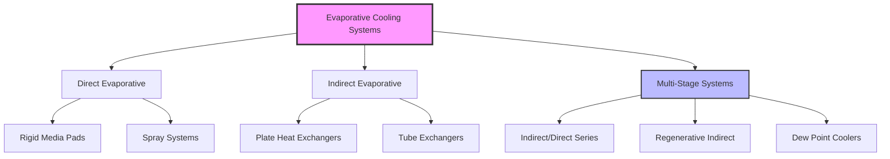
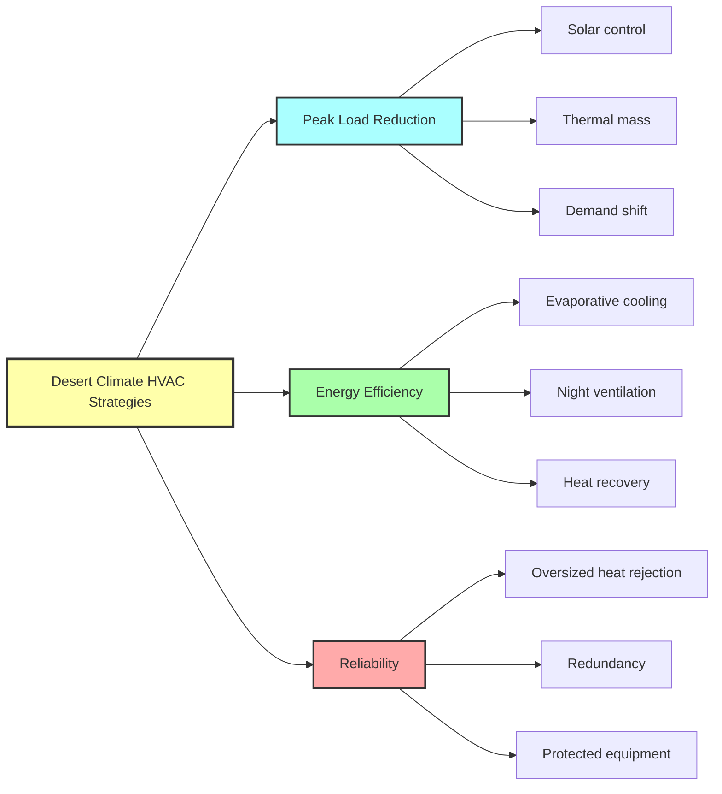

## Climate Characteristics

Hot-dry extreme desert climates present unique HVAC design challenges characterized by high daytime temperatures, low humidity, intense solar radiation, and significant diurnal temperature swings. These regions, classified as BWh (hot desert) in the Köppen-Geiger system, include locations such as Phoenix, Arizona; Dubai, UAE; and Riyadh, Saudi Arabia.

### Key Psychrometric Parameters

Typical summer design conditions for extreme desert climates:

| Parameter | Range | Impact on HVAC Design |
|-----------|-------|----------------------|
| Dry bulb temperature | 40-50°C (104-122°F) | Extreme cooling loads |
| Wet bulb temperature | 18-24°C (64-75°F) | High evaporative cooling potential |
| Relative humidity | 5-20% | Minimal latent load |
| Diurnal temperature swing | 15-25°C (27-45°F) | Night cooling opportunities |
| Solar radiation | 800-1000 W/m² | Dominant load component |

The large wet bulb depression (dry bulb minus wet bulb) creates exceptional conditions for evaporative cooling technologies.

## Solar Load Mitigation Strategies

Solar radiation dominates the cooling load in desert climates, often accounting for 40-60% of total heat gain. Effective solar control reduces both peak demand and energy consumption.

### Solar Heat Gain Through Envelope

The heat gain through glazing is calculated as:

$$Q_{solar} = A \times SHGC \times I_{solar} \times CLF$$

Where:
- $Q_{solar}$ = solar heat gain (W)
- $A$ = window area (m²)
- $SHGC$ = solar heat gain coefficient (dimensionless)
- $I_{solar}$ = incident solar radiation (W/m²)
- $CLF$ = cooling load factor accounting for thermal mass

### Recommended Solar Control Measures

**Glazing specifications for desert climates:**

- Maximum SHGC: 0.25 for east/west orientations, 0.30 for north/south
- Minimum visible light transmittance: 0.40 to maintain daylighting
- Low-e coatings with emissivity < 0.10 on surface #3
- Exterior shading devices with projection factor > 0.6 for west facades

**Roof and wall strategies:**

- Cool roof coatings with solar reflectance > 0.70 and thermal emittance > 0.85
- Light-colored exterior finishes (albedo > 0.60)
- Ventilated roof cavities to reject heat before conduction
- Minimum insulation: R-30 (RSI-5.3) roofs, R-19 (RSI-3.3) walls per ASHRAE 90.1 Climate Zone 1

## Evaporative Cooling Applications

The thermodynamic advantage of evaporative cooling in desert climates derives from the psychrometric relationship between sensible and latent heat exchange.

### Direct Evaporative Cooling Process

The adiabatic saturation process follows the wet bulb line on the psychrometric chart:

$$T_{out} = T_{in} - \eta_{EC} \times (T_{db} - T_{wb})$$

Where:
- $T_{out}$ = supply air temperature (°C)
- $T_{in}$ = entering air dry bulb temperature (°C)
- $\eta_{EC}$ = evaporative cooler effectiveness (0.70-0.90)
- $T_{db}$ = dry bulb temperature (°C)
- $T_{wb}$ = wet bulb temperature (°C)

**Example calculation:**
For outdoor conditions of 45°C DB / 20°C WB with 85% effectiveness:

$$T_{out} = 45 - 0.85 \times (45 - 20) = 23.75°C$$

This demonstrates the potential to achieve comfortable supply temperatures through evaporative cooling alone.

### Evaporative Cooling System Types

**Performance comparison:**

| System Type | Effectiveness Range | Humidity Addition | Capital Cost Factor |
|-------------|-------------------|------------------|-------------------|
| Direct evaporative | 70-90% | High | 1.0x |
| Indirect evaporative | 50-75% | None to space | 1.8-2.5x |
| Indirect/direct staged | 100-120% | Moderate | 2.2-3.0x |
| Dew point coolers | 100-130% | Low | 2.5-3.5x |

Staged systems can achieve supply temperatures below the entering wet bulb through multiple heat exchange stages.

## Thermal Mass Utilization

The large diurnal temperature swing in desert climates enables thermal mass strategies to shift and reduce peak cooling loads.

### Heat Storage in Building Mass

The thermal storage capacity of building mass:

$$Q_{stored} = m \times c_p \times \Delta T = \rho \times V \times c_p \times \Delta T$$

Where:
- $Q_{stored}$ = stored thermal energy (J)
- $m$ = mass of material (kg)
- $c_p$ = specific heat capacity (J/kg·K)
- $\Delta T$ = temperature swing (K)
- $\rho$ = density (kg/m³)
- $V$ = volume (m³)

**Effective thermal mass materials:**

- Concrete: $\rho$ = 2400 kg/m³, $c_p$ = 880 J/kg·K
- Adobe/rammed earth: $\rho$ = 1800 kg/m³, $c_p$ = 840 J/kg·K
- Masonry: $\rho$ = 1920 kg/m³, $c_p$ = 920 J/kg·K

### Night Ventilation Cooling

Night sky radiation and convective cooling can discharge thermal mass accumulated during the day. The cooling potential is expressed as:

$$Q_{night} = \dot{m}_{air} \times c_{p,air} \times (T_{indoor} - T_{outdoor}) \times t$$

Effective night cooling requires:
- Minimum airflow rate: 10-15 air changes per hour
- Outdoor temperature below 25°C (77°F)
- Duration: 6-8 hours minimum
- Exposed thermal mass surface area > 2× floor area

## Equipment Selection Considerations

Desert operating conditions significantly impact HVAC equipment performance and longevity.

### Condensing Temperature Effects

Air-cooled refrigeration equipment operates at elevated condensing temperatures when ambient exceeds design conditions. The Carnot COP relationship:

$$COP_{Carnot} = \frac{T_{evap}}{T_{cond} - T_{evap}}$$

A 10°C increase in condensing temperature typically reduces actual system COP by 15-20% and capacity by 8-12%.

**Equipment specifications for desert operation:**

| Component | Standard Rating | Desert Rating Requirement |
|-----------|----------------|--------------------------|
| Air-cooled condensers | 35°C (95°F) | 46-52°C (115-125°F) |
| Evaporative condensers | 35°C WB | 27°C WB minimum |
| Cooling towers | 27°C WB | 24°C WB or lower |
| Supply fan motors | 40°C ambient | 50-55°C ambient |

### Filtration Requirements

Desert dust infiltration demands enhanced filtration:

- Pre-filters: MERV 8 minimum to protect coils
- Final filters: MERV 13-14 for occupied spaces
- Filter change frequency: 2-4× more frequent than temperate climates
- Outdoor air intake location: minimum 3 m above grade, away from dust sources

## System Architecture Recommendations

**Optimal system types by building size:**

**Small buildings (<2,000 m²):**
- Direct/indirect evaporative cooling with minimal mechanical backup
- Packaged rooftop units with evaporative pre-cooling
- Desert-rated residential equipment

**Medium buildings (2,000-10,000 m²):**
- Chilled water systems with evaporative-cooled chillers
- Dedicated outdoor air systems with indirect evaporative cooling
- Thermal energy storage for peak shaving

**Large buildings (>10,000 m²):**
- Central chilled water plants with hybrid cooling towers
- Variable refrigerant flow systems for perimeter zones
- District cooling where available

## Water Conservation Balance

While evaporative cooling provides exceptional efficiency in desert climates, water consumption requires careful analysis. The water use per ton-hour of cooling:

- Direct evaporative cooling: 15-25 L/ton·h
- Evaporative condensers: 8-12 L/ton·h
- Cooling towers: 10-18 L/ton·h
- Air-cooled equipment: 0 L/ton·h

The decision between evaporative and air-cooled technologies must weigh energy consumption against water availability and cost. In many desert regions, the electrical energy savings justify water consumption, particularly where treated wastewater or brackish water can supply cooling systems.

## References

ASHRAE Handbook—Fundamentals, Chapter 14: Climatic Design Information
ASHRAE Standard 90.1: Energy Standard for Buildings Except Low-Rise Residential Buildings
ASHRAE Standard 169: Climatic Data for Building Design Standards
