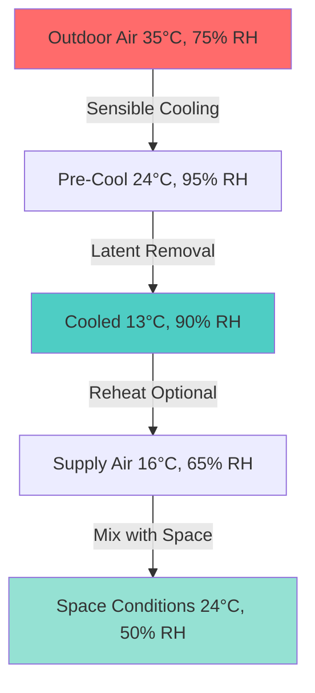
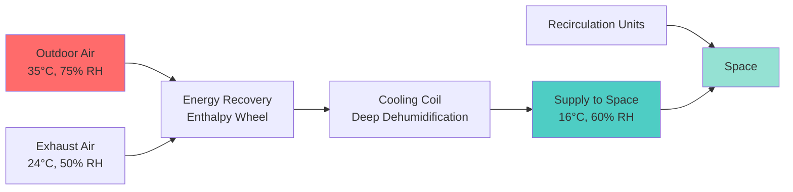

## Climate Characteristics and Design Implications

Humid subtropical climates (Köppen classification Cfa/Cwa, ASHRAE Climate Zones 2A and 3A) present unique HVAC challenges characterized by high ambient temperature combined with elevated moisture levels. These regions experience summer design conditions typically ranging from 32-38°C dry-bulb with coincident wet-bulb temperatures of 24-28°C, resulting in relative humidity often exceeding 70%.

The fundamental challenge stems from the dominance of latent cooling loads over sensible loads. The sensible heat ratio (SHR) in these climates frequently falls below 0.70, requiring HVAC systems specifically designed for moisture removal rather than temperature reduction alone.

$$\text{SHR} = \frac{Q_s}{Q_s + Q_l} = \frac{\text{Sensible Load}}{\text{Total Load}}$$

Where:
- $Q_s$ = sensible cooling load (kW)
- $Q_l$ = latent cooling load (kW)

## Psychrometric Analysis

Understanding the psychrometric relationships in humid subtropical conditions is critical for proper system design. The enthalpy difference between outdoor and desired indoor conditions drives the total cooling requirement:

$$\Delta h = c_p \Delta T + h_{fg} \Delta W$$

Where:
- $c_p$ = specific heat of air (1.006 kJ/kg·K)
- $\Delta T$ = temperature difference (K)
- $h_{fg}$ = latent heat of vaporization (2501 kJ/kg at 0°C)
- $\Delta W$ = humidity ratio difference (kg moisture/kg dry air)

## Dehumidification Strategies

### Direct Expansion Systems

Conventional DX systems in humid subtropical climates require careful refrigerant circuit design to achieve sufficient dehumidification. The apparatus dew point (ADP) must be maintained below the desired space dew point to ensure adequate moisture removal.

| System Configuration | ADP Range (°C) | Typical SHR | Application |
|---------------------|----------------|-------------|-------------|
| Standard DX Coil | 10-13 | 0.70-0.75 | Light commercial |
| Enhanced Dehumidification | 7-10 | 0.60-0.70 | High latent loads |
| Dedicated Dehumidification | 4-7 | 0.40-0.60 | Critical moisture control |
| Desiccant-Assisted | Variable | 0.30-0.50 | Museums, archives |

### Subcooling and Reheat

When the sensible heat ratio falls below the equipment capability, subcooling followed by reheat becomes necessary. The supply air temperature from the cooling coil must be sufficiently low to remove moisture, then reheated to prevent overcooling the space:

$$Q_{reheat} = \dot{m} \cdot c_p \cdot (T_{supply} - T_{coil})$$

This approach, while effective for humidity control, introduces an energy penalty that can be minimized through:
- Heat recovery from condenser
- Series coil arrangements
- Variable refrigerant flow systems
- Hot gas bypass (with efficiency considerations)

## Ventilation Load Management

ASHRAE Standard 62.1 ventilation requirements impose significant loads in humid subtropical climates. The enthalpy of outdoor air substantially exceeds indoor conditions, making dedicated outdoor air systems (DOAS) particularly advantageous.

### DOAS Configuration Benefits

DOAS systems separate ventilation from space conditioning, allowing each system to operate at optimal conditions. The outdoor air stream receives deep dehumidification while recirculation units handle sensible loads only.

## Condensation Prevention

Surface temperatures below the dew point of indoor air cause condensation, leading to mold growth, material degradation, and IAQ problems. Critical surfaces requiring thermal analysis include:

**Minimum Insulation R-Values (ASHRAE Zone 2A/3A):**

| Component | R-Value (m²·K/W) | Purpose |
|-----------|------------------|---------|
| Chilled water piping | 0.53-0.70 | Condensation prevention |
| Refrigerant suction lines | 0.35-0.53 | Energy conservation + condensation |
| Ductwork (supply air) | 0.70-1.06 | Condensation + thermal efficiency |
| Cold surfaces in space | 0.18-0.35 | Surface moisture control |

The critical surface temperature calculation follows:

$$T_{surface,min} = T_{dewpoint,indoor} + \Delta T_{safety}$$

Where $\Delta T_{safety}$ typically equals 2-3°C to account for thermal bridging and installation imperfections.

## Equipment Selection Criteria

### Cooling Equipment Performance

Equipment must maintain efficiency across the operating range typical of humid subtropical conditions. The integrated energy efficiency ratio (IEER) provides better performance indication than rated EER:

$$\text{IEER} = 0.02A + 0.617B + 0.238C + 0.125D$$

Where A, B, C, D represent efficiency at 100%, 75%, 50%, and 25% capacity respectively.

**Recommended Minimum Efficiencies (ASHRAE 90.1):**

| Equipment Type | Capacity Range | Minimum IEER/IPLV |
|----------------|----------------|-------------------|
| Air-cooled chillers | <528 kW | 12.20 |
| Air-cooled chillers | ≥528 kW | 13.00 |
| Water-cooled chillers | All capacities | 16.00-18.00 |
| Packaged rooftop units | <19 kW | 12.00 IEER |
| Packaged rooftop units | 19-40 kW | 11.60 IEER |

### Control Strategies

Humidity control requires independent control from temperature. Dual setpoint controllers maintain both parameters within acceptable ranges:

1. **Dewpoint control** - Most accurate for critical applications
2. **Relative humidity control** - Common for comfort conditioning
3. **Enthalpy control** - Energy-efficient economizer management

## Thermal Mass and Building Envelope

Building thermal mass interacts differently in humid subtropical climates compared to arid regions. The consistent moisture levels reduce the effectiveness of night purging and increase the importance of continuous dehumidification.

Vapor retarder placement follows the "warm side" principle - positioned on the exterior in cooling-dominated climates to prevent interior moisture migration into building cavities where it may condense on cooler surfaces.

Wall assembly vapor permeance requirements:
- Interior finish: >10 perms (vapor open)
- Exterior vapor retarder: 0.1-1.0 perms (semi-permeable)
- Drainage plane and ventilation gaps: Essential for moisture escape

## Energy Recovery Systems

Energy recovery ventilators (ERV) provide substantial benefits by transferring both sensible and latent energy between exhaust and outdoor air streams. The effectiveness in humid conditions:

$$\epsilon_{latent} = \frac{W_{outdoor} - W_{supply}}{W_{outdoor} - W_{exhaust}}$$

High-performance enthalpy wheels achieve 70-85% latent effectiveness, recovering significant cooling energy that would otherwise be lost. In humid subtropical climates, annual energy savings from ERV systems typically range from 30-45% of ventilation cooling loads.

## Conclusion

HVAC design for humid subtropical climates requires prioritizing latent load management through proper dehumidification strategies, condensation prevention, and energy recovery. System selection must account for the dominant moisture removal requirement rather than simple temperature control, with careful attention to part-load performance where systems operate most frequently.
