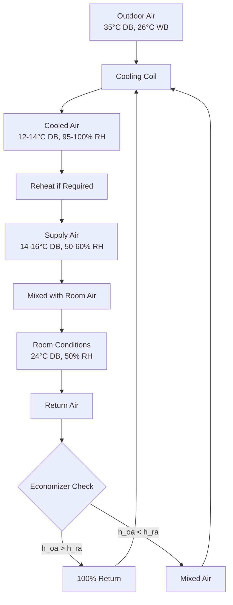

## Climate Definition and Geographic Distribution

Humid subtropical climates (Köppen classification Cfa/Cwa) characterize regions between approximately 25° and 40° latitude on the eastern sides of continents. These zones include the southeastern United States, southern China, southern Japan, northern Argentina, coastal Australia, and portions of southern Europe. The climate exhibits hot, humid summers with significant precipitation and mild to cool winters.

ASHRAE climate zone classification designates these regions primarily as Zone 2A (Hot-Humid) and portions of Zone 3A (Warm-Humid), defined by cooling degree days exceeding heating degree days and specific moisture criteria.

## Thermodynamic Properties

### Temperature Characteristics

Humid subtropical regions demonstrate substantial seasonal temperature variation with summer design dry-bulb temperatures typically ranging from 32°C to 38°C (90°F to 100°F) and winter design temperatures from -5°C to 5°C (23°F to 41°F) depending on latitude and continental proximity.

The mean coincident wet-bulb temperature during peak cooling periods ranges from 24°C to 27°C (75°F to 81°F), creating significant challenges for mechanical cooling systems. This small wet-bulb depression (dry-bulb minus wet-bulb temperature) of 5-8°C indicates limited evaporative cooling potential.

### Psychrometric Analysis

The fundamental relationship governing air-moisture interactions follows:

$$h = c_p T + W(h_{fg} + c_{pw}T)$$

Where:
- h = enthalpy of moist air (kJ/kg)
- c_p = specific heat of dry air (1.006 kJ/kg·K)
- T = dry-bulb temperature (°C)
- W = humidity ratio (kg water/kg dry air)
- h_fg = latent heat of vaporization at 0°C (2501 kJ/kg)
- c_pw = specific heat of water vapor (1.86 kJ/kg·K)

During peak summer conditions, outdoor air typically exhibits humidity ratios between 0.018 and 0.024 kg/kg, corresponding to relative humidity values of 55-75% at 35°C. This high absolute moisture content drives substantial latent cooling loads.

## Moisture Load Characteristics

### Latent versus Sensible Load Distribution

Humid subtropical climates impose exceptional latent cooling demands. The sensible heat ratio (SHR) during summer design conditions typically ranges from 0.65 to 0.75, significantly lower than arid climates where SHR exceeds 0.90.

$$SHR = \frac{Q_{sensible}}{Q_{sensible} + Q_{latent}}$$

The latent cooling load derives from both ventilation air and infiltration:

$$Q_{latent} = \dot{m}_{air} \times h_{fg} \times (W_{outside} - W_{inside})$$

For a ventilation rate of 1000 CFM (0.472 m³/s) with outdoor conditions at 35°C, 70% RH (W = 0.0246 kg/kg) and indoor setpoint of 24°C, 50% RH (W = 0.0093 kg/kg):

$$Q_{latent} = 0.567 \text{ kg/s} \times 2501 \text{ kJ/kg} \times (0.0246 - 0.0093) = 21.7 \text{ kW (74,000 Btu/h)}$$

This represents approximately 35-40% of total cooling load for typical commercial buildings.

## Seasonal Variations

| Season | Design DB (°C) | Design WB (°C) | Humidity Ratio (kg/kg) | Primary HVAC Challenge |
|--------|----------------|----------------|------------------------|------------------------|
| Summer | 33-36 | 24-27 | 0.020-0.024 | Latent load, dehumidification |
| Winter | -2 to 8 | -3 to 5 | 0.002-0.005 | Humidification, heating |
| Spring | 20-28 | 15-21 | 0.010-0.016 | Variable loads, controls |
| Fall | 18-26 | 13-19 | 0.008-0.014 | Economizer optimization |

## Precipitation and Atmospheric Moisture

Annual precipitation in humid subtropical zones ranges from 900 to 2000 mm (35-80 inches), distributed relatively evenly throughout the year with slight summer peaks. This consistent moisture availability maintains elevated absolute humidity levels year-round.

The dew point temperature, calculated from:

$$T_{dp} = T - \frac{(100 - RH)}{5}$$ (approximation for typical ranges)

More precisely through vapor pressure relationships:

$$e_s(T_{dp}) = RH \times e_s(T_{db})/100$$

Summer dew points frequently exceed 21°C (70°F), approaching or surpassing indoor comfort conditions. This phenomenon eliminates sensible cooling potential from outdoor air and necessitates continuous dehumidification.

## Psychrometric Process Requirements

## Building Envelope Interactions

The vapor pressure differential between outdoor and indoor conditions during summer creates inward moisture diffusion through building envelopes. The moisture flux follows:

$$g = M \times \Delta p_{vapor}$$

Where M represents the permeance of the envelope assembly (ng/Pa·s·m²). Proper vapor retarder placement on the exterior (low-permeance sheathing) prevents condensation within wall cavities during air-conditioned periods.

## Design Implications Comparison

| Climate Parameter | Humid Subtropical | Hot-Dry (Comparison) | Impact Factor |
|-------------------|-------------------|----------------------|---------------|
| Peak Latent Load | 8-12 W/m² | 2-4 W/m² | 3-4× higher |
| Cooling Coil Approach | Deep (to 12°C) | Moderate (to 16°C) | Lower SHR required |
| Dehumidification Hours | 2500-3500 hr/yr | 500-1000 hr/yr | Continuous operation |
| Economizer Effectiveness | Limited (enthalpy) | Excellent (dry-bulb) | Reduced free cooling |
| Envelope Vapor Control | Critical (outward in summer) | Minimal concern | Reversed from cold climates |

## Air-Conditioning System Sizing

ASHRAE Standard 90.1 requires systems to meet both sensible and latent loads independently. The total cooling capacity derives from:

$$Q_{total} = Q_{sensible} + Q_{latent} = 1.08 \times CFM \times \Delta T + 0.68 \times CFM \times \Delta W$$

Where CFM represents volumetric flow rate at standard conditions.

For humid subtropical applications, equipment must provide sufficient moisture removal at part-load conditions. Single-stage systems cycling on/off demonstrate poor humidity control, as the coil surface dries between cycles. Variable-capacity systems or dedicated dehumidification equipment maintain lower indoor humidity ratios during reduced sensible loads.

## Thermal Comfort Considerations

The predicted mean vote (PMV) model shows increased sensitivity to humidity at elevated temperatures. Maintaining 50% relative humidity at 24°C provides equivalent comfort to 40% at 22°C, allowing slight temperature elevation with improved dehumidification to reduce energy consumption.

The relationship between operative temperature and acceptable humidity for thermal comfort follows ASHRAE Standard 55 comfort zones, which restrict upper humidity limits to 0.012 kg/kg (approximately 65% RH at 24°C) to prevent mold growth and surface condensation.

## System Selection Criteria

Climate characteristics dictate specific system attributes:

1. **Cooling coil design**: Minimum 8-10 rows, low face velocity (200-250 FPM) for enhanced moisture removal
2. **Supply air temperature**: 12-14°C to achieve adequate dehumidification
3. **Reheat capability**: Required for humidity control during part-load conditions
4. **Economizer controls**: Enthalpy-based rather than dry-bulb to prevent increased latent loads
5. **Ventilation air treatment**: Dedicated outdoor air systems (DOAS) with separate latent/sensible processing

Understanding these fundamental climate characteristics enables proper system selection, sizing, and control strategy development for humid subtropical applications.
