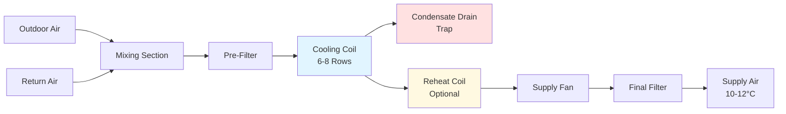
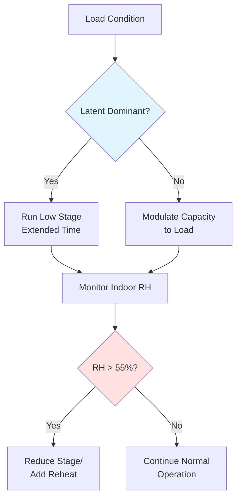

## Overview

Humid subtropical climates (ASHRAE Climate Zone 2A and 3A) present unique equipment challenges due to sustained high moisture levels, elevated outdoor air temperatures (24-32°C design conditions), and latent cooling loads that frequently exceed 30% of total cooling capacity. Equipment selection must prioritize moisture removal capability while maintaining acceptable indoor humidity levels below 60% RH.

## Dehumidification Requirements

### Sensible Heat Ratio Analysis

The sensible heat ratio (SHR) determines the proportion of cooling capacity devoted to temperature reduction versus moisture removal:

$$SHR = \frac{Q_{sensible}}{Q_{sensible} + Q_{latent}}$$

Humid subtropical applications typically require SHR values between 0.65-0.75, significantly lower than the 0.80-0.85 range common in dry climates. Equipment must be selected or modified to operate effectively at these reduced ratios.

### Latent Cooling Capacity

The latent cooling load calculation accounts for moisture removal:

$$Q_{latent} = \dot{m} \times h_{fg} \times (W_{outdoor} - W_{indoor})$$

Where:
- $\dot{m}$ = mass flow rate of air (kg/s)
- $h_{fg}$ = latent heat of vaporization (2,501 kJ/kg at 0°C)
- $W$ = humidity ratio (kg moisture/kg dry air)

For typical conditions (32°C, 70% RH outdoor to 24°C, 50% RH indoor), the humidity ratio change is approximately 0.012 kg/kg, requiring substantial dehumidification capacity.

## Equipment Selection Criteria

### Cooling Coil Design

| Parameter | Standard Climate | Humid Subtropical | Impact |
|-----------|-----------------|-------------------|---------|
| Coil rows | 3-4 | 6-8 | Enhanced moisture removal |
| Fin spacing | 10-12 FPI | 8-10 FPI | Reduced condensate bridging |
| Face velocity | 500-550 FPM | 400-450 FPM | Lower carryover, better dehumidification |
| Leaving air temp | 12-14°C | 10-12°C | Deeper dehumidification |
| Apparatus dew point | 10-12°C | 8-10°C | Maximum moisture extraction |

Deeper coils with increased surface area provide extended contact time between air and cold surfaces, maximizing condensation. Lower face velocities prevent moisture re-entrainment into the air stream.

### Air Handling Unit Configurations

Critical features for humid subtropical applications:

1. **Deep-trap condensate drains** - Minimum 150 mm water column to prevent air infiltration
2. **Sloped drain pans** - 2% minimum slope to prevent standing water
3. **Antimicrobial coatings** - Reduce biological growth on wet surfaces
4. **Double-wall insulation** - Prevent external condensation on cold surfaces
5. **Access panels** - Facilitate regular coil cleaning in high-moisture environments

## Dehumidification Strategies

### Subcool-Reheat Approach

This method overcools air below the desired temperature to achieve deep dehumidification, then reheats to maintain comfort:

$$Q_{reheat} = \dot{m}_{air} \times c_p \times (T_{supply} - T_{coil\\_leaving})$$

Energy penalty: Typically 10-15% of total cooling energy, but necessary for humidity control when outdoor dew points exceed 20°C.

### Dedicated Outdoor Air Systems (DOAS)

DOAS units separate ventilation air treatment from space conditioning, allowing optimized equipment selection:

| Component | Configuration | Benefit |
|-----------|--------------|---------|
| Outdoor air unit | Deep cooling coil (8-10 rows) | Handles high ventilation latent load |
| Space unit | Standard coil (4-6 rows) | Manages sensible load efficiently |
| Energy recovery | Enthalpy wheel (70-80% effectiveness) | Reduces outdoor air conditioning load |
| Supply temp | 10-13°C dew point | Neutral or slight dehumidification |

Energy recovery is critical in humid subtropical climates, where outdoor air conditioning represents 40-50% of total cooling load compared to 25-30% in moderate climates.

### Desiccant Dehumidification

For applications requiring indoor humidity below 45% RH (museums, pharmaceuticals), solid or liquid desiccant systems provide supplemental moisture removal:

$$\eta_{desiccant} = \frac{W_{in} - W_{out}}{W_{in} - W_{saturation}}$$

Desiccant effectiveness typically ranges from 60-75% depending on regeneration energy availability. Integration with waste heat sources (condensing boilers, solar thermal) improves operating economics.

## Equipment Sizing Considerations

### Part-Load Performance

Equipment operates at part-load conditions 95% of annual runtime in humid subtropical climates. Performance degradation occurs because:

1. **Reduced runtime** - Less moisture removal per cycle
2. **Higher cycling frequency** - Coil never reaches steady-state wet conditions
3. **Elevated SHR** - System removes less moisture at reduced capacity

### Multiple-Stage or Variable-Speed Equipment

Variable-speed compressors operating at 40-60% capacity provide superior dehumidification compared to single-stage units cycling on/off. The extended coil contact time at reduced airflow maximizes moisture removal.

## Condensate Management

### Drainage System Design

Condensate production in humid subtropical climates reaches 4-6 liters per hour per ton of cooling capacity. Proper drainage prevents:

- Microbial growth in standing water
- Drain pan overflow and water damage
- Air infiltration through inadequate traps
- System performance degradation

Trap depth calculation:

$$H_{trap} = \frac{P_{fan}}{ρ \times g} + Safety\\_Factor$$

Where static pressure ($P_{fan}$) in negative pressure systems requires trap depth exceeding the maximum fan static pressure by 50% safety margin.

### Maintenance Access

High condensate production accelerates biological fouling. Design must include:

- Removable coil sections for mechanical cleaning
- Washable or replaceable drain pans (stainless steel preferred)
- UV-C light ports for germicidal treatment
- Inspection ports at drain trap locations

## Material Selection

| Component | Standard Material | Humid Subtropical Alternative | Reason |
|-----------|------------------|-------------------------------|---------|
| Drain pans | Galvanized steel | Stainless steel 304 | Corrosion resistance |
| Coil fins | Aluminum | Coated aluminum or copper | Extended service life |
| Ductwork insulation | Fiberglass | Closed-cell foam | Prevents moisture absorption |
| Fasteners | Carbon steel | Stainless steel | Prevents rust staining |
| Cabinet | Painted steel | Powder-coated or stainless | Humidity resistance |

Galvanic corrosion accelerates in high-humidity environments. Dissimilar metal contact must incorporate dielectric isolation.

## Control Strategies

Effective humidity control in humid subtropical climates requires:

1. **Dew point control** - Supply air dew point setpoint (typically 10-12°C) rather than dry bulb temperature
2. **Demand-based ventilation** - CO₂ sensors reduce outdoor air during low occupancy
3. **Reheat optimization** - Minimize energy penalty through heat recovery or condenser heat utilization
4. **Lockout controls** - Prevent simultaneous heating and cooling in perimeter zones

Supply air dew point control maintains consistent dehumidification regardless of space sensible load variations, critical for stable indoor humidity levels.

## Conclusion

Equipment selection for humid subtropical climates requires fundamental departures from standard practice. Deep cooling coils, reduced face velocities, enhanced condensate management, and sophisticated control strategies address the dominant latent cooling loads. Proper equipment specification reduces indoor humidity levels, improves occupant comfort, prevents moisture-related building damage, and maintains acceptable indoor air quality in challenging environmental conditions.
