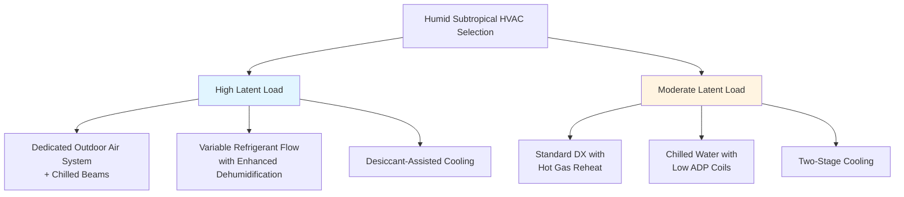
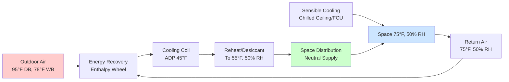

## Climate Characteristics

Humid subtropical climates (Köppen Cfa/Cwa) present unique HVAC challenges characterized by:

- **High cooling loads**: 2500-4500 cooling degree days (65°F base)
- **Persistent humidity**: 60-80% relative humidity year-round
- **Latent-dominated loads**: Latent heat ratios of 0.30-0.45
- **Mild winters**: 500-2000 heating degree days (65°F base)
- **Extended cooling seasons**: 6-9 months annually

The psychrometric challenge centers on simultaneous temperature and humidity control, where moisture removal often drives equipment selection more than sensible cooling capacity.

## Dehumidification Requirements

### Latent Cooling Load Analysis

The total cooling load separates into sensible and latent components:

$$Q_{total} = Q_{sensible} + Q_{latent}$$

where latent load from moisture infiltration and internal sources is:

$$Q_{latent} = \dot{m}_{air} \times h_{fg} \times (W_{outdoor} - W_{indoor})$$

**Variables:**
- $\dot{m}_{air}$ = mass flow rate of outdoor air (lb/hr)
- $h_{fg}$ = latent heat of vaporization (≈1060 BTU/lb at standard conditions)
- $W$ = humidity ratio (lb water/lb dry air)

The sensible heat ratio (SHR) quantifies the relationship:

$$SHR = \frac{Q_{sensible}}{Q_{total}}$$

Humid subtropical applications typically require SHR of 0.55-0.70, compared to 0.75-0.85 in arid climates.

### Apparatus Dewpoint Selection

Effective dehumidification requires cooling coil apparatus dewpoint (ADP) temperatures below desired space dewpoint:

| Space Condition | Required ADP | Coil Face Velocity |
|-----------------|--------------|-------------------|
| 75°F, 50% RH | 48-52°F | 300-400 fpm |
| 75°F, 45% RH | 45-48°F | 250-350 fpm |
| 72°F, 50% RH | 45-49°F | 300-400 fpm |

Lower face velocities improve moisture removal by increasing coil contact time and approach to ADP conditions.

## System Selection Strategies

### Cooling Equipment Comparison

### Equipment Performance Characteristics

| System Type | Latent Capacity | Energy Efficiency | Humidity Control | Capital Cost |
|-------------|----------------|-------------------|------------------|--------------|
| Standard DX | Moderate | EER 11-13 | Fair | Low |
| Enhanced DX + Reheat | High | EER 9-11 | Excellent | Moderate |
| Chilled Water (42°F) | Moderate | 0.6-0.8 kW/ton | Good | Moderate |
| DOAS + Radiant | Very High | Combined 0.5-0.7 kW/ton | Excellent | High |
| Desiccant Hybrid | Very High | COP 3-5 | Excellent | High |

## Psychrometric Process Design

### Cooling and Dehumidification Process

The air conditioning process follows a psychrometric path from outdoor to supply conditions:

$$\dot{Q}_{coil} = \dot{m}_{air} \times (h_{entering} - h_{leaving})$$

For effective moisture removal, the leaving air condition must fall on the saturation curve at the coil ADP temperature, then mix with bypass air:

$$h_{supply} = BF \times h_{entering} + (1-BF) \times h_{ADP}$$

where bypass factor (BF) typically ranges 0.05-0.20 for dehumidification applications.

### Reheat for Humidity Control

Achieving low humidity without overcooling requires sensible heat addition:

$$\dot{Q}_{reheat} = \dot{m}_{air} \times c_p \times (T_{supply} - T_{coil,leaving})$$

**Reheat methods comparison:**

| Method | Energy Source | Efficiency | Control Precision | Application |
|--------|--------------|-----------|-------------------|-------------|
| Electric resistance | Electricity | 100% conversion | Excellent | Small zones |
| Hot gas reheat | Compressor waste heat | "Free" recovery | Good | DX systems |
| Heat recovery | Condenser heat | COP 3-6 | Good | Large systems |
| Heat pump reheat | Refrigeration cycle | COP 2-4 | Excellent | Year-round |

## Ventilation and Outdoor Air Management

### ASHRAE 62.1 Compliance in Humid Climates

Outdoor air introduces significant latent load:

$$\dot{Q}_{latent,OA} = 4840 \times CFM \times (\rho/13.33) \times (W_{outdoor} - W_{indoor})$$

At design conditions (95°F DB, 78°F WB), outdoor air at 20 CFM/person contributes approximately:
- **Sensible load**: 230 BTU/hr per person
- **Latent load**: 180 BTU/hr per person
- **Total load**: 410 BTU/hr per person

### Dedicated Outdoor Air Systems

DOAS decouples ventilation from space conditioning:

Energy recovery effectiveness in humid climates:

$$\epsilon_{latent} = \frac{W_{outdoor} - W_{supply,ERV}}{W_{outdoor} - W_{return}}$$

Target latent effectiveness: 60-75% for enthalpy wheels, reducing outdoor air moisture load by 40-60%.

## Moisture Control Strategies

### Building Envelope Considerations

Vapor pressure differential drives moisture migration:

$$\Delta p_v = p_{v,outdoor} - p_{v,indoor}$$

At summer design conditions (outdoor 95°F/75% RH, indoor 75°F/50% RH):
- Outdoor vapor pressure: 0.74 psia
- Indoor vapor pressure: 0.43 psia
- Driving force: 0.31 psi (inward migration)

**Envelope requirements:**
- Continuous air barrier: <0.25 CFM/ft² at 75 Pa
- Vapor retarder: Class II or III on exterior (warm side)
- Drainage plane: Minimum 3/8" cavity behind cladding
- Foundation moisture barrier: 6-mil polyethylene minimum

### Condensate Removal

Dehumidification generates substantial condensate:

$$\dot{m}_{condensate} = \dot{m}_{air} \times (W_{entering} - W_{leaving})$$

**Design requirements:**
- Trap depth: Minimum 2× negative pressure at drain pan (inches water column)
- Slope: 1/8" per foot minimum on horizontal runs
- Capacity: Size for peak latent load removal rate
- Treatment: Biocide tablets or UV treatment for standing water

## Control Strategies for Humidity

### Dual-Setpoint Control

Independent temperature and humidity control requires:

1. **Temperature control loop**: Modulates cooling capacity via compressor speed or valve position
2. **Humidity control loop**: Activates additional dehumidification or reheat
3. **Priority logic**: Dehumidification overrides temperature setpoint by 2-3°F when necessary

### Dewpoint Control vs. RH Control

Dewpoint-based control provides superior moisture management:

$$T_{dewpoint} = T_{drybulb} - \frac{100-RH}{5}$$ (approximation for 60-80°F range)

**Control comparison:**

| Parameter | RH Control | Dewpoint Control |
|-----------|-----------|------------------|
| Accuracy | ±5% RH | ±2°F dewpoint |
| Temperature drift | Significant | Minimal |
| Sensor location sensitivity | High | Moderate |
| Mold prevention | Good | Excellent |
| Energy efficiency | Moderate | Better |

Maintain dewpoint below 55°F to prevent mold growth and surface condensation on thermal bridges.

## Energy Efficiency Measures

### Variable Capacity Operation

Part-load dehumidification performance improves with:

$$COP_{part-load} = COP_{rated} \times (0.85 + 0.15 \times PLR)$$

where PLR = part load ratio (0.3-1.0)

**Equipment strategies:**
- Variable-speed compressors: Maintain coil temperatures during low-load conditions
- Staged cooling: Sequential compressor operation extends runtime
- Economizer lockout: Prevent introduction of humid outdoor air when enthalpy exceeds return air

### Subcool Reheat Cycles

Enhanced dehumidification with waste heat recovery:

1. Overcool air to 45-48°F dewpoint (deep dehumidification)
2. Recover condenser heat for reheat to supply temperature
3. Achieve 40-45% RH at minimal energy penalty

Net COP improvement: 15-25% compared to electric reheat while providing superior humidity control.

## References

- ASHRAE Standard 62.1: Ventilation for Acceptable Indoor Air Quality
- ASHRAE Standard 55: Thermal Environmental Conditions for Human Occupancy
- ASHRAE Handbook—Fundamentals, Chapter 1: Psychrometrics
- ASHRAE Handbook—HVAC Applications, Chapter 28: Humidity Control
- ASHRAE Design Guide: Dedicated Outdoor Air Systems
