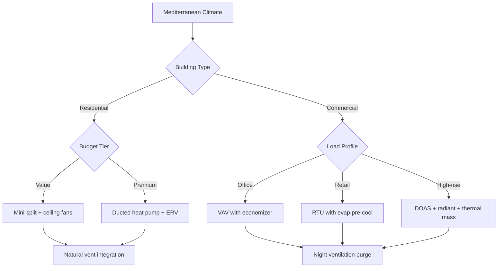

# Mediterranean Climate HVAC Design

Mediterranean climates (Köppen classification Csa/Csb) present unique opportunities for energy-efficient HVAC design due to their characteristic hot, dry summers and mild, wet winters. The favorable diurnal temperature swings and extended shoulder seasons enable hybrid system strategies that minimize mechanical cooling and heating loads while maximizing natural ventilation and passive conditioning.

## Climate Characteristics and Design Implications

**Temperature Profile:**
- Summer dry-bulb: 85-100°F (29-38°C)
- Winter dry-bulb: 45-60°F (7-16°C)
- Diurnal swing: 25-35°F (14-19°C) typical
- Heating degree days (base 65°F): 1,500-2,500 annually
- Cooling degree days (base 65°F): 800-1,500 annually

**Humidity Conditions:**
- Summer relative humidity: 20-40% typical
- Winter relative humidity: 50-70% typical
- Wet-bulb depression: 20-30°F (11-17°C) in summer

The substantial wet-bulb depression during cooling season provides exceptional conditions for evaporative cooling and economizer operation. The mild winter temperatures minimize heating requirements, often reducing heating loads to 20-30% of comparable mixed-humid climates.

## Seasonal Load Analysis

### Summer Cooling Loads

Cooling loads dominate Mediterranean climate HVAC design, typically representing 70-80% of annual energy consumption. Peak loads occur during afternoon hours when solar radiation and outdoor temperatures coincide.

| Load Component | Percentage of Peak | Design Strategy |
|----------------|-------------------|-----------------|
| Solar gain (windows) | 30-40% | Low-E glazing, exterior shading |
| Solar gain (envelope) | 15-25% | High thermal mass, light-colored roofs |
| Ventilation | 20-30% | Economizer cycles, night ventilation |
| Internal gains | 15-25% | LED lighting, efficient equipment |
| Infiltration | 5-10% | Air barrier systems, vestibules |

**Cooling Load Calculation Considerations:**

The sensible heat ratio (SHR) typically ranges from 0.85-0.95 in Mediterranean climates due to low absolute humidity. This high SHR requires careful equipment selection to avoid overcooling and humidity control issues.

Design cooling capacity calculation:
```
Q_total = Q_sensible + Q_latent
Q_sensible = m × cp × ΔT + UA × ΔT + Q_solar + Q_internal
Q_latent = m × h_fg × Δω (typically 5-15% of total)
```

Where the latent component remains minimal, allowing downsized dehumidification capacity compared to humid climates.

### Winter Heating Loads

Heating loads remain modest, with design conditions typically ranging from 35-45°F (2-7°C) outdoor dry-bulb. Internal gains from occupancy, lighting, and equipment often satisfy daytime heating requirements in commercial buildings.

**Heating Load Characteristics:**
- Transmission losses: 60-70% of total heating load
- Infiltration/ventilation: 20-30% of total heating load
- Peak morning warm-up loads exceed steady-state by 40-60%
- Night setback recovery requires 2-4 hours typically

Heating equipment is commonly sized at 25-35 BTU/h per square foot for residential applications and 15-25 BTU/h per square foot for commercial buildings with moderate internal gains.

### Shoulder Season Opportunities

The extended spring and fall periods (March-May, September-November in Northern Hemisphere) offer 4-6 months annually where outdoor conditions support natural ventilation and economizer operation without mechanical conditioning.

**Free Cooling Hours Analysis:**

Mediterranean climates typically provide 3,000-4,500 hours annually when outdoor air temperature falls within the economizer range (55-70°F), representing 35-50% of occupied hours. This extensive free cooling potential justifies investment in high-quality economizer systems and natural ventilation infrastructure.

## System Selection Framework

### Decision Matrix



### Hybrid System Strategies

The optimal approach combines mechanical systems with passive strategies:

**1. Economizer-Dominant Systems**
- Airside economizer with integrated controls
- Dry-bulb control strategy (dewpoint unnecessary)
- Minimum 100% outdoor air capability during shoulder seasons
- Variable-speed supply fans for low-load operation
- Energy recovery bypassed during economizer mode

**2. Evaporative Pre-Cooling Integration**
- Indirect evaporative cooling reduces entering air temperature 10-20°F
- Direct evaporative stages for spaces tolerating humidity addition
- Two-stage systems achieve 75-90% wet-bulb approach effectiveness
- Water consumption: 2-4 gallons per ton-hour of cooling

**3. Thermal Mass Utilization**
- Concrete slab exposure provides 20-40 BTU/ft² thermal storage capacity
- Night ventilation purge (outdoor air < 70°F) recharges mass
- Radiant cooling integration maintains mean radiant temperature 68-72°F
- Reduces peak cooling loads by 25-35% compared to lightweight construction

## Equipment Sizing Considerations

Mediterranean climates require asymmetric sizing approaches that recognize cooling-dominant loads while avoiding oversized heating equipment.

**Cooling Equipment Sizing:**
- Manual J/S calculations using 1% design conditions (not 0.4%)
- Account for thermal mass lag in load profiles
- Size for sensible capacity at design SHR, not total capacity
- Variable-capacity equipment prevents short-cycling during shoulder seasons

**Heating Equipment Sizing:**
- Use 99% design conditions for heating
- Heat pump balance point typically 35-45°F
- Backup resistance heat: 50-70% of design load sufficient
- Consider heat pump-only operation for coastal zones

**Recommended Capacity Ratios:**

| System Type | Cooling (BTU/h/ft²) | Heating (BTU/h/ft²) | Heating/Cooling Ratio |
|-------------|-------------------|-------------------|---------------------|
| Residential | 18-25 | 20-30 | 0.9-1.2 |
| Office | 25-35 | 15-25 | 0.5-0.8 |
| Retail | 30-45 | 20-30 | 0.6-0.8 |
| High-rise residential | 20-30 | 15-25 | 0.7-1.0 |

## Control Strategies for Mediterranean Climates

**Integrated Control Sequence:**

1. **Outdoor air temperature < 55°F:** Heating mode with minimum ventilation
2. **55-65°F:** 100% economizer operation, mechanical cooling disabled
3. **65-75°F:** Economizer modulation, mechanical cooling stages as required
4. **75-85°F:** Integrated economizer + mechanical cooling
5. **> 85°F:** Minimum outdoor air, full mechanical cooling, consider evaporative assist

**Night Ventilation Protocol:**
- Initiate when outdoor temperature < indoor temperature - 5°F
- Target 8-12 air changes per hour for thermal mass charging
- Operate until space temperature reaches 68-70°F or 2 hours before occupancy
- Requires motorized dampers, security considerations, and filtration

## Energy Performance Benchmarks

Well-designed HVAC systems in Mediterranean climates achieve:

- **Residential:** 4-8 kWh/ft²/year total HVAC energy
- **Office:** 6-12 kWh/ft²/year total HVAC energy
- **HVAC energy fraction:** 25-35% of total building energy (vs. 40-50% in extreme climates)
- **Peak demand reduction:** 0.8-1.2 W/ft² through passive strategies

These performance levels require integrated design considering building envelope, orientation, fenestration, thermal mass, natural ventilation infrastructure, and mechanical system optimization.

## Design Recommendations Summary

**Priority Strategies:**
1. Maximize economizer hours through generous outdoor air capacity and optimized controls
2. Integrate thermal mass exposure with night ventilation purge cycles
3. Right-size cooling equipment for high sensible heat ratio conditions
4. Deploy evaporative cooling where water availability and space humidity tolerance permit
5. Minimize heating equipment capacity to actual requirements, avoiding oversizing
6. Specify variable-capacity equipment to maintain efficiency across wide load ranges
7. Design for natural cross-ventilation during shoulder seasons (4-6 months annually)

Mediterranean climates reward sophisticated hybrid approaches that recognize the climate's inherent advantages. Systems that rigidly apply heating-climate or cooling-climate templates sacrifice 30-50% of potential energy savings available through climate-responsive design.
