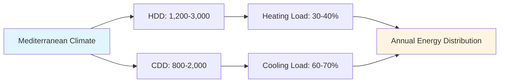
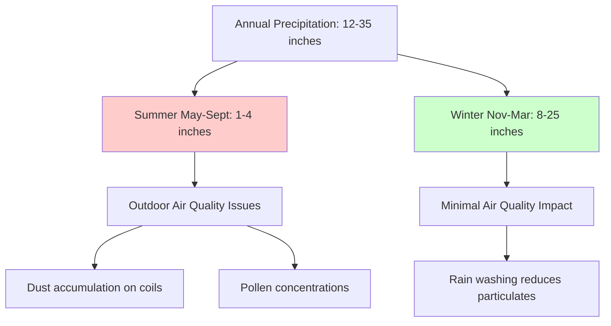

# Mediterranean Climate Characteristics for HVAC Design

Mediterranean climates (Köppen classification Csa and Csb) exhibit distinct seasonal patterns characterized by hot, dry summers and mild, wet winters. These climate zones occur along the western coasts of continents between 30° and 45° latitude, including coastal California, central Chile, the Mediterranean Basin, southwestern Australia, and South Africa's Western Cape. The unique thermal and psychrometric properties of this climate enable HVAC strategies that differ fundamentally from heating-dominant or cooling-dominant approaches.

## Climate Classification and Geographic Distribution

**Köppen Climate Criteria:**

- **Csa (Hot-summer Mediterranean):** Warmest month ≥ 72°F (22°C) mean, driest summer month < 1.2 inches (30 mm) precipitation
- **Csb (Warm-summer Mediterranean):** Fewer than 4 months ≥ 72°F mean, driest summer month < 1.2 inches precipitation
- Summer dry season: < 40% of annual precipitation falls May through September (Northern Hemisphere)
- Winter precipitation concentration: > 60% of annual precipitation falls November through March

**Representative HVAC Design Cities:**

| Location | Classification | Summer DB (1%) | Winter DB (99%) | Annual Precipitation |
|----------|---------------|----------------|-----------------|---------------------|
| Los Angeles, CA | Csb | 85°F (29°C) | 45°F (7°C) | 15 inches (381 mm) |
| San Francisco, CA | Csb | 80°F (27°C) | 42°F (6°C) | 23 inches (584 mm) |
| Sacramento, CA | Csa | 98°F (37°C) | 38°F (3°C) | 18 inches (457 mm) |
| Perth, Australia | Csa | 97°F (36°C) | 46°F (8°C) | 32 inches (813 mm) |
| Rome, Italy | Csa | 93°F (34°C) | 37°F (3°C) | 33 inches (838 mm) |
| Athens, Greece | Csa | 95°F (35°C) | 41°F (5°C) | 16 inches (406 mm) |

## Temperature Characteristics

### Seasonal Temperature Profiles

Mediterranean climates demonstrate asymmetric seasonal temperature distributions with cooling-dominant annual energy requirements but significant heating demand during winter mornings.

**Summer Temperature Parameters (June-September, Northern Hemisphere):**

- Design dry-bulb temperature (1% exceedance): 85-100°F (29-38°C)
- Mean daily maximum temperature: 80-92°F (27-33°C)
- Mean daily minimum temperature: 60-70°F (16-21°C)
- Daily temperature range: 20-30°F (11-17°C) typical
- Peak temperature occurrence: 2:00-4:00 PM solar time
- Cooling degree days (base 65°F): 800-2,000 annually

**Winter Temperature Parameters (December-February, Northern Hemisphere):**

- Design dry-bulb temperature (99% exceedance): 35-48°F (2-9°C)
- Mean daily maximum temperature: 55-65°F (13-18°C)
- Mean daily minimum temperature: 42-52°F (6-11°C)
- Daily temperature range: 12-18°F (7-10°C) typical
- Minimum temperature occurrence: 6:00-7:00 AM solar time
- Heating degree days (base 65°F): 1,200-3,000 annually

### Diurnal Temperature Swing

The diurnal temperature swing represents one of the most significant design parameters for Mediterranean climate HVAC systems. This temperature variation between daily maximum and minimum enables thermal mass strategies and night ventilation cooling.

**Diurnal Temperature Analysis:**

The diurnal temperature swing follows a sinusoidal pattern approximated by:

$$T(t) = T_{mean} + \frac{\Delta T_{diurnal}}{2} \sin\left(\frac{2\pi(t - t_{min})}{24}\right)$$

Where:
- $T(t)$ = outdoor air temperature at time $t$ (°F)
- $T_{mean}$ = daily mean temperature (°F)
- $\Delta T_{diurnal}$ = diurnal temperature swing (°F)
- $t_{min}$ = time of minimum temperature, typically 6:00-7:00 AM (hours)

**Seasonal Diurnal Swing Patterns:**

| Season | Mean Swing | Range | HVAC Implication |
|--------|------------|-------|-----------------|
| Summer | 28°F (16°C) | 24-35°F (13-19°C) | Night ventilation highly effective |
| Winter | 15°F (8°C) | 12-20°F (7-11°C) | Morning heating recovery extended |
| Spring/Fall | 22°F (12°C) | 18-28°F (10-16°C) | Free cooling windows extended |

The substantial summer diurnal swing enables thermal mass to absorb daytime heat gains and reject stored energy during cooler nighttime hours. Night ventilation purge cycles operating when outdoor temperature falls below 70°F (21°C) can reduce peak cooling loads by 25-35% in mass-heavy construction.

### Degree Day Analysis

Degree day calculations quantify heating and cooling energy requirements. Mediterranean climates exhibit balanced but asymmetric degree day distributions.

**Degree Day Calculation:**

Heating degree days (HDD):

$$HDD = \sum_{i=1}^{365} \max(0, T_{base} - T_{mean,i})$$

Cooling degree days (CDD):

$$CDD = \sum_{i=1}^{365} \max(0, T_{mean,i} - T_{base})$$

Where $T_{base} = 65°F$ (18°C) for residential applications.

**Representative Degree Day Values:**

**Comparison with Other Climates:**

| Climate Type | HDD (65°F base) | CDD (65°F base) | Ratio HDD:CDD |
|--------------|----------------|----------------|---------------|
| Mediterranean (Csa) | 1,500-2,500 | 1,200-2,000 | 1.0-1.5 |
| Hot-Humid Subtropical | 1,500-2,500 | 2,500-4,000 | 0.5-0.8 |
| Hot-Dry Desert | 1,000-2,000 | 3,000-5,000 | 0.3-0.5 |
| Cold Continental | 5,000-8,000 | 500-1,200 | 5.0-10.0 |
| Marine West Coast | 3,500-5,500 | 100-400 | 12.0-30.0 |

## Psychrometric Characteristics

### Humidity and Moisture Content

Mediterranean climates exhibit pronounced seasonal humidity variations, transitioning from very dry summer conditions to moderate winter humidity levels.

**Summer Psychrometric Conditions:**

- Relative humidity (afternoon): 15-35%
- Relative humidity (morning): 40-60%
- Dew point temperature: 50-60°F (10-16°C)
- Humidity ratio: 0.005-0.008 lb water/lb dry air
- Wet-bulb temperature: 62-72°F (17-22°C)
- Wet-bulb depression: 18-30°F (10-17°C)

**Winter Psychrometric Conditions:**

- Relative humidity (afternoon): 50-70%
- Relative humidity (morning): 70-90%
- Dew point temperature: 38-50°F (3-10°C)
- Humidity ratio: 0.004-0.007 lb water/lb dry air
- Wet-bulb temperature: 42-55°F (6-13°C)
- Wet-bulb depression: 5-12°F (3-7°C)

### Wet-Bulb Depression and Evaporative Cooling Potential

The wet-bulb depression—the difference between dry-bulb and wet-bulb temperatures—determines the theoretical limit for evaporative cooling effectiveness.

**Evaporative Cooling Capacity:**

The maximum sensible cooling achievable through direct evaporative cooling:

$$Q_{evap} = \dot{m}_{air} \cdot c_{p,air} \cdot \eta_{evap} \cdot (T_{db} - T_{wb})$$

Where:
- $Q_{evap}$ = evaporative cooling capacity (BTU/h)
- $\dot{m}_{air}$ = mass flow rate of air (lb/h)
- $c_{p,air}$ = specific heat of air = 0.24 BTU/lb·°F
- $\eta_{evap}$ = evaporative cooler effectiveness (0.70-0.85 for direct, 0.55-0.75 for indirect)
- $T_{db}$ = dry-bulb temperature (°F)
- $T_{wb}$ = wet-bulb temperature (°F)

**Practical Evaporative Cooling Performance:**

For a typical summer design condition of 95°F dry-bulb and 65°F wet-bulb (30°F depression):

| System Type | Effectiveness | Temperature Reduction | Leaving Air Temp |
|-------------|--------------|----------------------|------------------|
| Direct evaporative | 80% | 24°F (13°C) | 71°F (22°C) |
| Indirect evaporative | 65% | 19.5°F (11°C) | 75.5°F (24°C) |
| Two-stage indirect-direct | 110%* | 33°F (18°C) | 62°F (17°C) |

*Effectiveness > 100% for two-stage systems using wet-bulb approach definition

### Sensible Heat Ratio

The sensible heat ratio (SHR) quantifies the proportion of total cooling load attributed to sensible (temperature) versus latent (humidity) components:

$$SHR = \frac{Q_{sensible}}{Q_{sensible} + Q_{latent}} = \frac{Q_{sensible}}{Q_{total}}$$

**Mediterranean Climate SHR Values:**

- Summer design SHR: 0.85-0.95
- Winter heating (sensible only): 1.00
- Shoulder season: 0.90-0.98

High SHR conditions require equipment selection prioritizing sensible cooling capacity. Standard direct-expansion (DX) cooling equipment sized for total capacity will overcool spaces before removing adequate sensible heat, resulting in cold, clammy conditions and short-cycling.

**Equipment Dehumidification Performance:**

The leaving air humidity ratio from cooling coils:

$$\omega_{leaving} = \omega_{entering} - \frac{Q_{latent}}{\dot{m}_{air} \cdot h_{fg}}$$

Where:
- $\omega$ = humidity ratio (lb water/lb dry air)
- $h_{fg}$ = latent heat of vaporization ≈ 1,060 BTU/lb at typical conditions

In Mediterranean climates with low latent loads, cooling coils rarely achieve the low leaving air temperatures (42-48°F) necessary for effective dehumidification, making dedicated dehumidification systems unnecessary for most applications.

## Solar Radiation Patterns

### Solar Intensity and Duration

Mediterranean climates receive high solar radiation levels during summer months with clear sky conditions prevailing 70-90% of daylight hours.

**Solar Radiation Design Values:**

| Parameter | Summer | Winter | Annual Average |
|-----------|--------|--------|----------------|
| Peak solar irradiance | 310-330 BTU/h·ft² | 220-260 BTU/h·ft² | 270-290 BTU/h·ft² |
| Daily total horizontal | 2,200-2,600 BTU/ft²·day | 800-1,200 BTU/ft²·day | 1,500-1,900 BTU/ft²·day |
| Clear sky hours | 10-14 h/day | 6-9 h/day | 8-11 h/day |
| Cloud cover | 10-20% | 35-50% | 25-35% |

**Solar Heat Gain Through Glazing:**

Solar heat gain coefficient (SHGC) determines the fraction of incident solar radiation transmitted through fenestration:

$$Q_{solar,glazing} = A_{glazing} \cdot SHGC \cdot I_{solar} \cdot CLF$$

Where:
- $Q_{solar,glazing}$ = solar heat gain through glazing (BTU/h)
- $A_{glazing}$ = glazing area (ft²)
- $SHGC$ = solar heat gain coefficient (dimensionless, 0-1)
- $I_{solar}$ = incident solar radiation (BTU/h·ft²)
- $CLF$ = cooling load factor accounting for thermal mass lag (0.6-1.0)

**Optimal Glazing Strategies for Mediterranean Climates:**

| Orientation | Summer SHGC | Winter SHGC | Shading Strategy |
|-------------|------------|------------|------------------|
| South | 0.25-0.35 | Maximize solar gain | Horizontal overhangs |
| East/West | 0.20-0.30 | 0.30-0.40 | Vertical fins + overhangs |
| North | 0.35-0.50 | 0.40-0.60 | Minimal shading required |

### Seasonal Sun Path Implications

The sun path varies significantly between summer and winter in Mediterranean latitudes (30-45°), creating opportunities for passive solar heating during winter while enabling effective shading during summer.

**Solar Altitude Angle Calculation:**

$$\sin(\alpha) = \sin(\phi) \sin(\delta) + \cos(\phi) \cos(\delta) \cos(h)$$

Where:
- $\alpha$ = solar altitude angle above horizon
- $\phi$ = latitude
- $\delta$ = solar declination angle (+23.45° summer solstice, -23.45° winter solstice)
- $h$ = hour angle (15° per hour from solar noon)

**Peak Solar Altitude at Solar Noon:**

| Latitude | Summer Solstice | Winter Solstice | Difference |
|----------|----------------|-----------------|------------|
| 32°N (San Diego) | 81° | 35° | 46° |
| 38°N (San Francisco) | 75° | 29° | 46° |
| 40°N (Northern Italy) | 73° | 27° | 46° |
| 34°S (Adelaide) | 79° | 33° | 46° |

The consistent 46° difference between summer and winter solar altitude enables fixed horizontal overhangs to block high summer sun while admitting low winter sun for passive heating.

## Precipitation and Outdoor Air Quality

### Seasonal Precipitation Patterns

Mediterranean climates concentrate 60-80% of annual precipitation during the mild winter months (November-March in Northern Hemisphere), creating distinct dry and wet seasons.

**Monthly Precipitation Distribution (Northern Hemisphere):**

**HVAC Implications of Precipitation Patterns:**

- **Dry summer months:** Increased airborne particulate matter requires enhanced filtration (MERV 11-13 minimum)
- **Winter rain events:** Outdoor air intakes require proper drainage and weather protection
- **Spring pollen:** Peak pollen concentrations during March-May necessitate higher filtration efficiency
- **Dust accumulation:** Extended dry periods cause outdoor coil fouling, reducing heat transfer coefficient by 15-30%

### Outdoor Air Quality Considerations

Mediterranean regions experience air quality challenges specific to the climate's dry summer conditions and geography.

**Common Air Quality Issues:**

| Pollutant | Summer Concentration | Winter Concentration | Source |
|-----------|---------------------|---------------------|---------|
| PM2.5 | 15-35 µg/m³ | 8-20 µg/m³ | Wildfires, dust, vehicle emissions |
| PM10 | 25-60 µg/m³ | 15-35 µg/m³ | Dust, construction, road dust |
| Ozone (O₃) | 60-90 ppb | 30-50 ppb | Photochemical smog formation |
| VOCs | Moderate-High | Low-Moderate | Vegetation emissions, urban sources |

**Filtration Requirements by Application:**

- **Residential:** MERV 11-13 for occupant health and equipment protection
- **Commercial office:** MERV 13-14 for indoor air quality standards (ASHRAE 62.1)
- **Healthcare:** MERV 14-16 with enhanced outdoor air treatment
- **Sensitive applications:** HEPA filtration (99.97% @ 0.3 µm) for laboratory, cleanroom environments

## Wind Patterns and Natural Ventilation Potential

### Prevailing Wind Characteristics

Mediterranean climates typically experience consistent afternoon sea breezes in coastal locations and diurnal mountain-valley wind patterns in interior regions.

**Coastal Wind Patterns:**

- **Summer daytime:** Sea breeze 8-18 mph (3.5-8 m/s) from ocean/sea, onset 10:00 AM-12:00 PM
- **Summer nighttime:** Land breeze 4-10 mph (1.8-4.5 m/s) toward ocean/sea, onset 8:00 PM-10:00 PM
- **Winter:** More variable, storm-driven winds 12-25 mph (5-11 m/s) with precipitation events

**Interior/Valley Wind Patterns:**

- **Daytime:** Up-valley/upslope winds 6-15 mph (2.7-6.7 m/s)
- **Nighttime:** Down-valley/downslope winds 4-12 mph (1.8-5.4 m/s)
- **Seasonal variation:** Summer patterns more consistent than winter

### Natural Ventilation Effectiveness

The predictable wind patterns and favorable temperature swings enable natural ventilation strategies for 4-6 months annually during shoulder seasons.

**Ventilation Flow Rate Through Openings:**

Wind-driven ventilation flow rate:

$$Q_{wind} = C_d \cdot A \cdot V_{wind}$$

Where:
- $Q_{wind}$ = ventilation flow rate (CFM)
- $C_d$ = discharge coefficient (0.6-0.7 for sharp-edged openings)
- $A$ = effective opening area (ft²)
- $V_{wind}$ = wind velocity (ft/min)

Stack-effect ventilation flow rate:

$$Q_{stack} = C_d \cdot A \cdot \sqrt{2 \cdot g \cdot H \cdot \frac{(T_{indoor} - T_{outdoor})}{T_{indoor}}}$$

Where:
- $g$ = gravitational acceleration = 32.2 ft/s²
- $H$ = vertical distance between inlet and outlet (ft)
- $T$ = absolute temperature (°R = °F + 460)

**Natural Ventilation Potential Hours:**

| Season | Hours/Month | Conditions Met | Strategy |
|--------|-------------|----------------|----------|
| Summer day | 0-50 h | Rare—outdoor temp too high | Mechanical cooling required |
| Summer night | 180-220 h | Frequent—outdoor < 70°F | Night ventilation purge |
| Spring/Fall | 400-550 h | Extensive—outdoor 60-75°F | Cross-ventilation during occupied hours |
| Winter | 100-200 h | Moderate—when heating not required | Economizer operation |

## Design Condition Summary

**ASHRAE Design Conditions for Representative Cities:**

| City | Lat/Long | Summer DB (1%) | Summer WB (1%) | Winter DB (99%) | MCWB* | MCDB** |
|------|----------|----------------|----------------|-----------------|-------|--------|
| Los Angeles, CA | 34°N/118°W | 85°F (29°C) | 66°F (19°C) | 45°F (7°C) | 72°F | 75°F |
| Sacramento, CA | 39°N/121°W | 98°F (37°C) | 68°F (20°C) | 38°F (3°C) | 70°F | 82°F |
| Athens, Greece | 38°N/24°E | 95°F (35°C) | 70°F (21°C) | 41°F (5°C) | 72°F | 79°F |
| Perth, Australia | 32°S/116°E | 97°F (36°C) | 67°F (19°C) | 46°F (8°C) | 71°F | 80°F |

*MCWB = Mean Coincident Wet-Bulb temperature (at summer DB design condition)
**MCDB = Mean Coincident Dry-Bulb temperature (at winter DB design condition)

**Climate Parameters Influence on HVAC Design:**

The Mediterranean climate characteristics create specific design priorities:

1. **High diurnal temperature swing** → Thermal mass strategies and night ventilation
2. **Large wet-bulb depression** → Evaporative cooling viability
3. **Balanced degree days** → Avoid oversizing heating equipment
4. **Extended shoulder seasons** → Economizer operation 3,500-4,500 hours annually
5. **Low summer humidity** → High sensible heat ratio equipment selection
6. **Seasonal precipitation** → Enhanced filtration during dry months
7. **Predictable wind patterns** → Natural ventilation integration
8. **High solar radiation** → Glazing optimization and exterior shading critical

These climate characteristics enable Mediterranean regions to achieve among the lowest HVAC energy consumption per square foot of any climate zone when systems are properly designed to leverage the climate's inherent advantages rather than applying generic equipment templates.
