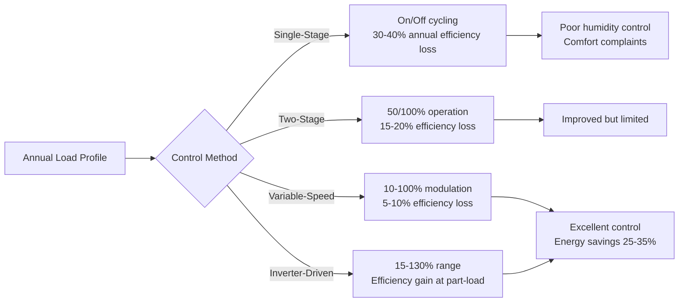
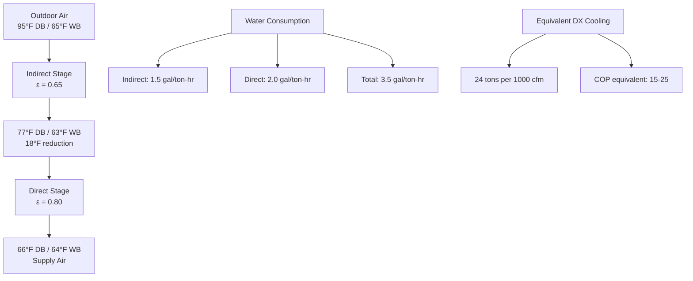

# Mediterranean Climate HVAC Equipment Selection

Equipment selection for Mediterranean climates requires optimization for cooling-dominant operation, high sensible heat ratios, extended economizer periods, and minimal heating loads. The climate's favorable characteristics—substantial diurnal temperature swings, low humidity, and mild winters—enable equipment configurations that differ fundamentally from those suited to extreme heating or cooling climates.

## Cooling Equipment Selection Criteria

### Sensible Heat Ratio Matching

Mediterranean climates typically exhibit sensible heat ratios (SHR) of 0.85-0.95 during peak cooling conditions. Standard equipment rated at SHR 0.70-0.75 will overcool spaces before achieving adequate dehumidification, leading to comfort issues and cycling inefficiency.

**Sensible cooling capacity at operating conditions:**

$$Q_{sensible} = \dot{m} \times c_p \times (T_{entering} - T_{leaving})$$

$$\text{SHR} = \frac{Q_{sensible}}{Q_{total}} = \frac{Q_{sensible}}{Q_{sensible} + Q_{latent}}$$

For Mediterranean applications, select equipment meeting these criteria:

| Equipment Type | Minimum SHR | Entering Air Conditions | Application Range |
|----------------|-------------|------------------------|-------------------|
| DX coils | 0.85 | 80°F DB / 60°F WB | General purpose |
| Chilled water coils | 0.90 | 80°F DB / 58°F WB | Low-latent loads |
| Evaporative-assisted | 0.95 | 95°F DB / 65°F WB | Dry summer peak |
| Radiant cooling | 1.00 | Surface temperature > dewpoint | Sensible-only |

**Coil selection methodology:**

1. Calculate design sensible load independently from latent load
2. Determine required apparatus dewpoint (ADP) from psychrometric analysis
3. Select coil with sufficient rows and fin spacing to achieve target SHR
4. Verify bypass factor: $BF = e^{-NTU}$ where NTU increases with coil depth

Typical Mediterranean applications require 4-6 row coils with 10-12 fins per inch, compared to 6-8 rows with 14-16 FPI in humid climates.

### Variable-Capacity Technologies

The wide operating range in Mediterranean climates—from minimal shoulder-season loads to peak summer conditions—demands equipment capable of efficient part-load operation.

**Capacity Modulation Comparison:**

**Part-load efficiency metrics:**

$$\text{IEER} = 0.020A + 0.617B + 0.238C + 0.125D$$

Where:
- A = COP at 100% load (design conditions)
- B = COP at 75% load
- C = COP at 50% load
- D = COP at 25% load

Mediterranean climates operate primarily in the 25-75% load range for 60-70% of cooling hours. Equipment selection should prioritize IEER over EER for accurate efficiency assessment.

## Heat Pump Configurations

### Reversible Heat Pump Sizing

Mediterranean climates present the ideal application for air-source heat pumps due to mild heating loads and moderate winter temperatures. The heating-to-cooling capacity ratio typically ranges from 0.5:1 to 1.2:1, depending on building type.

**Heat pump balance point analysis:**

$$T_{balance} = T_{indoor} - \frac{Q_{internal} + Q_{solar}}{\text{UA}_{building}}$$

For Mediterranean applications, balance points typically fall between 35-50°F, well above the minimum compressor operating temperature (typically -15°F for modern heat pumps).

**Heating capacity at operating temperature:**

$$Q_{heating}(T_{outdoor}) = Q_{rated} \times \left[1 - k(T_{rated} - T_{outdoor})\right]$$

Where $k$ = capacity degradation factor (typically 0.015-0.025 per °F for air-source units).

**Recommended Heat Pump Specifications:**

| Climate Zone | Coastal | Inland Valley | Foothill |
|--------------|---------|---------------|----------|
| Design heating temp | 40-45°F | 35-40°F | 30-35°F |
| HSPF minimum | 9.0 | 9.5 | 10.0 |
| SEER minimum | 16 | 18 | 18 |
| Heating capacity @ 17°F | 60% rated | 70% rated | 80% rated |
| Backup heat sizing | 40% design load | 50% design load | 60% design load |

### Variable Refrigerant Flow Systems

VRF systems excel in Mediterranean applications due to simultaneous heating/cooling capability, high part-load efficiency, and zoning flexibility. Interior zones often require cooling year-round while perimeter zones transition seasonally.

**VRF capacity distribution:**

$$Q_{system} = \sum_{i=1}^{n} Q_i \times CF_i$$

Where $CF_i$ = coincidence factor for zone $i$ (typically 0.7-0.9 for Mediterranean applications).

**VRF advantages for Mediterranean climates:**

- **Heat recovery mode:** Transfer heat from cooling zones to heating zones, reducing total energy input by 20-35%
- **Individual zone control:** Accommodates diverse load profiles from solar orientation differences
- **Extended part-load range:** 10-130% capacity maintains efficiency across diurnal swings
- **Minimal ductwork:** Reduces envelope penetrations and thermal losses
- **Integrated economizer:** Factory-coordinated outdoor air pre-conditioning

**Sizing methodology:**

1. Calculate peak block load (not sum of zone peaks)
2. Apply diversity factor: 0.70-0.85 for commercial, 0.60-0.75 for residential
3. Select outdoor unit with capacity at 95°F design temperature
4. Verify heating capacity at 35-40°F design temperature
5. Ensure indoor unit total connected capacity = 100-130% of outdoor unit

## Economizer Equipment and Controls

### Airside Economizer Design

Mediterranean climates provide 3,000-4,500 annual hours suitable for economizer operation—representing the highest return on investment for this technology.

**Economizer capacity requirements:**

$$\dot{V}_{OA,max} = \frac{Q_{cooling,sensible}}{\rho \times c_p \times (T_{indoor} - T_{outdoor,min})}$$

For Mediterranean applications, economizer dampers and fans must accommodate 100% outdoor air at design supply airflow, not the minimum code-required ventilation rate.

**Economizer Components:**

| Component | Specification | Mediterranean Requirement |
|-----------|--------------|---------------------------|
| Outdoor air damper | Opposed-blade, low-leakage | Class 1A leakage (<3 cfm/ft²) |
| Relief damper | Gravity or powered | Sized for 100% OA + 10% |
| Damper actuator | Modulating, spring-return | 90-second stroke time maximum |
| Supply fan | Variable-speed drive | 30-100% speed range |
| Outdoor air sensor | ±1°F accuracy | Aspirated shield, north-facing |
| Mixed air sensor | ±1°F accuracy | Downstream of mixing point |

**Control sequence for dry-bulb economizer:**

1. **$T_{OA} < 55°F$:** Economizer disabled, minimum OA for ventilation
2. **$55°F \leq T_{OA} < 65°F$:** 100% OA, mechanical cooling locked out
3. **$65°F \leq T_{OA} < 75°F$:** Modulate OA damper to maintain supply temperature, mechanical cooling stages as needed
4. **$T_{OA} \geq 75°F$:** Return to minimum OA, full mechanical cooling

Enthalpy-based control is unnecessary in Mediterranean dry summers. Dry-bulb control captures all available free cooling hours without added complexity.

### Evaporative Cooling Systems

The substantial wet-bulb depression characteristic of Mediterranean summers (20-30°F typical) enables highly effective evaporative cooling.

**Direct evaporative cooling effectiveness:**

$$\epsilon_{direct} = \frac{T_{db,in} - T_{db,out}}{T_{db,in} - T_{wb,in}}$$

Typical effectiveness: 70-85% for rigid media, 85-90% for high-efficiency designs.

**Indirect evaporative cooling:**

$$T_{supply} = T_{db,in} - \epsilon_{indirect}(T_{db,in} - T_{wb,in})$$

Indirect systems achieve 55-75% effectiveness while avoiding humidity addition to supply air.

**Two-Stage Evaporative Cooling:**

**Application guidelines:**

- **100% evaporative:** Suitable when supply air 65-70°F meets load (warehouses, workshops)
- **Evaporative pre-cooling + DX:** Reduces DX load 30-50%, maintains precise control
- **Indirect-only:** Applications requiring humidity control (museums, archives)
- **Water quality requirements:** TDS < 500 ppm, continuous bleed-off 10-15% circulation rate

## Air Distribution Equipment

### Fan Selection for Variable Operation

Mediterranean climates require fan systems optimized for wide airflow variation, from minimum ventilation during unoccupied periods to 100% economizer operation.

**Fan power at part-load conditions:**

$$P_{fan} = P_{design} \times \left(\frac{CFM_{actual}}{CFM_{design}}\right)^3 \times \frac{1}{\eta_{motor} \times \eta_{drive}}$$

Variable-speed drives reduce fan power consumption by 50-70% during economizer and part-load operation compared to constant-volume systems with inlet vanes or discharge dampers.

**Fan Efficiency Requirements (per ASHRAE 90.1):**

| Fan Type | Minimum FEI | Mediterranean Target |
|----------|-------------|---------------------|
| Plenum fans | 0.96 | 1.00 |
| Housed centrifugal | 1.00 | 1.10 |
| Inline centrifugal | 0.96 | 1.05 |
| Housed axial | 0.92 | 0.98 |

**Pressure budget allocation:**

- Filters: 0.4-0.8 in. w.g. (MERV 13-14)
- Cooling coil: 0.3-0.6 in. w.g.
- Heating coil: 0.2-0.3 in. w.g.
- Economizer dampers: 0.15-0.25 in. w.g.
- Ductwork: 0.08 in. w.g. per 100 ft
- Diffusers/grilles: 0.05-0.10 in. w.g.
- **Total external static:** 1.5-2.5 in. w.g. typical

### Ductwork Sizing for Economizer Operation

Standard duct sizing methodologies based on 700-900 fpm velocities prove inadequate for systems designed for 100% outdoor air economizer operation.

**Recommended velocities for Mediterranean economizer systems:**

- **Main supply duct:** 1,200-1,500 fpm (vs. 900-1,200 standard)
- **Branch ducts:** 800-1,000 fpm (vs. 600-800 standard)
- **Return duct:** 1,000-1,200 fpm (vs. 700-900 standard)
- **Outdoor air duct:** 900-1,100 fpm (sized for 100% system airflow)

Higher velocities prevent excessive duct sizes when accommodating full economizer airflow while maintaining acceptable pressure drop and noise levels.

## Filtration Equipment

### Filtration Strategy for Dry Climates

Mediterranean climates present elevated particulate loads during dry summer months, requiring robust filtration without excessive pressure drop that penalizes economizer operation.

**Filter selection criteria:**

| Filter Type | MERV Rating | Initial Δp | Final Δp | Replacement Trigger | Mediterranean Suitability |
|-------------|-------------|-----------|----------|---------------------|--------------------------|
| Pleated media | 8 | 0.25 in. | 0.75 in. | 0.65 in. | Adequate for residential |
| Synthetic media | 11-13 | 0.35 in. | 1.0 in. | 0.85 in. | Commercial standard |
| Mini-pleat | 14-15 | 0.50 in. | 1.4 in. | 1.2 in. | High-performance buildings |
| HEPA | 17-20 | 1.0 in. | 2.5 in. | 2.0 in. | Critical environments only |

**Extended economizer operation considerations:**

During the 3,000+ annual economizer hours, air handling units process 5-10× the normal outdoor air volume. Filter dust loading increases proportionally, requiring:

- **Increased filter depth:** 4-inch minimum (vs. 2-inch standard)
- **Lower face velocity:** 300-400 fpm (vs. 500 fpm standard)
- **Differential pressure monitoring:** Replace filters at 80% of rated final pressure drop
- **Seasonal replacement schedule:** Pre-summer (May) and post-summer (October) minimum

## Equipment Integration and Accessories

### Energy Recovery Systems

Energy recovery ventilators (ERV) and heat recovery ventilators (HRV) require careful evaluation in Mediterranean climates due to extended economizer periods when heat recovery becomes counterproductive.

**Effectiveness during heating season:**

$$\epsilon_{sensible} = \frac{T_{supply} - T_{outdoor}}{T_{exhaust} - T_{outdoor}}$$

$$\epsilon_{total} = \frac{h_{supply} - h_{outdoor}}{h_{exhaust} - h_{outdoor}}$$

**Mediterranean climate recovery system guidelines:**

- **HRV preferred over ERV:** Low humidity reduces latent recovery value
- **Bypass dampers mandatory:** Enable full bypass during economizer operation (50-60% of operating hours)
- **Sensible effectiveness:** 70-80% target (higher effectiveness increases cost without proportional savings)
- **Pressure drop limit:** 0.5 in. w.g. maximum to avoid penalizing economizer operation
- **Application threshold:** Buildings requiring > 2,000 cfm continuous ventilation

**Annual energy recovery calculation:**

$$E_{recovered} = \dot{V} \times \rho \times c_p \times (T_{indoor} - T_{outdoor}) \times \epsilon \times \tau_{operating}$$

Where $\tau_{operating}$ accounts for economizer bypass hours (typically 40-50% of total hours in Mediterranean climates).

### Thermal Energy Storage

Mediterranean diurnal temperature swings and utility time-of-use rates create favorable economics for thermal energy storage (TES).

**Ice storage capacity:**

$$Q_{storage} = m_{water} \times [c_p \Delta T + h_{fusion}] = m_{water} \times [1.0 \times 10 + 144] = 154 \text{ Btu/lb}$$

**Chilled water storage capacity:**

$$Q_{storage} = m_{water} \times c_p \times \Delta T = m_{water} \times 1.0 \times (54-42) = 12 \text{ Btu/lb}$$

Ice storage provides 12.8× the energy density of chilled water storage, enabling compact installations in space-constrained applications.

**Mediterranean TES applications:**

- **Full storage:** Shift all daytime cooling to off-peak charging (typical: 10 PM - 6 AM)
- **Partial storage:** Reduce peak demand by 40-60%, chiller + storage meet peak load
- **Load-leveling:** Constant chiller operation, storage buffers load variations

**Economic threshold:** Time-of-use demand charges > $15/kW-month typically justify TES investment in Mediterranean climates where cooling loads dominate.

## Equipment Performance Verification

### Field Testing Requirements

Equipment installed in Mediterranean climates requires verification of performance under actual operating conditions, particularly economizer functionality and part-load efficiency.

**Commissioning test procedures:**

1. **Economizer functional test:**
   - Verify 100% outdoor air achievable at design supply airflow
   - Confirm damper sequencing at control setpoints (55°F, 65°F, 75°F)
   - Measure mixed air temperature at various damper positions
   - Verify mechanical cooling lockout during full economizer mode

2. **Cooling capacity verification:**
   - Measure airflow: $\dot{V} = $ velocity × area (pitot traverse)
   - Record entering/leaving conditions: dry-bulb, wet-bulb, pressure
   - Calculate capacity: $Q = 4.5 \times CFM \times \Delta h$ (Btu/h)
   - Compare to rated capacity at operating conditions (within ±10%)

3. **Part-load performance:**
   - Test at 100%, 75%, 50%, 25% capacity if variable-speed
   - Record power input at each load point
   - Calculate COP: $\text{COP} = \frac{Q_{cooling}}{P_{input} \times 3.412}$
   - Verify IEER calculation from measured data

Mediterranean climate equipment must demonstrate full design performance during the brief peak summer period while maintaining high efficiency across the extended shoulder season operation.
