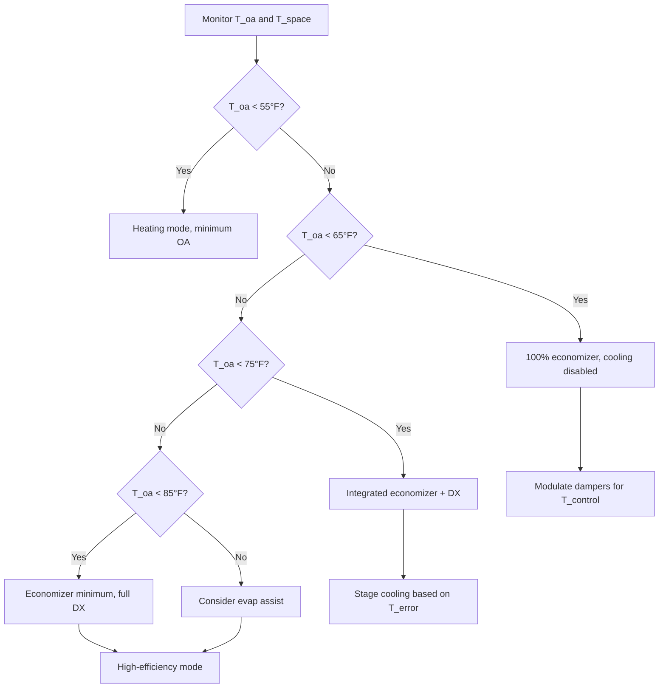
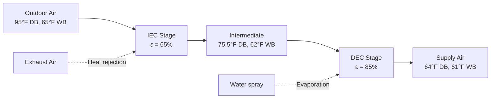
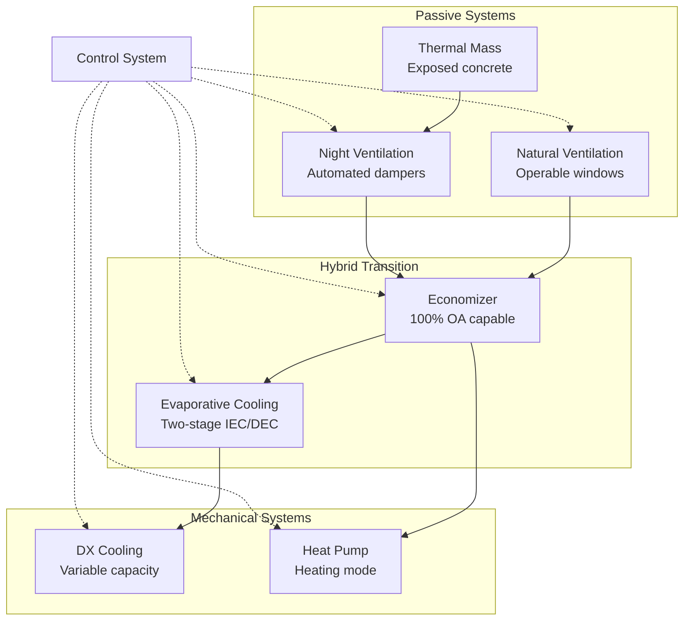

# Mediterranean Climate HVAC Strategies

Mediterranean climates (Köppen Csa/Csb) provide exceptional opportunities for energy-efficient HVAC design through hybrid strategies that exploit characteristic diurnal temperature swings of 25-35°F, extended shoulder seasons, and low humidity conditions. The following strategies leverage fundamental heat transfer principles to minimize mechanical conditioning while maintaining occupant comfort.

## Economizer-Dominant System Design

The substantial free cooling potential in Mediterranean climates—typically 3,000-4,500 hours annually—justifies economizer systems as the primary HVAC strategy rather than supplemental features.

### Airside Economizer Fundamentals

Economizer operation replaces return air with outdoor air when outdoor conditions reduce cooling energy. The enthalpy comparison determines economizer activation:

$$
h_{oa} < h_{ra} - \Delta h_{threshold}
$$

Where:
- $h_{oa}$ = outdoor air enthalpy (BTU/lb)
- $h_{ra}$ = return air enthalpy (BTU/lb)
- $\Delta h_{threshold}$ = control differential (typically 2-3 BTU/lb)

For Mediterranean climates with dry summers, simplified dry-bulb control proves more reliable than enthalpy control:

$$
T_{oa} < T_{setpoint} - \Delta T_{differential}
$$

Typical control setpoint: 65-70°F with 3-5°F differential.

### Economizer Sizing Requirements

Standard economizer systems provide 15-25% outdoor air capacity. Mediterranean climate applications require 100% outdoor air capability for maximum free cooling hours.

**Design Air Change Rates:**

| Building Type | Minimum OA (CFM/person) | Economizer Capacity (ACH) | Supply Fan Sizing Factor |
|---------------|------------------------|---------------------------|--------------------------|
| Office | 15-20 | 4-6 | 1.25-1.35 |
| Retail | 10-15 | 3-5 | 1.20-1.30 |
| Restaurant | 20-30 | 6-8 | 1.30-1.40 |
| School classroom | 15-20 | 5-7 | 1.25-1.35 |

The increased outdoor air capacity requires proportional increases in supply fan power. Variable frequency drives (VFDs) recover this energy penalty during minimum outdoor air operation.

### Control Sequence Optimization

**Integrated Control Benefits:**
- Eliminates mechanical cooling during 35-50% of occupied hours
- Reduces peak demand by 0.8-1.5 W/ft²
- Extends compressor life through reduced runtime
- Maintains ventilation air quality requirements

## Evaporative Cooling Integration

Low humidity conditions (20-40% RH) during cooling season create ideal conditions for evaporative cooling. The substantial wet-bulb depression (20-30°F) enables significant sensible cooling through water evaporation.

### Evaporative Cooling Physics

Direct evaporative cooling follows the psychrometric process along constant wet-bulb temperature lines. The cooling effectiveness quantifies performance:

$$
\varepsilon_{evap} = \frac{T_{db,in} - T_{db,out}}{T_{db,in} - T_{wb,in}}
$$

Where:
- $\varepsilon_{evap}$ = evaporative cooling effectiveness (0.70-0.95 typical)
- $T_{db,in}$ = entering dry-bulb temperature (°F)
- $T_{db,out}$ = leaving dry-bulb temperature (°F)
- $T_{wb,in}$ = entering wet-bulb temperature (°F)

**Example Calculation:**

Given Mediterranean summer conditions:
- Outdoor air: 95°F DB, 65°F WB
- Direct evaporative cooler effectiveness: 85%

$$
T_{db,out} = T_{db,in} - \varepsilon_{evap}(T_{db,in} - T_{wb,in})
$$

$$
T_{db,out} = 95°F - 0.85(95°F - 65°F) = 69.5°F
$$

This 25.5°F temperature reduction occurs with zero compressor energy, consuming only fan and pump power (0.1-0.2 kW/ton).

### Indirect Evaporative Cooling

Indirect evaporative cooling (IEC) provides sensible cooling without adding humidity to supply air. Heat exchanger surfaces separate wet and dry airstreams.

**IEC Performance:**

| Parameter | Typical Range | Design Value |
|-----------|---------------|--------------|
| Effectiveness | 55-75% | 65% |
| Wet-bulb approach | 8-15°F | 10°F |
| Pressure drop | 0.4-0.8 in. w.g. | 0.6 in. w.g. |
| Water consumption | 2-4 gal/ton-hr | 3 gal/ton-hr |
| Fan power | 0.15-0.25 kW/ton | 0.20 kW/ton |

The cooling capacity for IEC systems:

$$
Q_{IEC} = \dot{m}_{air} \cdot c_p \cdot \varepsilon_{IEC} \cdot (T_{db} - T_{wb})
$$

### Two-Stage Evaporative Systems

Two-stage systems combine indirect evaporative cooling followed by direct evaporative cooling, achieving wet-bulb approach temperatures of 2-5°F.

**Two-stage performance:**
- Supply air temperature: 62-68°F achievable from 95°F outdoor conditions
- Total effectiveness: 87-93% of wet-bulb depression
- Energy consumption: 0.15-0.30 kW/ton (vs. 1.0-1.2 kW/ton for DX cooling)
- Water consumption: 4-6 gallons per ton-hour

## Thermal Mass Utilization

Thermal mass moderates indoor temperature fluctuations by storing heat during peak periods and releasing heat during cool periods. The diurnal temperature swing in Mediterranean climates (25-35°F) provides ideal conditions for thermal mass strategies.

### Heat Storage Capacity

The thermal storage capacity of building mass:

$$
Q_{stored} = m \cdot c_p \cdot \Delta T = \rho \cdot V \cdot c_p \cdot \Delta T
$$

Where:
- $m$ = mass (lb)
- $c_p$ = specific heat capacity (BTU/lb·°F)
- $\Delta T$ = temperature swing (°F)
- $\rho$ = density (lb/ft³)
- $V$ = volume (ft³)

**Material Properties for Thermal Mass:**

| Material | Density (lb/ft³) | Specific Heat (BTU/lb·°F) | Volumetric Heat Capacity (BTU/ft³·°F) |
|----------|------------------|---------------------------|---------------------------------------|
| Concrete | 145 | 0.22 | 31.9 |
| Brick masonry | 120 | 0.24 | 28.8 |
| Stone | 165 | 0.21 | 34.7 |
| Gypsum board | 50 | 0.26 | 13.0 |
| Wood | 35 | 0.33 | 11.6 |

**Effective Thermal Mass Calculation:**

For a 2,000 ft² building with 6-inch exposed concrete slab:

$$
V = 2,000 \text{ ft}^2 \times 0.5 \text{ ft} = 1,000 \text{ ft}^3
$$

$$
Q_{stored} = 1,000 \text{ ft}^3 \times 31.9 \frac{\text{BTU}}{\text{ft}^3 \cdot °F} \times 10°F = 319,000 \text{ BTU}
$$

This thermal storage capacity equals 26.6 ton-hours of cooling, providing substantial peak load reduction.

### Thermal Mass Design Guidelines

**Maximize effectiveness through:**
- Expose concrete slabs and masonry walls to occupied spaces
- Maintain surface temperature within 68-75°F range during occupancy
- Couple thermal mass with night ventilation for daily recharge
- Position thermal mass to intercept solar radiation through windows
- Ensure mass surface area exceeds 1.5× floor area for optimal contact

**Performance metrics:**
- Peak cooling load reduction: 25-35% compared to lightweight construction
- Temperature swing reduction: 5-8°F in occupied spaces
- HVAC equipment downsizing potential: 15-25%
- Annual cooling energy reduction: 20-30%

## Night Ventilation Cooling

Night ventilation purges warm daytime air and charges thermal mass with cool outdoor air during unoccupied hours. The physics involves convective heat transfer from mass surfaces to ventilation air.

### Heat Transfer Fundamentals

The convective heat transfer rate from thermal mass to ventilation air:

$$
Q_{conv} = h_c \cdot A_s \cdot (T_s - T_a)
$$

Where:
- $h_c$ = convective heat transfer coefficient (BTU/hr·ft²·°F)
- $A_s$ = surface area of thermal mass (ft²)
- $T_s$ = surface temperature (°F)
- $T_a$ = air temperature (°F)

For forced convection during night ventilation, the convective coefficient:

$$
h_c = 0.99 \cdot V_{air}^{0.8}
$$

Where $V_{air}$ = air velocity across surface (ft/min), typically 50-150 ft/min for 8-12 ACH.

### Night Ventilation Control Strategy

**Activation criteria:**
1. Outdoor temperature < indoor temperature - 5°F
2. Outdoor temperature > 50°F (prevent overcooling)
3. Time period: 10:00 PM to 6:00 AM typical
4. Security system integration required

**Ventilation rates:**
- Minimum effective: 6 ACH
- Optimal range: 8-12 ACH
- High thermal mass buildings: 12-15 ACH

**Target discharge temperatures:**

$$
T_{discharge} = T_{space,initial} - \frac{Q_{removed}}{\dot{m}_{air} \cdot c_p}
$$

Target space temperature before occupancy: 68-70°F

### Energy Impact Quantification

Night ventilation effectiveness depends on outdoor temperature and ventilation rate. For Mediterranean climates with typical summer night temperatures of 60-70°F:

**Daily cooling energy displaced:**

$$
Q_{daily} = \dot{V} \cdot \rho \cdot c_p \cdot (T_{space} - T_{oa}) \cdot t_{operating}
$$

For 20,000 CFM operating 8 hours overnight:

$$
Q_{daily} = 20,000 \frac{\text{ft}^3}{\text{min}} \times 0.075 \frac{\text{lb}}{\text{ft}^3} \times 0.24 \frac{\text{BTU}}{\text{lb} \cdot °F} \times 12°F \times 480 \text{ min}
$$

$$
Q_{daily} = 12.4 \text{ million BTU} = 1,033 \text{ ton-hours}
$$

**Fan energy consumption:**

Operating 20,000 CFM at 0.5 in. w.g. static pressure with 60% fan efficiency:

$$
P_{fan} = \frac{Q \cdot \Delta P}{6,356 \cdot \eta_{fan}} = \frac{20,000 \times 0.5}{6,356 \times 0.60} = 2.62 \text{ kW}
$$

Energy ratio: 1,033 ton-hours cooling / (2.62 kW × 8 hrs) = 49.3 ton-hours per kWh

This represents exceptional efficiency compared to mechanical cooling at 0.8-1.2 ton-hours per kWh.

## Hybrid System Architecture

Optimal Mediterranean climate HVAC combines mechanical systems with passive strategies in coordinated control sequences.

### System Component Integration

### Seasonal Operating Modes

**Summer Operation (June-September):**
1. Night ventilation: 10 PM - 6 AM when $T_{oa}$ < 70°F
2. Morning economizer: 6 AM - 10 AM when $T_{oa}$ < 75°F
3. Evaporative assist: 10 AM - 4 PM when $T_{oa}$ < 95°F
4. Mechanical cooling: Peak hours when $T_{oa}$ > 95°F or evap insufficient
5. Evening economizer: 6 PM - 10 PM when $T_{oa}$ < 80°F

**Shoulder Season (March-May, October-November):**
1. Natural ventilation: All hours when $65°F < T_{oa} < 75°F$
2. 100% economizer: When cooling required and $T_{oa}$ < 70°F
3. Minimal mechanical operation: Only during exceptional conditions

**Winter Operation (December-February):**
1. Heat pump heating: When $T_{oa}$ < 65°F
2. Minimum ventilation: 15-20 CFM per person
3. Heat recovery: ERV integration during continuous ventilation

### Performance Benchmarks

Well-executed hybrid strategies in Mediterranean climates achieve:

**Energy Intensity Targets:**
- Residential: 3-6 kWh/ft²/year HVAC energy
- Small office: 5-9 kWh/ft²/year HVAC energy
- Retail: 8-14 kWh/ft²/year HVAC energy

**Mechanical Cooling Fraction:**
- Hours of mechanical cooling: 800-1,200 hours annually
- Hours of economizer/free cooling: 3,000-4,500 hours annually
- Mechanical cooling energy: 40-55% of total HVAC energy
- Free cooling contribution: 45-60% of cooling requirements

## Design Implementation Checklist

**Economizer Systems:**
- Size supply fans for 100% outdoor air at design airflow
- Specify modulating dampers with low-leakage construction
- Install dry-bulb temperature sensors in representative locations
- Program integrated economizer-DX control sequences
- Verify damper operation and sensor calibration during commissioning

**Evaporative Cooling:**
- Evaluate two-stage systems for peak load reduction
- Size water treatment systems for local water quality
- Provide separate electrical circuits for evaporative components
- Install drift eliminators for direct evaporative stages
- Monitor water consumption and adjust bleed rates seasonally

**Thermal Mass:**
- Expose minimum 1.5× floor area of thermal mass surfaces
- Specify light-colored or reflective finishes for solar control
- Integrate radiant heating/cooling for enhanced mass coupling
- Avoid carpeting or suspended ceilings over thermal mass
- Model thermal mass impacts using hourly energy simulation

**Night Ventilation:**
- Install motorized dampers with fail-safe spring return
- Integrate security systems with ventilation controls
- Provide inlet air filtration (MERV 8 minimum)
- Commission night ventilation sequences with occupied override
- Monitor space temperatures to verify discharge targets

Mediterranean climates reward comprehensive integration of passive and active HVAC strategies. Systems designed around economizer operation, evaporative cooling, thermal mass utilization, and night ventilation reduce mechanical cooling energy by 50-70% compared to conventional all-mechanical approaches while maintaining superior comfort conditions.
