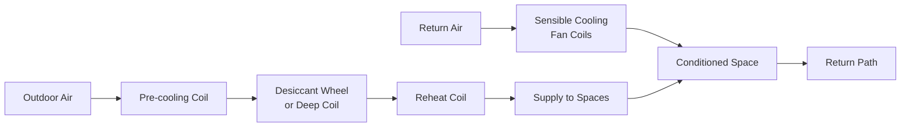

## Overview

Tropical climate HVAC design addresses the fundamental challenge of high sensible and latent loads resulting from elevated ambient temperatures (typically 25-35°C) combined with relative humidity levels of 70-90%. The thermodynamic requirements differ substantially from temperate climate applications, demanding specialized equipment selection, enhanced dehumidification capacity, and moisture control strategies to maintain acceptable indoor conditions.

The primary engineering challenge stems from the high moisture content in outdoor air, requiring substantial energy input for condensation and removal. Standard cooling equipment sized for sensible loads alone proves inadequate, resulting in elevated indoor humidity, microbial growth, and occupant discomfort.

## Psychrometric Characteristics

### Outdoor Design Conditions

Tropical climates exhibit distinctive psychrometric properties that govern system design:

| Parameter | Typical Range | Design Impact |
|-----------|---------------|---------------|
| Dry-bulb temperature | 28-34°C | Moderate sensible cooling load |
| Wet-bulb temperature | 24-28°C | High latent load indicator |
| Relative humidity | 70-90% | Severe dehumidification requirement |
| Dew point temperature | 22-26°C | Sets minimum achievable humidity |
| Specific humidity | 16-22 g/kg | High moisture removal demand |

The wet-bulb temperature depression (difference between dry-bulb and wet-bulb) typically ranges from 4-8°C, significantly lower than temperate climates (8-15°C), limiting evaporative cooling effectiveness.

### Latent Load Dominance

The latent cooling load in tropical applications frequently equals or exceeds the sensible load. The total cooling load is:

$$Q_{total} = Q_{sensible} + Q_{latent}$$

where:

$$Q_{latent} = \dot{m}_{air} \times h_{fg} \times \Delta W$$

- $\dot{m}_{air}$ = mass flow rate of air (kg/s)
- $h_{fg}$ = latent heat of vaporization (2,450 kJ/kg at 20°C)
- $\Delta W$ = change in humidity ratio (kg water/kg dry air)

The sensible heat ratio (SHR) typically ranges from 0.50 to 0.65 in tropical climates, compared to 0.75-0.85 in temperate zones:

$$SHR = \frac{Q_{sensible}}{Q_{total}}$$

## Dehumidification Strategies

### Enhanced Cooling Coil Design

Standard direct expansion (DX) coils must be modified to achieve adequate moisture removal:

**Coil face velocity reduction**: Limiting face velocity to 1.5-2.0 m/s (versus 2.5-3.0 m/s standard) increases contact time between air and cold surface, enhancing condensation. This reduces coil capacity per unit area but significantly improves dehumidification performance.

**Lower evaporating temperature**: Operating refrigerant evaporating temperatures at 4-6°C (versus 7-10°C standard) increases the temperature differential between the coil surface and dew point, driving greater condensation rates. The moisture removal rate follows:

$$\dot{m}_{condensate} = \dot{m}_{air} \times (W_{in} - W_{out})$$

where $W$ represents humidity ratio at coil inlet and outlet conditions.

**Deep coil configurations**: 6-8 row coils provide extended surface contact compared to standard 3-4 row designs, increasing latent capacity by 30-50%.

### Dedicated Outdoor Air Systems (DOAS)

DOAS configurations separate ventilation air treatment from space conditioning, optimizing each function independently:

The DOAS unit processes 100% outdoor air through enhanced dehumidification equipment, delivering air at 12-15°C and 40-50% RH. Parallel sensible cooling devices (chilled beams, fan coils) handle space loads without introducing additional moisture.

This approach reduces total system energy consumption by 20-35% compared to conventional mixed-air systems by eliminating the energy penalty of overcooling and reheating to achieve humidity control.

### Desiccant Dehumidification

Solid or liquid desiccant systems remove moisture through absorption rather than condensation, particularly effective when combined with waste heat for regeneration:

The desiccant moisture removal rate depends on vapor pressure differential:

$$\dot{m}_{water} = k \times A \times (P_{v,air} - P_{v,surface})$$

- $k$ = mass transfer coefficient
- $A$ = desiccant surface area
- $P_{v}$ = water vapor partial pressure

Silica gel, molecular sieves, and lithium chloride solutions achieve outlet dew points of 10-15°C from inlet conditions of 25-28°C. Regeneration requires thermal energy at 60-80°C, suitable for solar thermal, waste heat recovery, or gas-fired systems.

## Equipment Selection Considerations

### Refrigeration Cycle Modifications

Standard air conditioning equipment requires modification for tropical performance:

| Modification | Purpose | Typical Impact |
|--------------|---------|----------------|
| Oversized evaporator coils | Lower surface temperature | +25-40% latent capacity |
| Variable-speed compressors | Part-load dehumidification | +15-25% efficiency |
| Hot gas bypass | Minimum cooling during high humidity | Maintains coil temperature |
| Subcooling circuits | Increased refrigerant effect | +5-10% system capacity |

### Air Distribution Design

Supply air conditions must prevent condensation on diffusers and ductwork while maintaining comfort:

**Supply air temperature**: 12-14°C supply air temperature (versus 10-12°C in dry climates) reduces surface condensation risk. The surface temperature of ductwork and diffusers must remain above the space dew point to prevent moisture accumulation.

**Airflow rates**: Higher volumetric flow rates (0.012-0.015 m³/s per kW cooling) compensate for reduced temperature differential, maintaining adequate air circulation while controlling humidity.

## Ventilation and Infiltration Control

### Outdoor Air Load Impact

Ventilation air represents the dominant load component in tropical climates. For each liter per second of outdoor air at 32°C/80% RH conditioned to 24°C/50% RH:

$$Q_{OA} = \dot{V} \times \rho_{air} \times \Delta h$$

where $\Delta h$ (specific enthalpy change) typically equals 25-30 kJ/kg, compared to 10-15 kJ/kg in temperate climates.

This 2-3x enthalpy differential necessitates:

- Demand-controlled ventilation (DCV) using CO₂ sensors to minimize excess outdoor air
- Energy recovery ventilators (ERV) recovering 60-75% of exhaust air energy
- Vestibules and air curtains at building entries to reduce infiltration

### Building Envelope Strategies

Moisture migration through building assemblies requires vapor barrier placement on the exterior (warm side) to prevent condensation within insulation:

**Critical pressure differential**: Maintaining slight positive pressure (+2 to +5 Pa) in conditioned spaces relative to outdoors prevents humid air infiltration through envelope penetrations.

**Thermal bridging elimination**: Continuous insulation and thermal breaks prevent localized cold surfaces where condensation occurs at indoor humidity levels.

## Energy Efficiency Approaches

### Elevated Chilled Water Temperatures

Increasing chilled water supply temperature from conventional 5-7°C to 10-12°C improves chiller efficiency by 15-25% through higher evaporating pressure. The Carnot coefficient of performance relationship:

$$COP_{Carnot} = \frac{T_{evap}}{T_{cond} - T_{evap}}$$

demonstrates that each 1°C increase in evaporating temperature ($T_{evap}$) yields approximately 2-3% efficiency improvement.

This requires larger heat exchange surfaces (chilled beams, radiant panels, oversized coils) but reduces annual energy consumption substantially. Combined with dedicated dehumidification, this approach maintains comfort while optimizing thermodynamic efficiency.

### Free Cooling Limitations

Night sky radiation and ambient temperature reduction provide minimal benefit in tropical climates due to:

- Limited diurnal temperature swing (typically 6-10°C versus 15-20°C in arid climates)
- High nighttime humidity preventing effective evaporative cooling
- Elevated wet-bulb temperatures limiting cooling tower performance

Water-side economizers achieve marginal savings (5-10% of annual cooling energy) compared to 20-40% in temperate climates.

## Microbial Growth Prevention

High ambient humidity creates conditions conducive to mold, mildew, and bacterial proliferation. Critical control measures include:

**Ductwork design**: Eliminating horizontal runs where condensate accumulates, providing minimum 1:200 slope toward drain points, and using antimicrobial duct liner materials.

**Drain pan maintenance**: Oversized condensate pans with positive drainage, UV-C germicidal irradiation, and biocide treatment prevent biofilm formation.

**Indoor humidity limits**: ASHRAE Standard 55 recommends maintaining indoor relative humidity below 65% to prevent mold growth, requiring robust dehumidification capacity during all operating modes.

## ASHRAE Standards Application

ASHRAE Standard 169-2020 classifies tropical climates as Climate Zone 0A (very hot, humid), requiring:

- Minimum SEER 14-16 for unitary equipment (versus 13 minimum in temperate zones)
- Enhanced envelope requirements limiting moisture transmission
- Mandatory ventilation air dehumidification for buildings exceeding 500 m² floor area

ASHRAE Standard 62.1 ventilation rates must be tempered with energy recovery to manage the extreme outdoor air load. The standard permits reduced ventilation rates when implementing demand-controlled ventilation with direct occupancy measurement.

## Conclusion

Successful HVAC design for tropical climates requires fundamental shifts from conventional temperate climate approaches. Latent load management through enhanced dehumidification, careful equipment selection optimizing sensible heat ratios, and building envelope strategies preventing moisture infiltration form the engineering foundation. The thermodynamic penalties of high ambient humidity demand energy recovery, elevated chilled water temperatures, and dedicated outdoor air treatment to achieve acceptable performance and efficiency. Recognition of climate-specific psychrometric characteristics and application of appropriate design principles enable comfortable, healthy indoor environments while managing energy consumption in tropical regions.
