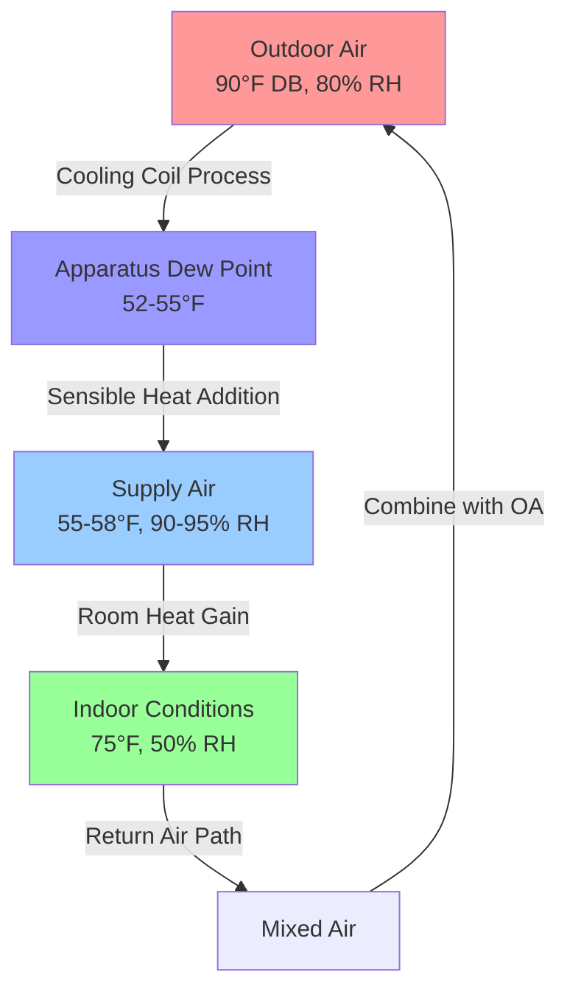

## Defining Tropical Climate Conditions

Tropical climates present unique HVAC design challenges characterized by elevated temperatures, high absolute humidity, minimal seasonal variation, and substantial solar radiation. ASHRAE climate zone classification places most tropical regions in zones 1A and 2A, denoting hot-humid conditions with cooling degree days exceeding 5000°F-days annually.

The fundamental design parameters for tropical HVAC systems diverge significantly from temperate climate requirements due to the thermodynamic properties of warm, moisture-laden air and the resulting impact on heat transfer processes.

## Thermodynamic Properties of Tropical Air

### Temperature and Humidity Characteristics

Tropical climates maintain consistently high dry-bulb temperatures between 75°F and 95°F (24°C to 35°C) year-round, with diurnal variations typically ranging from 15°F to 25°F (8°C to 14°C). The critical design distinction lies in the elevated wet-bulb temperatures, which commonly exceed 75°F (24°C) during peak conditions.

Absolute humidity levels in tropical regions frequently reach 0.020 to 0.025 lb moisture per lb dry air (140 to 175 grains/lb), corresponding to dew point temperatures of 70°F to 78°F (21°C to 26°C). This elevated moisture content fundamentally alters the psychrometric processes required for comfort conditioning.

**Key Tropical Climate Parameters:**

| Parameter | Typical Range | Design Impact |
|-----------|---------------|---------------|
| Dry-bulb temperature | 85-95°F (29-35°C) | Sensible cooling load |
| Wet-bulb temperature | 75-82°F (24-28°C) | Equipment capacity limits |
| Relative humidity | 70-90% | Latent load magnitude |
| Dew point temperature | 70-78°F (21-26°C) | Minimum achievable supply conditions |
| Solar radiation | 250-350 Btu/h·ft² | Envelope load contribution |

### Psychrometric Process Requirements

The psychrometric transformation from outdoor to indoor conditions in tropical climates requires substantial dehumidification. For a typical comfort condition of 75°F (24°C) and 50% RH, starting from outdoor conditions of 90°F (32°C) and 80% RH, the process involves:

Sensible heat removal:

$$Q_s = \dot{m} \times c_p \times (T_{outdoor} - T_{indoor})$$

Latent heat removal:

$$Q_l = \dot{m} \times h_{fg} \times (W_{outdoor} - W_{indoor})$$

Where the humidity ratio difference typically equals 0.010 to 0.015 lb/lb, requiring significant moisture extraction.

The sensible heat ratio (SHR) for tropical applications typically ranges from 0.60 to 0.75, substantially lower than the 0.80 to 0.90 values common in temperate climates. This drives equipment selection toward systems optimized for latent capacity.

## Heat Load Distribution

### Sensible vs. Latent Load Composition

Tropical building heat loads exhibit higher latent-to-sensible ratios than temperate climate structures. A typical commercial building in a tropical climate experiences the following load distribution:

**Tropical Climate Heat Load Breakdown:**

| Load Component | Percentage | Primary Driver |
|----------------|------------|----------------|
| Solar radiation (envelope) | 25-35% | High incident angle, extended exposure |
| Transmission (conduction) | 15-20% | Small temperature differential |
| Infiltration sensible | 5-10% | Minimal temperature difference |
| Infiltration latent | 15-25% | High humidity ratio difference |
| Ventilation latent | 15-20% | Code-required outdoor air |
| Internal gains | 20-25% | Occupancy, equipment, lighting |

The infiltration and ventilation latent loads represent 30-45% of total cooling load, compared to 15-25% in moderate climates. This shift occurs because the enthalpy difference between indoor and outdoor air derives primarily from moisture content rather than temperature.

### Outdoor Air Ventilation Impact

ASHRAE Standard 62.1 ventilation requirements impose substantial penalties in tropical climates. The enthalpy of outdoor air at 90°F DB and 75°F WB equals approximately 40 Btu/lb, while indoor air at 75°F and 50% RH contains roughly 28 Btu/lb. Each CFM of outdoor air therefore adds:

$$\dot{Q}_{oa} = \dot{V} \times \rho \times \Delta h \times 60 = CFM \times 4.5 \times (40-28) = 54 \text{ Btu/h per CFM}$$

This 54 Btu/h per CFM load compares to 25-35 Btu/h per CFM in temperate climates, effectively doubling the ventilation load contribution.

## Solar Radiation Characteristics

Tropical locations near the equator experience solar radiation patterns distinct from higher latitudes. The solar altitude angle remains elevated year-round, varying between 60° and 90° at solar noon. This produces:

- High incident radiation on horizontal surfaces (roofs)
- Reduced incident angles on vertical surfaces during midday
- Extended daylight hours with minimal seasonal variation
- Consistent daily solar gain patterns

Peak solar heat gain through fenestration occurs during morning and afternoon hours when sun angles strike east and west facades directly. South-facing surfaces (in northern hemisphere tropics) receive minimal direct radiation, while north-facing surfaces experience some direct exposure depending on latitude.

The solar heat gain coefficient (SHGC) for glazing becomes critical, with recommended values below 0.30 for most orientations. The cooling load temperature difference (CLTD) method requires adjustment factors accounting for the continuous high ambient temperature and reduced diurnal temperature swing.

## Material and Equipment Performance Considerations

### Psychrometric Efficiency Constraints

Cooling equipment operates at reduced efficiency in tropical climates due to elevated condensing temperatures. Air-cooled condensers reject heat to ambient air at 90-100°F (32-38°C), compared to 85-95°F (29-35°C) design conditions in temperate zones. The resulting increase in condensing temperature from approximately 105°F to 120°F reduces coefficient of performance (COP) by 15-25% according to the Carnot efficiency relationship:

$$COP_{ideal} = \frac{T_{evap}}{T_{cond} - T_{evap}}$$

Water-cooled systems gain advantage in tropical climates, as wet-bulb temperatures typically remain 10-15°F below dry-bulb values, enabling lower condensing temperatures through evaporative cooling in cooling towers.

### Moisture Control Requirements

Continuous high humidity accelerates corrosion, promotes biological growth, and degrades building materials. HVAC systems must maintain indoor relative humidity below 60% to prevent mold proliferation and material degradation. This requirement necessitates:

- Deep coil apparatus dew points (50-55°F)
- Adequate coil face velocity control (under 500 fpm)
- Effective condensate drainage and management
- Reheat capability for low-load conditions
- Continuous air circulation during unoccupied periods

The deep dehumidification process inherently provides substantial subcooling, requiring careful supply air temperature management to avoid overcooling occupied spaces during part-load operation.

## Design Temperature Selection

ASHRAE Handbook - Fundamentals provides climatic design data based on statistical analysis of weather records. For tropical locations, the 0.4% and 1.0% design dry-bulb temperatures typically differ by only 2-3°F, reflecting the minimal temperature variability. The critical design parameter becomes the mean coincident wet-bulb temperature (MCWB), which governs equipment capacity and efficiency.

Selecting design conditions requires balancing first cost, operating cost, and comfort reliability. A 1.0% design condition indicates the parameter exceeds the design value for approximately 88 hours annually (1% of 8760 hours), representing acceptable risk for most applications.

The wet-bulb temperature determines theoretical minimum temperatures achievable through evaporative processes and establishes performance limits for cooling towers, evaporative condensers, and direct/indirect evaporative coolers. In tropical climates where wet-bulb temperatures exceed 75°F, these technologies provide minimal benefit, shifting design preference toward mechanical refrigeration systems.

---

**Related Topics:**
- Dehumidification strategies for high-humidity climates
- Tropical HVAC system selection criteria
- Energy recovery in hot-humid climates
- Mold and moisture control in tropical buildings
