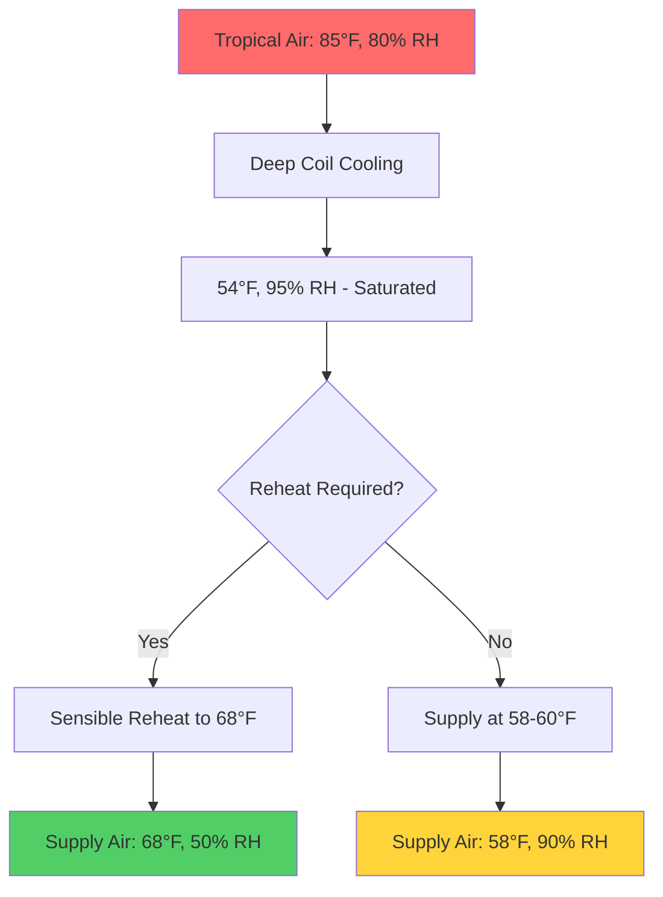
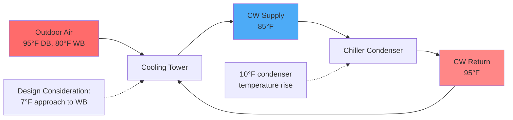

Equipment operation in tropical climates presents unique challenges driven by sustained high temperatures, elevated humidity levels, intense solar radiation, and corrosive atmospheric conditions. Proper equipment selection and specification requires understanding the physical mechanisms that degrade performance and component longevity in these environments.

## Capacity Derating for Tropical Conditions

HVAC equipment rated at standard conditions (95°F outdoor dry-bulb for cooling) requires capacity adjustment when operating at tropical design conditions, which typically exceed 95°F with coincident wet-bulb temperatures of 80-82°F.

### Refrigeration Cycle Performance

The Carnot coefficient of performance for cooling systems decreases as the temperature lift increases:

$$
COP_{Carnot} = \frac{T_{evap}}{T_{cond} - T_{evap}}
$$

Where temperatures are in absolute units (Rankine or Kelvin). For a condensing temperature increase from 105°F to 115°F with constant evaporator temperature:

$$
\Delta COP = \frac{COP_{T1}}{COP_{T2}} = \frac{T_{cond,2}(T_{cond,1} - T_{evap})}{T_{cond,1}(T_{cond,2} - T_{evap})}
$$

Practical air-cooled equipment experiences capacity reductions of 8-15% and efficiency losses of 10-20% at elevated tropical ambient conditions compared to standard rating conditions.

| Equipment Type | Capacity Loss at 105°F | Capacity Loss at 115°F | Power Increase at 115°F |
|----------------|------------------------|------------------------|-------------------------|
| Air-Cooled Chiller | 5-8% | 12-18% | 15-25% |
| Rooftop Unit | 6-10% | 14-20% | 18-28% |
| Split System | 8-12% | 15-22% | 20-30% |
| VRF System | 6-9% | 13-19% | 16-26% |

## High Latent Load Management

Tropical climates impose sensible heat ratios (SHR) of 0.65-0.75, significantly lower than the 0.75-0.80 typical in temperate climates. The latent cooling requirement is:

$$
q_{latent} = \dot{m} \cdot h_{fg} \cdot (W_1 - W_2) = 1.08 \cdot CFM \cdot (W_1 - W_2)
$$

Where $W$ is humidity ratio in lb water/lb dry air and $h_{fg}$ is the latent heat of vaporization (approximately 1060 BTU/lb at typical conditions).

### Equipment Selection for Latent Capacity

Standard DX equipment may achieve SHR values of 0.75-0.85, insufficient for tropical applications. Enhanced latent capacity requires:

- **Reduced airflow**: Lowering CFM/ton from 400 to 350 increases coil moisture removal
- **Additional coil rows**: 6-8 row coils versus standard 3-4 rows
- **Lower coil entering air temperature**: Face-split configurations or dedicated dehumidification
- **Subcooling and reheat**: Overcool to remove moisture, then reheat to avoid overcooling

## Corrosion Protection Requirements

Tropical coastal environments combine high salinity (chloride concentrations exceeding 100 ppm within 1 km of coastline) with sustained high humidity, creating aggressive corrosive conditions.

### Material Specifications

| Component | Standard Material | Tropical Upgrade | Corrosion Mechanism |
|-----------|------------------|------------------|---------------------|
| Coil Fins | Aluminum | Pre-coated aluminum or copper | Galvanic corrosion, chloride attack |
| Coil Tubes | Copper | Copper with enhanced wall thickness | Formicary corrosion |
| Fasteners | Zinc-plated steel | 316 stainless steel | Crevice corrosion |
| Cabinets | Painted galvanized steel | Powder-coated galvanized or aluminum | Atmospheric corrosion |
| Condensate Pans | Galvanized steel | Stainless steel 304/316 | Galvanic corrosion |

### Protective Coatings

Coil coating systems provide barrier protection against atmospheric corrosants. Performance depends on coating thickness and adhesion:

- **E-coating (electrophoretic)**: 0.8-1.2 mil thickness, uniform coverage
- **Powder coating**: 2-4 mil thickness, superior barrier properties
- **Phenolic coatings**: 0.5-1.0 mil, gold-standard for corrosion resistance

ASHRAE Standard 188 requires corrosion-resistant materials for systems with extended outdoor air exposure in coastal or industrial environments.

## Condensate Management

High latent loads produce condensate generation rates of 6-10 gallons per ton per day, compared to 2-4 gallons in temperate climates. The condensate production rate is:

$$
\dot{m}_{condensate} = \frac{q_{latent}}{h_{fg}} = \frac{CFM \cdot 1.08 \cdot (W_1 - W_2)}{1060}
$$

For a 10-ton unit removing moisture from 0.020 to 0.010 lb/lb at 3,500 CFM:

$$
\dot{m}_{condensate} = \frac{3500 \cdot 1.08 \cdot (0.020 - 0.010)}{1060} = 0.036 \text{ lb/min} = 2.6 \text{ gal/hr}
$$

### Drainage System Design

- **Trap depth**: Minimum depth equal to system static pressure plus 1 inch (H = P/0.036 for inches of trap per inch w.c. pressure)
- **Slope**: Minimum 1/8 inch per foot, 1/4 inch preferred for reliability
- **Pipe sizing**: 3/4 inch minimum diameter per ton for indirect drainage
- **Overflow protection**: Secondary drain pans with independent drainage and monitoring

## Filtration Requirements

High particulate and biological loads in tropical climates necessitate enhanced filtration. Outdoor particle concentrations in tropical urban areas routinely exceed 50 μg/m³ PM2.5, with biological aerosol concentrations 2-5 times higher than temperate regions.

### Filter Specification

| Application | Minimum MERV | Preferred MERV | Replacement Interval |
|-------------|--------------|----------------|----------------------|
| Residential | 8 | 11 | 60-90 days |
| Commercial Office | 11 | 13 | 90-120 days |
| Healthcare | 14 | 16 | 180 days |
| Critical Environment | 17 (HEPA) | 17 (HEPA) | Annual |

Pressure drop across filters increases more rapidly in high-humidity conditions due to hygroscopic particle growth. Design static pressure should account for 50% higher end-of-life pressure drop than temperate climate applications.

## Heat Exchanger Sizing

Elevated wet-bulb temperatures reduce the temperature difference driving heat transfer in both evaporators and condensers. The log-mean temperature difference (LMTD) for counterflow heat exchangers:

$$
LMTD = \frac{(T_{h,in} - T_{c,out}) - (T_{h,out} - T_{c,in})}{\ln\left(\frac{T_{h,in} - T_{c,out}}{T_{h,out} - T_{c,in}}\right)}
$$

For condenser water systems, approach temperatures to wet-bulb must account for the reduced driving force. A cooling tower with 78°F wet-bulb may only achieve 85-87°F condenser water supply versus 80-82°F possible with 70°F wet-bulb in temperate climates.

## Electrical Considerations

High ambient temperatures derate electrical components and conductors. Conductor ampacity must be adjusted using correction factors from NEC Table 310.15(B)(2)(a). At 50°C ambient versus 30°C reference:

- Copper conductor ampacity: 0.82 correction factor
- Equipment terminal ratings: Often limited to 75°C termination class
- Transformer loading: Derate capacity by 1.5% per °C above rated ambient

Control electronics require environmental protection to IP65 or NEMA 4X standards in outdoor applications, with conformal coating for circuit boards exposed to high humidity.

## Refrigerant System Design

Elevated condensing temperatures increase discharge pressures and temperatures, requiring:

- **High-pressure cutout settings**: Adjusted 10-15% higher than temperate applications
- **Compressor cooling**: Enhanced oil cooling, liquid injection, or auxiliary cooling
- **Receiver sizing**: Increased capacity to accommodate greater charge migration
- **TXV selection**: Sized for higher pressure drops across the valve

Subcooling requirements increase by 2-4°F to ensure adequate liquid refrigerant quality entering expansion devices under high ambient conditions.

---

## References

- ASHRAE Handbook—HVAC Applications, Chapter 54: Tropical Climates
- ASHRAE Standard 62.1: Ventilation for Acceptable Indoor Air Quality
- ASHRAE Standard 188: Legionellosis—Risk Management for Building Water Systems
- ARI Standard 550/590: Performance Rating of Water-Chilling and Heat Pump Water-Heating Packages Using the Vapor Compression Cycle
