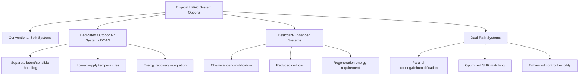

# HVAC Strategies for Tropical Climates

Tropical climate HVAC design requires fundamentally different approaches compared to temperate zones. The combination of high ambient temperatures (typically 75-95°F year-round), elevated humidity levels (60-100% RH), and minimal seasonal variation creates unique challenges centered on latent heat removal and moisture control rather than sensible cooling alone.

## Psychrometric Considerations

The tropical climate operates in a distinct region of the psychrometric chart where enthalpy remains consistently high. ASHRAE climate zones 0A and 1A encompass tropical and subtropical humid regions where cooling degree days exceed 9000°F-days annually.

The cooling load distribution differs markedly from temperate climates:

| Load Component | Temperate Climate | Tropical Climate |
|----------------|-------------------|------------------|
| Sensible Heat Ratio (SHR) | 0.75-0.85 | 0.55-0.70 |
| Latent Load Percentage | 15-25% | 30-45% |
| Design Outdoor Humidity Ratio | 60-100 gr/lb | 120-160 gr/lb |
| Indoor Moisture Generation | Moderate concern | Critical factor |

The total cooling load calculation must account for the elevated moisture removal requirement:

$$Q_{total} = Q_{sensible} + Q_{latent} = \dot{m} \times c_p \times \Delta T + \dot{m} \times h_{fg} \times \Delta W$$

Where $\Delta W$ represents the humidity ratio difference between outdoor and indoor air, often 80-100 grains per pound in tropical applications.

## Dehumidification-Focused Design

Conventional HVAC systems designed for temperate climates typically operate with supply air temperatures of 55-60°F. Tropical applications require lower apparatus dewpoint temperatures (45-50°F) to achieve adequate moisture removal:

$$\text{Moisture Removal Rate} = \dot{V} \times \rho \times (W_{return} - W_{supply})$$

Equipment selection must prioritize dehumidification capacity. Standard direct expansion (DX) systems often prove inadequate because:

- Oversized sensible capacity leads to short cycling
- Insufficient coil contact time prevents moisture removal
- Supply air may be too warm to adequately dehumidify spaces

## System Architecture Approaches

### Dedicated Outdoor Air Systems (DOAS)

DOAS architecture separates ventilation air treatment from space conditioning, allowing optimization of each function. The outdoor air stream undergoes deep dehumidification to 40-45°F dewpoint, then sensible heating to neutral temperature (65-70°F) before delivery to spaces.

Advantages in tropical applications:

- Independent latent and sensible control
- Energy recovery from exhaust air streams
- Reduced zone equipment sizing requirements
- Prevention of moisture infiltration through building envelope pressurization

The energy recovery effectiveness significantly impacts operating costs:

$$\eta_{enthalpy} = \frac{h_{outdoor} - h_{supply}}{h_{outdoor} - h_{exhaust}} \times 100\%$$

High-performance enthalpy wheels achieve 70-80% effectiveness, recovering both sensible and latent energy from exhaust streams.

## Ventilation Rate Optimization

ASHRAE Standard 62.1 prescribes minimum ventilation rates, but tropical climates require careful analysis of the outdoor air fraction impact. Each CFM of outdoor air introduces substantial latent load:

$$Q_{latent,OA} = 60 \times \dot{V}_{OA} \times \rho \times h_{fg} \times (W_{outdoor} - W_{indoor})$$

For a 1,000 CFM outdoor air requirement with outdoor conditions at 85°F DB/78°F WB (W = 140 gr/lb) and indoor setpoint 75°F/50% RH (W = 65 gr/lb):

$$Q_{latent,OA} = 60 \times 1000 \times 0.075 \times 1060 \times \frac{(140-65)}{7000} = 51,000 \text{ Btu/hr}$$

This represents 4.25 tons of latent cooling from ventilation air alone. Demand-controlled ventilation (DCV) using CO₂ sensors reduces this burden by 30-50% during partial occupancy periods.

## Equipment Selection Criteria

### Cooling Coil Design

Tropical climate coils require:

- 6-8 rows depth (versus 4-6 rows for temperate climates)
- Fin spacing 8-10 FPI to minimize moisture bridging
- Face velocity limited to 400-450 FPM for adequate contact time
- Refrigerant circuits optimized for low leaving air temperatures

The coil bypass factor must be minimized:

$$BF = \frac{t_{leaving} - t_{ADP}}{t_{entering} - t_{ADP}}$$

Target bypass factors of 0.05-0.10 ensure effective dehumidification, compared to 0.15-0.25 typical in temperate applications.

### Compressor and Refrigeration System

Lower evaporator temperatures (38-42°F) reduce refrigeration efficiency but remain necessary for moisture removal. The coefficient of performance (COP) decreases according to the Carnot limitation:

$$COP_{actual} = \eta_{carnot} \times \frac{T_{evap}}{T_{cond} - T_{evap}}$$

Variable-speed compressors mitigate efficiency losses by matching capacity to instantaneous loads while maintaining design dehumidification performance.

## Air Distribution Strategies

Supply air delivery must prevent moisture accumulation on surfaces and within the building envelope:

- Ceiling diffusers designed for horizontal throw patterns minimize cold air stagnation
- Supply air temperatures not below 58-60°F at diffusers to prevent condensation
- Return air pathways configured to avoid short-circuiting
- Slight positive pressurization (0.02-0.05 in. w.c.) prevents moisture infiltration

The mixing effectiveness directly impacts humidity control:

$$\epsilon_{mixing} = \frac{T_{room} - T_{supply}}{T_{exhaust} - T_{supply}}$$

Values below 0.85 indicate poor mixing and potential humidity stratification zones.

## Moisture Migration Prevention

Building envelope design integrates with HVAC strategy to prevent interstitial condensation. The vapor pressure differential drives moisture from high humidity exterior to conditioned interior:

$$\dot{m}_{vapor} = \frac{A \times \delta \times (p_{v,out} - p_{v,in})}{d}$$

Where $\delta$ represents material permeability. Vapor barriers on the exterior (warm) side of insulation prevent condensation within wall assemblies. HVAC systems must maintain indoor dewpoint below the coldest surface temperature in the building envelope to prevent visible condensation and mold growth.

## Control System Requirements

Tropical climate controls prioritize humidity management:

- Dual setpoint control (temperature and humidity)
- Supply air temperature reset based on space humidity levels
- Minimum on-time enforcement to ensure adequate dehumidification cycles
- Staged or variable-speed operation to prevent short cycling
- Integration with weather prediction for pre-cooling strategies

The control algorithm must balance energy efficiency against humidity control, often accepting slight overcooling to achieve target humidity levels during high latent load periods.

## Natural Ventilation Integration

Despite high humidity, natural ventilation provides comfort through elevated air movement when outdoor conditions permit. The cooling effect from air velocity follows:

$$\Delta T_{effective} = 1.8 \times (V_{air})^{0.5}$$

Where $V_{air}$ is in feet per minute. At 200 FPM, occupants perceive a 25°F reduction in effective temperature, enabling higher thermostat setpoints during mild periods.

## Drainage and Condensate Management

Tropical systems generate 2-4 gallons of condensate per ton-hour of operation. Drainage systems require:

- Oversized drain pans with 100% capacity margin
- P-trap sizing for high condensate flow rates
- Secondary drain pans with independent drainage paths
- Algaecide treatment or UV sterilization to prevent biological growth
- Condensate pumps with high-water alarms for critical applications

The condensate flow rate calculation:

$$\dot{V}_{condensate} = \frac{Q_{latent}}{h_{fg} \times \rho_{water}} = \frac{Q_{latent}}{8.33 \times 1060}$$

For a 10-ton system with 40% latent load, condensate generation reaches 5.4 gallons per hour during peak operation.

## Material Selection for Corrosion Resistance

High humidity environments accelerate corrosion of HVAC components. Material specifications must address moisture exposure:

| Component | Standard Material | Tropical Specification |
|-----------|------------------|------------------------|
| Coil Fins | Aluminum | Epoxy-coated aluminum or copper |
| Drain Pans | Galvanized steel | Stainless steel or polymer |
| Fasteners | Zinc-plated steel | Stainless steel 316 |
| Ductwork | Galvanized sheet metal | Pre-coated or fiber-reinforced polymer |
| Insulation Facings | Standard foil | Anti-microbial polymer films |

---

**Related Topics:** Tropical Climate Characteristics, Equipment Considerations, Mold Prevention, Energy Recovery Ventilation