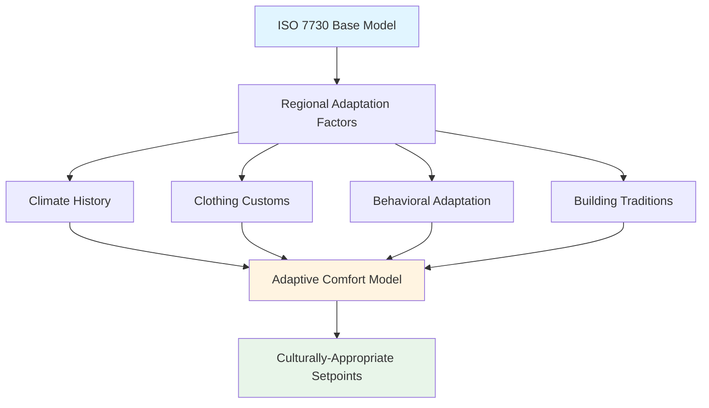
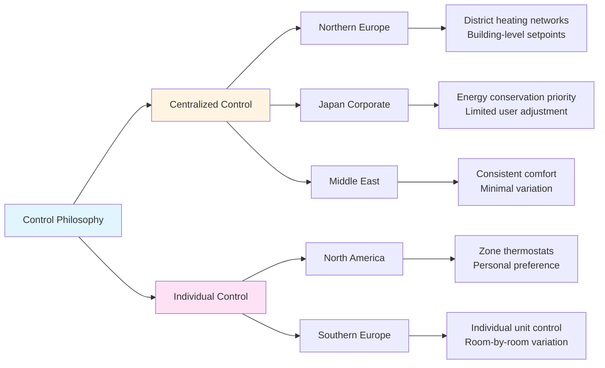
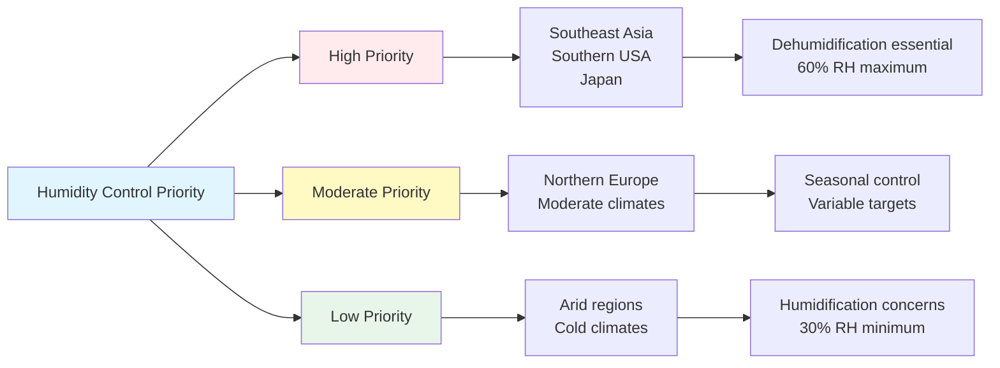
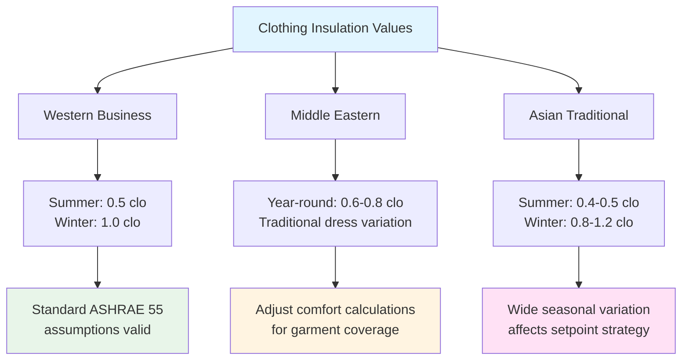

# Cross-Cultural Considerations in HVAC Design

Cultural factors significantly influence thermal comfort expectations, system operational preferences, and building climate control strategies. Understanding these variations is essential for international HVAC projects and multinational facility management.

## Cultural Comfort Expectations

Thermal comfort perception varies across cultures due to physiological adaptation, clothing customs, activity patterns, and historical building practices.

### Regional Comfort Temperature Preferences

| Region | Cooling Setpoint | Heating Setpoint | Humidity Preference | Basis |
|--------|------------------|------------------|---------------------|-------|
| North America | 72-76°F (22-24°C) | 68-72°F (20-22°C) | 40-60% RH | ASHRAE Standard 55 |
| Northern Europe | 68-72°F (20-22°C) | 68-70°F (20-21°C) | 30-50% RH | EN 16798-1 |
| Southern Europe | 75-78°F (24-26°C) | 66-70°F (19-21°C) | 40-65% RH | Adaptive comfort |
| Japan | 77-82°F (25-28°C) | 64-68°F (18-20°C) | 50-70% RH | JIS standards |
| Middle East | 70-75°F (21-24°C) | 72-75°F (22-24°C) | 30-50% RH | Local codes |
| Southeast Asia | 75-80°F (24-27°C) | Not applicable | 50-70% RH | Adaptive models |
| China | 74-79°F (23-26°C) | 64-68°F (18-20°C) | 40-70% RH | GB 50736 |

### ISO 7730 and Cultural Adaptation

ISO 7730 provides the Predicted Mean Vote (PMV) and Predicted Percentage of Dissatisfied (PPD) framework, but research shows systematic variations in comfort perception across cultures:

**PMV Adjustments by Region:**
- Southeast Asian populations: Neutral temperature approximately 1.5-2°C higher than ISO 7730 predictions
- Northern European populations: Close alignment with ISO 7730 predictions
- Middle Eastern populations: Higher tolerance for dry heat, lower humidity acceptance
- Japanese populations: Seasonal clothing adjustment more pronounced than Western populations

## Operational Practice Variations

### Window Opening Behavior

Cultural attitudes toward natural ventilation and window operation differ substantially:

| Culture | Window Opening Practice | Impact on HVAC |
|---------|------------------------|----------------|
| German | Frequent "stoßlüften" (shock ventilation) | Systems must accommodate rapid air changes |
| British | Preference for operable windows year-round | Conflicts with sealed building HVAC |
| American | Reliance on mechanical systems | Rarely open windows when HVAC operating |
| Japanese | Seasonal window opening traditions | Mixed-mode systems common |
| Scandinavian | High ventilation rate preference | Demand for fresh air override controls |

### Temperature Control Philosophy

**Centralized vs. Individual Control:**
- **Scandinavian/German approach:** District heating/cooling with limited individual control, emphasis on collective energy efficiency
- **North American approach:** Individual thermostats standard, personal comfort prioritized
- **Japanese approach:** Centralized control in offices with strong energy conservation culture, individual control in residences
- **Southern European approach:** High prevalence of individual split systems with autonomous control

## Design Standard Variations

### Air Movement Preferences

Acceptable air velocity varies significantly by culture and climate adaptation:

| Region | Summer Air Speed | Winter Air Speed | Rationale |
|--------|------------------|------------------|-----------|
| USA | <0.25 m/s (50 fpm) | <0.15 m/s (30 fpm) | Draft avoidance priority |
| Europe | <0.20 m/s (40 fpm) | <0.12 m/s (25 fpm) | Conservative approach |
| Tropical Asia | 0.5-1.0 m/s (100-200 fpm) | Not applicable | Elevated air speed cooling |
| Middle East | <0.30 m/s (60 fpm) | <0.20 m/s (40 fpm) | Moderate air movement |

Elevated air speed cooling strategies are culturally acceptable in hot-humid climates where populations adapted to natural ventilation conditions.

### Humidity Control Priorities

## Energy Conservation Culture

Cultural attitudes toward energy use dramatically affect HVAC operational strategies:

### Energy Use Behavioral Factors

| Culture | Conservation Priority | Typical Behavior | System Impact |
|---------|----------------------|------------------|---------------|
| Japanese | Very high | Aggressive setpoints (28°C summer), limited hours | Minimalist HVAC operation |
| German/Scandinavian | High | High-performance envelopes, optimal control | Efficient system utilization |
| North American | Moderate | Comfort-focused, increasing efficiency awareness | Larger capacity, longer runtime |
| Middle Eastern | Variable | Low energy costs reduce conservation incentive | Oversized systems common |
| Southern European | Moderate-High | Economic drivers, siesta heat avoidance | Intermittent operation patterns |

**Cool Biz and Warm Biz Campaigns (Japan):**
The Japanese government initiatives establishing 28°C (82°F) summer and 20°C (68°F) winter office temperatures demonstrate cultural acceptance of wider comfort bands for energy conservation. Similar programs exist in other Asian countries but with less stringent adherence.

## Clothing and Activity Considerations

### Seasonal Clothing Adaptation

Traditional and religious clothing practices affect thermal comfort calculations:
- Middle Eastern thobe/abaya: Higher coverage but lightweight fabrics
- South Asian business attire: Often higher insulation than Western equivalents
- Japanese seasonal clothing traditions: Pronounced winter-summer variation

### Metabolic Rate Assumptions

Activity patterns and work culture variations affect metabolic rate assumptions:
- **Northern European:** Standard sedentary office (1.2 met) assumptions valid
- **North American:** Sedentary assumptions valid, increasing standing desk adoption
- **Asian manufacturing:** Higher activity levels in non-air-conditioned facilities
- **Middle Eastern:** Prayer space requirements affect building use patterns

## Ventilation Rate Expectations

Cultural expectations for outdoor air delivery vary independent of code requirements:

| Region | Outdoor Air Expectation | Driver |
|--------|------------------------|--------|
| Scandinavian | Very high (>15 cfm/person) | Cultural preference for fresh air |
| German | High (>12 cfm/person) | Building biology movement influence |
| North American | Code minimum (typically) | Cost-driven, ASHRAE 62.1 baseline |
| Southern European | Moderate, natural ventilation preference | Traditional building practices |
| Japanese | Moderate to high | Sick building syndrome awareness |
| Chinese | Increasing demand | Air quality concerns driving change |

## Design Recommendations for International Projects

**1. Research Local Comfort Preferences:**
- Conduct occupant surveys for existing buildings in region
- Review local standards beyond international codes
- Consult with local engineering firms on practice norms

**2. Provide Operational Flexibility:**
- Wider setpoint adjustment ranges than single-culture projects
- Manual override capabilities for culturally-driven preferences
- Seasonal scheduling accommodating local practices

**3. Consider Adaptive Comfort Models:**
- ASHRAE 55 adaptive model for naturally conditioned spaces
- EN 16798-1 adaptive model for European projects
- Local research on thermal adaptation where available

**4. Account for Behavioral Differences:**
- Window opening interlocks where cultural resistance to lockout exists
- Occupancy sensors calibrated for local activity patterns
- Control interfaces in local language with culturally appropriate symbols

**5. Energy Policy Alignment:**
- Design to local energy performance requirements which reflect cultural priorities
- Consider future regulatory trends (e.g., Asian movement toward higher setpoints)
- Communicate design assumptions and operational expectations clearly

## Standards and Guidelines

**International Standards:**
- ISO 7730: Moderate thermal environments - PMV and PPD determination
- ISO 7726: Thermal environment instruments and measurement methods
- ASHRAE Standard 55: Thermal Environmental Conditions for Human Occupancy
- EN 16798-1: Indoor environmental parameters for assessment of energy performance
- JIS Z 8703: Japanese thermal environment standards

**Regional Adaptations:**
- GB 50736 (China): Design code for heating ventilation and air conditioning
- NBC (India): National Building Code thermal comfort provisions
- Singapore SS 553: Code of practice for air conditioning and mechanical ventilation
- Saudi SBC 601: Energy conservation code with cultural considerations

Understanding cross-cultural variations in thermal comfort expectations, operational preferences, and energy conservation priorities enables HVAC professionals to design systems that satisfy diverse occupant populations while meeting local performance expectations and regulatory requirements.
