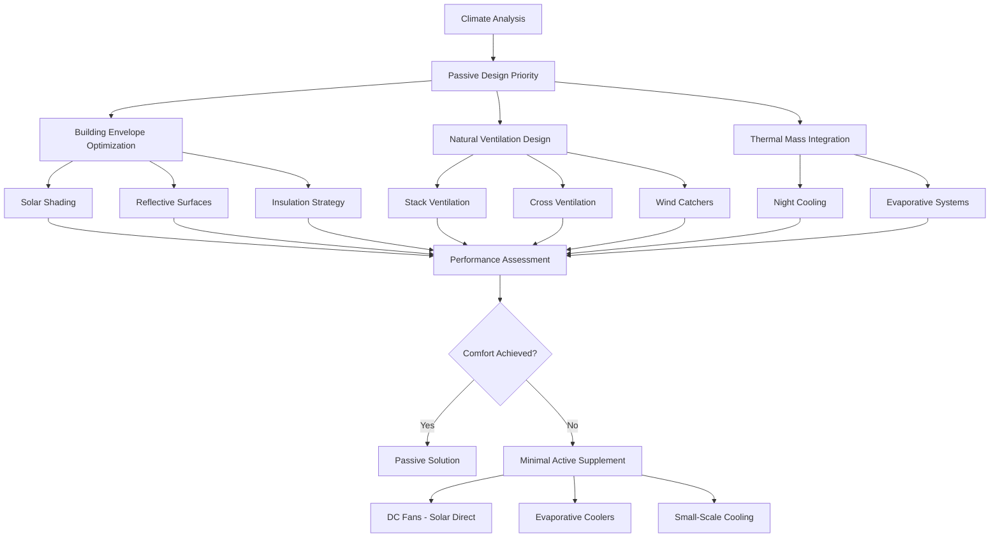

# HVAC Solutions for Developing World Applications

Climate control in developing regions demands fundamentally different engineering approaches than conventional HVAC design. Resource constraints—limited electrical infrastructure, capital availability, technical expertise, and maintenance capacity—require solutions grounded in passive physics principles, robust simplicity, and local adaptability. This section examines thermal management strategies optimized for emerging economies where conventional air conditioning remains economically or technically infeasible.

## Thermal Load Reality in Hot Climates

Developing regions concentrate in tropical and subtropical zones where cooling demands dominate. A typical rural structure in sub-Saharan Africa or Southeast Asia experiences peak cooling loads of 80-150 W/m² under direct solar exposure. The fundamental heat balance equation governs indoor conditions:

$$Q_{total} = Q_{solar} + Q_{conduction} + Q_{infiltration} + Q_{internal} - Q_{ventilation}$$

Where solar radiation through uninsulated roofs contributes 40-60% of total heat gain in lightweight construction. Reducing $Q_{solar}$ through passive means delivers greater impact than active cooling in resource-limited contexts.

## Passive Cooling Mechanisms

### Ventilation-Driven Heat Removal

Natural ventilation exploits stack effect and wind-driven pressure differentials. The volumetric flow rate through openings follows:

$$\dot{V} = C_d A \sqrt{2g\Delta H \frac{\Delta T}{T_{avg}}}$$

Where:
- $C_d$ = discharge coefficient (0.6-0.65 for typical openings)
- $A$ = free area of openings (m²)
- $g$ = gravitational acceleration (9.81 m/s²)
- $\Delta H$ = vertical distance between inlet and outlet (m)
- $\Delta T$ = indoor-outdoor temperature difference (K)
- $T_{avg}$ = average absolute temperature (K)

A 4-meter stack height with 1 m² opening area and 3°C temperature differential generates approximately 0.8 m³/s airflow—sufficient to maintain tolerable conditions in a 50 m² space if internal heat generation remains below 2 kW.

### Radiative Cooling Strategies

Night sky radiation provides a heat sink at effective temperatures of 10-30°C below ambient. The radiative cooling power follows Stefan-Boltzmann principles:

$$q_{rad} = \varepsilon \sigma (T_{surface}^4 - T_{sky}^4)$$

With surface emissivity $\varepsilon$ = 0.9 and clear-sky conditions, horizontal surfaces reject 80-120 W/m² overnight. Thermal mass coupling captures this cooling for daytime temperature suppression.

## Appropriate Technology Framework

## Technology Comparison Matrix

| Strategy | Capital Cost | Operating Cost | Cooling Capacity | Infrastructure Requirement | Maintenance Complexity |
|----------|--------------|----------------|------------------|----------------------------|------------------------|
| Natural Ventilation | Very Low | Zero | 20-40 W/m² | None | Minimal |
| Thermal Mass + Night Vent | Low | Zero | 30-50 W/m² | None | Minimal |
| Direct Evaporative Cooling | Low | Low | 100-200 W/m² | Water supply | Low |
| Indirect Evaporative | Medium | Low | 150-250 W/m² | Water + electricity | Medium |
| DC Solar Fans | Medium | Zero | Ventilation only | Solar panels | Low |
| Small Split AC (Solar) | High | Medium | 2000-3500 W | Solar + battery | Medium-High |
| Mini-Split AC (Grid) | Medium-High | High | 2000-5000 W | Reliable grid | Medium |

## Energy Constraints and Solar Integration

Grid electricity in rural developing regions averages 4-12 hours daily availability with voltage fluctuations of ±20%. Solar photovoltaic systems offer reliability but demand cost-effective integration. A basic comfort cooling system requires:

$$E_{daily} = \frac{Q_{cooling} \times t_{operation}}{\text{COP}} + P_{fans} \times t_{operation}$$

For a 20 m² space requiring 1.5 kW peak cooling operating 8 hours daily with COP = 2.5:

$$E_{daily} = \frac{1500 \times 8}{2.5} + 40 \times 8 = 5120 \text{ Wh}$$

This demands approximately 1.2 kWp solar capacity with 400 Ah battery storage at 24V—representing significant capital investment relative to local income levels.

## Evaporative Cooling Effectiveness

Direct evaporative cooling provides cost-effective sensible cooling in arid climates. The theoretical temperature depression follows:

$$\Delta T = \eta (T_{db} - T_{wb})$$

Where $\eta$ represents saturation efficiency (0.7-0.85 for pad systems). In a climate with 40°C dry-bulb and 24°C wet-bulb temperature:

$$\Delta T = 0.75 \times (40 - 24) = 12°C$$

Achieving 28°C supply air without mechanical refrigeration. However, this approach fails in humid tropical climates where wet-bulb temperatures exceed 26°C.

## ASHRAE Standards Application

ASHRAE Standard 55 thermal comfort zones require modification for developing world contexts. Adaptive comfort models permit higher operative temperatures (28-32°C) when occupants control airflow and acclimatization occurs. The adaptive comfort temperature:

$$T_{comfort} = 0.31 \times T_{outdoor,mean} + 17.8$$

For tropical regions with 30°C mean outdoor temperatures, acceptable indoor temperatures reach 27°C with air movement—achievable through low-energy fan systems rather than air conditioning.

## Material Selection for Hot Climates

Roof and wall materials dominate thermal performance in lightweight construction. Solar reflectance (albedo) and thermal emittance determine heat gain:

| Material | Solar Reflectance | Thermal Emittance | Surface Temperature (40°C ambient) |
|----------|-------------------|-------------------|-------------------------------------|
| Bare Concrete | 0.30 | 0.90 | 62°C |
| Galvanized Metal | 0.60 | 0.25 | 68°C |
| White-Painted Metal | 0.70 | 0.90 | 48°C |
| Clay Tile (Red) | 0.35 | 0.90 | 58°C |
| Thatched Roof | 0.40 | 0.90 | 54°C |

White or light-colored roofing reduces conducted heat gain by 40-60% compared to bare metal, representing the most cost-effective intervention.

## Water Conservation in Cooling

Evaporative systems consume 4-8 liters per kW-hour of sensible cooling. In water-scarce regions, this constraint favors dry cooling technologies. Closed-loop indirect evaporative systems reduce consumption by 60-70% while maintaining effectiveness.

## Implementation Challenges

Technical success depends on local capacity for installation and maintenance. Systems requiring refrigerant handling, electrical diagnostics, or complex controls fail without trained technicians. Robust designs prioritize:

- Mechanical simplicity with minimal moving parts
- Locally available replacement components
- Operation without specialized tools
- Passive failsafe modes
- Visual performance indicators

The optimal developing-world HVAC solution balances physics fundamentals with economic reality, prioritizing passive thermal management supplemented by minimal active systems when comfort requirements exceed passive capabilities.

