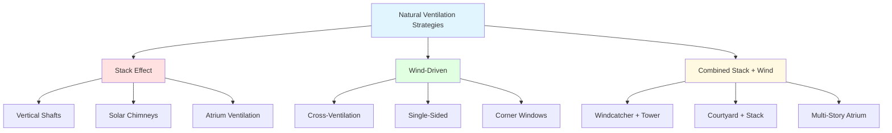
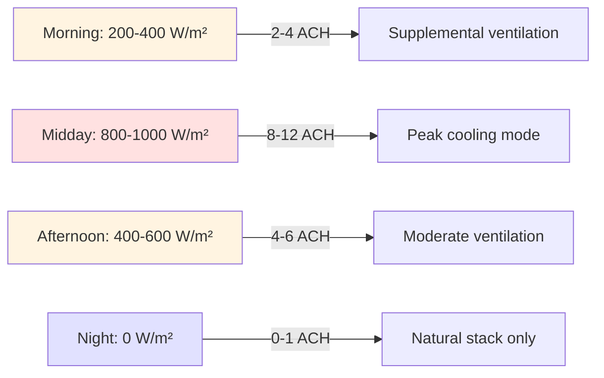
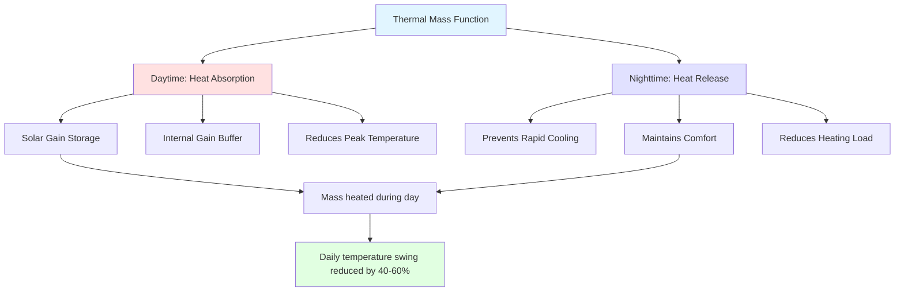

Appropriate technology HVAC emphasizes simple, locally maintainable climate control solutions that minimize energy consumption, capital costs, and technical complexity while maximizing thermal comfort. These approaches integrate physics-based passive strategies with traditional building techniques adapted to modern performance requirements.

## Passive Cooling Fundamentals

### Heat Transfer Pathways

Passive cooling manipulates three heat transfer mechanisms to reject building loads without mechanical refrigeration:

**Conductive heat rejection:**

$q = \frac{k \cdot A \cdot \Delta T}{L}$

Where:
- q = heat transfer rate (W)
- k = thermal conductivity (W/m·K)
- A = surface area (m²)
- ΔT = temperature difference (K)
- L = material thickness (m)

**Convective heat removal:**

$q = h \cdot A \cdot (T_s - T_{\infty})$

Where:
- h = convection coefficient (W/m²·K)
- T_s = surface temperature (K)
- T_∞ = fluid temperature (K)

**Radiative heat exchange:**

$q = \epsilon \cdot \sigma \cdot A \cdot (T_s^4 - T_{sky}^4)$

Where:
- ε = surface emissivity (dimensionless)
- σ = Stefan-Boltzmann constant (5.67×10⁻⁸ W/m²·K⁴)
- T_sky = effective sky temperature (K)

### Cooling Potential by Climate

| Climate Zone | Strategy Priority | Daily Cooling Potential | Implementation Cost |
|--------------|-------------------|------------------------|---------------------|
| Hot-dry | Evaporative, radiative | 80-120 W/m² floor | Low ($5-15/m²) |
| Hot-humid | Ventilative, shading | 40-60 W/m² floor | Very low ($2-8/m²) |
| Temperate-dry | Night cooling, mass | 50-80 W/m² floor | Low ($8-20/m²) |
| Hot-moderate | Mixed-mode | 60-90 W/m² floor | Moderate ($15-35/m²) |

## Natural Ventilation Design

### Buoyancy-Driven Flow

Stack effect generates airflow through vertical temperature gradients. The pressure difference driving flow:

$\Delta P = \rho \cdot g \cdot H \cdot \frac{\Delta T}{T_{avg}}$

Where:
- ΔP = pressure differential (Pa)
- ρ = air density (1.2 kg/m³ at sea level)
- g = gravitational acceleration (9.81 m/s²)
- H = vertical height difference (m)
- ΔT = temperature difference between inlet and outlet (K)
- T_avg = average absolute temperature (K)

**Volumetric flow rate:**

$\dot{Q} = C_d \cdot A \cdot \sqrt{2 \cdot g \cdot H \cdot \frac{\Delta T}{T_{avg}}}$

Where:
- Q̇ = volumetric flow (m³/s)
- C_d = discharge coefficient (0.6-0.7 for sharp-edged openings)
- A = effective opening area (m²)

### Design Parameters for Stack Ventilation

| Parameter | Minimum | Optimal | Maximum |
|-----------|---------|---------|---------|
| Height differential | 2 m | 4-8 m | 15 m |
| Inlet opening area | 0.5% floor area | 2-4% floor area | 8% floor area |
| Outlet/inlet ratio | 1.0 | 1.2-1.5 | 2.0 |
| Temperature difference | 2 K | 5-8 K | 15 K |
| Air changes per hour | 3 ACH | 6-12 ACH | 20 ACH |

**Practical performance:** A 5 m stack height with 3 K temperature difference generates approximately 2.5 Pa driving pressure, sufficient for 4-8 ACH in typical residential construction.

### Wind-Driven Ventilation

Wind pressure on building facades creates pressure differentials exploited for cross-ventilation:

$\Delta P = C_p \cdot \frac{1}{2} \cdot \rho \cdot v^2$

Where:
- C_p = pressure coefficient (-0.8 to +0.8, facade-dependent)
- v = wind velocity (m/s)

**Volumetric flow through openings:**

$\dot{Q} = C_d \cdot A \cdot \sqrt{\frac{2 \cdot \Delta P}{\rho}}$

**Cross-ventilation effectiveness** depends on:
- Opening location (windward high pressure, leeward low pressure)
- Opening size ratio (balanced flow: 1:1, enhanced velocity: smaller outlet)
- Internal obstructions (partition walls reduce flow by 30-60%)
- Wind angle of incidence (maximum effectiveness at 45-90° to facade)

## Windcatcher Systems (Baud-Geer)

### Traditional Design Principles

Windcatchers capture prevailing winds at roof level and channel airflow into occupied spaces. Middle Eastern designs combine wind capture with evaporative cooling and thermal mass.

**Basic windcatcher configurations:**

| Type | Direction | Height | Application | Cooling Enhancement |
|------|-----------|--------|-------------|---------------------|
| Unidirectional | Single opening | 4-8 m | Consistent wind | Intake only |
| Bidirectional | Two opposite | 5-10 m | Variable wind | Intake/exhaust |
| Multidirectional | Four openings | 6-12 m | Complex wind | Omnidirectional |
| Windcatcher + shaft | Tower + basement | 8-15 m | Hot-dry climate | Evaporative + stack |

### Performance Analysis

Air velocity through windcatcher:

$v_{interior} = C_d \cdot v_{exterior} \cdot \sqrt{\frac{A_{capture}}{A_{interior}}}$

**Typical velocity reduction:** External wind at 3-5 m/s produces interior velocities of 0.8-1.5 m/s, sufficient for comfort enhancement through convective cooling.

**Convective cooling effect on occupants:**

At 35°C ambient with 1.2 m/s air velocity, convective and evaporative heat removal from occupants increases approximately 40% compared to still air, equivalent to 3-4 K reduction in perceived temperature.

### Enhanced Windcatcher Designs

**Evaporative cooling integration:**
- Wetted porous ceramic inserts in windcatcher shaft
- Temperature reduction: 5-10 K in hot-dry climates
- Water consumption: 2-5 L/hr per 100 m³/hr airflow
- Effectiveness limited by humidity (optimal RH <35%)

**Underground air cooling:**
- Windcatcher intake connected to underground chamber
- Chamber depth: 3-4 m below grade
- Temperature reduction: 8-12 K in hot climates
- Air residence time: 15-30 seconds for effective heat transfer

**Cost comparison:**

| Configuration | Capital Cost | Operating Cost | Cooling Capacity | Maintenance |
|---------------|--------------|----------------|------------------|-------------|
| Basic windcatcher | $200-500 | $0/year | 30-50 W/m² floor | Minimal |
| + Evaporative | $400-800 | $20-40/year | 50-80 W/m² floor | Low |
| + Underground | $800-1,500 | $0/year | 60-100 W/m² floor | Minimal |
| Conventional AC | $1,500-3,000 | $300-600/year | 100-150 W/m² floor | Moderate |

## Solar Chimney Ventilation

### Operating Principle

Solar chimneys use solar radiation to heat air in a vertical channel, creating buoyancy-driven upward flow that induces ventilation through the building.

**Heat gain in solar chimney:**

$q_{solar} = \alpha \cdot I \cdot A_{absorber} \cdot \eta_{thermal}$

Where:
- α = absorber surface absorptance (0.85-0.95 for selective coatings)
- I = incident solar irradiance (W/m²)
- A_absorber = absorber surface area (m²)
- η_thermal = thermal efficiency (0.40-0.65 typical)

**Temperature rise in chimney:**

$\Delta T = \frac{q_{solar}}{\dot{m} \cdot c_p}$

Where:
- ṁ = mass flow rate (kg/s)
- c_p = specific heat of air (1,005 J/kg·K)

**Induced airflow rate:**

$\dot{m} = C_d \cdot A_{chimney} \cdot \sqrt{2 \cdot g \cdot H \cdot \rho \cdot \frac{\Delta T}{T_{avg}}}$

### Design Parameters

| Parameter | Small Scale | Medium Scale | Large Scale |
|-----------|-------------|--------------|-------------|
| Chimney height | 2-4 m | 4-8 m | 8-15 m |
| Channel width | 0.15-0.30 m | 0.30-0.60 m | 0.60-1.20 m |
| Glazing | Single clear | Double clear | Low-e double |
| Absorber | Black paint | Selective coating | Selective + fins |
| Flow rate | 50-150 m³/hr | 150-500 m³/hr | 500-2,000 m³/hr |
| Temperature rise | 10-20 K | 15-25 K | 20-35 K |
| ACH provided | 2-4 | 4-8 | 8-15 |

**Peak performance:** Solar chimney with 6 m height and 800 W/m² irradiance can generate temperature rise of 20-25 K, producing 8-12 ACH for a 100 m² space.

### Diurnal Performance Profile

**Thermal mass integration:** Incorporating 100-200 mm concrete in chimney absorber extends operation 2-4 hours after sunset, maintaining ventilation into evening.

## Passive Solar Heating

### Direct Gain Systems

South-facing glazing (northern hemisphere) admits solar radiation that heats interior thermal mass. The mass stores heat during the day and releases it at night, moderating temperature swings.

**Solar heat gain:**

$q_{gain} = SHGC \cdot A_{glazing} \cdot I \cdot \tau_{glazing}$

Where:
- SHGC = solar heat gain coefficient (0.60-0.80 for single glazing)
- τ_glazing = glazing transmittance (0.85-0.90 for clear glass)

**Required thermal mass for temperature moderation:**

$m = \frac{q_{gain} \cdot t}{c_p \cdot \Delta T_{acceptable}}$

Where:
- t = storage period (typically 8-12 hours)
- ΔT_acceptable = acceptable temperature swing (6-8 K)

**Practical sizing:** For 10 m² south glazing receiving 600 W/m² average irradiance over 6 hours, required thermal mass is approximately 5,000 kg (5 m³ concrete at 100 mm thickness distributed over 50 m² floor area).

### Indirect Gain: Trombe Walls

Trombe walls place thermal mass directly behind glazing, separated by an air gap. Solar-heated mass transfers heat to interior via conduction and thermocirculation through vents.

**Heat transfer through Trombe wall:**

$q = \frac{A \cdot \Delta T}{R_{total}}$

Where total thermal resistance includes:
- Glazing cavity (0.15-0.20 m²·K/W)
- Masonry mass (0.05-0.10 m²·K/W per 100 mm)
- Interior surface film (0.12 m²·K/W)

**Thermocirculation through vents:**

Vents at top and bottom of wall allow natural convection loop:
- Lower vent: cool room air enters cavity
- Air heated in cavity by warm mass
- Upper vent: warm air returns to room
- Flow rate: 20-40 m³/hr per m² of wall under 800 W/m² irradiance

### Design Comparison

| System Type | Capital Cost | Heat Delivery | Time Lag | Control | Complexity |
|-------------|--------------|---------------|----------|---------|------------|
| Direct gain | Low ($50-100/m²) | Immediate | Minimal | Simple shading | Very simple |
| Trombe wall | Moderate ($150-250/m²) | Gradual | 6-10 hours | Vent operation | Simple |
| Sunspace | High ($300-500/m²) | Variable | 2-4 hours | Doors/vents | Moderate |
| Isolated gain | High ($400-700/m²) | Controlled | Minimal | Active distribution | Complex |

**Climate suitability:**
- Cold-sunny: All systems effective
- Cold-cloudy: Supplemental heating required regardless of passive design
- Temperate: Direct gain and sunspace optimal (heating + daylighting)
- Hot-dry: Trombe wall with night venting for cooling

## Earth Coupling for Temperature Moderation

### Ground Temperature Profiles

Below frost depth (typically 1.5-2.5 m), soil temperature stabilizes near annual average air temperature. This thermal reservoir provides heating in winter and cooling in summer.

**Soil temperature at depth:**

$T(z,t) = T_{mean} + A_s \cdot e^{-z\sqrt{\frac{\pi}{365 \cdot \alpha}}} \cdot \cos\left[\frac{2\pi}{365}(t - t_0 - \frac{z}{2}\sqrt{\frac{365}{\pi \cdot \alpha}})\right]$

Where:
- T_mean = annual average air temperature (K)
- A_s = surface temperature amplitude (K)
- z = depth below surface (m)
- α = soil thermal diffusivity (m²/day)
- t = time (days)
- t_0 = phase lag (days)

**Practical values:**
- At 3 m depth, temperature fluctuation <2 K annually
- At 5 m depth, temperature nearly constant year-round
- Thermal diffusivity: 0.05-0.15 m²/day (varies with moisture content)

### Earth Tube Implementation

**Heat transfer effectiveness:**

$\epsilon = 1 - e^{-\frac{U \cdot A}{\dot{m} \cdot c_p}}$

Where:
- U = overall heat transfer coefficient (8-15 W/m²·K for buried pipes)
- A = pipe interior surface area (m²)
- ṁ = air mass flow rate (kg/s)

**Temperature reduction:**

$T_{out} = T_{soil} + (T_{in} - T_{soil}) \cdot (1 - \epsilon)$

**Optimal configurations:**

| Parameter | Summer Cooling | Winter Heating | Year-Round |
|-----------|----------------|----------------|------------|
| Depth | 2.5-3.5 m | 3.0-4.0 m | 3.5-4.5 m |
| Length | 20-35 m | 25-40 m | 30-45 m |
| Diameter | 200-300 mm | 250-350 mm | 250-350 mm |
| Airflow | 100-300 m³/hr | 150-400 m³/hr | 200-400 m³/hr |
| Slope | 2-3% | 2-3% | 2-3% |

**Performance expectations:**
- Summer: 6-10 K cooling in hot climates
- Winter: 4-8 K preheating in cold climates
- Fan power: 100-200 W for typical residential application
- Cooling equivalent: 1.5-2.5 tons without refrigerant

### Earth-Sheltered Construction

**Underground buildings** leverage constant earth temperature for passive thermal stability:

**Heat loss reduction:**

$q = U \cdot A \cdot (T_{interior} - T_{ground})$

Where T_ground ≈ T_mean reduces heating/cooling loads by 40-70% compared to above-ground construction.

**Design considerations:**
- Waterproofing critical (bentonite, membranes, drainage)
- Structural loads from soil overburden (1,800-2,000 kg/m³)
- Natural lighting through lightwells, clerestories
- Ventilation essential (no natural infiltration)
- Radon mitigation in affected regions

**Construction cost premium:** 15-30% above conventional, offset by 50-80% reduction in HVAC energy over building lifetime.

## Thermal Mass Strategies

### Heat Capacity and Temperature Swing Reduction

Thermal mass absorbs heat during periods of excess gain and releases heat during periods of deficit, moderating indoor temperature.

**Heat storage capacity:**

$Q = m \cdot c_p \cdot \Delta T$

**Effective thermal mass** depends on:
- Material specific heat capacity
- Material density
- Exposed surface area
- Coupling to room air (convective heat transfer)
- Diurnal activation (daily charge/discharge cycle)

### Material Comparison

| Material | Density (kg/m³) | Specific Heat (J/kg·K) | Volumetric Capacity (MJ/m³·K) | Cost ($/m³) |
|----------|----------------|----------------------|-------------------------------|------------|
| Concrete | 2,300 | 880 | 2.02 | $100-150 |
| Brick | 1,800 | 840 | 1.51 | $120-200 |
| Adobe | 1,600 | 840 | 1.34 | $40-80 |
| Rammed earth | 2,000 | 880 | 1.76 | $60-120 |
| Stone | 2,500 | 840 | 2.10 | $150-300 |
| Water | 1,000 | 4,180 | 4.18 | $5-15 |
| Phase change | 800-900 | 2,000 + latent | 8-15 (effective) | $800-2,000 |

**Water provides maximum heat storage per volume** but requires containment and has structural limitations.

**Phase change materials (PCMs)** absorb/release large amounts of latent heat at specific temperatures, providing enhanced thermal buffering in narrow temperature ranges.

### Optimal Mass Distribution

**Interior mass placement:**
- Maximum solar exposure for direct gain systems
- Distributed throughout space for general temperature moderation
- Thickness: 100-200 mm optimal (beyond 250 mm provides diminishing returns)
- Surface-to-volume ratio: higher is better for rapid charge/discharge

**Required mass for temperature swing reduction:**

For 50 m² space with 3 kW peak internal gain over 8-hour period, and target temperature swing of 6 K:

$m = \frac{3,000 \text{ W} \times 8 \times 3,600 \text{ s}}{880 \text{ J/kg·K} \times 6 \text{ K}} = 16,400 \text{ kg}$

This corresponds to approximately 7 m³ of concrete, or 100 mm thickness over 70 m² of surface area (walls, floors combined).

## Integrated System Design

### Climate-Appropriate Strategy Selection

| Climate | Heating Priority | Cooling Priority | Ventilation | Optimal Integration |
|---------|-----------------|------------------|-------------|---------------------|
| Hot-dry | Minimal | High | Moderate | Windcatcher + evaporative + mass |
| Hot-humid | Minimal | High | Critical | Cross-ventilation + shading |
| Cold-dry | Critical | Minimal | Controlled | Passive solar + mass + earth coupling |
| Temperate | Moderate | Moderate | Seasonal | Mixed-mode + mass + night flush |
| Hot-moderate | Low | High | Important | Solar chimney + stack + shading |

### Performance Metrics

**Thermal autonomy** (percentage of hours within comfort range without active HVAC):

- Passive design only: 40-60% in most climates
- Passive + appropriate technology: 60-80% in favorable climates
- Passive + low-energy mechanical: 80-95% in all climates
- Conventional HVAC: 95-100% (high energy cost)

**Cost-effectiveness comparison** (30-year life cycle, hot climate):

| Approach | Capital | Energy | Maintenance | Total | Thermal Autonomy |
|----------|---------|--------|-------------|-------|------------------|
| Passive only | $2,000 | $3,000 | $500 | $5,500 | 50% |
| Appropriate tech | $5,000 | $6,000 | $2,000 | $13,000 | 75% |
| Mini-split AC | $3,000 | $24,000 | $3,000 | $30,000 | 100% |
| Central AC | $8,000 | $36,000 | $6,000 | $50,000 | 100% |

**Value proposition:** Appropriate technology systems deliver 75% of comfort at 26% of life-cycle cost compared to central air conditioning.

## Implementation Considerations

### Local Material Utilization

**Advantages:**
- Reduced transportation costs and embodied energy
- Support local economy and skills
- Cultural appropriateness and acceptance
- Simplified supply chains and repair

**Material assessment criteria:**
- Thermal performance (conductivity, capacity, stability)
- Structural adequacy for application
- Durability in local climate
- Availability and cost
- Workability with local skills

### Maintenance Requirements

| Technology | Frequency | Skill Level | Cost/Year | Critical Failures |
|------------|-----------|-------------|-----------|-------------------|
| Natural ventilation | Annual | Low | <$50 | Blocked openings, insect screens |
| Windcatcher | 2-3 years | Low | <$100 | Debris accumulation, damper failure |
| Solar chimney | 2-5 years | Low-moderate | $50-150 | Glazing breakage, seal failure |
| Earth tubes | 5 years | Moderate | $100-200 | Filter clogging, condensate issues |
| Thermal mass | 10+ years | Low | <$50 | Surface degradation, minimal risk |
| Passive solar | 3-5 years | Low-moderate | $100-300 | Glazing, movable insulation |

**Design for maintenance access:** Critical for long-term performance, particularly in resource-constrained settings where component replacement may be difficult.

### User Training and Engagement

**Operational requirements:**
- Understanding of seasonal system operation (summer vs. winter modes)
- Manual control of vents, dampers, shading
- Recognition of optimal operating conditions
- Basic troubleshooting capabilities

**Cultural integration:**
- Align with traditional practices where applicable
- Demonstrate performance benefits clearly
- Provide visual indicators of system function
- Design for intuitive operation

## Technology Transfer and Adaptation

### Appropriate Technology Criteria (Schumacher Framework)

1. **Small-scale:** Suitable for household or small community implementation
2. **Labor-intensive:** Utilizes local workforce, creates employment
3. **Low-capital:** Affordable initial investment
4. **Energy-efficient:** Minimal operating energy requirement
5. **Simple:** Locally maintainable without specialized expertise
6. **Local materials:** Uses regionally available resources
7. **Decentralized:** Independent operation, resilient to infrastructure failures

### Successful Implementation Examples

**Middle East windcatchers:**
- Traditional designs adapted with modern materials
- Integration with mechanical backup systems
- Demonstrated 60-80% energy reduction vs. full AC
- Cultural acceptance enables widespread adoption

**Indian evaporative cooling:**
- Passive downdraft evaporative cooling towers
- Wetted khus grass (vetiver) for evaporation
- Zero operating cost beyond water ($0.10-0.20/day)
- Achieves 8-12 K temperature reduction

**East African earth construction:**
- Stabilized earth blocks with 5-8% cement
- High thermal mass, low embodied energy
- 50-70% reduction in cooling loads
- Material cost: $20-40/m³ vs. $120+ for concrete blocks

Appropriate technology HVAC provides viable thermal comfort in resource-constrained environments through physics-based passive strategies, traditional techniques validated by modern analysis, and locally maintainable systems. Success requires careful matching of technology to climate, materials to context, and design to user capabilities.

## Components

- Passive Cooling Strategies
- Natural Ventilation Design
- Evaporative Cooling Low Cost
- Solar Chimney Ventilation
- Windcatcher Traditional Designs
- Earth Coupling Cooling
- Passive Solar Heating
- Thermal Mass Construction
