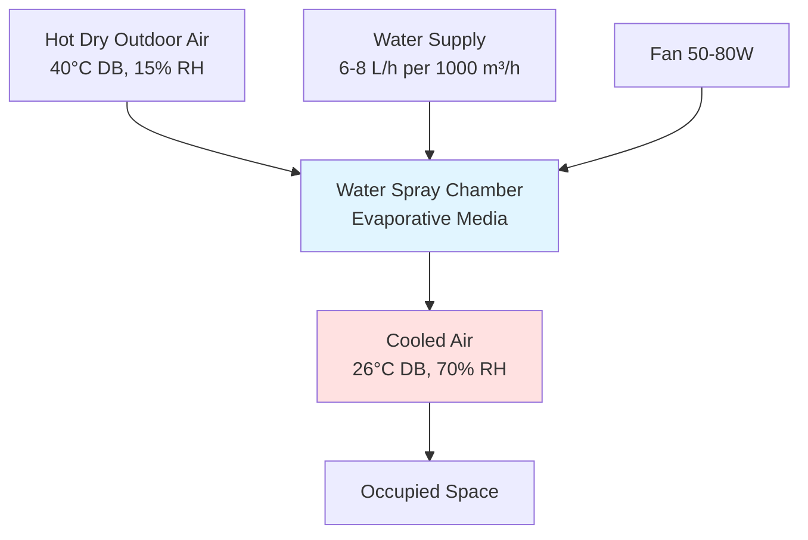

## Overview

Resource-constrained HVAC design addresses climate control challenges in developing regions where financial limitations, unreliable electrical infrastructure, limited technical expertise, and supply chain constraints demand fundamentally different engineering approaches. Effective design prioritizes passive strategies, locally available materials, minimal energy consumption, and maintenance simplicity while delivering essential thermal comfort and indoor air quality.

## Core Design Constraints

### Economic Limitations

Capital cost constraints typically limit HVAC expenditure to 2-5% of total building cost in developing markets versus 15-25% in developed economies. Operating cost sensitivity demands systems with minimal energy consumption due to high electricity costs relative to income levels.

**First cost optimization hierarchy:**

1. Passive architectural features (building orientation, thermal mass, shading)
2. Natural ventilation systems with minimal mechanical components
3. Evaporative cooling where climatically appropriate
4. High-efficiency fans for air movement
5. Mechanical refrigeration only for critical applications

### Infrastructure Challenges

Electrical grid reliability varies significantly across developing regions. Design must accommodate:

- Voltage fluctuations: ±20-30% variation from nominal
- Frequent power interruptions: 2-10 outages daily in some regions
- Low power quality: harmonics, phase imbalance, transients
- Limited or absent three-phase power in rural areas

**Voltage tolerance requirements:**

$V_{operating} = V_{nominal} \pm 0.25 V_{nominal}$

Equipment must operate across this range without protection devices, as voltage stabilizers add unacceptable cost.

### Technical Capacity Constraints

Limited availability of trained technicians necessitates designs that minimize:

- Refrigerant handling (leak detection, charging, recovery)
- Electronic controls and sensors
- Specialized diagnostic equipment requirements
- Complex commissioning procedures

## Passive Cooling Strategies

### Thermal Mass Utilization

High thermal mass construction (adobe, rammed earth, concrete) provides diurnal temperature stabilization in climates with high day-night temperature swings.

**Heat storage capacity:**

$Q_{stored} = \rho V c_p \Delta T$

Where:
- ρ = material density (kg/m³)
- V = volume (m³)
- c_p = specific heat capacity (J/kg·K)
- ΔT = temperature swing (K)

For a 300mm thick concrete wall (10m²):

$Q_{stored} = 2400 \times 3 \times 840 \times 8 = 48.4 \text{ MJ}$

This thermal storage dampens indoor temperature swings by 4-6°C when properly coupled with night ventilation.

### Natural Ventilation Design

Stack-driven and wind-driven ventilation eliminate mechanical energy consumption while providing adequate air change rates for comfort and IAQ.

**Stack effect airflow:**

$Q = C_d A \sqrt{2 g H \frac{\Delta T}{T_{average}}}$

Where:
- C_d = discharge coefficient (0.6-0.65)
- A = effective opening area (m²)
- g = gravitational acceleration (9.81 m/s²)
- H = vertical distance between openings (m)
- ΔT = indoor-outdoor temperature difference (K)

For H = 4m, A = 2m², ΔT = 5K, T_avg = 303K:

$Q = 0.62 \times 2 \times \sqrt{2 \times 9.81 \times 4 \times \frac{5}{303}} = 2.2 \text{ m}^3\text{/s} = 7920 \text{ m}^3\text{/h}$

This provides 8-12 air changes per hour for a 100m² space with 3m ceiling height.

## Appropriate Technology Solutions

### Evaporative Cooling Systems

Direct and indirect evaporative cooling provides 8-15°C temperature reduction in hot-dry climates (relative humidity <40%) with minimal energy input.

**Cooling effectiveness:**

$\epsilon = \frac{T_{db,in} - T_{db,out}}{T_{db,in} - T_{wb,in}}$

Direct evaporative coolers achieve ε = 0.70-0.85, requiring only fan power (30-80 W/1000 m³/h airflow).

**Water consumption rate:**

$\dot{m}_{water} = \frac{\dot{m}_{air} (W_{out} - W_{in})}{1}$

For 2000 m³/h airflow with 10 g/kg humidity ratio increase:

$\dot{m}_{water} = \frac{2000 \times 1.2 \times 0.010}{3600} = 6.7 \text{ kg/h}$

### Ceiling Fan Optimization

Ceiling fans increase comfort temperature setpoint by 2-4°C through elevated air velocity, reducing or eliminating mechanical cooling requirements.

**Effective temperature reduction:**

$\Delta T_{effective} = 0.6 v^{0.5}$

For v = 1.0 m/s air velocity:

$\Delta T_{effective} = 0.6 \times 1.0^{0.5} = 0.6°C$

Combined with elevated setpoint tolerance in developing climates (28-30°C acceptable), ceiling fans (60-75W) replace air conditioning systems (1500-2500W) for many applications.

## Low-Energy Mechanical Systems

### DC-Powered Equipment

Solar photovoltaic integration with DC-powered compressors and fans eliminates inverter losses (8-12%) and enables off-grid operation.

**System efficiency comparison:**

| Configuration | Conversion Stages | Total Efficiency |
|--------------|-------------------|------------------|
| AC system with grid power | Generation → Transmission → Conversion | 28-32% |
| AC system with solar+inverter | PV → DC/AC inverter → AC equipment | 12-16% |
| DC system with solar direct | PV → DC equipment | 16-20% |

DC systems achieve 20-30% higher solar utilization efficiency by eliminating inverter conversion losses.

### Variable Speed Compression

Inverter-driven compressors reduce energy consumption by 30-45% compared to fixed-speed units through capacity modulation matching load variations.

**Seasonal energy efficiency:**

$SEER = \frac{\sum Q_{cooling}}{\sum W_{input}}$

Budget inverter systems achieve SEER = 4.0-4.5 (13.6-15.3 EER) versus SEER = 2.8-3.2 (9.5-10.9 EER) for fixed-speed equivalents, justifying 15-25% cost premium through 2-3 year payback periods.

## Material and Component Selection

### Locally Available Materials

Design must prioritize materials and components available through local supply chains:

**Preferred materials hierarchy:**

1. Structural: Concrete, clay brick, locally quarried stone
2. Insulation: Rice husk, coconut fiber, compressed earth
3. Ducting: Galvanized steel, rigid PVC
4. Piping: Mild steel, CPVC (avoid copper due to cost/theft)

### Corrosion Resistance

Coastal and high-humidity environments demand enhanced corrosion protection without premium materials:

- Epoxy-coated condensers and evaporators
- Hot-dip galvanized structural steel
- Stainless steel fasteners (304 grade minimum)
- Protective coatings on electrical components

## Simplified Controls

### Mechanical Thermostats

Bimetallic thermostats eliminate electronic failure modes and provide 20+ year service life with ±1-2°C control accuracy sufficient for most applications.

**Cost comparison:**

| Control Type | First Cost | Annual Failure Rate | Replacement Cost |
|--------------|-----------|---------------------|------------------|
| Mechanical thermostat | $8-15 | 0.5-1% | $8-15 |
| Basic electronic | $25-40 | 3-5% | $25-40 |
| Programmable electronic | $60-120 | 5-8% | $60-120 |

Lifecycle cost analysis over 10 years strongly favors mechanical controls in resource-constrained applications.

### Manual Control Strategies

User-operated dampers, louvers, and switches reduce system complexity while enabling occupant adaptation to local preferences and usage patterns.

## Maintenance Simplification

### Serviceable Design Principles

Equipment selection criteria prioritize:

- Tool-free filter access
- Minimal specialized tool requirements
- Visual diagnostic indicators
- Standardized fastener sizes
- Modular component replacement

### Preventive Maintenance Schedules

Extended service intervals reduce technician visit frequency:

- Filter cleaning/replacement: Monthly → Quarterly
- Coil cleaning: Monthly → Semi-annually
- Refrigerant check: Quarterly → Annually
- Belt inspection: Monthly → Quarterly (or eliminate with direct-drive)

## Performance Optimization

### Climate-Specific Design

ASHRAE climate zones guide appropriate technology selection:

**Technology suitability matrix:**

| Climate Zone | Primary Strategy | Secondary Strategy | Avoid |
|--------------|------------------|-------------------|-------|
| Hot-Dry (BWh, BSh) | Evaporative cooling | Thermal mass | Sealed buildings |
| Hot-Humid (Af, Am) | Natural ventilation | Ceiling fans | Evaporative cooling |
| Warm-Humid (Aw) | Cross-ventilation | Dehumidification | High thermal mass |
| Temperate (Cfa, Cfb) | Thermal mass | Passive solar | Mechanical cooling |

### Load Reduction Strategies

Building envelope improvements deliver superior return on investment compared to mechanical system upgrades:

**Heat gain reduction priorities:**

1. Roof insulation: 40-50% cooling load reduction, 1-2 year payback
2. External shading: 30-40% window load reduction, immediate payback
3. Reflective surfaces: 20-30% roof heat gain reduction, 2-3 year payback
4. Air sealing: 15-25% infiltration load reduction, 1-2 year payback

**Roof insulation heat flux:**

$q = \frac{T_{outdoor} - T_{indoor}}{R_{total}}$

Adding R-2.5 (RSI-0.44) insulation to uninsulated concrete roof:

$q_{before} = \frac{45 - 28}{0.15} = 113 \text{ W/m}^2$

$q_{after} = \frac{45 - 28}{2.65} = 6.4 \text{ W/m}^2$

This 94% heat gain reduction eliminates mechanical cooling requirements for many building types.

## Implementation Considerations

### Phased Installation

Financial constraints necessitate staged implementation:

**Phase 1:** Passive measures (orientation, shading, thermal mass, natural ventilation)

**Phase 2:** Low-energy active systems (ceiling fans, evaporative cooling)

**Phase 3:** Mechanical cooling for critical spaces only (bedrooms, sensitive equipment areas)

This approach delivers immediate comfort improvements while distributing costs across multiple budget cycles.

### Local Manufacturing

Encouraging local production of simple HVAC components (evaporative coolers, ceiling fans, ductwork) reduces costs by 30-50% while building regional technical capacity and creating employment.

## Conclusion

Resource-constrained HVAC design demands fundamental rethinking of conventional approaches. Success requires prioritizing passive strategies, minimizing energy consumption, simplifying maintenance, and leveraging locally available materials and manufacturing capabilities. When properly engineered, these systems deliver adequate thermal comfort and indoor air quality at lifecycle costs 60-80% below conventional mechanical systems while providing superior reliability in challenging infrastructure environments.

The physics of heat transfer, thermodynamics, and fluid mechanics remain constant regardless of economic context. Resource-constrained design applies these principles more carefully, extracting maximum value from minimal resources through optimized passive strategies before adding selective mechanical intervention only where essential for occupant health and productivity.
