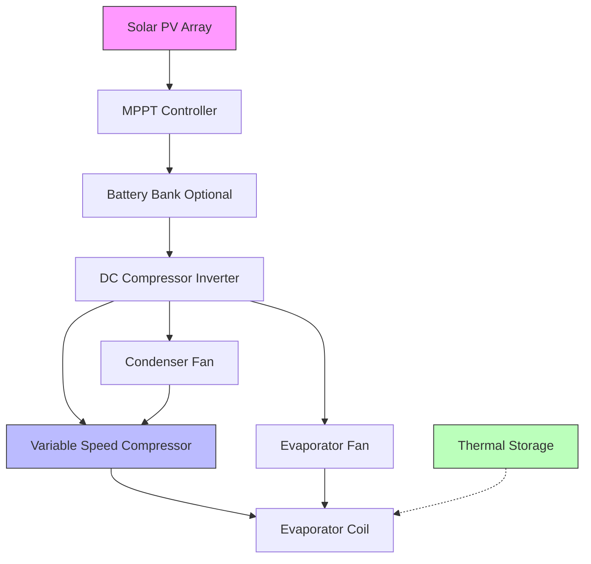
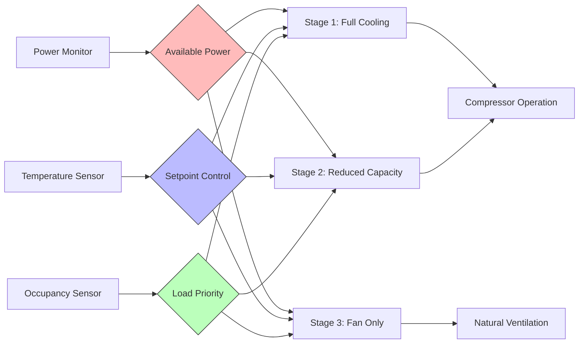

# Rural Electrification HVAC Systems

Rural electrification programs in developing regions face unique challenges when integrating climate control systems. Limited grid capacity, intermittent power supply, and high infrastructure costs demand specialized HVAC approaches that balance thermal comfort with energy constraints.

## Power Supply Characteristics

### Grid-Connected Rural Systems

Rural electrical grids typically exhibit voltage fluctuations of ±15-20% compared to ±5% in urban areas. This variability significantly impacts HVAC equipment performance and longevity.

**Voltage Impact on Compressor Performance:**

The relationship between voltage variation and refrigeration capacity follows:

$$Q_{actual} = Q_{rated} \times \left(\frac{V_{actual}}{V_{rated}}\right)^{1.5}$$

where:
- $Q_{actual}$ = actual cooling capacity (W)
- $Q_{rated}$ = rated cooling capacity (W)
- $V_{actual}$ = actual supply voltage (V)
- $V_{rated}$ = rated voltage (V)

A 20% voltage drop reduces cooling capacity by approximately 28%, while power consumption decreases only 16%, resulting in degraded efficiency.

### Off-Grid Power Sources

| Power Source | Capacity Range | Availability Factor | Initial Cost | O&M Cost |
|--------------|----------------|---------------------|--------------|----------|
| Solar PV | 1-10 kW | 0.15-0.25 | High | Low |
| Diesel Generator | 5-50 kW | 0.95 | Medium | High |
| Micro-hydro | 2-100 kW | 0.70-0.90 | High | Low |
| Wind Turbine | 1-20 kW | 0.20-0.35 | High | Medium |
| Hybrid Systems | Variable | 0.60-0.85 | High | Medium |

## Solar-Powered HVAC Systems

### Direct DC Solar Cooling

Photovoltaic-powered vapor compression systems eliminate DC-AC conversion losses (typically 8-12%), improving overall system efficiency. Variable-speed DC compressors modulate capacity based on available solar radiation.

**System Sizing Methodology:**

Peak cooling load must match photovoltaic generation during maximum solar irradiance:

$$P_{PV} = \frac{Q_{cool}}{\text{COP}_{system} \times \eta_{electrical} \times \eta_{wiring}}$$

where:
- $P_{PV}$ = required PV array capacity (W)
- $Q_{cool}$ = design cooling load (W)
- $\text{COP}_{system}$ = coefficient of performance (2.5-3.5 typical)
- $\eta_{electrical}$ = electrical efficiency (0.92-0.96)
- $\eta_{wiring}$ = wiring efficiency (0.95-0.98)

### Solar Thermal Absorption Cooling

Single-effect absorption chillers driven by evacuated tube collectors provide cooling without photovoltaic panels. Generator temperatures of 80-95°C enable coefficient of performance (COP) values of 0.65-0.75.

**Collector Area Calculation:**

$$A_{collector} = \frac{Q_{cooling}}{I_{solar} \times \eta_{collector} \times \text{COP}_{absorption}}$$

where:
- $A_{collector}$ = required collector area (m²)
- $I_{solar}$ = average solar irradiance (W/m²)
- $\eta_{collector}$ = collector efficiency (0.60-0.70 for evacuated tubes)

## Load Management Strategies

### Thermal Energy Storage

Ice storage or phase change materials (PCM) shift cooling loads to periods of peak solar generation or low electricity cost. Latent heat storage provides 3-4 times higher energy density than sensible heat storage.

**Ice Storage Capacity:**

$$m_{ice} = \frac{Q_{storage}}{h_{fusion} \times \eta_{charge}}$$

where:
- $m_{ice}$ = ice mass required (kg)
- $Q_{storage}$ = storage capacity (kJ)
- $h_{fusion}$ = latent heat of fusion (334 kJ/kg)
- $\eta_{charge}$ = charging efficiency (0.85-0.92)

### Demand-Responsive Controls

Microprocessor-based controls modulate HVAC operation based on:
- Available power capacity
- Battery state of charge (solar systems)
- Time-of-use pricing
- Occupancy patterns

## Equipment Selection Criteria

### Voltage Tolerance

Rural applications require equipment rated for extended voltage ranges:
- Standard equipment: ±10% voltage variation
- Rural-rated equipment: ±20-25% voltage variation
- Voltage stabilizers add 5-8% energy penalty

### Efficiency Requirements

ASHRAE Standard 90.1 minimum efficiency values must be exceeded for economical operation with expensive or limited electricity:

| Equipment Type | Standard Efficiency | Rural Application Target |
|----------------|---------------------|--------------------------|
| Split AC (≤5.3 kW) | EER ≥ 11.0 (3.22 COP) | EER ≥ 13.0 (3.81 COP) |
| Window AC | EER ≥ 10.0 (2.93 COP) | EER ≥ 12.0 (3.52 COP) |
| Evaporative Cooler | N/A | 15-25 W per 1000 m³/h |

### Maintenance Accessibility

Equipment selection must consider:
- Availability of replacement parts in rural areas
- Technical skill level of local service providers
- Transportation logistics for large components
- Simplified diagnostics for troubleshooting

## Natural Ventilation Integration

Building design maximizes passive cooling through stack effect and cross-ventilation, reducing mechanical cooling loads by 30-60% in appropriate climates.

**Stack Ventilation Airflow:**

$$\dot{V} = C_d A \sqrt{2 g H \frac{\Delta T}{T_{avg}}}$$

where:
- $\dot{V}$ = volumetric airflow rate (m³/s)
- $C_d$ = discharge coefficient (0.6-0.65)
- $A$ = opening area (m²)
- $g$ = gravitational acceleration (9.81 m/s²)
- $H$ = vertical distance between openings (m)
- $\Delta T$ = indoor-outdoor temperature difference (K)
- $T_{avg}$ = average absolute temperature (K)

## Economic Considerations

Life-cycle cost analysis must account for:
- Fuel transportation costs for generator-based systems (50-200% premium over urban diesel prices)
- Battery replacement intervals (3-5 years typical)
- Reduced equipment lifespan due to voltage fluctuations and environmental conditions
- Local employment generation through installation and maintenance

**Present Value Analysis:**

$$\text{PV}_{total} = C_{initial} + \sum_{t=1}^{n} \frac{C_{operation,t} + C_{maintenance,t}}{(1+r)^t}$$

where:
- $r$ = discount rate (0.08-0.12 typical for developing regions)
- $n$ = analysis period (15-20 years)

Rural electrification HVAC systems require integrated solutions combining renewable energy, thermal storage, efficient equipment, and passive design strategies. Success depends on matching technology to local resources, technical capabilities, and economic constraints while maintaining acceptable indoor environmental quality for health and productivity.
