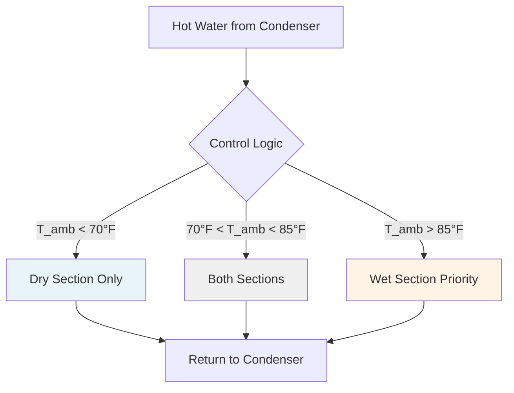
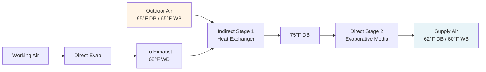

## Overview

Water scarcity represents a critical constraint for HVAC systems in developing regions, particularly where evaporative cooling and water-cooled equipment dominate due to lower capital costs. HVAC systems in commercial buildings can consume 20-40% of total water use, with cooling towers accounting for the majority. Effective water conservation strategies reduce operational costs, environmental impact, and dependency on unreliable water infrastructure.

## Water Consumption in HVAC Systems

### Primary Water Uses

**Evaporative cooling systems:**
- Evaporation losses: 0.8-1.0% of circulation rate per 10°F temperature drop
- Blowdown: 0.3-0.6% of circulation rate depending on cycles of concentration
- Drift losses: 0.001-0.02% of circulation rate

**Calculation of makeup water requirement:**

$$
W_{makeup} = W_{evap} + W_{blowdown} + W_{drift}
$$

$$
W_{evap} = \frac{Q_{rejected}}{h_{fg}}
$$

where $Q_{rejected}$ is heat rejection rate (Btu/hr) and $h_{fg}$ is latent heat of vaporization (≈1050 Btu/lb at atmospheric pressure).

**Cycles of concentration (COC) relationship:**

$$
COC = \frac{C_{blowdown}}{C_{makeup}} = \frac{W_{evap}}{W_{blowdown}}
$$

Higher COC reduces blowdown requirements but increases scaling and corrosion potential.

## Water Conservation Technologies

### Dry Cooling Systems

Dry cooling eliminates water consumption by rejecting heat directly to ambient air through finned-tube heat exchangers.

**Performance characteristics:**

| Parameter | Dry Cooling | Wet Cooling | Hybrid |
|-----------|-------------|-------------|--------|
| Water consumption | 0 gal/ton-hr | 2-3 gal/ton-hr | 0.5-1.5 gal/ton-hr |
| Approach to ambient | 15-25°F | 5-7°F | 10-15°F |
| Capital cost multiplier | 2.0-3.0× | 1.0× | 1.4-1.8× |
| Fan power | 3-5 hp/100 tons | 1-2 hp/100 tons | 2-3 hp/100 tons |
| Footprint | Large | Medium | Medium-Large |

**Dry cooling effectiveness:**

$$
\varepsilon = \frac{T_{in} - T_{out}}{T_{in} - T_{ambient}}
$$

Typical effectiveness ranges from 0.65-0.80 depending on air velocity and fin configuration.

### Hybrid Cooling Systems

Hybrid systems combine dry and wet cooling to optimize water use while maintaining acceptable condensing temperatures.

**Water savings calculation:**

$$
WS = W_{wet} \times \left(1 - \frac{t_{wet}}{t_{total}}\right)
$$

where $t_{wet}$ is hours operating in wet mode and $t_{total}$ is total operating hours.

## Advanced Water Management Strategies

### Maximizing Cycles of Concentration

Increasing COC from 3 to 6 can reduce makeup water by approximately 33%.

**Blowdown requirement:**

$$
W_{blowdown} = \frac{W_{evap}}{COC - 1}
$$

**Total makeup water:**

$$
W_{makeup} = W_{evap} \times \frac{COC}{COC - 1}
$$

**Limiting factors for COC:**

| Parameter | Target Range | Method |
|-----------|--------------|--------|
| Total dissolved solids | < 2000 ppm | Filtration, softening |
| Calcium hardness | < 800 ppm as CaCO₃ | Acid injection, softening |
| Alkalinity | < 500 ppm as CaCO₃ | Acid feed |
| Langelier Saturation Index | -0.5 to +0.5 | Chemical balance |
| Chlorides | < 750 ppm | Blowdown control |

### Alternative Water Sources

**Graywater and treated wastewater utilization:**

Graywater from sinks, showers, and laundry can provide 30-50% of cooling tower makeup requirements after basic filtration and treatment.

**Treatment requirements:**

- Filtration: 50-100 micron minimum
- pH adjustment: 6.5-8.5 range
- Disinfection: 0.5-1.0 ppm free chlorine residual
- Monitoring: Weekly biological oxygen demand (BOD) testing

**Rainwater harvesting:**

Annual collection potential:

$$
V_{collect} = A_{roof} \times P_{annual} \times \eta_{collection} \times 0.623
$$

where $A_{roof}$ is roof area (ft²), $P_{annual}$ is annual precipitation (inches), $\eta_{collection}$ is collection efficiency (0.75-0.85), and 0.623 converts to gallons.

### Condensate Recovery

Air handling units operating in cooling mode generate condensate that can be captured for reuse.

**Condensate generation rate:**

$$
W_{condensate} = \frac{Q_{sensible} \times SHR}{h_{fg} \times (1 - SHR)}
$$

where SHR is sensible heat ratio.

For a 100-ton AHU at SHR = 0.70:

$$
W_{condensate} = \frac{1,200,000 \times 0.70}{1050 \times 0.30} \approx 2,667 \text{ lb/hr} = 320 \text{ gal/hr}
$$

## Evaporative Cooling Alternatives

### Indirect Evaporative Cooling

Indirect systems provide sensible cooling without adding moisture to the supply air, reducing water consumption by 40-60% compared to direct evaporative cooling.

**Cooling effectiveness:**

$$
\varepsilon_{IEC} = \frac{T_{db,in} - T_{db,out}}{T_{db,in} - T_{wb,in}}
$$

Typical effectiveness: 0.55-0.75

### Dew Point Cooling

Advanced indirect/direct staging achieves sub-wet-bulb cooling with water consumption 50-70% lower than conventional evaporative systems.

## Water Quality Monitoring

### Critical Parameters

**ASHRAE Standard 188 compliance requirements:**

- Monthly Legionella risk assessment
- Continuous conductivity monitoring for COC control
- Weekly pH and oxidation-reduction potential (ORP) measurement
- Quarterly microbiological testing

**Automated blowdown control:**

$$
BD_{rate} = \frac{EC_{circulating} - EC_{makeup}}{EC_{blowdown} - EC_{makeup}} \times Q_{makeup}
$$

where EC is electrical conductivity (μS/cm).

## Economic Analysis

### Water Cost Impact

**Annual operating cost comparison for 500-ton system:**

| System Type | Water Use (kgal/yr) | Water Cost ($0.008/gal) | Energy Penalty | Total Annual Cost |
|-------------|---------------------|-------------------------|----------------|-------------------|
| Wet cooling tower (3 COC) | 7,200 | $57,600 | $0 | $57,600 |
| Wet cooling tower (6 COC) | 4,800 | $38,400 | $2,400 | $40,800 |
| Hybrid system | 2,400 | $19,200 | $8,500 | $27,700 |
| Dry cooling | 0 | $0 | $24,000 | $24,000 |

**Payback calculation:**

$$
PB = \frac{C_{capital,incremental}}{(C_{water,base} - C_{water,efficient}) + (C_{energy,base} - C_{energy,efficient})}
$$

## Implementation Considerations

### Regional Adaptations

**Arid climates (< 10 inches annual rainfall):**
- Prioritize dry cooling for base load
- Use hybrid systems with dry-mode bias
- Implement maximum COC strategies (8-10 cycles)

**Semi-arid climates (10-20 inches annual rainfall):**
- Hybrid systems optimized for local wet-bulb temperatures
- Seasonal operating mode changes
- Rainwater harvesting integration

**Water-stressed regions with periodic scarcity:**
- Dual-mode systems capable of dry operation
- On-site water storage (7-14 day capacity)
- Graywater and condensate recovery systems

### Maintenance Requirements

**Water conservation systems demand enhanced maintenance:**

- Daily: Visual inspection of water levels, automated controls
- Weekly: Water chemistry testing, COC verification
- Monthly: Heat exchanger inspection, scaling assessment
- Quarterly: Comprehensive water treatment audit
- Annually: System descaling, mechanical component overhaul

**Chemical treatment costs increase with COC:**

$$
C_{chemical} = C_{base} \times \left(1 + 0.15 \times \frac{COC - 3}{3}\right)
$$

## Future Developments

Emerging water conservation technologies include:

- **Membrane distillation** for zero liquid discharge in cooling towers
- **Atmospheric water generation** using HVAC condensate enhancement
- **Thermoelectric cooling** eliminating water use in small applications
- **Advanced polymer heat exchangers** enabling higher COC operation
- **AI-based predictive blowdown control** optimizing real-time water use

Effective water conservation requires integrated system design considering local climate, water costs, regulatory requirements, and operational capabilities. In water-scarce developing regions, the economic value of conserved water often exceeds energy efficiency benefits, fundamentally altering traditional HVAC optimization priorities.
