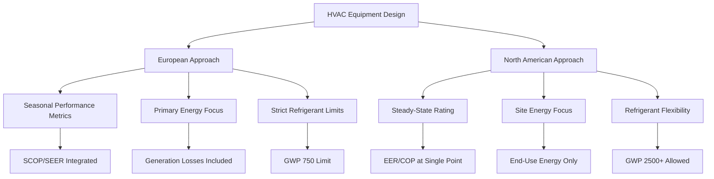

## Overview of European HVAC Regulatory Framework

European HVAC standards represent one of the most comprehensive and stringent regulatory frameworks globally, driven by aggressive climate goals and energy efficiency mandates. The European Union's approach integrates building energy performance, equipment efficiency, refrigerant management, and renewable energy adoption into a cohesive system that shapes HVAC design and operation across 27 member states.

The regulatory architecture comprises three primary layers: EN (European Norm) technical standards developed by CEN (European Committee for Standardization), EU-wide directives and regulations with legal force, and member state implementation through national building codes. This multi-tier structure creates uniform minimum requirements while allowing regional adaptation for climate-specific needs.

## Key Regulatory Instruments

### Energy Performance of Buildings Directive (EPBD)

The EPBD establishes the framework for building energy performance across the EU, mandating nearly zero-energy buildings (nZEB) for new construction and setting renovation standards for existing stock. HVAC systems fall under stringent efficiency requirements, with heat recovery ventilation and high-efficiency heat pumps becoming standard practice in Northern European applications.

The directive requires Energy Performance Certificates (EPCs) that quantify building energy consumption normalized to climate zone, expressed in primary energy demand per unit floor area:

$\text{PED} = \frac{Q_{\text{heating}} + Q_{\text{cooling}} + Q_{\text{DHW}} + Q_{\text{lighting}} + Q_{\text{ventilation}}}{A_{\text{floor}} \cdot f_{\text{primary}}}$

where $f_{\text{primary}}$ represents the primary energy conversion factor accounting for generation and transmission losses.

### F-Gas Regulation (EU 517/2014)

This regulation phases down hydrofluorocarbon (HFC) refrigerants through a quota system reducing supply by 79% between 2015 and 2030. The mechanism assigns global warming potential (GWP) limits for specific applications, with direct-expansion air conditioning systems increasingly limited to refrigerants below GWP 750 for equipment containing more than 3 kg charge.

The phase-down drives adoption of natural refrigerants (R290, R744, R717) and lower-GWP synthetic options (R32, R1234yf). Heat pump manufacturers have transitioned to R290 (propane) for residential units and R744 (CO₂) transcritical systems for commercial applications, particularly in Scandinavian markets.

### Ecodesign Directive (2009/125/EC)

Ecodesign requirements establish minimum energy efficiency thresholds for HVAC equipment placed on the EU market. The directive uses seasonal performance metrics that account for part-load operation and climate-dependent performance:

**Seasonal Coefficient of Performance (SCOP)** for heat pumps:

$\text{SCOP} = \frac{\sum_{i=1}^{n} Q_{\text{heating},i}}{\sum_{i=1}^{n} W_{\text{input},i}}$

where performance is integrated across the heating season using bin temperature method calculations for three reference climates (cold, average, warm).

## European Standards Structure

### EN 12831: Heating System Design

EN 12831 defines heat load calculation methodology diverging from ASHRAE fundamentals in several aspects. Design outdoor temperatures use 99% annual exceedance values rather than 97.5%, resulting in more conservative sizing. Transmission heat loss calculations include thermal bridge corrections mandatory for modern low-energy construction:

$\Phi_{\text{T}} = \sum (U \cdot A \cdot f_{\text{temp}}) + \sum (\psi \cdot l \cdot f_{\text{temp}}) \cdot (T_{\text{int}} - T_{\text{ext}})$

where $\psi$ represents linear thermal transmittance of junctions between building elements.

### EN 13779 / EN 16798: Ventilation Standards

These standards establish indoor environmental quality categories (IEQ I through IV) with corresponding ventilation rates, filtration requirements, and thermal comfort criteria. Category II (normal expectation) requires 0.7 L/s·m² minimum outdoor air supply with F7-grade filtration (equivalent to MERV 13), significantly exceeding typical ASHRAE 62.1 minimums for commercial buildings.

## Comparison with North American Practice

| Parameter | European Standards | ASHRAE/North American | Implication |
|-----------|-------------------|---------------------|-------------|
| Heat Load Design Temp | 99% exceedance | 97.5% exceedance | 15-20% larger EU equipment |
| Ventilation Minimum | 0.7 L/s·m² (Category II) | 0.3 L/s·m² (ASHRAE 62.1) | Higher energy recovery adoption |
| Heat Pump Performance | SCOP (seasonal) | COP (47°F/8°C) | Part-load optimization critical |
| Refrigerant GWP Limit | 750 (split AC >3kg) | No federal limit | Natural refrigerant growth |
| Thermal Bridging | Mandatory calculation | Typically ignored | Lower U-value requirements |
| Primary Energy Factor | 1.9-2.5 (electricity) | Not standard | Favors heat pumps vs. resistance |

## Technical Implementation Differences

### Heat Pump Sizing Philosophy

European practice emphasizes bivalent heat pump operation where the heat pump covers base load (typically 60-80% of peak) with auxiliary heat providing peak capacity. This approach maximizes seasonal efficiency by operating the heat pump at higher capacity factors. The bivalent point occurs where heat pump capacity matches building load:

$Q_{\text{HP}}(T_{\text{biv}}) = Q_{\text{building}}(T_{\text{biv}})$

Below this temperature, supplementary heat activates. ASHRAE design typically sizes heat pumps to full peak load, resulting in excessive cycling during mild weather.

### Hydronic Distribution Dominance

Low-temperature hydronic systems (supply temperatures 35-45°C) with radiant panels or oversized radiators dominate European practice, enabling higher heat pump COP through reduced condensing temperatures. North American forced-air systems require 50-60°C supply for adequate air temperature rise, reducing heat pump efficiency by 15-25% at design conditions.

The Carnot efficiency relationship illustrates this advantage:

$\eta_{\text{Carnot}} = \frac{T_{\text{cond}}}{T_{\text{cond}} - T_{\text{evap}}}$

Reducing condensing temperature from 60°C (333K) to 40°C (313K) with evaporating temperature -5°C (268K) improves theoretical efficiency from 5.1 to 6.0, representing an 18% gain.

### Ventilation Heat Recovery

EN 13053 establishes testing protocols for heat recovery ventilators with temperature efficiency defined under standardized conditions. Systems achieving 85-90% sensible recovery efficiency are standard in passive house construction, recovering 50-70% of ventilation heating load. This contrasts with North American practice where heat recovery adoption remains limited outside cold climates despite ASHRAE 90.1 energy recovery requirements.

## Regional Variations

While EU directives establish minimum requirements, member states implement varying stringency levels. Germany's EnEV (superseded by GEG) requires primary energy demand 25% below EPBD minimums. Nordic countries mandate exhaust air heat recovery in all residential construction. Mediterranean regions focus on cooling efficiency with seasonal energy efficiency ratios (SEER) minimum thresholds for air conditioners.

## Integration with Renewable Energy Systems

The Renewable Energy Directive (RED II) establishes binding targets for renewable energy in buildings, driving integration of HVAC systems with photovoltaic arrays, solar thermal collectors, and district heating networks. Heat pumps powered by grid electricity count toward renewable targets based on the grid's renewable fraction, creating regulatory preference for electric heat over fossil fuel combustion in regions with renewable-heavy electricity generation.

## Certification and Compliance

Eurovent certification provides third-party verification of equipment performance claims, testing heat pumps, air handlers, and chillers to EN standards. CE marking indicates conformity with all applicable EU directives but represents manufacturer self-declaration rather than independent testing. This dual system contrasts with North American AHRI certification which combines both regulatory compliance and performance verification.

The European framework prioritizes lifecycle energy consumption and environmental impact through integrated regulatory instruments, setting global precedents for building decarbonization while requiring fundamental shifts in HVAC system design compared to North American conventional practice.
