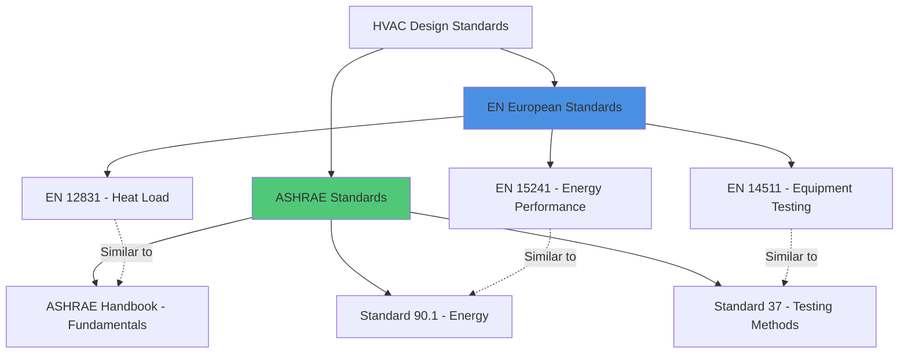

## Overview of EN Standards

European Norm (EN) standards, developed by the European Committee for Standardization (CEN), establish uniform technical specifications for HVAC systems across European Union member states and associated countries. These standards become legally binding when adopted as national standards, replacing conflicting local codes. EN standards emphasize energy efficiency, indoor environmental quality, and harmonization of testing methodologies.

The EN framework differs from ASHRAE standards in regulatory approach: EN standards carry legal force when transposed into national law, while ASHRAE standards primarily serve as technical guidelines unless adopted by local jurisdictions. This fundamental distinction shapes design practice throughout Europe.

## EN 12831: Heat Load Calculation

EN 12831 specifies the methodology for calculating design heating loads in buildings. The standard establishes a room-by-room calculation procedure based on steady-state heat transfer principles.

### Design Heat Load Formula

The total design heat load consists of transmission and ventilation components:

$$
\Phi_{HL} = \Phi_T + \Phi_V
$$

Where:
- $\Phi_{HL}$ = total design heat load (W)
- $\Phi_T$ = transmission heat loss (W)
- $\Phi_V$ = ventilation heat loss (W)

The transmission heat loss through building envelope elements:

$$
\Phi_T = \sum (A \cdot U \cdot f_x) \cdot (T_{int,i} - T_e)
$$

Where:
- $A$ = surface area (m²)
- $U$ = thermal transmittance (W/m²·K)
- $f_x$ = temperature correction factor (dimensionless)
- $T_{int,i}$ = design interior temperature (°C)
- $T_e$ = design external temperature (°C)

The ventilation heat loss:

$$
\Phi_V = \dot{V} \cdot \rho \cdot c_p \cdot (T_{int,i} - T_{sup})
$$

Where:
- $\dot{V}$ = ventilation air flow rate (m³/s)
- $\rho$ = air density (kg/m³)
- $c_p$ = specific heat capacity of air (J/kg·K)
- $T_{sup}$ = supply air temperature (°C)

EN 12831 mandates specific outdoor design temperatures based on geographic location, unlike ASHRAE's percentile approach (99.6% or 99% design conditions). The European method uses standardized climatic zones with fixed design temperatures.

## EN 13779: Ventilation for Non-Residential Buildings

EN 13779 (superseded by EN 16798-3 but still widely referenced) categorizes indoor air quality and ventilation requirements for commercial buildings.

### Indoor Air Quality Categories

| Category | Description | Application | Outdoor Air Rate |
|----------|-------------|-------------|------------------|
| IDA 1 | High | Hospitals, laboratories | >54 m³/h·person |
| IDA 2 | Medium | Offices, schools | 36-54 m³/h·person |
| IDA 3 | Moderate | Commercial buildings | 22-36 m³/h·person |
| IDA 4 | Low | Temporary occupancy | <22 m³/h·person |

This classification system differs from ASHRAE Standard 62.1, which prescribes minimum ventilation rates based on occupancy and floor area rather than quality categories.

## EN 15241: Energy Performance Assessment

EN 15241 establishes calculation methods for assessing HVAC system energy performance in buildings. The standard evaluates total primary energy consumption including generation, distribution, and terminal losses.

### System Energy Balance

$$
E_{tot} = E_{gen} + E_{dist} + E_{em} + E_{ctrl} - E_{rec}
$$

Where:
- $E_{tot}$ = total system energy (kWh/year)
- $E_{gen}$ = generation losses (kWh/year)
- $E_{dist}$ = distribution losses (kWh/year)
- $E_{em}$ = emission/terminal losses (kWh/year)
- $E_{ctrl}$ = control energy (kWh/year)
- $E_{rec}$ = recovered energy (kWh/year)

The standard requires accounting for part-load performance using bin method calculations, recognizing that equipment operates at design capacity for minimal annual hours.

## EN 1264: Embedded Water-Based Heating Systems

EN 1264 governs design and installation of hydronic radiant heating systems embedded in floors, walls, and ceilings. The standard specifies maximum surface temperatures to prevent occupant discomfort.

### Heat Output Calculation

The specific heat output from radiant surfaces:

$$
q = B \cdot (T_m - T_i)^n
$$

Where:
- $q$ = specific heat output (W/m²)
- $B$ = system-specific coefficient
- $T_m$ = mean water temperature (°C)
- $T_i$ = indoor air temperature (°C)
- $n$ = exponent (typically 1.1)

Maximum surface temperature limits:

| Zone Type | Max Surface Temp (°C) | Application |
|-----------|----------------------|-------------|
| Occupied zone | 29 | Living spaces |
| Peripheral zone | 35 | Perimeter areas |
| Bathrooms | 33 | Wet areas |

## EN 14511: Air Conditioners and Heat Pumps

EN 14511 specifies testing conditions and performance rating for air-conditioning equipment. The standard establishes seasonal performance metrics rather than single-point ratings.

### Seasonal Energy Efficiency Ratio

For cooling mode:

$$
SEER = \frac{Q_{C,annual}}{E_{C,annual}}
$$

Where:
- $SEER$ = seasonal energy efficiency ratio (dimensionless)
- $Q_{C,annual}$ = annual cooling energy demand (kWh)
- $E_{C,annual}$ = annual electrical energy consumption (kWh)

For heating mode:

$$
SCOP = \frac{Q_{H,annual}}{E_{H,annual}}
$$

Where $SCOP$ represents seasonal coefficient of performance.

## Comparison with ASHRAE Standards

### Key Methodological Differences

| Aspect | EN Standards | ASHRAE Standards |
|--------|--------------|------------------|
| Heat load basis | Room-by-room steady-state | CLTD/CLF or RTS method |
| Outdoor design temp | Fixed by climate zone | Percentile approach (99.6%) |
| Ventilation rates | IDA categories | Occupancy + area basis |
| Equipment ratings | Seasonal (SEER/SCOP) | Single-point + seasonal |
| Unit system | SI (metric) exclusively | IP and SI dual system |
| Legal status | Mandatory when transposed | Advisory unless adopted |

## EN 16798: Energy Performance of Buildings

EN 16798 represents the current harmonized approach to building energy performance, incorporating ventilation, indoor climate, and energy assessment. Part 1 addresses input parameters including occupancy schedules, metabolic rates, and clothing insulation values.

The standard establishes four thermal comfort categories based on predicted percentage dissatisfied (PPD):

$$
PPD = 100 - 95 \cdot e^{(-0.03353 \cdot PMV^4 - 0.2179 \cdot PMV^2)}
$$

Where $PMV$ represents predicted mean vote from Fanger's thermal comfort model, identical to ISO 7730 methodology referenced in ASHRAE Standard 55.

## Compliance and Implementation

National standards bodies (BSI in UK, DIN in Germany, NEN in Netherlands) transpose EN standards into local codes with country-specific annexes addressing climatic conditions and construction practices. Designers must reference both the core EN standard and applicable national annex.

The CE marking requirement for HVAC equipment sold within the EU mandates compliance with relevant EN testing standards, creating uniform performance benchmarks across member states. This regulatory framework ensures equipment compatibility and facilitates cross-border trade while maintaining technical rigor.

EN standards continue evolving to address emerging technologies including advanced heat pump systems, thermal energy storage, and building automation. Future revisions will incorporate machine learning-based control strategies and grid-interactive building concepts, expanding beyond current steady-state calculation methodologies.
