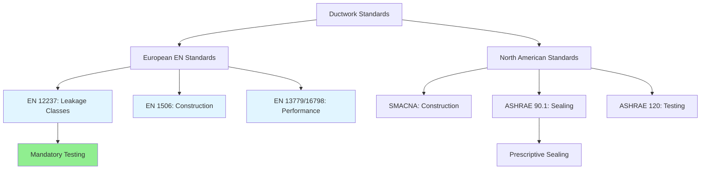

## Overview of European Ductwork Standards

European ductwork design and construction follows a comprehensive framework established primarily through EN 12237 (sheet metal air ducts), EN 1506 (rectangular sheet metal ducts), EN 13779 (ventilation performance requirements), and the newer EN 16798 series. These standards establish rigorous requirements for duct construction, leakage classification, pressure testing, and system performance that often exceed North American practices defined by SMACNA and ASHRAE Standard 90.1.

The European approach emphasizes airtightness through mandatory leakage testing, standardized construction methods, and detailed classification systems that integrate with building energy performance requirements under the Energy Performance of Buildings Directive (EPBD).

## Duct Leakage Classification System

EN 12237 establishes four duct leakage classes (A, B, C, D) based on allowable air leakage rates per unit surface area at specified test pressures. This classification directly impacts energy consumption and system performance.

### Leakage Rate Calculation

The allowable leakage rate is calculated using:

$$
f_v = C \cdot \Delta p^{0.65}
$$

Where:
- $f_v$ = leakage rate per square meter of duct surface (L/s·m²)
- $C$ = leakage class coefficient
- $\Delta p$ = test pressure (Pa)

| Leakage Class | C Coefficient | Typical Applications |
|--------------|---------------|----------------------|
| Class A | 0.027 | High-performance buildings, cleanrooms |
| Class B | 0.009 | Standard commercial HVAC, office buildings |
| Class C | 0.003 | Low-pressure residential systems |
| Class D | 0.001 | Very low-pressure applications |

### Test Pressure Requirements

Test pressures are determined by the duct pressure classification:

- **Low pressure**: ≤500 Pa → Test at 400 Pa
- **Medium pressure**: 500-1500 Pa → Test at 700 Pa
- **High pressure**: >1500 Pa → Test at 1000 Pa

Total system leakage must satisfy:

$$
Q_L = f_v \cdot A_{duct} = C \cdot \Delta p^{0.65} \cdot A_{duct}
$$

Where $A_{duct}$ represents the total duct surface area including fittings.

## EN 13779 Sizing and Performance Requirements

EN 13779 (superseded by EN 16798-3 but still widely referenced) establishes ventilation system performance criteria including velocity limits, pressure drop allowances, and air distribution effectiveness.

### Velocity Limitations

Maximum duct velocities prevent excessive noise generation and pressure losses:

| Duct Location | Maximum Velocity | Noise Criteria |
|--------------|------------------|----------------|
| Main ducts | 8 m/s | NC 35-40 |
| Branch ducts | 6 m/s | NC 30-35 |
| Terminal devices | 4 m/s | NC 25-30 |
| Supply openings (occupied zones) | 2-3 m/s | NC 25-30 |

### Pressure Drop Budget

EN 13779 recommends specific pressure (SFP) targets for complete systems:

$$
SFP = \frac{P_{fan,total}}{\dot{V}}
$$

Where:
- $SFP$ = specific fan power (W/(L/s) or kW/(m³/s))
- $P_{fan,total}$ = total fan power (W)
- $\dot{V}$ = airflow rate (L/s or m³/s)

**Target SFP Values:**
- **SFP 1**: <500 W/(m³/s) - Passive ventilation systems
- **SFP 2**: 500-750 W/(m³/s) - Demand-controlled ventilation
- **SFP 3**: 750-1250 W/(m³/s) - CAV systems
- **SFP 4**: 1250-2000 W/(m³/s) - Complex VAV systems
- **SFP 5**: >2000 W/(m³/s) - Specialized industrial systems

## Duct Construction Standards EN 1506

EN 1506 specifies rectangular duct construction including sheet metal thickness, joint configurations, reinforcement spacing, and sealing requirements.

### Sheet Metal Thickness Requirements

Minimum sheet metal thickness varies with duct dimensions and pressure class:

| Duct Dimension (mm) | Low Pressure | Medium Pressure | High Pressure |
|---------------------|--------------|-----------------|---------------|
| ≤200 | 0.5 mm | 0.6 mm | 0.8 mm |
| 201-500 | 0.6 mm | 0.7 mm | 1.0 mm |
| 501-1000 | 0.7 mm | 0.8 mm | 1.2 mm |
| 1001-2000 | 0.8 mm | 1.0 mm | 1.5 mm |
| >2000 | 1.0 mm | 1.2 mm | 2.0 mm |

### Reinforcement Spacing

Rectangular ducts require transverse reinforcement at intervals determined by duct width and pressure:

$$
L_{max} = k \cdot \frac{w}{\sqrt{\Delta p}}
$$

Where:
- $L_{max}$ = maximum reinforcement spacing (m)
- $k$ = construction factor (typically 1.5-2.0)
- $w$ = duct width (m)
- $\Delta p$ = design pressure (Pa)

## Comparison with ASHRAE/SMACNA Standards

### Key Differences

| Aspect | European Standards | ASHRAE/SMACNA |
|--------|-------------------|---------------|
| Leakage testing | Mandatory for all classes | Optional (ASHRAE 120) |
| Sealing specification | Performance-based (leakage class) | Prescriptive (seal locations) |
| Pressure testing | Detailed protocols by class | General guidelines |
| Velocity limits | Strict NC-based criteria | Application-dependent |
| SFP requirements | Mandatory energy targets | Voluntary (90.1 recommendations) |

## Insulation Requirements EN 14303

Duct insulation follows EN 14303 and integrates with overall building energy calculations per EN ISO 13790. Minimum insulation thermal resistance varies by application:

$$
R_{min} = \frac{1}{U_{max}}
$$

**Typical Requirements:**
- Supply ducts in unconditioned spaces: R ≥ 1.2 m²·K/W
- Return ducts in unconditioned spaces: R ≥ 0.6 m²·K/W
- Ducts in conditioned spaces: R ≥ 0.3 m²·K/W

Heat loss through insulated ductwork:

$$
Q_{loss} = U \cdot A_{duct} \cdot (T_{air} - T_{ambient})
$$

Where:
- $U$ = overall heat transfer coefficient (W/m²·K)
- $A_{duct}$ = duct surface area (m²)
- $T_{air}$ - $T_{ambient}$ = temperature difference (K)

## System Integration and Compliance

European ductwork standards integrate with broader building performance frameworks including EN 15241 (ventilation for buildings) and national building codes. Compliance verification requires:

1. **Design documentation**: Leakage class specification for all duct sections
2. **Construction verification**: Material certificates and joint assembly records
3. **Pressure testing**: Witnessed testing per EN 12237 protocols
4. **Performance commissioning**: Airflow verification and SFP measurement

This integrated approach ensures ductwork design directly supports EPBD energy performance targets while maintaining indoor air quality standards per EN 16798-1.

---

**References:**
- EN 12237:2003 - Ventilation for buildings: Ductwork
- EN 1506:2007 - Sheet metal air ducts and fittings
- EN 13779:2007 - Ventilation for non-residential buildings
- EN 16798-3:2017 - Energy performance of buildings: Ventilation
- ASHRAE Handbook - HVAC Systems and Equipment
