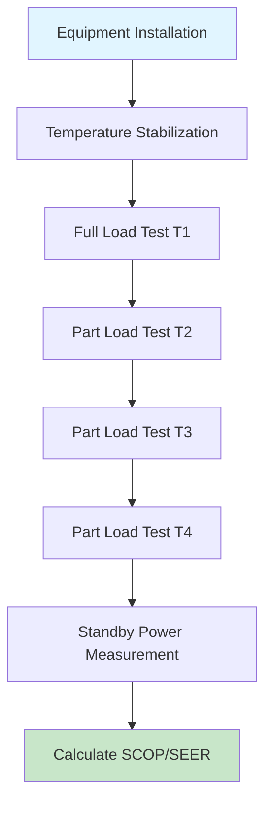

# EU Energy Performance Standards for HVAC Systems

European energy performance standards establish mandatory efficiency requirements for HVAC equipment through the Ecodesign Directive (2009/125/EC) and Energy Labeling Regulation (2017/1369). These standards fundamentally differ from North American approaches by emphasizing seasonal performance metrics that account for part-load operation and climate variations.

## Seasonal Efficiency Metrics

European standards mandate seasonal coefficients of performance rather than single-point ratings, providing more accurate representations of annual energy consumption.

### Seasonal Coefficient of Performance (SCOP)

SCOP quantifies heating efficiency across the entire heating season using climate-weighted performance at multiple operating points:

$$
SCOP = \frac{\sum_{j} h_j \cdot P_{h}(T_j)}{\sum_{j} h_j \cdot \left[\frac{P_{h}(T_j)}{COP(T_j)} + P_{TO}(T_j) + P_{SB}(T_j) + P_{CK}(T_j) + P_{OFF}(T_j)\right]}
$$

Where:
- $h_j$ = number of hours at bin temperature $T_j$ (hours)
- $P_{h}(T_j)$ = heating capacity at bin temperature (kW)
- $COP(T_j)$ = coefficient of performance at operating point
- $P_{TO}$ = thermostat off mode power (kW)
- $P_{SB}$ = standby power (kW)
- $P_{CK}$ = crankcase heater power (kW)
- $P_{OFF}$ = off mode power (kW)

### Seasonal Energy Efficiency Ratio (SEER)

SEER evaluates cooling performance using similar seasonal methodology:

$$
SEER = \frac{Q_{C,annual}}{E_{C,annual}} = \frac{\sum_{j} h_j \cdot P_{c}(T_j)}{\sum_{j} h_j \cdot \left[\frac{P_{c}(T_j)}{EER(T_j)} + P_{TO}(T_j) + P_{SB}(T_j) + P_{OFF}(T_j)\right]}
$$

Where:
- $Q_{C,annual}$ = annual cooling demand (kWh)
- $E_{C,annual}$ = annual cooling electricity consumption (kWh)
- $P_{c}(T_j)$ = cooling capacity at bin temperature (kW)
- $EER(T_j)$ = energy efficiency ratio at operating point

## Climate Zone Classification

European standards define three reference climates for performance testing, recognizing continental diversity:

| Climate | Location | Annual Average Temp | Heating Hours | Cooling Hours |
|---------|----------|---------------------|---------------|---------------|
| Average | Strasbourg | 10.5°C | 4,910 | 350 |
| Warmer | Athens | 17.6°C | 2,602 | 1,177 |
| Colder | Helsinki | 5.3°C | 6,446 | 0 |

## Testing Protocol Standards

### EN 14511 Multi-Split Testing

EN 14511 establishes testing procedures for air conditioners and heat pumps, requiring performance verification at standardized conditions:

### Standard Rating Conditions

Performance testing occurs at specific outdoor temperatures corresponding to operating bins:

**Heating Mode (EN 14511-3):**
- T1: +7°C outdoor, 20°C indoor (rated capacity point)
- T2: +2°C outdoor, 20°C indoor
- T3: -7°C outdoor, 20°C indoor
- T4: -15°C outdoor, 20°C indoor (for colder climates)

**Cooling Mode (EN 14511-2):**
- T1: +35°C outdoor, 27°C indoor (rated capacity point)
- T2: +30°C outdoor, 27°C indoor
- T3: +25°C outdoor, 27°C indoor
- T4: +20°C outdoor, 27°C indoor

## Minimum Efficiency Requirements

Ecodesign regulations mandate progressive efficiency improvements through tiered implementation:

### Air-to-Air Heat Pumps (Regulation 206/2012)

| Capacity Range | SCOP Minimum (Average Climate) | SEER Minimum |
|----------------|--------------------------------|--------------|
| ≤12 kW | 4.0 | 6.1 |
| >12 kW | 4.0 | 5.1 |

### Space Heaters (Regulation 813/2013)

Seasonal space heating energy efficiency (ηs) requirements:

$$
\eta_s = \frac{Q_{H,annual}}{Q_{fuel} + E_{elec} \cdot CC}
$$

Where:
- $Q_{fuel}$ = annual fuel consumption (kWh)
- $E_{elec}$ = annual electricity consumption (kWh)
- $CC$ = conversion coefficient (2.5 for electricity to primary energy)

Minimum $\eta_s$ values range from 75% (conventional boilers) to 125% (heat pumps and condensing systems).

## Comparison with ASHRAE Standards

European and North American approaches exhibit fundamental differences:

| Parameter | European Standards | ASHRAE Standards |
|-----------|-------------------|------------------|
| Metric Basis | Seasonal (SCOP/SEER) | Single-point + partial load (IEER/IPLV) |
| Climate Consideration | Three reference climates | Single standard condition |
| Part-Load Weighting | Temperature bin method | Four-point weighted average |
| Standby Power | Included in calculation | Separate specification |
| Testing Standard | EN 14511 | AHRI 210/240 |

ASHRAE Standard 90.1 emphasizes integrated part-load values (IPLV) calculated at 100%, 75%, 50%, and 25% load points, while European SCOP/SEER integrate continuously across temperature bins weighted by occurrence frequency.

## Control Requirements

EN 15232 specifies building automation impact on energy performance, categorizing control systems by efficiency class:

- **Class A (High energy performance):** Advanced automation with self-adaptive control
- **Class B (Standard):** Electronic control with limited self-regulation
- **Class C (Non-energy efficient):** Manual control systems
- **Class D (Non-energy efficient):** No automatic controls

Control system efficiency factors modify calculated building energy demand, with Class A systems reducing HVAC energy consumption by 10-20% compared to Class C reference systems.

## Compliance Documentation

Manufacturers must provide technical documentation demonstrating:

1. Test results at all specified operating points per EN 14511
2. SCOP/SEER calculations for all three climate zones
3. Sound power level measurements per EN 12102
4. Refrigerant environmental data including GWP values
5. Installation and maintenance instructions ensuring rated performance

Non-compliance results in market withdrawal and financial penalties under the Market Surveillance Regulation (EU) 2019/1020.

## Components

- En 15232 Building Automation Control Impact
- En 15316 Heating Systems Buildings
- En 14825 Air Conditioners Heat Pumps Heating
- En 14511 Air Conditioners Chillers Heat Pumps
- En 12309 Gas Fired Absorption Adsorption Heat Pumps

---

*Content reflects standards current through January 2025.*
