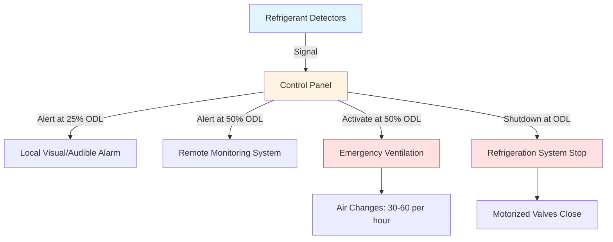

## Overview of European Refrigeration Standards

European refrigeration standards establish harmonized safety and performance requirements across EU member states. The EN 378 series constitutes the primary framework for refrigerating systems and heat pumps, covering design, construction, testing, installation, and operation. These standards support compliance with the Pressure Equipment Directive (PED) 2014/68/EU and F-Gas Regulation (EU) No 517/2014.

EN 378 differs from ASHRAE Standard 15 in several key areas: refrigerant charge limits, occupancy classifications, machinery room requirements, and leak detection thresholds. Understanding these distinctions is essential for engineers working on international projects or equipment certification.

## EN 378 Standard Series Structure

The EN 378 standard divides into four interconnected parts:

**EN 378-1: Safety and Environmental Requirements**
- Refrigerant classification and properties
- Occupancy category definitions
- Charge limit calculations
- Location restrictions
- Safety device requirements

**EN 378-2: Design, Construction, Testing, Marking, and Documentation**
- Pressure vessel design according to PED
- Material specifications
- Welding and joining procedures
- Pressure and leak testing protocols
- Technical documentation requirements

**EN 378-3: Installation Site and Personal Protection**
- Machinery room design criteria
- Ventilation requirements
- Emergency systems and alarms
- Personal protective equipment
- Maintenance access provisions

**EN 378-4: Operation, Maintenance, Repair, and Recovery**
- Commissioning procedures
- Periodic inspection schedules
- Refrigerant handling and recovery
- Decommissioning requirements
- Record-keeping obligations

## Refrigerant Classification and Charge Limits

EN 378-1 classifies refrigerants by safety group (A1, A2L, A2, A3, B1, B2L, B2, B3) following ISO 817 and ASHRAE Standard 34. The standard then establishes maximum allowable charge limits based on refrigerant group, occupancy category, and system type.

### Occupancy Categories

| Category | Description | Examples | Critical Factor |
|----------|-------------|----------|-----------------|
| a | Residential/domestic | Houses, apartments | m³ per person |
| b | Supervised public | Offices, restaurants | Escape routes |
| c | Public with high density | Theaters, sports venues | Evacuation time |
| d | Critical facilities | Hospitals, data centers | Continued operation |

### Practical Charge Limit Calculation

For direct systems with A1 refrigerants (R-134a, R-404A, R-507A) in occupancy category b:

$$m_{max} = 2.5 \times LFL \times h_0 \times A^{0.5}$$

Where:
- $m_{max}$ = maximum refrigerant charge (kg)
- $LFL$ = lower flammability limit (kg/m³), or practical limit for A1 refrigerants
- $h_0$ = installation height above floor (m), limited to 1.8 m
- $A$ = floor area of occupied space (m²)

For A1 refrigerants (non-flammable), the practical charge limit simplifies based on toxicity and room volume. Category b occupancies permit up to 1.5 kg per m³ of room volume for most A1 refrigerants, with specific calculations required for smaller spaces.

For A2L refrigerants (R-32, R-1234yf, R-454B, R-515B):

$$m_{max} = \frac{LFL \times h_0 \times A^{0.5}}{G}$$

Where $G$ is the safety factor (typically 4 for A2L refrigerants).

### Refrigerant Charge Limit Comparison

| Refrigerant | Group | LFL (kg/m³) | Max Charge 50 m² Office | Notes |
|-------------|-------|-------------|--------------------------|-------|
| R-404A | A1 | Non-flammable | 106 kg | Volume-based limit |
| R-134a | A1 | Non-flammable | 106 kg | Volume-based limit |
| R-32 | A2L | 0.307 | 14.7 kg | Height h₀ = 1.8 m |
| R-1234yf | A2L | 0.289 | 13.8 kg | Height h₀ = 1.8 m |
| R-290 (Propane) | A3 | 0.038 | 1.8 kg | Severe restrictions |
| R-717 (Ammonia) | B2L | 0.116 | Prohibited | Machinery room only |

## Machinery Room Requirements

EN 378-3 mandates machinery rooms for systems exceeding charge limits for occupied spaces or using B-group (toxic) refrigerants. Machinery room design must satisfy multiple criteria:

**Structural Requirements:**
- Fire resistance rating REI 120 (120 minutes)
- Direct access to open air or protected corridor
- Doors opening outward with panic hardware
- No direct connection to occupiable spaces
- Explosion-proof electrical equipment for A2, A3, B2, B3 refrigerants

**Ventilation Design:**

Mechanical ventilation capacity must remove refrigerant vapor from the largest leak scenario. For A1 refrigerants:

$$Q_{vent} = \frac{m_{total}}{t \times \rho_{air} \times C_{max}}$$

Where:
- $Q_{vent}$ = ventilation rate (m³/s)
- $m_{total}$ = total system charge (kg)
- $t$ = evacuation time (3600 s for emergency mode)
- $\rho_{air}$ = air density (1.2 kg/m³)
- $C_{max}$ = maximum allowable concentration (kg/kg), typically ODL/2

For flammable refrigerants, ventilation must maintain concentration below 25% of LFL with continuous operation and emergency backup.

**Detection and Alarm Systems:**

## Pressure Equipment Directive Compliance

Refrigeration systems fall under PED 2014/68/EU when operating pressures exceed 0.5 bar gauge. The directive categorizes equipment based on pressure-volume product and fluid group:

**Fluid Group Classification:**
- Group 1: Refrigerants classified as dangerous per CLP Regulation
- Group 2: All other refrigerants

**Category Assignment:**

For vessels and pressure accessories, the category depends on:

$$PV_{product} = PS \times V$$

Where:
- $PS$ = maximum allowable pressure (bar gauge)
- $V$ = vessel volume (liters)

| PV Product | Group 2 (Most Refrigerants) | Group 1 (Ammonia, Hydrocarbons) |
|------------|------------------------------|----------------------------------|
| < 50 bar·L | Sound Engineering Practice (SEP) | Category I |
| 50-200 bar·L | Category I | Category II |
| 200-1000 bar·L | Category II | Category III |
| > 1000 bar·L | Category III | Category IV |

Higher categories require:
- Notified body conformity assessment
- CE marking with identification number
- EU Declaration of Conformity
- Complete technical documentation
- Production quality assurance

## EN 13313: Refrigerant Pipework

EN 13313 specifies requirements for refrigerant piping systems, complementing EN 378 with detailed installation guidance:

**Material Selection:**
- Copper tube to EN 12735-1 for halocarbon refrigerants
- Steel pipe to EN 10255 or EN 10216 for ammonia systems
- Aluminum prohibited for most refrigerants
- Stainless steel for specific applications

**Jointing Methods:**
- Brazed connections preferred (silver alloy >5% silver)
- Flared fittings limited to small diameters and low pressure
- Welded joints required for steel ammonia piping
- Mechanical joints restricted to accessible locations

**Pressure Testing Protocol:**

Strength test pressure:

$$P_{strength} = 1.43 \times PS$$

Tightness test pressure:

$$P_{tightness} = 1.1 \times PS$$

Minimum test duration: 24 hours with documented pressure monitoring.

## Leak Detection Requirements

EN 378 establishes leak detection thresholds based on refrigerant charge and GWP:

**Fixed Detection Mandatory When:**
- Total charge exceeds 500 kg CO₂-equivalent
- Charge > 500 kg for any refrigerant in machinery spaces
- Flammable refrigerants (A2L, A3) in occupied areas

**Calculation:**

$$CO_2eq = m_{charge} \times GWP$$

Where:
- $m_{charge}$ = refrigerant charge (kg)
- $GWP$ = Global Warming Potential (100-year value)

For R-404A (GWP 3922): Fixed detection required when charge exceeds 0.127 kg (500/3922).

For R-32 (GWP 675): Fixed detection required when charge exceeds 0.74 kg.

This requirement drives significant design differences compared to ASHRAE 15, particularly for high-GWP refrigerants still permitted in existing systems.

## Comparison: EN 378 vs ASHRAE 15

| Aspect | EN 378 | ASHRAE 15 |
|--------|--------|-----------|
| Refrigerant classification | ISO 817 | ASHRAE 34 (similar) |
| Occupancy categories | a, b, c, d | A1, A2, A3, B1, B2 |
| Charge limit basis | Area-based formula | Volume-based |
| Machinery room ventilation | ODL-based continuous | Leak scenario event |
| Leak detection threshold | 500 kg CO₂-eq | 6.6 kg refrigerant |
| Pressure testing | PED requirements | ASME standards |
| Documentation | Technical file mandatory | Installation records |

## Periodic Inspection Requirements

F-Gas Regulation 517/2014 mandates periodic leak checking intervals based on CO₂-equivalent charge:

| CO₂-Equivalent Charge (tCO₂) | Inspection Frequency | Fixed Detection Alternative |
|------------------------------|---------------------|------------------------------|
| 5 to < 50 | Every 12 months | 24 months with detection |
| 50 to < 500 | Every 6 months | 12 months with detection |
| ≥ 500 | Every 3 months | 6 months with detection |
| Hermetic < 10 | Exempt if labeled | N/A |

Certified technicians must perform inspections following EN 378-4 protocols and record findings in system logbooks maintained for minimum 5 years.

## Practical Implementation Considerations

Engineers designing refrigeration systems for European installations must navigate multiple overlapping regulations:

1. **EN 378 series** for safety and design
2. **PED 2014/68/EU** for pressure vessels
3. **F-Gas Regulation 517/2014** for environmental compliance
4. **ATEX Directive 2014/34/EU** for flammable refrigerants
5. **National codes** that may impose stricter requirements

The trend toward lower-GWP refrigerants (A2L and A3 classifications) creates design challenges reconciling flammability safety with charge limit optimization. Indirect systems using secondary fluids increasingly provide solutions for large capacity applications while maintaining compliance.

---

*This content provides engineering guidance based on published standards. Designers must verify current standard editions and local implementing regulations for specific projects. Professional engineering judgment and appropriate certifications remain essential for refrigeration system design and installation.*
