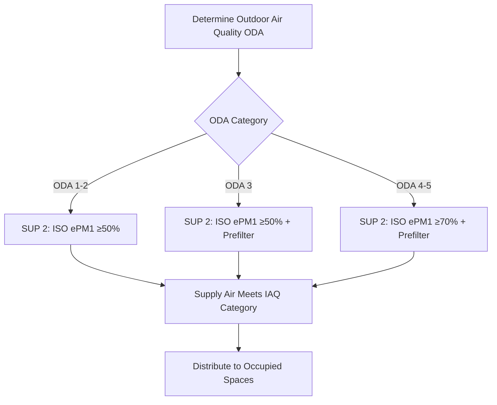
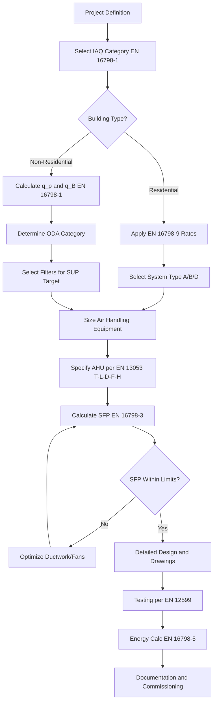

# European Ventilation Standards: EN 13779 to EN 16798

European ventilation standards establish the technical framework for ventilation system design, indoor environment quality classification, energy performance assessment, and testing procedures across all EU member states. The primary standards—EN 13779 (now superseded by EN 16798), EN 15251 (replaced by EN 16798-1), EN 12599 for testing, and EN 13053 for air handling unit ratings—define ventilation rate methodologies, indoor air quality categories, air cleanliness classifications, energy efficiency metrics, and commissioning protocols that differ substantively from North American approaches codified in ASHRAE Standards 62.1 and 62.2.

## EN 16798: Energy Performance of Buildings - Ventilation

### Standard Development and Structure

**Transition from EN 13779 and EN 15251:**
EN 16798 series replaced and consolidated earlier European ventilation standards effective 2019, providing updated methodology aligned with Energy Performance of Buildings Directive (EPBD) requirements. The standard addresses energy performance calculation while maintaining ventilation design principles.

**EN 16798 series structure:**

- **EN 16798-1:** Indoor environmental input parameters for design and assessment of energy performance including air quality, thermal environment, lighting, and acoustics
- **EN 16798-2:** Interpretation of requirements in EN 16798-1 for commercial buildings
- **EN 16798-3:** Ventilation for non-residential buildings - Performance requirements for ventilation and room-conditioning systems
- **EN 16798-5:** Calculation methods for energy requirements of ventilation systems
- **EN 16798-7:** Calculation of system ventilation effectiveness
- **EN 16798-9:** Calculation methods for residential ventilation
- **EN 16798-13:** Calculation of cooling systems
- **EN 16798-15:** Energy performance of buildings - Ventilation for buildings - Calculation methods for energy requirements of heating systems
- **EN 16798-17:** Ventilation for buildings - Guidelines for inspection of ventilation systems

### Indoor Air Quality Categories (EN 16798-1)

**Classification system:**
EN 16798-1 establishes four indoor air quality (IAQ) categories based on occupant expectations and building type, fundamentally different from ASHRAE 62.1's prescriptive approach.

| IAQ Category | Description | Typical Applications | Dissatisfaction Level |
|--------------|-------------|---------------------|----------------------|
| **Category I** | High level of expectation | Spaces occupied by sensitive persons (hospitals, nurseries, allergy care) | < 15% dissatisfied |
| **Category II** | Normal level of expectation | New buildings, renovations (offices, schools, residential) | < 20% dissatisfied |
| **Category III** | Moderate, acceptable level | Existing buildings during major renovation | < 30% dissatisfied |
| **Category IV** | Low expectation | Existing buildings requiring upgrade | > 30% dissatisfied |

**Design principle:**
Select IAQ category during design phase based on building purpose, occupant expectations, energy performance targets, and economic constraints. Higher categories require increased ventilation rates but provide superior occupant satisfaction and productivity.

### Ventilation Rate Determination

**Two complementary methods:**

**Method A: Ventilation rate based on perceived air quality:**

The required ventilation rate accounts for emissions from both occupants and building materials:

$$q_{tot} = n \cdot q_p + A \cdot q_B$$

Where:
- $q_{tot}$ = Total required ventilation rate (L/s)
- $n$ = Number of occupants (persons)
- $q_p$ = Ventilation rate per person (L/s·person)
- $A$ = Floor area (m²)
- $q_B$ = Ventilation rate per floor area for building emissions (L/s·m²)

**Category-specific ventilation rates (low-polluting buildings):**

| IAQ Category | $q_p$ (L/s·person) | $q_B$ (L/s·m²) | Total Rate (Office, 0.07 persons/m²) |
|--------------|-------------------|----------------|--------------------------------------|
| Category I | 10 | 0.5 | 1.2 L/s·m² (2.4 cfm/ft²) |
| Category II | 7 | 0.35 | 0.84 L/s·m² (1.7 cfm/ft²) |
| Category III | 4 | 0.2 | 0.48 L/s·m² (0.95 cfm/ft²) |
| Category IV | 2.5 | 0.1 | 0.28 L/s·m² (0.55 cfm/ft²) |

**High-polluting buildings:**
For spaces with significant material emissions (new construction with low-emission materials not selected), multiply $q_B$ by correction factors 1.5-3.0 depending on emission level.

**Method B: Ventilation rate based on specific contaminants:**

For spaces with known dominant contaminants (CO₂ in densely occupied spaces, specific pollutants in industrial ventilation):

$$q = \frac{G}{C_i - C_o}$$

Where:
- $q$ = Required ventilation rate (m³/s)
- $G$ = Contaminant generation rate (mg/s or L/s for CO₂)
- $C_i$ = Indoor design concentration limit (mg/m³ or ppm)
- $C_o$ = Outdoor contaminant concentration (mg/m³ or ppm)

**CO₂-based calculation (metabolic generation):**

$$q_{CO_2} = \frac{n \cdot G_{CO_2}}{C_{i,CO_2} - C_{o,CO_2}}$$

Where:
- $G_{CO_2}$ = CO₂ generation per person ≈ 19 L/h (0.0053 L/s) for sedentary office work
- $C_{i,CO_2}$ = Indoor CO₂ concentration limit (ppm above outdoor)
- $C_{o,CO_2}$ = Outdoor CO₂ concentration (typically 400 ppm)

**Category-specific CO₂ limits:**

| IAQ Category | Max CO₂ Above Outdoor | Indoor CO₂ (400 ppm outdoor) | Approx. Ventilation Rate |
|--------------|----------------------|------------------------------|-------------------------|
| Category I | 350 ppm | 750 ppm | 15.1 L/s·person |
| Category II | 500 ppm | 900 ppm | 10.6 L/s·person |
| Category III | 800 ppm | 1200 ppm | 6.6 L/s·person |
| Category IV | 1200 ppm | 1600 ppm | 4.4 L/s·person |

### Comparison with ASHRAE 62.1

**Fundamental approach differences:**

| Aspect | EN 16798-1 | ASHRAE 62.1-2022 |
|--------|-----------|------------------|
| **Philosophy** | Category-based expectation levels | Prescriptive minimum rates |
| **Occupant component** | 2.5-10 L/s·person by category | 2.5 L/s·person (fixed) |
| **Building component** | 0.1-0.5 L/s·m² by category | Varies by space type (0-0.3 cfm/ft²) |
| **Design flexibility** | High (select category) | Medium (fixed by space type) |
| **Energy consideration** | Explicit in category selection | Implicit in rate selection |
| **Contaminant basis** | Perceived air quality (decipol) | Health-based (CO₂, VOC, formaldehyde) |

**Office space example comparison (100 m², 7 occupants):**

**EN 16798-1 Category II:**
- Person component: 7 × 7 = 49 L/s
- Building component: 100 × 0.35 = 35 L/s
- **Total: 84 L/s (178 cfm, 0.84 L/s·m² or 1.67 cfm/ft²)**

**ASHRAE 62.1-2022 (Office, Table 6-1):**
- Person component: 7 × 2.5 = 17.5 L/s
- Area component: 100 × 0.06 × 2.118 = 12.7 cfm = 6.0 L/s
- **Total: 23.5 L/s (50 cfm, 0.235 L/s·m² or 0.47 cfm/ft²)**

**Result:** EN 16798 Category II requires 3.6× the ventilation rate of ASHRAE 62.1 for typical office spaces, reflecting European emphasis on perceived air quality and material emissions.

### Outdoor Air Quality Classification

**EN 16798-1 outdoor air quality (ODA) categories:**

| ODA Category | Description | PM₁₀ (μg/m³) | NO₂ (μg/m³) | Typical Locations |
|--------------|-------------|--------------|-------------|-------------------|
| **ODA 1** | Pure air | < 20 | < 40 | Rural areas, forests |
| **ODA 2** | Low pollution | 20-35 | 40-80 | Suburban areas |
| **ODA 3** | Moderate pollution | 35-50 | 80-150 | Urban areas |
| **ODA 4** | High pollution | 50-70 | 150-250 | City centers with traffic |
| **ODA 5** | Very high pollution | > 70 | > 250 | Industrial areas, highways |

**Air filtration requirements:**
Outdoor air must be filtered to achieve supply air quality (SUP) matching or exceeding indoor air quality category requirements.

**Supply air categories (after filtration):**

| SUP Category | Max Particle Concentration | Min Filter Class | Applications |
|--------------|---------------------------|-----------------|--------------|
| **SUP 1** | Very low | ISO ePM1 ≥ 80% | Operating rooms, cleanrooms |
| **SUP 2** | Low | ISO ePM1 ≥ 50% | Category I spaces |
| **SUP 3** | Medium | ISO Coarse ≥ 80% | Category II-III spaces |
| **SUP 4** | Moderate | ISO Coarse ≥ 60% | Category IV spaces |

**Filter selection logic:**
Combine ODA category with required SUP category to determine minimum filter efficiency. Example: ODA 3 (urban) with Category II building (SUP 2 required) mandates minimum ISO ePM1 ≥ 50% filter (equivalent to MERV 13-14).

## EN 13053: Air Handling Unit Ratings and Performance

### Scope and Application

EN 13053 establishes classification and rating system for air handling units (AHUs) covering thermal performance, air leakage, filter bypass, mechanical strength, and heat recovery efficiency. The standard enables comparison between manufacturers and specification of minimum performance requirements.

### Classification Parameters

**Thermal transmittance (insulation class):**

| Class | Max U-value (W/m²·K) | Typical Construction |
|-------|---------------------|---------------------|
| **T1** | ≤ 0.3 | Heavy insulation (100 mm mineral wool) |
| **T2** | ≤ 0.5 | Standard insulation (50 mm) |
| **T3** | ≤ 1.0 | Light insulation (25 mm) |
| **T4** | ≤ 1.5 | Minimal insulation |
| **T5** | > 1.5 | No insulation |

**Air leakage class (at ±400 Pa, ±700 Pa, or ±1000 Pa test pressure):**

| Class | Max Leakage Rate (% of nominal flow) | Application |
|-------|--------------------------------------|-------------|
| **L1** | ≤ 0.15% + 0.06 L/s·m² | High-performance systems |
| **L2** | ≤ 0.30% + 0.12 L/s·m² | Standard commercial |
| **L3** | ≤ 0.45% + 0.18 L/s·m² | Light commercial |

**Mechanical strength:**

| Class | Test Deflection Limit | Static Pressure Range |
|-------|----------------------|----------------------|
| **D1** | ≤ 4 mm/m panel length | ≥ ±2000 Pa |
| **D2** | ≤ 6 mm/m panel length | ≥ ±1500 Pa |
| **D3** | ≤ 8 mm/m panel length | ≥ ±1000 Pa |

**Filter bypass class:**

| Class | Max Bypass (% of flow) | Sealing Quality |
|-------|------------------------|-----------------|
| **F5** | ≤ 0.5% | Excellent sealing |
| **F6** | ≤ 1% | Good sealing |
| **F7** | ≤ 2% | Standard sealing |
| **F8** | ≤ 5% | Light sealing |
| **F9** | > 5% | Poor sealing |

### Heat Recovery Efficiency Classification

**Temperature efficiency at design conditions:**

$$\eta_t = \frac{t_{supply} - t_{outdoor}}{t_{extract} - t_{outdoor}} \times 100\%$$

Where:
- $\eta_t$ = Temperature efficiency (%)
- $t_{supply}$ = Supply air temperature after heat recovery (°C)
- $t_{outdoor}$ = Outdoor air temperature (°C)
- $t_{extract}$ = Extract air temperature (°C)

**EN 13053 efficiency classes:**

| Class | Min Dry Efficiency (%) | Typical Technology |
|-------|----------------------|-------------------|
| **H1** | ≥ 90% | Counterflow plate, rotary regenerator |
| **H2** | ≥ 80% | Crossflow plate, heat pipe |
| **H3** | ≥ 70% | Crossflow plate (compact) |
| **H4** | ≥ 60% | Run-around coil, basic plate |
| **H5** | < 60% | Thermal wheel (low efficiency) |

**Humidity recovery (enthalpic exchangers):**

Additional classification for moisture transfer effectiveness:

$$\eta_x = \frac{x_{supply} - x_{outdoor}}{x_{extract} - x_{outdoor}} \times 100\%$$

Where:
- $\eta_x$ = Moisture recovery efficiency (%)
- $x$ = Absolute humidity (g/kg)

**Typical AHU specification example:**
**Classification: EN 13053 - T2 L1 D1 F5 H1**
- T2: U-value ≤ 0.5 W/m²·K
- L1: Air leakage ≤ 0.15% + 0.06 L/s·m² at 400 Pa
- D1: Panel deflection ≤ 4 mm/m at 2000 Pa
- F5: Filter bypass ≤ 0.5%
- H1: Heat recovery efficiency ≥ 90%

This specification ensures high-performance unit suitable for Category I or II buildings with energy recovery ventilation.

## EN 12599: Ventilation Testing and Measurement Procedures

### Standard Scope

EN 12599 establishes protocols for testing, adjusting, and balancing (TAB) of ventilation and air conditioning systems to verify compliance with design specifications. The standard defines measurement methods, instrumentation accuracy requirements, test conditions, and documentation formats.

### Measurement Parameters and Methods

**Air flow rate measurement:**

**Duct traverse method (EN 12599 Section 6.1):**

$$Q = A \cdot \bar{v}$$

Where:
- $Q$ = Volume flow rate (m³/s)
- $A$ = Duct cross-sectional area (m²)
- $\bar{v}$ = Mean air velocity from traverse (m/s)

**Traverse point requirements:**

| Duct Diameter/Width (mm) | Minimum Points | Traverse Pattern |
|--------------------------|----------------|------------------|
| < 250 | 9 | 3×3 grid |
| 250-500 | 16 | 4×4 grid |
| 500-1000 | 25 | 5×5 grid |
| > 1000 | 36+ | 6×6 or more |

**Measurement accuracy requirements:**

| Parameter | Required Accuracy | Instrument Type |
|-----------|------------------|-----------------|
| Air velocity | ±3% of reading or ±0.05 m/s | Thermal anemometer, vane anemometer |
| Volume flow | ±5% of reading | Pitot tube + manometer, flow hood |
| Static pressure | ±2 Pa or ±3% | Digital manometer |
| Temperature | ±0.5 K | Calibrated thermometer/sensor |
| Humidity | ±5% RH | Calibrated hygrometer |

**Supply/extract terminal flow measurement:**

**Flow hood method:**
Preferred for ceiling diffusers and grilles where duct access unavailable. Accuracy: ±10% for flows > 50 L/s, decreases for lower flows.

**Balancing tolerance:**

| System Component | Acceptable Deviation from Design |
|------------------|----------------------------------|
| Individual terminal | ±10% |
| Room total supply/extract | ±5% |
| System total flow | ±5% |
| Zone flow | ±5% |
| Room pressurization | ±10% of design pressure |

### System Performance Testing

**Air handling unit verification (EN 12599 Section 7):**

**Parameters tested:**
1. Total supply and extract air flow rates
2. Outdoor, supply, return, and exhaust air temperatures
3. Filter pressure drops
4. Heat recovery efficiency (temperature and enthalpy)
5. Fan power consumption
6. Supply and extract static pressures
7. Sound levels at unit and in occupied spaces

**Heat recovery efficiency field test:**

Measure temperatures at four points simultaneously under steady-state conditions:

$$\eta_{field} = \frac{t_2 - t_1}{t_3 - t_1} \times 100\%$$

Where:
- $t_1$ = Outdoor air temperature before heat recovery (°C)
- $t_2$ = Supply air temperature after heat recovery (°C)
- $t_3$ = Extract air temperature before heat recovery (°C)

**Acceptance criteria:** Measured efficiency ≥ 90% of manufacturer rating (e.g., 85% rated requires ≥ 76.5% field measurement).

**Specific fan power (SFP) verification:**

$$SFP = \frac{P_{fan}}{Q}$$

Where:
- $SFP$ = Specific fan power (W/(m³/s) or kW/(m³/s))
- $P_{fan}$ = Total electrical power of all fans (supply + extract) (W)
- $Q$ = Air flow rate (m³/s)

Convert to common European unit W/(L/s): Divide by 1000.

**EN 16798-3 SFP limits (supply + extract combined):**

| Ventilation System Type | Max SFP (W/(L/s)) | Max SFP (kW/(m³/s)) |
|-------------------------|------------------|---------------------|
| Residential mechanical extract only | 0.45 | 0.45 |
| Residential balanced with heat recovery | 0.80 | 0.80 |
| Non-residential CAV without heat recovery | 1.50 | 1.50 |
| Non-residential CAV with heat recovery | 2.00 | 2.00 |
| Non-residential VAV with heat recovery | 2.50 | 2.50 |

**Room air quality verification:**

Minimum testing duration: 48 hours of normal occupancy after system balancing complete.

**Monitored parameters:**
- CO₂ concentration (continuous or periodic sampling)
- Temperature and relative humidity
- Air velocity at workstations (< 0.15-0.25 m/s depending on category)
- Acoustic noise level (< 30-45 dB(A) depending on category)

### Documentation Requirements

**Test report contents (EN 12599 Annex C):**

1. System description and design specifications
2. Test conditions (outdoor temperature, occupancy level, system operating mode)
3. Measurement instruments used (model, serial number, calibration date)
4. Measured data with location identifications
5. Comparison of measured vs. design values
6. Deviations and corrective actions taken
7. System balancing calculations and adjustments
8. Final verification of compliance
9. Commissioning sign-off

## Energy Performance Calculation (EN 16798-5)

### Ventilation System Energy Calculation Methodology

EN 16798-5 provides standardized calculation method for annual energy consumption of ventilation systems, supporting EPBD compliance and energy performance certificate (EPC) calculations.

**Total ventilation energy:**

$$E_{vent,tot} = E_{fans} + E_{heat} - E_{rec} + E_{cool} + E_{hum}$$

Where:
- $E_{vent,tot}$ = Total annual ventilation system energy (kWh/year)
- $E_{fans}$ = Fan electrical energy (kWh/year)
- $E_{heat}$ = Heating energy for supply air (kWh/year)
- $E_{rec}$ = Energy recovered by heat recovery (kWh/year)
- $E_{cool}$ = Cooling energy for supply air (kWh/year)
- $E_{hum}$ = Humidification energy (kWh/year)

**Fan energy calculation:**

$$E_{fans} = SFP \cdot Q \cdot t_{op} \cdot f_{ctrl}$$

Where:
- $SFP$ = Specific fan power (kW/(m³/s))
- $Q$ = Air flow rate (m³/s)
- $t_{op}$ = Annual operating hours (hours/year)
- $f_{ctrl}$ = Control factor (0.4-1.0, accounting for VAV, scheduling, etc.)

**Heating energy without heat recovery:**

$$E_{heat,no-rec} = \rho \cdot c_p \cdot Q \cdot (t_{supply} - t_{outdoor,avg}) \cdot t_{op}$$

Where:
- $\rho$ = Air density (1.2 kg/m³)
- $c_p$ = Specific heat of air (1.005 kJ/kg·K)
- $t_{supply}$ = Supply air temperature setpoint (°C)
- $t_{outdoor,avg}$ = Average outdoor temperature during heating season (°C)

**Energy saved by heat recovery:**

$$E_{rec} = \eta_{HR} \cdot E_{heat,no-rec}$$

Where:
- $\eta_{HR}$ = Seasonal heat recovery efficiency (accounting for bypass, defrost, etc.)

**Net heating energy requirement:**

$$E_{heat} = E_{heat,no-rec} - E_{rec} = (1 - \eta_{HR}) \cdot E_{heat,no-rec}$$

### Seasonal Performance Adjustments

**Heat recovery efficiency correction factors:**

| Factor | Typical Value | Impact |
|--------|--------------|--------|
| Temperature efficiency degradation | 0.90-0.95 | Frost, fouling, imbalance |
| Bypass operation (warm season) | 0.70-0.85 | Free cooling mode |
| Defrost penalty (cold climates) | 0.85-0.95 | Preheating or regeneration |
| Cross-leakage (rotary exchangers) | 0.95-0.98 | Supply contamination |

**Effective seasonal efficiency:**

$$\eta_{seasonal} = \eta_{rated} \cdot f_{degrad} \cdot f_{bypass} \cdot f_{defrost}$$

**Example calculation (Northern Europe office building):**
- Design outdoor air flow: 5000 m³/h (1.39 m³/s)
- SFP: 1.8 kW/(m³/s) (supply + extract)
- Heat recovery rated efficiency: 85%
- Operating hours: 3500 hours/year (weekdays, 10 hours/day)
- Control factor: 0.7 (VAV with night/weekend shutdown)
- Supply temperature: 18°C
- Heating season average outdoor temperature: 5°C
- Seasonal HR efficiency: 85% × 0.95 × 0.80 × 0.90 = 58%

**Fan energy:**

$$E_{fans} = 1.8 \times 1.39 \times 3500 \times 0.7 = 6,126 \text{ kWh/year}$$

**Heating energy without recovery:**

$$E_{heat,no-rec} = 1.2 \times 1.005 \times 1.39 \times (18-5) \times 3500 = 76,000 \text{ kWh/year}$$

**Energy recovered:**

$$E_{rec} = 0.58 \times 76,000 = 44,080 \text{ kWh/year}$$

**Net heating energy:**

$$E_{heat} = 76,000 - 44,080 = 31,920 \text{ kWh/year}$$

**Total ventilation energy:**

$$E_{vent,tot} = 6,126 + 31,920 = 38,046 \text{ kWh/year}$$

**Energy savings from heat recovery:** 44,080 kWh/year (58% reduction in heating energy)

**Primary energy impact (electricity factor 2.0, heat factor 1.0):**
- Fan primary energy: 6,126 × 2.0 = 12,252 kWh PE/year
- Heating primary energy: 31,920 × 1.0 = 31,920 kWh PE/year (assuming district heating)
- **Total: 44,172 kWh PE/year**

Without heat recovery, total would be 88,252 kWh PE/year (50% reduction achieved).

## Residential Ventilation (EN 16798-9)

### Residential Ventilation Rate Requirements

**Whole-dwelling ventilation rate:**

$$q_{tot,dwelling} = n_{bedrooms} \cdot q_{bedroom} + A_{living} \cdot q_{living}$$

**Typical minimum rates (Category II residential):**

| Space Type | Ventilation Rate | Unit | Basis |
|-----------|-----------------|------|-------|
| Bedrooms | 7 | L/s·person | Sleeping occupants |
| Living spaces | 0.35-0.49 | L/s·m² | Material emissions |
| Kitchens (background) | 7-10 | L/s | Continuous |
| Kitchens (cooking) | 20-30 | L/s | Intermittent/boost |
| Bathrooms (background) | 7 | L/s | Continuous |
| Bathrooms (showering) | 15-20 | L/s | Intermittent/boost |

**Alternative approach: Air change rate method:**

$$q_{ACH} = \frac{n \cdot V}{3600}$$

Where:
- $n$ = Air changes per hour (ACH)
- $V$ = Dwelling volume (m³)

**Minimum air change rates:**

| Dwelling Occupancy | Min ACH (Category II) | Equivalent Rate (100 m², 2.5 m ceiling) |
|-------------------|----------------------|----------------------------------------|
| Low (0-2 persons) | 0.30 ACH | 21 L/s (44 cfm) |
| Medium (3-4 persons) | 0.40 ACH | 28 L/s (59 cfm) |
| High (5+ persons) | 0.50 ACH | 35 L/s (74 cfm) |

### Residential Ventilation System Types

**System classification per EN 16798-9:**

**System A: Natural supply and extract:**
- Windows, trickle vents, passive stacks
- No mechanical components
- Lowest energy consumption (zero electrical)
- Climate-dependent performance
- Indoor air quality: Category III-IV typically

**System B: Mechanical extract only:**
- Continuous or intermittent extract fans
- Natural supply through trickle vents or grilles
- Low energy consumption (50-150 W)
- Depressurizes dwelling
- Indoor air quality: Category II-III achievable

**System C: Mechanical supply only:**
- Mechanical supply with natural exhaust
- Pressurizes dwelling (positive pressure prevents infiltration)
- Moderate energy consumption
- Uncommon in residential (more typical in commercial)

**System D: Balanced mechanical supply and extract with heat recovery:**
- Supply and extract fans with heat exchanger
- Highest indoor air quality potential (Category I-II)
- Highest energy consumption for fans (200-500 W)
- Significant heating energy savings (40-70%)
- Increasingly mandated in NZEB residential construction

**Energy comparison (100 m² dwelling, Northern Europe):**

| System Type | Fan Power (W) | Annual Fan Energy (kWh) | Annual Heating Energy (kWh) | Total Energy (kWh) |
|-------------|--------------|------------------------|-----------------------------|--------------------|
| A: Natural | 0 | 0 | 8,000 | 8,000 |
| B: Mechanical extract | 100 | 876 | 7,500 | 8,376 |
| D: Balanced with 80% HR | 300 | 2,628 | 2,400 | 5,028 |

**Conclusion:** Despite higher fan energy, System D reduces total energy by 37% compared to natural ventilation through heat recovery.

## Implementation in Practice

### Design Workflow Using European Standards

### Specification Example: Office Building

**Project parameters:**
- Floor area: 2,000 m²
- Occupancy: 0.07 persons/m² = 140 persons
- IAQ target: Category II
- Location: Urban (ODA 3)
- Operating schedule: 10 hours/day, 250 days/year

**Ventilation rate calculation (EN 16798-1 Method A):**

$$q_{tot} = 140 \times 7 + 2000 \times 0.35 = 980 + 700 = 1,680 \text{ L/s} = 6,048 \text{ m³/h}$$

**System selection:**
Balanced mechanical ventilation with heat recovery (mandatory for Category II new construction per national building codes)

**AHU specification:**
- Nominal flow: 6,500 m³/h (8% safety margin)
- Classification: EN 13053 T2 L1 D1 F5 H1
- Heat recovery: Counterflow plate exchanger, 85% efficiency
- Supply air filters: ISO ePM1 60% (F7 equivalent, for ODA 3 to SUP 2)
- Extract air filters: ISO Coarse 60% (G4 equivalent)
- Target SFP: 1.8 kW/(m³/s) maximum

**Filter pressure drop budget:**
- Outdoor air intake: ISO Coarse 60% @ 75 Pa (average)
- Supply air: ISO ePM1 60% @ 150 Pa (average)
- Extract air: ISO Coarse 60% @ 75 Pa
- Total filtration: 300 Pa

**System pressure budget:**
- Supply ductwork: 400 Pa
- Supply diffusers: 50 Pa
- AHU internal (coils, HX, dampers): 250 Pa
- Filters (supply side): 225 Pa
- **Total supply static pressure: 925 Pa**

- Extract ductwork: 350 Pa
- Extract grilles: 30 Pa
- AHU internal: 200 Pa
- Extract filter: 75 Pa
- **Total extract static pressure: 655 Pa**

**Fan sizing:**
- Supply fan: 6,500 m³/h @ 925 Pa → 1.85 kW (η = 0.60)
- Extract fan: 6,500 m³/h @ 655 Pa → 1.35 kW (η = 0.60)
- **Total fan power: 3.20 kW**

**SFP verification:**

$$SFP = \frac{3,200}{6,500/3,600} = 1.78 \text{ kW/(m³/s)} = 1.78 \text{ W/(L/s)}$$

Result: Within EN 16798-3 limit of 2.0 W/(L/s) for non-residential with heat recovery.

## Summary

European ventilation standards EN 16798, EN 13053, and EN 12599 establish comprehensive technical framework encompassing indoor air quality categorization (Category I-IV based on occupant expectations), ventilation rate determination combining occupant-based and building emission components (2.5-10 L/s·person plus 0.1-0.5 L/s·m²), outdoor air quality classification requiring appropriate filtration (ODA 1-5 categories), air handling unit performance specifications (thermal transmittance, air leakage, mechanical strength, filter bypass, heat recovery efficiency classes), testing and balancing procedures with defined measurement accuracy requirements, and energy performance calculation methodologies. These standards differ fundamentally from ASHRAE 62.1 through category-based design flexibility, explicit consideration of building material emissions, typically higher ventilation rates for equivalent spaces, stringent air handling unit leakage requirements, mandatory heat recovery for higher performance categories, and integration with Energy Performance of Buildings Directive compliance calculations, collectively establishing European best practice for ventilation system design, specification, installation, testing, and energy performance verification.

---

## Components

- EN 13779 Ventilation Non Residential
- EN 15251 Indoor Environment Criteria
- EN 16798 Energy Performance Buildings Ventilation
- EN 12599 Ventilation Testing Procedures
- EN 13053 Air Handling Units Ratings
